<h1>Результати першого етапу дослідження</h1>

[English](README.md)

<b>Скорочення:</b>
<ul>
    <li><b>TS</b> - Оцінка тексту</li>
    <li><b>IS-D</b> - Оцінка зображення - Dalle</li>
    <li><b>IS-SD</b> - Оцінка зображення - SD</li>
    <li><b>IS-MJ</b> - Оцінка зображення - MidJourney</li>
    <li><b>Ln</b> - Довжина рядка</li>
</ul>

<h2>1. Результати оцінювання всіх тестовий сторінок для всіх книг</h2>
<table>
  <tr>
    <th>Метод</th><th>TS</th><th>Ln</th><th>IS-D</th><th>IS-SD</th><th>IS-MJ</th><th>TS</th><th>Ln</th><th>IS-D</th><th>IS-SD</th><th>IS-MJ</th><th>TS</th><th>Ln</th><th>IS-D</th><th>IS-SD</th><th>IS-MJ</th><th>TS</th><th>Ln</th><th>IS-D</th><th>IS-SD</th><th>IS-MJ</th><th>TS</th><th>Ln</th><th>IS-D</th><th>IS-SD</th><th>IS-MJ</th>
  </tr>
  <tr>
    <td colspan="26">
      Олександр Дюма - Граф Монте Крісто
    </td>
  </tr>
  <tr>
    <td></td>
    <td colspan="5">Випадкова сторінка 1</td>
    <td colspan="5">Випадкова сторінка 2</td>
    <td colspan="5">Випадкова сторінка 3</td>
    <td colspan="5">Випадкова сторінка 4</td>
    <td colspan="5">Випадкова сторінка 5</td>
  </tr>
  <tr>
    <td>co-occurance-semantic</td><td>4</td><td>10</td><td>6</td><td>7</td><td>5</td><td>4</td><td>10</td><td>5</td><td>4</td><td>2</td><td>6</td><td>10</td><td>7</td><td>3</td><td>5</td><td>6</td><td>10</td><td>7</td><td>3</td><td>6</td><td>3</td><td>10</td><td>2</td><td>2</td><td>2</td>
  </tr>
  <tr>
    <td>openapi-sum-gpt-3</td><td>10</td><td>29</td><td>9</td><td>7</td><td>9</td><td>10</td><td>37</td><td>8</td><td>6</td><td>8</td><td>10</td><td>28</td><td>6</td><td>8</td><td>error</td><td>9</td><td>35</td><td>8</td><td>6</td><td>10</td><td>9</td><td>37</td><td>7</td><td>8</td><td>9</td>
  </tr>
  <tr>
    <td>openapi-keywords-gpt-3</td><td>6</td><td>10</td><td>7</td><td>4</td><td>4</td><td>5</td><td>10</td><td>2</td><td>2</td><td>2</td><td>6</td><td>10</td><td>7</td><td>7</td><td>7</td><td>7</td><td>10</td><td>7</td><td>5</td><td>5</td><td>3</td><td>10</td><td>2</td><td>2</td><td>2</td>
  </tr>
    <tr>
        <td>openapi-sum-gpt-4</td><td>9</td><td>31</td><td>9</td><td>7</td><td>8</td><td>10</td><td>41</td><td>9</td><td>7</td><td>8</td><td>10</td><td>36</td><td>9</td><td>8</td><td>8</td><td>10</td><td>41</td><td>9</td><td>7</td><td>9</td><td>8</td><td>35</td><td>3</td><td>7</td><td>9</td>
    </tr>
    <tr>
        <td>openapi-keywords-gpt-4</td><td>6</td><td>10</td><td>8</td><td>4</td><td>4</td><td>5</td><td>10</td><td>2</td><td>2</td><td>2</td><td>6</td><td>10</td><td>6</td><td>6</td><td>6</td><td>7</td><td>10</td><td>9</td><td>5</td><td>5</td><td>5</td><td>10</td><td>2</td><td>3</td><td>6</td>
    </tr>
    <tr>
        <td>textrank-algorithm</td><td>5</td><td>10</td><td>7</td><td>4</td><td>4</td><td>6</td><td>10</td><td>3</td><td>1</td><td>3</td><td>5</td><td>10</td><td>4</td><td>3</td><td>4</td><td>7</td><td>10</td><td>7</td><td>5</td><td>5</td><td>6</td><td>10</td><td>5</td><td>5</td><td>5</td>
    </tr>
    <tr>
        <td>tf-idf-keywords</td><td>4</td><td>7</td><td>6</td><td>error</td><td>1</td><td>6</td><td>7</td><td>7</td><td>3</td><td>7</td><td>6</td><td>10</td><td>6</td><td>6</td><td>7</td><td>7</td><td>12</td><td>7</td><td>5</td><td>5</td><td>5</td><td>6</td><td>5</td><td>5</td><td>5</td>
    </tr>
    <tr>
        <td>tf-idf-sum</td><td>6</td><td>20</td><td>5</td><td>1</td><td>7</td><td>6</td><td>50</td><td>4</td><td>5</td><td>5</td><td>5</td><td>26</td><td>4</td><td>4</td><td>4</td><td>6</td><td>17</td><td>6</td><td>5</td><td>5</td><td>4</td><td>11</td><td>4</td><td>4</td><td>4</td>
    </tr>
    <tr>
        <td>we-spacy</td><td>4</td><td>10</td><td>2</td><td>2</td><td>2</td><td>5</td><td>10</td><td>1</td><td>1</td><td>2</td><td>2</td><td>10</td><td>1</td><td>2</td><td>1</td><td>3</td><td>10</td><td>3</td><td>2</td><td>2</td><td>5</td><td>10</td><td>4</td><td>6</td><td>4</td>
    </tr>
    <tr>
        <td>wordnet</td><td>5</td><td>10</td><td>7</td><td>error</td><td>6</td><td>4</td><td>10</td><td>1</td><td>1</td><td>2</td><td>3</td><td>10</td><td>3</td><td>3</td><td>3</td><td>5</td><td>10</td><td>6</td><td>5</td><td>5</td><td>3</td><td>10</td><td>2</td><td>2</td><td>2</td>
    </tr>
    <tr>
        <th>Method</th><th>TS</th><th>Ln</th><th>IS-D</th><th>IS-SD</th><th>IS-MJ</th><th>TS</th><th>Ln</th><th>IS-D</th><th>IS-SD</th><th>IS-MJ</th><th>TS</th><th>Ln</th><th>IS-D</th><th>IS-SD</th><th>IS-MJ</th><th>TS</th><th>Ln</th><th>IS-D</th><th>IS-SD</th><th>IS-MJ</th><th>TS</th><th>Ln</th><th>IS-D</th><th>IS-SD</th><th>IS-MJ</th>
    </tr>
    <tr>
        <td colspan="26">Артур Конан Дойль - Знак чотирьох</td>
    </tr>
    <tr>
        <td>co-occurance-semantic</td><td>6</td><td>10</td><td>6</td><td>3</td><td>4</td><td>6</td><td>10</td><td>6</td><td>1</td><td>4</td><td>4</td><td>10</td><td>4</td><td>2</td><td>3</td><td>7</td><td>10</td><td>5</td><td>4</td><td>6</td><td>5</td><td>10</td><td>5</td><td>2</td><td>4</td>
    </tr>
    <tr>
        <td>openapi-keywords-gpt-3</td><td>7</td><td>10</td><td>7</td><td>6</td><td>6</td><td>3</td><td>10</td><td>4</td><td>3</td><td>4</td><td>5</td><td>10</td><td>5</td><td>4</td><td>4</td><td>7</td><td>10</td><td>7</td><td>7</td><td>7</td><td>8</td><td>10</td><td>8</td><td>4</td><td>7</td>
    </tr>
    <tr>
        <td>openapi-keywords-gpt-4</td><td>7</td><td>10</td><td>8</td><td>4</td><td>7</td><td>2</td><td>10</td><td>1</td><td>1</td><td>1</td><td>3</td><td>10</td><td>2</td><td>2</td><td>2</td><td>5</td><td>10</td><td>6</td><td>4</td><td>7</td><td>3</td><td>10</td><td>1</td><td>1</td><td>1</td>
    </tr>
    <tr>
        <td>openapi-sum-gpt-3</td><td>10</td><td>36</td><td>7</td><td>4</td><td>7</td><td>8</td><td>37</td><td>1</td><td>1</td><td>4</td><td>9</td><td>27</td><td>5</td><td>4</td><td>5</td><td>9</td><td>31</td><td>7</td><td>8</td><td>9</td><td>10</td><td>42</td><td>10</td><td>6</td><td>8</td>
    </tr>
    <tr>
        <td>openapi-sum-gpt-4</td><td>9</td><td>26</td><td>3</td><td>7</td><td>6</td><td>7</td><td>38</td><td>3</td><td>2</td><td>3</td><td>9</td><td>32</td><td>3</td><td>3</td><td>6</td><td>9</td><td>42</td><td>6</td><td>5</td><td>6</td><td>9</td><td>29</td><td>9</td><td>5</td><td>7</td>
    </tr>
    <tr>
        <td>textrank-algorithm</td><td>4</td><td>10</td><td>6</td><td>3</td><td>4</td><td>3</td><td>10</td><td>3</td><td>1</td><td>2</td><td>3</td><td>10</td><td>4</td><td>2</td><td>2</td><td>3</td><td>10</td><td>3</td><td>2</td><td>3</td><td>2</td><td>11</td><td>1</td><td>1</td><td>1</td>
    </tr>
    <tr>
        <td>tf-idf-keywords</td><td>7</td><td>9</td><td>6</td><td>4</td><td>4</td><td>3</td><td>3</td><td>3</td><td>2</td><td>3</td><td>7</td><td>8</td><td>5</td><td>4</td><td>5</td><td>2</td><td>4</td><td>2</td><td>2</td><td>2</td><td>4</td><td>8</td><td>3</td><td>2</td><td>2</td>
    </tr>
    <tr>
        <td>tf-idf-sum</td><td>5</td><td>80</td><td>4</td><td>2</td><td>6</td><td>6</td><td>80</td><td>4</td><td>1</td><td>2</td><td>6</td><td>50</td><td>7</td><td>4</td><td>5</td><td>6</td><td>44</td><td>3</td><td>4</td><td>5</td><td>8</td><td>44</td><td>9</td><td>4</td><td>7</td>
    </tr>
    <tr>
        <td>we-spacy</td><td>3</td><td>10</td><td>1</td><td>1</td><td>3</td><td>4</td><td>10</td><td>3</td><td>1</td><td>3</td><td>2</td><td>11</td><td>1</td><td>1</td><td>1</td><td>3</td><td>11</td><td>3</td><td>2</td><td>2</td><td>3</td><td>11</td><td>1</td><td>1</td><td>2</td>
    </tr>
    <tr>
        <td>wordnet</td><td>6</td><td>10</td><td>4</td><td>3</td><td>7</td><td>5</td><td>10</td><td>2</td><td>1</td><td>2</td><td>3</td><td>10</td><td>2</td><td>1</td><td>1</td><td>4</td><td>10</td><td>4</td><td>2</td><td>4</td><td>3</td><td>10</td><td>2</td><td>2</td><td>2</td>
    </tr>
    <tr>
        <th>Method</th><th>TS</th><th>Ln</th><th>IS-D</th><th>IS-SD</th><th>IS-MJ</th><th>TS</th><th>Ln</th><th>IS-D</th><th>IS-SD</th><th>IS-MJ</th><th>TS</th><th>Ln</th><th>IS-D</th><th>IS-SD</th><th>IS-MJ</th><th>TS</th><th>Ln</th><th>IS-D</th><th>IS-SD</th><th>IS-MJ</th><th>TS</th><th>Ln</th><th>IS-D</th><th>IS-SD</th><th>IS-MJ</th>
    </tr>
    <tr>
        <td colspan="26">Брем Стокер - Дракула</td>
    </tr>
    <tr>
        <td>co-occurance-semantic</td><td>6</td><td>11</td><td>5</td><td>6</td><td>7</td><td>6</td><td>10</td><td>7</td><td>5</td><td>6</td><td>6</td><td>10</td><td>6</td><td>5</td><td>5</td><td>6</td><td>10</td><td>7</td><td>5</td><td>6</td><td>5</td><td>10</td><td>3</td><td>2</td><td>4</td>
    </tr>
    <tr>
        <td>openapi-keywords-gpt-3</td><td>5</td><td>10</td><td>1</td><td>1</td><td>1</td><td>6</td><td>10</td><td>8</td><td>6</td><td>7</td><td>6</td><td>10</td><td>5</td><td>5</td><td>5</td><td>6</td><td>10</td><td>6</td><td>6</td><td>6</td><td>5</td><td>10</td><td>5</td><td>4</td><td>4</td>
    </tr>
    <tr>
        <td>openapi-keywords-gpt-4</td><td>5</td><td>10</td><td>5</td><td>4</td><td>4</td><td>5</td><td>10</td><td>2</td><td>5</td><td>5</td><td>5</td><td>10</td><td>6</td><td>4</td><td>5</td><td>6</td><td>10</td><td>6</td><td>6</td><td>6</td><td>5</td><td>10</td><td>6</td><td>4</td><td>4</td>
    </tr>
    <tr>
        <td>openapi-sum-gpt-3</td><td>10</td><td>29</td><td>9</td><td>7</td><td>8</td><td>10</td><td>30</td><td>1</td><td>2</td><td>2</td><td>9</td><td>29</td><td>7</td><td>5</td><td>6</td><td>9</td><td>19</td><td>9</td><td>4</td><td>8</td><td>9</td><td>22</td><td>5</td><td>5</td><td>6</td>
    </tr>
    <tr>
        <td>openapi-sum-gpt-4</td><td>10</td><td>33</td><td>6</td><td>8</td><td>8</td><td>10</td><td>33</td><td>7</td><td>7</td><td>7</td><td>10</td><td>54</td><td>7</td><td>5</td><td>6</td><td>10</td><td>43</td><td>6</td><td>7</td><td>8</td><td>10</td><td>38</td><td>7</td><td>6</td><td>7</td>
    </tr>
    <tr>
        <td>textrank-algorithm</td><td>6</td><td>12</td><td>7</td><td>6</td><td>8</td><td>7</td><td>10</td><td>6</td><td>7</td><td>7</td><td>5</td><td>10</td><td>6</td><td>4</td><td>4</td><td>6</td><td>14</td><td>6</td><td>5</td><td>6</td><td>5</td><td>13</td><td>2</td><td>2</td><td>2</td>
    </tr>
    <tr>
        <td>tf-idf-keywords</td><td>5</td><td>5</td><td>5</td><td>6</td><td>7</td><td>6</td><td>7</td><td>3</td><td>3</td><td>6</td><td>5</td><td>7</td><td>5</td><td>4</td><td>4</td><td>5</td><td>9</td><td>5</td><td>3</td><td>3</td><td>6</td><td>10</td><td>6</td><td>4</td><td>error</td>
    </tr>
    <tr>
        <td>tf-idf-sum</td><td>8</td><td>41</td><td>8</td><td>7</td><td>9</td><td>5</td><td>68</td><td>5</td><td>3</td><td>5</td><td>5</td><td>42</td><td>1</td><td>1</td><td>2</td><td>5</td><td>55</td><td>1</td><td>1</td><td>1</td><td>4</td><td>26</td><td>1</td><td>1</td><td>1</td>
    </tr>
    <tr>
        <td>we-spacy</td><td>2</td><td>10</td><td>1</td><td>1</td><td>1</td><td>3</td><td>11</td><td>1</td><td>1</td><td>1</td><td>3</td><td>11</td><td>2</td><td>1</td><td>2</td><td>4</td><td>10</td><td>6</td><td>5</td><td>6</td><td>3</td><td>10</td><td>3</td><td>2</td><td>3</td>
    </tr>
    <tr>
        <td>wordnet</td><td>3</td><td>10</td><td>1</td><td>2</td><td>4</td><td>7</td><td>10</td><td>7</td><td>3</td><td>6</td><td>3</td><td>10</td><td>2</td><td>2</td><td>2</td><td>2</td><td>10</td><td>2</td><td>2</td><td>2</td><td>4</td><td>10</td><td>5</td><td>3</td><td>3</td>
    </tr>
    <tr>
        <th>Method</th><th>TS</th><th>Ln</th><th>IS-D</th><th>IS-SD</th><th>IS-MJ</th><th>TS</th><th>Ln</th><th>IS-D</th><th>IS-SD</th><th>IS-MJ</th><th>TS</th><th>Ln</th><th>IS-D</th><th>IS-SD</th><th>IS-MJ</th><th>TS</th><th>Ln</th><th>IS-D</th><th>IS-SD</th><th>IS-MJ</th><th>TS</th><th>Ln</th><th>IS-D</th><th>IS-SD</th><th>IS-MJ</th>
    </tr>
    <tr>
        <td colspan="26">Чарльз Дікенз - Різдвя́на пі́сня в про́зі, або́ Різдвя́не оповіда́ння з при́видами</td>
    </tr>
    <tr>
        <td>co-occurance-semantic</td><td>5</td><td>10</td><td>7</td><td>5</td><td>7</td><td>8</td><td>10</td><td>7</td><td>4</td><td>5</td><td>8</td><td>10</td><td>9</td><td>7</td><td>8</td><td>4</td><td>10</td><td>2</td><td>2</td><td>2</td><td>7</td><td>10</td><td>9</td><td>4</td><td>7</td>
    </tr>
    <tr>
        <td>openapi-keywords-gpt-3</td><td>10</td><td>10</td><td>10</td><td>9</td><td>9</td><td>8</td><td>10</td><td>10</td><td>5</td><td>8</td><td>8</td><td>10</td><td>7</td><td>6</td><td>7</td><td>3</td><td>10</td><td>1</td><td>2</td><td>2</td><td>7</td><td>10</td><td>9</td><td>5</td><td>7</td>
    </tr>
    <tr>
        <td>openapi-keywords-gpt-4</td><td>8</td><td>10</td><td>8</td><td>7</td><td>8</td><td>6</td><td>10</td><td>8</td><td>5</td><td>5</td><td>8</td><td>10</td><td>5</td><td>6</td><td>7</td><td>2</td><td>10</td><td>1</td><td>1</td><td>1</td><td>7</td><td>10</td><td>7</td><td>6</td><td>6</td>
    </tr>
    <tr>
        <td>openapi-sum-gpt-3</td><td>10</td><td>27</td><td>9</td><td>6</td><td>8</td><td>10</td><td>23</td><td>9</td><td>7</td><td>9</td><td>8</td><td>21</td><td>8</td><td>6</td><td>7</td><td>7</td><td>25</td><td>7</td><td>5</td><td>7</td><td>9</td><td>21</td><td>7</td><td>5</td><td>7</td>
    </tr>
    <tr>
        <td>openapi-sum-gpt-4</td><td>10</td><td>30</td><td>8</td><td>6</td><td>10</td><td>10</td><td>40</td><td>9</td><td>7</td><td>9</td><td>10</td><td>21</td><td>8</td><td>6</td><td>9</td><td>10</td><td>50</td><td>5</td><td>7</td><td>8</td><td>10</td><td>38</td><td>5</td><td>6</td><td>7</td>
    </tr>
    <tr>
        <td>textrank-algorithm</td><td>8</td><td>14</td><td>8</td><td>7</td><td>8</td><td>7</td><td>10</td><td>9</td><td>5</td><td>7</td><td>4</td><td>10</td><td>2</td><td>4</td><td>2</td><td>2</td><td>11</td><td>1</td><td>1</td><td>1</td><td>7</td><td>10</td><td>7</td><td>5</td><td>6</td>
    </tr>
    <tr>
        <td>tf-idf-keywords</td><td>9</td><td>11</td><td>9</td><td>9</td><td>8</td><td>8</td><td>8</td><td>9</td><td>3</td><td>9</td><td>7</td><td>8</td><td>2</td><td>5</td><td>7</td><td>1</td><td>2</td><td>1</td><td>1</td><td>1</td><td>6</td><td>9</td><td>5</td><td>5</td><td>7</td>
    </tr>
    <tr>
        <td>tf-idf-sum</td><td>6</td><td>45</td><td>3</td><td>5</td><td>7</td><td>4</td><td>55</td><td>3</td><td>2</td><td>3</td><td>7</td><td>19</td><td>9</td><td>6</td><td>8</td><td>7</td><td>40</td><td>7</td><td>5</td><td>6</td><td>7</td><td>28</td><td>8</td><td>5</td><td>6</td>
    </tr>
    <tr>
        <td>we-spacy</td><td>6</td><td>13</td><td>6</td><td>2</td><td>6</td><td>4</td><td>11</td><td>3</td><td>2</td><td>2</td><td>4</td><td>13</td><td>3</td><td>4</td><td>4</td><td>2</td><td>11</td><td>1</td><td>1</td><td>1</td><td>2</td><td>10</td><td>2</td><td>2</td><td>1</td>
    </tr>
    <tr>
        <td>wordnet</td><td>8</td><td>10</td><td>7</td><td>8</td><td>6</td><td>6</td><td>10</td><td>7</td><td>5</td><td>5</td><td>7</td><td>10</td><td>7</td><td>5</td><td>5</td><td>2</td><td>10</td><td>1</td><td>1</td><td>1</td><td>8</td><td>10</td><td>8</td><td>8</td><td>7</td>
    </tr>
    <tr>
        <th>Method</th><th>TS</th><th>Ln</th><th>IS-D</th><th>IS-SD</th><th>IS-MJ</th><th>TS</th><th>Ln</th><th>IS-D</th><th>IS-SD</th><th>IS-MJ</th><th>TS</th><th>Ln</th><th>IS-D</th><th>IS-SD</th><th>IS-MJ</th><th>TS</th><th>Ln</th><th>IS-D</th><th>IS-SD</th><th>IS-MJ</th><th>TS</th><th>Ln</th><th>IS-D</th><th>IS-SD</th><th>IS-MJ</th>
    </tr>
    <tr>
        <td colspan="26">Даніель Дефо - Пригоди Робінзона Крузо</td>
    </tr>
    <tr>
        <td>co-occurance-semantic</td><td>6</td><td>10</td><td>6</td><td>5</td><td>6</td><td>4</td><td>10</td><td>2</td><td>2</td><td>2</td><td>7</td><td>10</td><td>8</td><td>6</td><td>7</td><td>6</td><td>10</td><td>4</td><td>error</td><td>5</td><td>8</td><td>10</td><td>8</td><td>6</td><td>6</td>
    </tr>
    <tr>
        <td>openapi-keywords-gpt-3</td><td>8</td><td>10</td><td>6</td><td>5</td><td>7</td><td>3</td><td>10</td><td>2</td><td>2</td><td>2</td><td>8</td><td>10</td><td>9</td><td>2</td><td>9</td><td>7</td><td>10</td><td>6</td><td>4</td><td>6</td><td>9</td><td>10</td><td>6</td><td>8</td><td>9</td>
    </tr>
    <tr>
        <td>openapi-keywords-gpt-4</td><td>7</td><td>10</td><td>6</td><td>6</td><td>7</td><td>3</td><td>10</td><td>2</td><td>1</td><td>2</td><td>8</td><td>10</td><td>8</td><td>8</td><td>8</td><td>7</td><td>10</td><td>6</td><td>4</td><td>6</td><td>8</td><td>10</td><td>8</td><td>8</td><td>9</td>
    </tr>
    <tr>
        <td>openapi-sum-gpt-3</td><td>9</td><td>39</td><td>6</td><td>5</td><td>6</td><td>9</td><td>30</td><td>3</td><td>3</td><td>5</td><td>9</td><td>38</td><td>8</td><td>8</td><td>8</td><td>9</td><td>34</td><td>7</td><td>6</td><td>8</td><td>9</td><td>42</td><td>8</td><td>3</td><td>7</td>
    </tr>
    <tr>
        <td>openapi-sum-gpt-4</td><td>9</td><td>39</td><td>7</td><td>7</td><td>8</td><td>10</td><td>51</td><td>3</td><td>3</td><td>6</td><td>9</td><td>42</td><td>8</td><td>8</td><td>8</td><td>9</td><td>39</td><td>5</td><td>3</td><td>4</td><td>9</td><td>36</td><td>8</td><td>4</td><td>7</td>
    </tr>
    <tr>
        <td>textrank-algorithm</td><td>2</td><td>10</td><td>2</td><td>2</td><td>2</td><td>3</td><td>12</td><td>5</td><td>3</td><td>3</td><td>7</td><td>13</td><td>7</td><td>7</td><td>8</td><td>4</td><td>15</td><td>4</td><td>2</td><td>2</td><td>6</td><td>10</td><td>6</td><td>3</td><td>3</td>
    </tr>
    <tr>
        <td>tf-idf-keywords</td><td>2</td><td>3</td><td>2</td><td>2</td><td>3</td><td>2</td><td>4</td><td>1</td><td>1</td><td>1</td><td>6</td><td>8</td><td>6</td><td>6</td><td>7</td><td>3</td><td>6</td><td>3</td><td>3</td><td>3</td><td>7</td><td>7</td><td>7</td><td>7</td><td>7</td>
    </tr>
    <tr>
        <td>tf-idf-sum</td><td>8</td><td>70</td><td>7</td><td>5</td><td>9</td><td>1</td><td>2</td><td>1</td><td>1</td><td>1</td><td>6</td><td>73</td><td>7</td><td>4</td><td>6</td><td>1</td><td>5</td><td>1</td><td>1</td><td>1</td><td>4</td><td>35</td><td>1</td><td>1</td><td>1</td>
    </tr>
    <tr>
        <td>we-spacy</td><td>2</td><td>10</td><td>2</td><td>2</td><td>2</td><td>2</td><td>10</td><td>1</td><td>1</td><td>1</td><td>4</td><td>10</td><td>5</td><td>1</td><td>4</td><td>3</td><td>10</td><td>1</td><td>1</td><td>1</td><td>5</td><td>12</td><td>4</td><td>3</td><td>3</td>
    </tr>
    <tr>
        <td>wordnet</td><td>5</td><td>10</td><td>5</td><td>5</td><td>6</td><td>5</td><td>10</td><td>1</td><td>5</td><td>1</td><td>5</td><td>10</td><td>5</td><td>4</td><td>5</td><td>3</td><td>10</td><td>3</td><td>3</td><td>3</td><td>5</td><td>10</td><td>6</td><td>3</td><td>3</td>
    </tr>
    <tr>
        <th>Method</th><th>TS</th><th>Ln</th><th>IS-D</th><th>IS-SD</th><th>IS-MJ</th><th>TS</th><th>Ln</th><th>IS-D</th><th>IS-SD</th><th>IS-MJ</th><th>TS</th><th>Ln</th><th>IS-D</th><th>IS-SD</th><th>IS-MJ</th><th>TS</th><th>Ln</th><th>IS-D</th><th>IS-SD</th><th>IS-MJ</th><th>TS</th><th>Ln</th><th>IS-D</th><th>IS-SD</th><th>IS-MJ</th>
    </tr>
    <tr>
        <td colspan="26">Ф. Скотт Фітцжеральт - Великий Гетсбі</td>
    </tr>
    <tr>
        <td>co-occurance-semantic</td><td>4</td><td>11</td><td>2</td><td>2</td><td>2</td><td>5</td><td>10</td><td>4</td><td>5</td><td>5</td><td>7</td><td>10</td><td>8</td><td>6</td><td>7</td><td>7</td><td>10</td><td>7</td><td>6</td><td>7</td><td>7</td><td>10</td><td>7</td><td>6</td><td>7</td>
    </tr>
    <tr>
        <td>openapi-keywords-gpt-3</td><td>7</td><td>10</td><td>7</td><td>6</td><td>7</td><td>5</td><td>10</td><td>5</td><td>3</td><td>3</td><td>6</td><td>10</td><td>6</td><td>5</td><td>6</td><td>6</td><td>10</td><td>4</td><td>6</td><td>6</td><td>8</td><td>10</td><td>8</td><td>8</td><td>8</td>
    </tr>
    <tr>
        <td>openapi-keywords-gpt-4</td><td>7</td><td>10</td><td>7</td><td>7</td><td>7</td><td>6</td><td>10</td><td>6</td><td>3</td><td>6</td><td>6</td><td>10</td><td>6</td><td>5</td><td>7</td><td>7</td><td>10</td><td>7</td><td>5</td><td>7</td><td>8</td><td>10</td><td>7</td><td>7</td><td>8</td>
    </tr>
    <tr>
        <td>openapi-sum-gpt-3</td><td>8</td><td>36</td><td>7</td><td>7</td><td>7</td><td>8</td><td>37</td><td>3</td><td>3</td><td>3</td><td>8</td><td>24</td><td>7</td><td>5</td><td>7</td><td>9</td><td>31</td><td>4</td><td>8</td><td>8</td><td>10</td><td>34</td><td>7</td><td>9</td><td>9</td>
    </tr>
    <tr>
        <td>openapi-sum-gpt-4</td><td>9</td><td>52</td><td>4</td><td>7</td><td>6</td><td>10</td><td>42</td><td>2</td><td>3</td><td>5</td><td>8</td><td>52</td><td>6</td><td>6</td><td>6</td><td>10</td><td>39</td><td>4</td><td>5</td><td>8</td><td>10</td><td>37</td><td>7</td><td>7</td><td>8</td>
    </tr>
    <tr>
        <td>textrank-algorithm</td><td>3</td><td>10</td><td>3</td><td>3</td><td>3</td><td>4</td><td>10</td><td>2</td><td>2</td><td>2</td><td>6</td><td>12</td><td>6</td><td>4</td><td>6</td><td>4</td><td>10</td><td>4</td><td>3</td><td>4</td><td>7</td><td>10</td><td>7</td><td>6</td><td>6</td>
    </tr>
    <tr>
        <td>tf-idf-keywords</td><td>3</td><td>7</td><td>3</td><td>3</td><td>3</td><td>5</td><td>7</td><td>5</td><td>4</td><td>4</td><td>4</td><td>3</td><td>6</td><td>4</td><td>6</td><td>6</td><td>6</td><td>7</td><td>7</td><td>7</td><td>4</td><td>5</td><td>2</td><td>3</td><td>4</td>
    </tr>
    <tr>
        <td>tf-idf-sum</td><td>5</td><td>43</td><td>4</td><td>4</td><td>4</td><td>5</td><td>65</td><td>2</td><td>2</td><td>2</td><td>4</td><td>52</td><td>1</td><td>1</td><td>1</td><td>4</td><td>34</td><td>3</td><td>1</td><td>3</td><td>4</td><td>56</td><td>1</td><td>1</td><td>1</td>
    </tr>
    <tr>
        <td>we-spacy</td><td>5</td><td>10</td><td>3</td><td>1</td><td>3</td><td>6</td><td>11</td><td>5</td><td>5</td><td>4</td><td>3</td><td>10</td><td>1</td><td>1</td><td>1</td><td>3</td><td>11</td><td>2</td><td>1</td><td>2</td><td>4</td><td>12</td><td>2</td><td>2</td><td>2</td>
    </tr>
    <tr>
        <td>wordnet</td><td>2</td><td>10</td><td>1</td><td>1</td><td>1</td><td>4</td><td>10</td><td>2</td><td>1</td><td>1</td><td>2</td><td>10</td><td>1</td><td>1</td><td>1</td><td>4</td><td>10</td><td>2</td><td>2</td><td>2</td><td>3</td><td>10</td><td>2</td><td>error</td><td>2</td>
    </tr>
    <tr>
        <th>Method</th><th>TS</th><th>Ln</th><th>IS-D</th><th>IS-SD</th><th>IS-MJ</th><th>TS</th><th>Ln</th><th>IS-D</th><th>IS-SD</th><th>IS-MJ</th><th>TS</th><th>Ln</th><th>IS-D</th><th>IS-SD</th><th>IS-MJ</th><th>TS</th><th>Ln</th><th>IS-D</th><th>IS-SD</th><th>IS-MJ</th><th>TS</th><th>Ln</th><th>IS-D</th><th>IS-SD</th><th>IS-MJ</th>
    </tr>
    <tr>
        <td colspan="26">Франц Кафка - Метаморфоза</td>
    </tr>
    <tr>
        <td>co-occurance-semantic</td><td>8</td><td>10</td><td>7</td><td>4</td><td>4</td><td>6</td><td>10</td><td>2</td><td>2</td><td>2</td><td>6</td><td>11</td><td>4</td><td>2</td><td>2</td><td>5</td><td>10</td><td>4</td><td>4</td><td>4</td><td>6</td><td>10</td><td>6</td><td>2</td><td>4</td>
    </tr>
    <tr>
        <td>openapi-keywords-gpt-3</td><td>8</td><td>10</td><td>1</td><td>3</td><td>3</td><td>6</td><td>10</td><td>6</td><td>2</td><td>3</td><td>6</td><td>10</td><td>4</td><td>1</td><td>1</td><td>5</td><td>10</td><td>4</td><td>5</td><td>5</td><td>5</td><td>10</td><td>4</td><td>5</td><td>5</td>
    </tr>
    <tr>
        <td>openapi-keywords-gpt-4</td><td>8</td><td>10</td><td>3</td><td>2</td><td>3</td><td>5</td><td>10</td><td>5</td><td>2</td><td>3</td><td>5</td><td>10</td><td>2</td><td>2</td><td>2</td><td>5</td><td>10</td><td>4</td><td>4</td><td>4</td><td>5</td><td>10</td><td>3</td><td>4</td><td>4</td>
    </tr>
    <tr>
        <td>openapi-sum-gpt-3</td><td>9</td><td>33</td><td>6</td><td>2</td><td>5</td><td>9</td><td>30</td><td>5</td><td>5</td><td>5</td><td>9</td><td>26</td><td>7</td><td>4</td><td>4</td><td>10</td><td>38</td><td>9</td><td>error</td><td>9</td><td>10</td><td>26</td><td>7</td><td>5</td><td>5</td>
    </tr>
    <tr>
        <td>openapi-sum-gpt-4</td><td>10</td><td>54</td><td>5</td><td>4</td><td>5</td><td>9</td><td>31</td><td>2</td><td>3</td><td>3</td><td>10</td><td>50</td><td>8</td><td>6</td><td>10</td><td>9</td><td>45</td><td>7</td><td>4</td><td>5</td><td>10</td><td>45</td><td>7</td><td>6</td><td>9</td>
    </tr>
    <tr>
        <td>textrank-algorithm</td><td>5</td><td>10</td><td>6</td><td>5</td><td>3</td><td>7</td><td>10</td><td>7</td><td>5</td><td>6</td><td>6</td><td>12</td><td>1</td><td>2</td><td>3</td><td>5</td><td>10</td><td>6</td><td>5</td><td>5</td><td>7</td><td>12</td><td>7</td><td>6</td><td>6</td>
    </tr>
    <tr>
        <td>tf-idf-keywords</td><td>6</td><td>5</td><td>4</td><td>3</td><td>3</td><td>7</td><td>8</td><td>6</td><td>5</td><td>6</td><td>9</td><td>20</td><td>3</td><td>2</td><td>4</td><td>7</td><td>8</td><td>3</td><td>5</td><td>5</td><td>6</td><td>7</td><td>4</td><td>4</td><td>4</td>
    </tr>
    <tr>
        <td>tf-idf-sum</td><td>5</td><td>62</td><td>5</td><td>4</td><td>5</td><td>7</td><td>33</td><td>5</td><td>4</td><td>7</td><td>7</td><td>83</td><td>2</td><td>2</td><td>4</td><td>6</td><td>75</td><td>4</td><td>3</td><td>5</td><td>6</td><td>58</td><td>4</td><td>2</td><td>4</td>
    </tr>
    <tr>
        <td>we-spacy</td><td>4</td><td>11</td><td>1</td><td>1</td><td>1</td><td>4</td><td>11</td><td>4</td><td>4</td><td>4</td><td>2</td><td>10</td><td>1</td><td>2</td><td>2</td><td>4</td><td>10</td><td>1</td><td>1</td><td>1</td><td>1</td><td>11</td><td>1</td><td>1</td><td>1</td>
    </tr>
    <tr>
        <td>wordnet</td><td>4</td><td>10</td><td>4</td><td>4</td><td>4</td><td>6</td><td>10</td><td>5</td><td>5</td><td>6</td><td>4</td><td>10</td><td>2</td><td>2</td><td>2</td><td>4</td><td>10</td><td>4</td><td>3</td><td>4</td><td>5</td><td>10</td><td>4</td><td>2</td><td>5</td>
    </tr>
    <tr>
        <th>Method</th><th>TS</th><th>Ln</th><th>IS-D</th><th>IS-SD</th><th>IS-MJ</th><th>TS</th><th>Ln</th><th>IS-D</th><th>IS-SD</th><th>IS-MJ</th><th>TS</th><th>Ln</th><th>IS-D</th><th>IS-SD</th><th>IS-MJ</th><th>TS</th><th>Ln</th><th>IS-D</th><th>IS-SD</th><th>IS-MJ</th><th>TS</th><th>Ln</th><th>IS-D</th><th>IS-SD</th><th>IS-MJ</th>
    </tr>
    <tr>
        <td colspan="26">Г. Уельс - Машина часу</td>
    </tr>
    <tr>
        <td>co-occurance-semantic</td><td>2</td><td>10</td><td>2</td><td>2</td><td>2</td><td>6</td><td>10</td><td>6</td><td>6</td><td>6</td><td>7</td><td>10</td><td>6</td><td>5</td><td>5</td><td>7</td><td>11</td><td>7</td><td>7</td><td>7</td><td>5</td><td>10</td><td>5</td><td>5</td><td>5</td>
    </tr>
    <tr>
        <td>openapi-keywords-gpt-3</td><td>8</td><td>10</td><td>5</td><td>7</td><td>6</td><td>6</td><td>10</td><td>6</td><td>4</td><td>6</td><td>6</td><td>10</td><td>5</td><td>5</td><td>5</td><td>6</td><td>10</td><td>6</td><td>6</td><td>6</td><td>4</td><td>10</td><td>4</td><td>2</td><td>4</td>
    </tr>
    <tr>
        <td>openapi-keywords-gpt-4</td><td>8</td><td>10</td><td>6</td><td>7</td><td>6</td><td>6</td><td>10</td><td>6</td><td>5</td><td>5</td><td>4</td><td>10</td><td>3</td><td>5</td><td>4</td><td>3</td><td>10</td><td>3</td><td>3</td><td>3</td><td>5</td><td>10</td><td>4</td><td>4</td><td>4</td>
    </tr>
    <tr>
        <td>openapi-sum-gpt-3</td><td>9</td><td>34</td><td>6</td><td>7</td><td>6</td><td>9</td><td>28</td><td>7</td><td>7</td><td>7</td><td>8</td><td>27</td><td>6</td><td>6</td><td>6</td><td>8</td><td>18</td><td>7</td><td>7</td><td>7</td><td>8</td><td>24</td><td>6</td><td>5</td><td>6</td>
    </tr>
    <tr>
        <td>openapi-sum-gpt-4</td><td>10</td><td>47</td><td>2</td><td>7</td><td>3</td><td>10</td><td>44</td><td>9</td><td>8</td><td>8</td><td>8</td><td>27</td><td>6</td><td>6</td><td>7</td><td>6</td><td>10</td><td>6</td><td>5</td><td>5</td><td>10</td><td>52</td><td>6</td><td>5</td><td>6</td>
    </tr>
    <tr>
        <td>textrank-algorithm</td><td>5</td><td>15</td><td>5</td><td>5</td><td>6</td><td>6</td><td>10</td><td>6</td><td>4</td><td>4</td><td>7</td><td>11</td><td>3</td><td>4</td><td>5</td><td>6</td><td>10</td><td>5</td><td>6</td><td>6</td><td>5</td><td>12</td><td>4</td><td>4</td><td>4</td>
    </tr>
    <tr>
        <td>tf-idf-keywords</td><td>6</td><td>10</td><td>4</td><td>7</td><td>4</td><td>6</td><td>8</td><td>5</td><td>4</td><td>4</td><td>7</td><td>19</td><td>5</td><td>5</td><td>6</td><td>6</td><td>10</td><td>6</td><td>5</td><td>5</td><td>4</td><td>10</td><td>4</td><td>3</td><td>4</td>
    </tr>
    <tr>
        <td>tf-idf-sum</td><td>4</td><td>48</td><td>3</td><td>2</td><td>4</td><td>4</td><td>52</td><td>2</td><td>2</td><td>2</td><td>5</td><td>48</td><td>2</td><td>2</td><td>2</td><td>5</td><td>56</td><td>6</td><td>4</td><td>5</td><td>6</td><td>62</td><td>3</td><td>error</td><td>3</td>
    </tr>
    <tr>
        <td>we-spacy</td><td>2</td><td>10</td><td>1</td><td>1</td><td>1</td><td>2</td><td>10</td><td>1</td><td>1</td><td>1</td><td>5</td><td>11</td><td>5</td><td>4</td><td>5</td><td>5</td><td>13</td><td>6</td><td>4</td><td>5</td><td>4</td><td>10</td><td>4</td><td>4</td><td>4</td>
    </tr>
    <tr>
        <td>wordnet</td><td>3</td><td>10</td><td>3</td><td>3</td><td>3</td><td>6</td><td>10</td><td>4</td><td>4</td><td>4</td><td>5</td><td>10</td><td>5</td><td>4</td><td>5</td><td>5</td><td>10</td><td>5</td><td>3</td><td>3</td><td>3</td><td>10</td><td>1</td><td>3</td><td>3</td>
    </tr>
    <tr>
        <th>Method</th><th>TS</th><th>Ln</th><th>IS-D</th><th>IS-SD</th><th>IS-MJ</th><th>TS</th><th>Ln</th><th>IS-D</th><th>IS-SD</th><th>IS-MJ</th><th>TS</th><th>Ln</th><th>IS-D</th><th>IS-SD</th><th>IS-MJ</th><th>TS</th><th>Ln</th><th>IS-D</th><th>IS-SD</th><th>IS-MJ</th><th>TS</th><th>Ln</th><th>IS-D</th><th>IS-SD</th><th>IS-MJ</th>
    </tr>
    <tr>
        <td colspan="26">Г. Лавкрафт - У горах божевілля</td>
    </tr>
    <tr>
        <td>co-occurance-semantic</td><td>6</td><td>13</td><td>5</td><td>4</td><td>4</td><td>7</td><td>12</td><td>7</td><td>5</td><td>7</td><td>7</td><td>11</td><td>5</td><td>2</td><td>5</td><td>6</td><td>10</td><td>6</td><td>4</td><td>5</td><td>6</td><td>11</td><td>7</td><td>6</td><td>6</td>
    </tr>
    <tr>
        <td>openapi-keywords-gpt-3</td><td>6</td><td>10</td><td>6</td><td>5</td><td>error</td><td>7</td><td>10</td><td>7</td><td>3</td><td>5</td><td>8</td><td>10</td><td>8</td><td>7</td><td>8</td><td>6</td><td>10</td><td>6</td><td>4</td><td>6</td><td>6</td><td>10</td><td>6</td><td>6</td><td>6</td>
    </tr>
    <tr>
        <td>openapi-keywords-gpt-4</td><td>6</td><td>10</td><td>5</td><td>5</td><td>error</td><td>7</td><td>10</td><td>7</td><td>5</td><td>5</td><td>9</td><td>10</td><td>9</td><td>7</td><td>8</td><td>6</td><td>10</td><td>6</td><td>5</td><td>6</td><td>6</td><td>10</td><td>6</td><td>5</td><td>6</td>
    </tr>
    <tr>
        <td>openapi-sum-gpt-3</td><td>9</td><td>32</td><td>error</td><td>6</td><td>8</td><td>9</td><td>36</td><td>7</td><td>7</td><td>8</td><td>9</td><td>35</td><td>7</td><td>7</td><td>7</td><td>9</td><td>35</td><td>6</td><td>4</td><td>7</td><td>9</td><td>35</td><td>7</td><td>6</td><td>6</td>
    </tr>
    <tr>
        <td>openapi-sum-gpt-4</td><td>9</td><td>22</td><td>error</td><td>6</td><td>8</td><td>8</td><td>37</td><td>8</td><td>7</td><td>8</td><td>10</td><td>51</td><td>6</td><td>5</td><td>7</td><td>9</td><td>43</td><td>6</td><td>4</td><td>7</td><td>9</td><td>40</td><td>8</td><td>5</td><td>6</td>
    </tr>
    <tr>
        <td>textrank-algorithm</td><td>6</td><td>15</td><td>6</td><td>5</td><td>6</td><td>6</td><td>14</td><td>7</td><td>5</td><td>5</td><td>5</td><td>11</td><td>5</td><td>3</td><td>3</td><td>6</td><td>14</td><td>4</td><td>4</td><td>4</td><td>6</td><td>11</td><td>7</td><td>4</td><td>6</td>
    </tr>
    <tr>
        <td>tf-idf-keywords</td><td>2</td><td>3</td><td>2</td><td>1</td><td>1</td><td>5</td><td>6</td><td>6</td><td>error</td><td>5</td><td>6</td><td>9</td><td>3</td><td>2</td><td>3</td><td>6</td><td>7</td><td>6</td><td>5</td><td>5</td><td>6</td><td>11</td><td>5</td><td>3</td><td>6</td>
    </tr>
    <tr>
        <td>tf-idf-sum</td><td>7</td><td>36</td><td>6</td><td>3</td><td>7</td><td>5</td><td>70</td><td>5</td><td>2</td><td>5</td><td>4</td><td>41</td><td>1</td><td>1</td><td>1</td><td>7</td><td>34</td><td>6</td><td>3</td><td>6</td><td>4</td><td>27</td><td>3</td><td>3</td><td>3</td>
    </tr>
    <tr>
        <td>we-spacy</td><td>6</td><td>14</td><td>6</td><td>5</td><td>6</td><td>5</td><td>10</td><td>4</td><td>2</td><td>5</td><td>3</td><td>11</td><td>3</td><td>3</td><td>2</td><td>3</td><td>12</td><td>3</td><td>3</td><td>3</td><td>3</td><td>10</td><td>1</td><td>1</td><td>1</td>
    </tr>
    <tr>
        <td>wordnet</td><td>6</td><td>15</td><td>5</td><td>5</td><td>6</td><td>5</td><td>10</td><td>5</td><td>4</td><td>4</td><td>3</td><td>10</td><td>1</td><td>1</td><td>1</td><td>2</td><td>10</td><td>2</td><td>2</td><td>2</td><td>7</td><td>10</td><td>7</td><td>6</td><td>6</td>
    </tr>
    <tr>
        <th>Method</th><th>TS</th><th>Ln</th><th>IS-D</th><th>IS-SD</th><th>IS-MJ</th><th>TS</th><th>Ln</th><th>IS-D</th><th>IS-SD</th><th>IS-MJ</th><th>TS</th><th>Ln</th><th>IS-D</th><th>IS-SD</th><th>IS-MJ</th><th>TS</th><th>Ln</th><th>IS-D</th><th>IS-SD</th><th>IS-MJ</th><th>TS</th><th>Ln</th><th>IS-D</th><th>IS-SD</th><th>IS-MJ</th>
    </tr>
    <tr>
        <td colspan="26">Герман Мельвіль - Мобі Дік</td>
    </tr>
    <tr>
        <td>co-occurance-semantic</td><td>7</td><td>10</td><td>7</td><td>7</td><td>7</td><td>4</td><td>10</td><td>3</td><td>2</td><td>3</td><td>7</td><td>10</td><td>7</td><td>5</td><td>6</td><td>8</td><td>11</td><td>7</td><td>4</td><td>5</td><td>7</td><td>10</td><td>8</td><td>6</td><td>7</td>
    </tr>
    <tr>
        <td>openapi-keywords-gpt-3</td><td>7</td><td>10</td><td>7</td><td>6</td><td>7</td><td>8</td><td>10</td><td>6</td><td>6</td><td>5</td><td>8</td><td>10</td><td>8</td><td>7</td><td>7</td><td>8</td><td>10</td><td>8</td><td>5</td><td>7</td><td>9</td><td>10</td><td>9</td><td>7</td><td>7</td>
    </tr>
    <tr>
        <td>openapi-keywords-gpt-4</td><td>7</td><td>10</td><td>8</td><td>7</td><td>7</td><td>8</td><td>10</td><td>5</td><td>3</td><td>5</td><td>8</td><td>10</td><td>8</td><td>6</td><td>8</td><td>8</td><td>10</td><td>7</td><td>6</td><td>7</td><td>9</td><td>10</td><td>8</td><td>6</td><td>7</td>
    </tr>
    <tr>
        <td>openapi-sum-gpt-3</td><td>10</td><td>26</td><td>7</td><td>7</td><td>7</td><td>9</td><td>27</td><td>8</td><td>6</td><td>7</td><td>9</td><td>49</td><td>7</td><td>7</td><td>8</td><td>10</td><td>45</td><td>8</td><td>6</td><td>8</td><td>8</td><td>31</td><td>8</td><td>6</td><td>7</td>
    </tr>
    <tr>
        <td>openapi-sum-gpt-4</td><td>10</td><td>33</td><td>7</td><td>6</td><td>6</td><td>10</td><td>46</td><td>7</td><td>6</td><td>7</td><td>10</td><td>55</td><td>8</td><td>7</td><td>7</td><td>10</td><td>34</td><td>8</td><td>7</td><td>8</td><td>10</td><td>34</td><td>9</td><td>8</td><td>7</td>
    </tr>
    <tr>
        <td>textrank-algorithm</td><td>5</td><td>10</td><td>6</td><td>error</td><td>6</td><td>6</td><td>10</td><td>6</td><td>error</td><td>6</td><td>7</td><td>12</td><td>8</td><td>7</td><td>8</td><td>8</td><td>14</td><td>7</td><td>6</td><td>6</td><td>6</td><td>10</td><td>6</td><td>6</td><td>6</td>
    </tr>
    <tr>
        <td>tf-idf-keywords</td><td>4</td><td>4</td><td>4</td><td>1</td><td>1</td><td>2</td><td>6</td><td>1</td><td>1</td><td>1</td><td>3</td><td>1</td><td>3</td><td>2</td><td>3</td><td>6</td><td>7</td><td>6</td><td>3</td><td>5</td><td>7</td><td>8</td><td>8</td><td>3</td><td>4</td>
    </tr>
    <tr>
        <td>tf-idf-sum</td><td>5</td><td>28</td><td>5</td><td>4</td><td>5</td><td>2</td><td>16</td><td>1</td><td>2</td><td>5</td><td>7</td><td>47</td><td>7</td><td>7</td><td>7</td><td>5</td><td>8</td><td>5</td><td>5</td><td>5</td><td>7</td><td>37</td><td>8</td><td>2</td><td>8</td>
    </tr>
    <tr>
        <td>we-spacy</td><td>2</td><td>10</td><td>1</td><td>1</td><td>1</td><td>2</td><td>10</td><td>3</td><td>1</td><td>error</td><td>2</td><td>10</td><td>2</td><td>2</td><td>2</td><td>4</td><td>11</td><td>error</td><td>1</td><td>4</td><td>2</td><td>12</td><td>1</td><td>1</td><td>1</td>
    </tr>
    <tr>
        <td>wordnet</td><td>6</td><td>10</td><td>5</td><td>error</td><td>6</td><td>4</td><td>10</td><td>3</td><td>4</td><td>4</td><td>7</td><td>10</td><td>7</td><td>7</td><td>5</td><td>5</td><td>10</td><td>4</td><td>4</td><td>4</td><td>6</td><td>10</td><td>6</td><td>6</td><td>6</td>
    </tr>
    <tr>
        <th>Method</th><th>TS</th><th>Ln</th><th>IS-D</th><th>IS-SD</th><th>IS-MJ</th><th>TS</th><th>Ln</th><th>IS-D</th><th>IS-SD</th><th>IS-MJ</th><th>TS</th><th>Ln</th><th>IS-D</th><th>IS-SD</th><th>IS-MJ</th><th>TS</th><th>Ln</th><th>IS-D</th><th>IS-SD</th><th>IS-MJ</th><th>TS</th><th>Ln</th><th>IS-D</th><th>IS-SD</th><th>IS-MJ</th>
    </tr>
    <tr>
        <td colspan="26">Джек Лондон - Поклик предків</td>
    </tr>
    <tr>
        <td>co-occurance-semantic</td><td>7</td><td>10</td><td>2</td><td>5</td><td>3</td><td>7</td><td>10</td><td>6</td><td>6</td><td>6</td><td>7</td><td>10</td><td>3</td><td>error</td><td>3</td><td>7</td><td>10</td><td>7</td><td>6</td><td>7</td><td>7</td><td>11</td><td>7</td><td>7</td><td>6</td>
    </tr>
    <tr>
        <td>openapi-keywords-gpt-3</td><td>8</td><td>10</td><td>7</td><td>8</td><td>8</td><td>7</td><td>10</td><td>7</td><td>7</td><td>7</td><td>8</td><td>10</td><td>6</td><td>7</td><td>7</td><td>8</td><td>10</td><td>8</td><td>error</td><td>8</td><td>9</td><td>10</td><td>8</td><td>8</td><td>9</td>
    </tr>
    <tr>
        <td>openapi-keywords-gpt-4</td><td>8</td><td>10</td><td>7</td><td>6</td><td>6</td><td>7</td><td>10</td><td>7</td><td>6</td><td>7</td><td>8</td><td>10</td><td>8</td><td>6</td><td>7</td><td>8</td><td>10</td><td>8</td><td>7</td><td>8</td><td>9</td><td>10</td><td>8</td><td>8</td><td>9</td>
    </tr>
    <tr>
        <td>openapi-sum-gpt-3</td><td>9</td><td>23</td><td>8</td><td>7</td><td>7</td><td>10</td><td>46</td><td>6</td><td>7</td><td>7</td><td>9</td><td>23</td><td>7</td><td>8</td><td>7</td><td>10</td><td>37</td><td>7</td><td>7</td><td>7</td><td>10</td><td>48</td><td>10</td><td>8</td><td>9</td>
    </tr>
    <tr>
        <td>openapi-sum-gpt-4</td><td>10</td><td>30</td><td>8</td><td>8</td><td>8</td><td>9</td><td>58</td><td>8</td><td>8</td><td>7</td><td>10</td><td>40</td><td>8</td><td>8</td><td>9</td><td>10</td><td>35</td><td>8</td><td>7</td><td>8</td><td>10</td><td>37</td><td>6</td><td>8</td><td>9</td>
    </tr>
    <tr>
        <td>textrank-algorithm</td><td>9</td><td>10</td><td>7</td><td>6</td><td>6</td><td>7</td><td>10</td><td>5</td><td>6</td><td>6</td><td>5</td><td>10</td><td>3</td><td>3</td><td>3</td><td>6</td><td>10</td><td>2</td><td>6</td><td>6</td><td>7</td><td>14</td><td>2</td><td>1</td><td>1</td>
    </tr>
    <tr>
        <td>tf-idf-keywords</td><td>4</td><td>7</td><td>1</td><td>1</td><td>1</td><td>6</td><td>6</td><td>5</td><td>6</td><td>6</td><td>4</td><td>7</td><td>3</td><td>2</td><td>error</td><td>4</td><td>5</td><td>4</td><td>4</td><td>4</td><td>5</td><td>5</td><td>2</td><td>2</td><td>2</td>
    </tr>
    <tr>
        <td>tf-idf-sum</td><td>7</td><td>49</td><td>7</td><td>1</td><td>1</td><td>6</td><td>32</td><td>5</td><td>1</td><td>1</td><td>7</td><td>71</td><td>8</td><td>6</td><td>7</td><td>3</td><td>36</td><td>3</td><td>3</td><td>3</td><td>8</td><td>25</td><td>6</td><td>7</td><td>7</td>
    </tr>
    <tr>
        <td>we-spacy</td><td>5</td><td>12</td><td>2</td><td>2</td><td>2</td><td>2</td><td>10</td><td>1</td><td>1</td><td>1</td><td>3</td><td>10</td><td>1</td><td>1</td><td>1</td><td>3</td><td>10</td><td>1</td><td>1</td><td>1</td><td>2</td><td>10</td><td>2</td><td>error</td><td>2</td>
    </tr>
    <tr>
        <td>wordnet</td><td>6</td><td>10</td><td>6</td><td>5</td><td>4</td><td>6</td><td>10</td><td>6</td><td>6</td><td>6</td><td>6</td><td>10</td><td>3</td><td>3</td><td>3</td><td>5</td><td>10</td><td>3</td><td>3</td><td>3</td><td>6</td><td>10</td><td>6</td><td>4</td><td>6</td>
    </tr>
    <tr>
        <th>Method</th><th>TS</th><th>Ln</th><th>IS-D</th><th>IS-SD</th><th>IS-MJ</th><th>TS</th><th>Ln</th><th>IS-D</th><th>IS-SD</th><th>IS-MJ</th><th>TS</th><th>Ln</th><th>IS-D</th><th>IS-SD</th><th>IS-MJ</th><th>TS</th><th>Ln</th><th>IS-D</th><th>IS-SD</th><th>IS-MJ</th><th>TS</th><th>Ln</th><th>IS-D</th><th>IS-SD</th><th>IS-MJ</th>
    </tr>
    <tr>
        <td colspan="26">Я. та В. Грімма - Казки братів Грімм</td>
    </tr>
    <tr>
        <td>co-occurance-semantic</td><td>7</td><td>10</td><td>7</td><td>5</td><td>6</td><td>7</td><td>12</td><td>7</td><td>6</td><td>6</td><td>7</td><td>10</td><td>7</td><td>5</td><td>6</td><td>7</td><td>11</td><td>6</td><td>5</td><td>5</td><td>6</td><td>12</td><td>6</td><td>6</td><td>6</td>
    </tr>
    <tr>
        <td>openapi-keywords-gpt-3</td><td>8</td><td>10</td><td>7</td><td>5</td><td>6</td><td>8</td><td>10</td><td>8</td><td>7</td><td>7</td><td>9</td><td>10</td><td>5</td><td>6</td><td>7</td><td>8</td><td>10</td><td>8</td><td>7</td><td>8</td><td>8</td><td>10</td><td>7</td><td>6</td><td>6</td>
    </tr>
    <tr>
        <td>openapi-keywords-gpt-4</td><td>9</td><td>10</td><td>9</td><td>7</td><td>9</td><td>8</td><td>10</td><td>6</td><td>4</td><td>6</td><td>9</td><td>10</td><td>8</td><td>7</td><td>8</td><td>8</td><td>10</td><td>7</td><td>7</td><td>7</td><td>7</td><td>10</td><td>8</td><td>5</td><td>8</td>
    </tr>
    <tr>
        <td>openapi-sum-gpt-3</td><td>10</td><td>35</td><td>9</td><td>7</td><td>8</td><td>8</td><td>23</td><td>7</td><td>7</td><td>6</td><td>10</td><td>58</td><td>7</td><td>7</td><td>8</td><td>9</td><td>23</td><td>7</td><td>7</td><td>7</td><td>9</td><td>31</td><td>3</td><td>8</td><td>9</td>
    </tr>
    <tr>
        <td>openapi-sum-gpt-4</td><td>10</td><td>64</td><td>8</td><td>7</td><td>8</td><td>9</td><td>35</td><td>6</td><td>6</td><td>6</td><td>9</td><td>33</td><td>6</td><td>7</td><td>7</td><td>9</td><td>34</td><td>7</td><td>7</td><td>7</td><td>9</td><td>32</td><td>4</td><td>8</td><td>9</td>
    </tr>
    <tr>
        <td>textrank-algorithm</td><td>7</td><td>10</td><td>6</td><td>6</td><td>6</td><td>7</td><td>13</td><td>7</td><td>5</td><td>6</td><td>6</td><td>12</td><td>6</td><td>5</td><td>5</td><td>7</td><td>15</td><td>7</td><td>7</td><td>7</td><td>7</td><td>13</td><td>7</td><td>5</td><td>6</td>
    </tr>
    <tr>
        <td>tf-idf-keywords</td><td>4</td><td>10</td><td>3</td><td>3</td><td>2</td><td>7</td><td>10</td><td>7</td><td>6</td><td>7</td><td>6</td><td>5</td><td>6</td><td>6</td><td>6</td><td>4</td><td>9</td><td>2</td><td>3</td><td>3</td><td>7</td><td>14</td><td>5</td><td>5</td><td>7</td>
    </tr>
    <tr>
        <td>tf-idf-sum</td><td>5</td><td>26</td><td>3</td><td>1</td><td>3</td><td>8</td><td>24</td><td>8</td><td>8</td><td>8</td><td>5</td><td>34</td><td>5</td><td>6</td><td>5</td><td>5</td><td>31</td><td>2</td><td>2</td><td>2</td><td>5</td><td>29</td><td>5</td><td>5</td><td>5</td>
    </tr>
    <tr>
        <td>we-spacy</td><td>2</td><td>10</td><td>2</td><td>2</td><td>2</td><td>4</td><td>10</td><td>1</td><td>1</td><td>1</td><td>2</td><td>10</td><td>1</td><td>1</td><td>1</td><td>3</td><td>10</td><td>1</td><td>1</td><td>1</td><td>2</td><td>11</td><td>1</td><td>1</td><td>1</td>
    </tr>
    <tr>
        <td>wordnet</td><td>6</td><td>10</td><td>5</td><td>5</td><td>5</td><td>5</td><td>10</td><td>5</td><td>5</td><td>5</td><td>7</td><td>10</td><td>5</td><td>6</td><td>6</td><td>7</td><td>10</td><td>6</td><td>6</td><td>6</td><td>7</td><td>10</td><td>7</td><td>5</td><td>6</td>
    </tr>
    <tr>
        <th>Method</th><th>TS</th><th>Ln</th><th>IS-D</th><th>IS-SD</th><th>IS-MJ</th><th>TS</th><th>Ln</th><th>IS-D</th><th>IS-SD</th><th>IS-MJ</th><th>TS</th><th>Ln</th><th>IS-D</th><th>IS-SD</th><th>IS-MJ</th><th>TS</th><th>Ln</th><th>IS-D</th><th>IS-SD</th><th>IS-MJ</th><th>TS</th><th>Ln</th><th>IS-D</th><th>IS-SD</th><th>IS-MJ</th>
    </tr>
    <tr>
        <td colspan="26">Дж. Ф. Купера - Останній з могікан</td>
    </tr>
    <tr>
        <td>co-occurance-semantic</td><td>4</td><td>10</td><td>4</td><td>4</td><td>4</td><td>6</td><td>10</td><td>6</td><td>4</td><td>2</td><td>6</td><td>10</td><td>3</td><td>2</td><td>6</td><td>7</td><td>11</td><td>5</td><td>5</td><td>5</td><td>7</td><td>10</td><td>6</td><td>6</td><td>6</td>
    </tr>
    <tr>
        <td>openapi-keywords-gpt-3</td><td>7</td><td>10</td><td>7</td><td>6</td><td>7</td><td>4</td><td>10</td><td>3</td><td>4</td><td>4</td><td>8</td><td>10</td><td>7</td><td>8</td><td>8</td><td>7</td><td>10</td><td>8</td><td>7</td><td>7</td><td>7</td><td>10</td><td>6</td><td>6</td><td>7</td>
    </tr>
    <tr>
        <td>openapi-keywords-gpt-4</td><td>8</td><td>10</td><td>6</td><td>8</td><td>8</td><td>7</td><td>10</td><td>error</td><td>4</td><td>4</td><td>9</td><td>10</td><td>8</td><td>8</td><td>8</td><td>8</td><td>10</td><td>7</td><td>7</td><td>8</td><td>7</td><td>10</td><td>7</td><td>7</td><td>8</td>
    </tr>
    <tr>
        <td>openapi-sum-gpt-3</td><td>9</td><td>18</td><td>9</td><td>9</td><td>9</td><td>7</td><td>30</td><td>6</td><td>6</td><td>6</td><td>10</td><td>36</td><td>8</td><td>9</td><td>9</td><td>9</td><td>29</td><td>6</td><td>5</td><td>6</td><td>9</td><td>30</td><td>6</td><td>3</td><td>7</td>
    </tr>
    <tr>
        <td>openapi-sum-gpt-4</td><td>10</td><td>44</td><td>9</td><td>8</td><td>9</td><td>9</td><td>49</td><td>6</td><td>5</td><td>6</td><td>10</td><td>36</td><td>8</td><td>6</td><td>9</td><td>9</td><td>32</td><td>7</td><td>6</td><td>7</td><td>9</td><td>38</td><td>7</td><td>5</td><td>7</td>
    </tr>
    <tr>
        <td>textrank-algorithm</td><td>7</td><td>12</td><td>7</td><td>3</td><td>3</td><td>4</td><td>11</td><td>4</td><td>2</td><td>3</td><td>7</td><td>11</td><td>8</td><td>6</td><td>8</td><td>6</td><td>12</td><td>6</td><td>6</td><td>2</td><td>7</td><td>11</td><td>1</td><td>error</td><td>7</td>
    </tr>
    <tr>
        <td>tf-idf-keywords</td><td>6</td><td>6</td><td>5</td><td>5</td><td>5</td><td>3</td><td>5</td><td>3</td><td>2</td><td>3</td><td>7</td><td>5</td><td>6</td><td>6</td><td>8</td><td>2</td><td>3</td><td>1</td><td>1</td><td>1</td><td>6</td><td>6</td><td>7</td><td>6</td><td>7</td>
    </tr>
    <tr>
        <td>tf-idf-sum</td><td>8</td><td>33</td><td>6</td><td>8</td><td>8</td><td>3</td><td>21</td><td>3</td><td>3</td><td>3</td><td>1</td><td>1</td><td>1</td><td>1</td><td>1</td><td>7</td><td>57</td><td>8</td><td>5</td><td>8</td><td>6</td><td>61</td><td>7</td><td>5</td><td>7</td>
    </tr>
    <tr>
        <td>we-spacy</td><td>2</td><td>10</td><td>1</td><td>2</td><td>2</td><td>4</td><td>11</td><td>4</td><td>2</td><td>2</td><td>4</td><td>10</td><td>2</td><td>2</td><td>2</td><td>6</td><td>12</td><td>5</td><td>6</td><td>7</td><td>3</td><td>10</td><td>1</td><td>2</td><td>error</td>
    </tr>
    <tr>
        <td>wordnet</td><td>7</td><td>10</td><td>6</td><td>7</td><td>8</td><td>5</td><td>10</td><td>3</td><td>3</td><td>3</td><td>5</td><td>10</td><td>2</td><td>2</td><td>2</td><td>7</td><td>10</td><td>7</td><td>6</td><td>6</td><td>6</td><td>10</td><td>3</td><td>3</td><td>6</td>
    </tr>
    <tr>
        <th>Method</th><th>TS</th><th>Ln</th><th>IS-D</th><th>IS-SD</th><th>IS-MJ</th><th>TS</th><th>Ln</th><th>IS-D</th><th>IS-SD</th><th>IS-MJ</th><th>TS</th><th>Ln</th><th>IS-D</th><th>IS-SD</th><th>IS-MJ</th><th>TS</th><th>Ln</th><th>IS-D</th><th>IS-SD</th><th>IS-MJ</th><th>TS</th><th>Ln</th><th>IS-D</th><th>IS-SD</th><th>IS-MJ</th>
    </tr>
    <tr>
        <td colspan="26">Дж. Остін - Гордість та упередження</td>
    </tr>
    <tr>
        <td>co-occurance-semantic</td><td>7</td><td>10</td><td>7</td><td>7</td><td>7</td><td>8</td><td>10</td><td>8</td><td>7</td><td>7</td><td>7</td><td>11</td><td>7</td><td>6</td><td>6</td><td>8</td><td>10</td><td>8</td><td>6</td><td>5</td><td>7</td><td>10</td><td>7</td><td>5</td><td>6</td>
    </tr>
    <tr>
        <td>openapi-keywords-gpt-3</td><td>7</td><td>10</td><td>8</td><td>6</td><td>7</td><td>6</td><td>10</td><td>6</td><td>5</td><td>5</td><td>8</td><td>10</td><td>6</td><td>6</td><td>7</td><td>7</td><td>10</td><td>7</td><td>7</td><td>7</td><td>8</td><td>10</td><td>3</td><td>8</td><td>8</td>
    </tr>
    <tr>
        <td>openapi-keywords-gpt-4</td><td>7</td><td>10</td><td>7</td><td>7</td><td>7</td><td>7</td><td>10</td><td>6</td><td>7</td><td>6</td><td>8</td><td>10</td><td>7</td><td>7</td><td>7</td><td>7</td><td>10</td><td>7</td><td>6</td><td>7</td><td>7</td><td>10</td><td>3</td><td>7</td><td>7</td>
    </tr>
    <tr>
        <td>openapi-sum-gpt-3</td><td>8</td><td>21</td><td>6</td><td>7</td><td>7</td><td>9</td><td>27</td><td>8</td><td>7</td><td>7</td><td>9</td><td>23</td><td>7</td><td>5</td><td>7</td><td>10</td><td>21</td><td>8</td><td>8</td><td>8</td><td>9</td><td>19</td><td>9</td><td>7</td><td>9</td>
    </tr>
    <tr>
        <td>openapi-sum-gpt-4</td><td>10</td><td>63</td><td>10</td><td>7</td><td>8</td><td>10</td><td>36</td><td>8</td><td>8</td><td>9</td><td>9</td><td>35</td><td>6</td><td>7</td><td>7</td><td>10</td><td>35</td><td>8</td><td>6</td><td>7</td><td>10</td><td>29</td><td>10</td><td>9</td><td>9</td>
    </tr>
    <tr>
        <td>textrank-algorithm</td><td>7</td><td>12</td><td>7</td><td>7</td><td>8</td><td>8</td><td>10</td><td>9</td><td>8</td><td>8</td><td>7</td><td>11</td><td>7</td><td>6</td><td>7</td><td>7</td><td>10</td><td>7</td><td>7</td><td>7</td><td>4</td><td>10</td><td>2</td><td>2</td><td>2</td>
    </tr>
    <tr>
        <td>tf-idf-keywords</td><td>6</td><td>6</td><td>5</td><td>5</td><td>6</td><td>8</td><td>16</td><td>6</td><td>8</td><td>7</td><td>7</td><td>8</td><td>6</td><td>6</td><td>7</td><td>4</td><td>4</td><td>5</td><td>4</td><td>5</td><td>5</td><td>6</td><td>4</td><td>2</td><td>2</td>
    </tr>
    <tr>
        <td>tf-idf-sum</td><td>6</td><td>41</td><td>5</td><td>4</td><td>5</td><td>7</td><td>40</td><td>7</td><td>6</td><td>6</td><td>7</td><td>59</td><td>7</td><td>6</td><td>7</td><td>7</td><td>48</td><td>8</td><td>4</td><td>7</td><td>3</td><td>22</td><td>5</td><td>error</td><td>6</td>
    </tr>
    <tr>
        <td>we-spacy</td><td>6</td><td>10</td><td>2</td><td>2</td><td>2</td><td>4</td><td>10</td><td>4</td><td>4</td><td>4</td><td>3</td><td>11</td><td>1</td><td>1</td><td>1</td><td>6</td><td>11</td><td>3</td><td>6</td><td>6</td><td>5</td><td>10</td><td>1</td><td>1</td><td>5</td>
    </tr>
    <tr>
        <td>wordnet</td><td>6</td><td>10</td><td>6</td><td>5</td><td>5</td><td>7</td><td>10</td><td>3</td><td>7</td><td>5</td><td>3</td><td>10</td><td>2</td><td>4</td><td>2</td><td>6</td><td>10</td><td>1</td><td>7</td><td>3</td><td>2</td><td>10</td><td>1</td><td>1</td><td>1</td>
    </tr>
    <tr>
        <th>Method</th><th>TS</th><th>Ln</th><th>IS-D</th><th>IS-SD</th><th>IS-MJ</th><th>TS</th><th>Ln</th><th>IS-D</th><th>IS-SD</th><th>IS-MJ</th><th>TS</th><th>Ln</th><th>IS-D</th><th>IS-SD</th><th>IS-MJ</th><th>TS</th><th>Ln</th><th>IS-D</th><th>IS-SD</th><th>IS-MJ</th><th>TS</th><th>Ln</th><th>IS-D</th><th>IS-SD</th><th>IS-MJ</th>
    </tr>
    <tr>
        <td colspan="26">Дж. Свіфт - Мандри Гулівера</td>
    </tr>
    <tr>
        <td>co-occurance-semantic</td><td>8</td><td>10</td><td>7</td><td>5</td><td>6</td><td>8</td><td>10</td><td>6</td><td>5</td><td>6</td><td>6</td><td>10</td><td>6</td><td>6</td><td>7</td><td>7</td><td>10</td><td>7</td><td>7</td><td>6</td><td>5</td><td>10</td><td>5</td><td>3</td><td>3</td>
    </tr>
    <tr>
        <td>openapi-keywords-gpt-3</td><td>6</td><td>10</td><td>4</td><td>4</td><td>4</td><td>7</td><td>10</td><td>7</td><td>7</td><td>7</td><td>8</td><td>10</td><td>8</td><td>7</td><td>8</td><td>7</td><td>10</td><td>6</td><td>6</td><td>7</td><td>6</td><td>10</td><td>3</td><td>6</td><td>3</td>
    </tr>
    <tr>
        <td>openapi-keywords-gpt-4</td><td>6</td><td>10</td><td>4</td><td>3</td><td>4</td><td>7</td><td>10</td><td>7</td><td>7</td><td>7</td><td>8</td><td>10</td><td>8</td><td>7</td><td>8</td><td>7</td><td>10</td><td>6</td><td>6</td><td>7</td><td>4</td><td>10</td><td>4</td><td>3</td><td>3</td>
    </tr>
    <tr>
        <td>openapi-sum-gpt-3</td><td>9</td><td>32</td><td>7</td><td>6</td><td>7</td><td>8</td><td>23</td><td>4</td><td>4</td><td>4</td><td>9</td><td>29</td><td>8</td><td>6</td><td>6</td><td>9</td><td>24</td><td>9</td><td>6</td><td>8</td><td>8</td><td>55</td><td>5</td><td>5</td><td>5</td>
    </tr>
    <tr>
        <td>openapi-sum-gpt-4</td><td>9</td><td>41</td><td>7</td><td>6</td><td>6</td><td>9</td><td>33</td><td>error</td><td>7</td><td>8</td><td>9</td><td>37</td><td>6</td><td>6</td><td>6</td><td>9</td><td>33</td><td>9</td><td>5</td><td>7</td><td>8</td><td>51</td><td>7</td><td>5</td><td>7</td>
    </tr>
    <tr>
        <td>textrank-algorithm</td><td>6</td><td>10</td><td>5</td><td>5</td><td>5</td><td>6</td><td>12</td><td>5</td><td>5</td><td>5</td><td>6</td><td>11</td><td>4</td><td>5</td><td>5</td><td>7</td><td>11</td><td>5</td><td>5</td><td>7</td><td>5</td><td>13</td><td>4</td><td>4</td><td>4</td>
    </tr>
    <tr>
        <td>tf-idf-keywords</td><td>6</td><td>5</td><td>6</td><td>6</td><td>6</td><td>7</td><td>10</td><td>7</td><td>7</td><td>7</td><td>6</td><td>8</td><td>5</td><td>5</td><td>5</td><td>6</td><td>12</td><td>4</td><td>5</td><td>5</td><td>5</td><td>11</td><td>4</td><td>4</td><td>4</td>
    </tr>
    <tr>
        <td>tf-idf-sum</td><td>6</td><td>20</td><td>3</td><td>3</td><td>3</td><td>6</td><td>66</td><td>6</td><td>5</td><td>6</td><td>5</td><td>89</td><td>5</td><td>5</td><td>5</td><td>8</td><td>113</td><td>5</td><td>3</td><td>6</td><td>4</td><td>90</td><td>4</td><td>4</td><td>4</td>
    </tr>
    <tr>
        <td>we-spacy</td><td>4</td><td>10</td><td>3</td><td>4</td><td>4</td><td>5</td><td>11</td><td>2</td><td>2</td><td>2</td><td>4</td><td>10</td><td>2</td><td>2</td><td>4</td><td>2</td><td>11</td><td>2</td><td>1</td><td>1</td><td>5</td><td>10</td><td>4</td><td>3</td><td>4</td>
    </tr>
    <tr>
        <td>wordnet</td><td>6</td><td>10</td><td>5</td><td>3</td><td>4</td><td>7</td><td>10</td><td>6</td><td>6</td><td>6</td><td>8</td><td>10</td><td>4</td><td>6</td><td>8</td><td>7</td><td>10</td><td>6</td><td>5</td><td>7</td><td>5</td><td>10</td><td>4</td><td>4</td><td>4</td>
    </tr>
    <tr>
        <th>Method</th><th>TS</th><th>Ln</th><th>IS-D</th><th>IS-SD</th><th>IS-MJ</th><th>TS</th><th>Ln</th><th>IS-D</th><th>IS-SD</th><th>IS-MJ</th><th>TS</th><th>Ln</th><th>IS-D</th><th>IS-SD</th><th>IS-MJ</th><th>TS</th><th>Ln</th><th>IS-D</th><th>IS-SD</th><th>IS-MJ</th><th>TS</th><th>Ln</th><th>IS-D</th><th>IS-SD</th><th>IS-MJ</th>
    </tr>
    <tr>
        <td colspan="26">Ж. Верн - Подорож до центру землі</td>
    </tr>
    <tr>
        <td>co-occurance-semantic</td><td>7</td><td>10</td><td>7</td><td>5</td><td>7</td><td>8</td><td>10</td><td>7</td><td>5</td><td>5</td><td>6</td><td>11</td><td>6</td><td>6</td><td>6</td><td>8</td><td>10</td><td>7</td><td>7</td><td>8</td><td>7</td><td>10</td><td>6</td><td>5</td><td>7</td>
    </tr>
    <tr>
        <td>openapi-keywords-gpt-3</td><td>6</td><td>10</td><td>6</td><td>6</td><td>6</td><td>8</td><td>10</td><td>7</td><td>5</td><td>7</td><td>9</td><td>10</td><td>6</td><td>6</td><td>6</td><td>8</td><td>10</td><td>8</td><td>7</td><td>8</td><td>7</td><td>10</td><td>7</td><td>5</td><td>7</td>
    </tr>
    <tr>
        <td>openapi-keywords-gpt-4</td><td>7</td><td>10</td><td>5</td><td>5</td><td>6</td><td>8</td><td>10</td><td>8</td><td>7</td><td>8</td><td>7</td><td>10</td><td>9</td><td>5</td><td>6</td><td>7</td><td>10</td><td>7</td><td>5</td><td>5</td><td>8</td><td>10</td><td>8</td><td>7</td><td>9</td>
    </tr>
    <tr>
        <td>openapi-sum-gpt-3</td><td>9</td><td>56</td><td>8</td><td>6</td><td>8</td><td>10</td><td>28</td><td>5</td><td>5</td><td>7</td><td>9</td><td>31</td><td>8</td><td>7</td><td>8</td><td>9</td><td>24</td><td>7</td><td>7</td><td>8</td><td>10</td><td>37</td><td>7</td><td>4</td><td>9</td>
    </tr>
    <tr>
        <td>openapi-sum-gpt-4</td><td>9</td><td>41</td><td>7</td><td>8</td><td>8</td><td>10</td><td>28</td><td>6</td><td>6</td><td>8</td><td>9</td><td>28</td><td>7</td><td>4</td><td>5</td><td>9</td><td>31</td><td>8</td><td>8</td><td>8</td><td>9</td><td>19</td><td>7</td><td>8</td><td>8</td>
    </tr>
    <tr>
        <td>textrank-algorithm</td><td>6</td><td>14</td><td>5</td><td>4</td><td>5</td><td>8</td><td>12</td><td>6</td><td>6</td><td>6</td><td>6</td><td>12</td><td>6</td><td>6</td><td>6</td><td>8</td><td>10</td><td>7</td><td>8</td><td>8</td><td>7</td><td>12</td><td>5</td><td>5</td><td>5</td>
    </tr>
    <tr>
        <td>tf-idf-keywords</td><td>6</td><td>5</td><td>6</td><td>6</td><td>6</td><td>5</td><td>4</td><td>6</td><td>5</td><td>5</td><td>6</td><td>11</td><td>6</td><td>6</td><td>6</td><td>6</td><td>4</td><td>7</td><td>6</td><td>8</td><td>2</td><td>3</td><td>2</td><td>1</td><td>1</td>
    </tr>
    <tr>
        <td>tf-idf-sum</td><td>8</td><td>84</td><td>5</td><td>6</td><td>7</td><td>6</td><td>41</td><td>5</td><td>5</td><td>5</td><td>6</td><td>18</td><td>6</td><td>6</td><td>6</td><td>7</td><td>55</td><td>6</td><td>5</td><td>6</td><td>6</td><td>34</td><td>5</td><td>5</td><td>4</td>
    </tr>
    <tr>
        <td>we-spacy</td><td>6</td><td>11</td><td>6</td><td>3</td><td>6</td><td>5</td><td>11</td><td>3</td><td>3</td><td>3</td><td>6</td><td>14</td><td>6</td><td>6</td><td>6</td><td>6</td><td>10</td><td>6</td><td>3</td><td>3</td><td>5</td><td>12</td><td>2</td><td>2</td><td>2</td>
    </tr>
    <tr>
        <td>wordnet</td><td>5</td><td>10</td><td>5</td><td>5</td><td>5</td><td>6</td><td>10</td><td>6</td><td>5</td><td>5</td><td>6</td><td>10</td><td>6</td><td>5</td><td>6</td><td>7</td><td>10</td><td>7</td><td>6</td><td>7</td><td>6</td><td>10</td><td>4</td><td>4</td><td>4</td>
    </tr>
    <tr>
        <th>Method</th><th>TS</th><th>Ln</th><th>IS-D</th><th>IS-SD</th><th>IS-MJ</th><th>TS</th><th>Ln</th><th>IS-D</th><th>IS-SD</th><th>IS-MJ</th><th>TS</th><th>Ln</th><th>IS-D</th><th>IS-SD</th><th>IS-MJ</th><th>TS</th><th>Ln</th><th>IS-D</th><th>IS-SD</th><th>IS-MJ</th><th>TS</th><th>Ln</th><th>IS-D</th><th>IS-SD</th><th>IS-MJ</th>
    </tr>
    <tr>
        <td colspan="26">Л. Ф. Баум - Чарівник країни Оз</td>
    </tr>
    <tr>
        <td>co-occurance-semantic</td><td>9</td><td>10</td><td>9</td><td>6</td><td>9</td><td>8</td><td>10</td><td>7</td><td>7</td><td>7</td><td>6</td><td>10</td><td>6</td><td>5</td><td>5</td><td>9</td><td>11</td><td>9</td><td>6</td><td>7</td><td>8</td><td>12</td><td>8</td><td>5</td><td>7</td>
    </tr>
    <tr>
        <td>openapi-keywords-gpt-3</td><td>9</td><td>10</td><td>8</td><td>6</td><td>9</td><td>8</td><td>10</td><td>6</td><td>6</td><td>6</td><td>7</td><td>10</td><td>7</td><td>7</td><td>6</td><td>7</td><td>10</td><td>6</td><td>6</td><td>6</td><td>8</td><td>10</td><td>7</td><td>6</td><td>6</td>
    </tr>
    <tr>
        <td>openapi-keywords-gpt-4</td><td>9</td><td>10</td><td>7</td><td>7</td><td>7</td><td>9</td><td>10</td><td>7</td><td>7</td><td>7</td><td>7</td><td>10</td><td>7</td><td>6</td><td>6</td><td>7</td><td>10</td><td>7</td><td>6</td><td>6</td><td>7</td><td>10</td><td>7</td><td>6</td><td>6</td>
    </tr>
    <tr>
        <td>openapi-sum-gpt-3</td><td>10</td><td>20</td><td>8</td><td>9</td><td>9</td><td>9</td><td>27</td><td>8</td><td>6</td><td>5</td><td>9</td><td>41</td><td>7</td><td>5</td><td>6</td><td>10</td><td>28</td><td>8</td><td>5</td><td>7</td><td>9</td><td>35</td><td>7</td><td>6</td><td>8</td>
    </tr>
    <tr>
        <td>openapi-sum-gpt-4</td><td>10</td><td>23</td><td>9</td><td>7</td><td>9</td><td>10</td><td>42</td><td>7</td><td>6</td><td>8</td><td>10</td><td>37</td><td>8</td><td>6</td><td>6</td><td>10</td><td>38</td><td>5</td><td>5</td><td>6</td><td>10</td><td>40</td><td>9</td><td>6</td><td>8</td>
    </tr>
    <tr>
        <td>textrank-algorithm</td><td>8</td><td>10</td><td>8</td><td>6</td><td>7</td><td>6</td><td>12</td><td>6</td><td>3</td><td>3</td><td>6</td><td>11</td><td>6</td><td>error</td><td>5</td><td>6</td><td>12</td><td>6</td><td>6</td><td>5</td><td>5</td><td>11</td><td>5</td><td>5</td><td>5</td>
    </tr>
    <tr>
        <td>tf-idf-keywords</td><td>8</td><td>5</td><td>9</td><td>6</td><td>6</td><td>7</td><td>6</td><td>7</td><td>6</td><td>6</td><td>6</td><td>9</td><td>6</td><td>6</td><td>6</td><td>6</td><td>4</td><td>7</td><td>5</td><td>5</td><td>9</td><td>16</td><td>7</td><td>5</td><td>6</td>
    </tr>
    <tr>
        <td>tf-idf-sum</td><td>4</td><td>22</td><td>3</td><td>3</td><td>3</td><td>7</td><td>96</td><td>7</td><td>6</td><td>6</td><td>5</td><td>29</td><td>5</td><td>4</td><td>6</td><td>7</td><td>66</td><td>6</td><td>3</td><td>6</td><td>6</td><td>27</td><td>5</td><td>6</td><td>7</td>
    </tr>
    <tr>
        <td>we-spacy</td><td>9</td><td>11</td><td>8</td><td>6</td><td>6</td><td>6</td><td>10</td><td>6</td><td>4</td><td>6</td><td>3</td><td>11</td><td>2</td><td>3</td><td>3</td><td>6</td><td>10</td><td>6</td><td>6</td><td>7</td><td>6</td><td>11</td><td>6</td><td>4</td><td>5</td>
    </tr>
    <tr>
        <td>wordnet</td><td>7</td><td>10</td><td>6</td><td>6</td><td>6</td><td>5</td><td>10</td><td>5</td><td>5</td><td>5</td><td>6</td><td>10</td><td>6</td><td>5</td><td>5</td><td>6</td><td>10</td><td>7</td><td>5</td><td>6</td><td>4</td><td>10</td><td>4</td><td>3</td><td>4</td>
    </tr>
    <tr>
        <th>Method</th><th>TS</th><th>Ln</th><th>IS-D</th><th>IS-SD</th><th>IS-MJ</th><th>TS</th><th>Ln</th><th>IS-D</th><th>IS-SD</th><th>IS-MJ</th><th>TS</th><th>Ln</th><th>IS-D</th><th>IS-SD</th><th>IS-MJ</th><th>TS</th><th>Ln</th><th>IS-D</th><th>IS-SD</th><th>IS-MJ</th><th>TS</th><th>Ln</th><th>IS-D</th><th>IS-SD</th><th>IS-MJ</th>
    </tr>
    <tr>
        <td colspan="26">Л. Керолл - Аліса у Дивокраї</td>
    </tr>
    <tr>
        <td>co-occurance-semantic</td><td>8</td><td>10</td><td>8</td><td>6</td><td>8</td><td>7</td><td>12</td><td>5</td><td>6</td><td>6</td><td>8</td><td>10</td><td>7</td><td>7</td><td>7</td><td>8</td><td>11</td><td>5</td><td>5</td><td>5</td><td>7</td><td>10</td><td>7</td><td>4</td><td>6</td>
    </tr>
    <tr>
        <td>openapi-keywords-gpt-3</td><td>7</td><td>10</td><td>8</td><td>6</td><td>6</td><td>8</td><td>10</td><td>6</td><td>6</td><td>8</td><td>8</td><td>10</td><td>7</td><td>error</td><td>7</td><td>8</td><td>10</td><td>8</td><td>5</td><td>5</td><td>7</td><td>10</td><td>7</td><td>5</td><td>5</td>
    </tr>
    <tr>
        <td>openapi-keywords-gpt-4</td><td>7</td><td>10</td><td>6</td><td>6</td><td>8</td><td>8</td><td>10</td><td>9</td><td>6</td><td>8</td><td>7</td><td>10</td><td>8</td><td>6</td><td>6</td><td>8</td><td>10</td><td>7</td><td>5</td><td>5</td><td>9</td><td>10</td><td>7</td><td>6</td><td>6</td>
    </tr>
    <tr>
        <td>openapi-sum-gpt-3</td><td>9</td><td>23</td><td>9</td><td>9</td><td>8</td><td>9</td><td>17</td><td>7</td><td>5</td><td>7</td><td>10</td><td>25</td><td>9</td><td>9</td><td>7</td><td>10</td><td>41</td><td>9</td><td>6</td><td>8</td><td>9</td><td>47</td><td>7</td><td>6</td><td>7</td>
    </tr>
    <tr>
        <td>openapi-sum-gpt-4</td><td>9</td><td>37</td><td>8</td><td>7</td><td>8</td><td>10</td><td>40</td><td>6</td><td>6</td><td>6</td><td>10</td><td>35</td><td>7</td><td>7</td><td>9</td><td>10</td><td>42</td><td>7</td><td>7</td><td>8</td><td>9</td><td>29</td><td>8</td><td>7</td><td>7</td>
    </tr>
    <tr>
        <td>textrank-algorithm</td><td>7</td><td>10</td><td>8</td><td>6</td><td>7</td><td>7</td><td>13</td><td>5</td><td>5</td><td>6</td><td>6</td><td>14</td><td>7</td><td>6</td><td>7</td><td>6</td><td>16</td><td>5</td><td>5</td><td>5</td><td>6</td><td>10</td><td>6</td><td>6</td><td>5</td>
    </tr>
    <tr>
        <td>tf-idf-keywords</td><td>7</td><td>7</td><td>7</td><td>5</td><td>6</td><td>6</td><td>9</td><td>5</td><td>5</td><td>5</td><td>6</td><td>5</td><td>6</td><td>5</td><td>6</td><td>2</td><td>6</td><td>1</td><td>1</td><td>1</td><td>6</td><td>6</td><td>7</td><td>4</td><td>4</td>
    </tr>
    <tr>
        <td>tf-idf-sum</td><td>5</td><td>18</td><td>7</td><td>5</td><td>6</td><td>6</td><td>38</td><td>5</td><td>5</td><td>6</td><td>8</td><td>36</td><td>9</td><td>7</td><td>7</td><td>3</td><td>21</td><td>1</td><td>5</td><td>4</td><td>2</td><td>23</td><td>1</td><td>1</td><td>1</td>
    </tr>
    <tr>
        <td>we-spacy</td><td>4</td><td>11</td><td>4</td><td>3</td><td>4</td><td>8</td><td>10</td><td>8</td><td>6</td><td>7</td><td>7</td><td>10</td><td>7</td><td>5</td><td>7</td><td>5</td><td>11</td><td>3</td><td>2</td><td>4</td><td>6</td><td>11</td><td>7</td><td>6</td><td>6</td>
    </tr>
    <tr>
        <td>wordnet</td><td>6</td><td>10</td><td>6</td><td>5</td><td>5</td><td>8</td><td>10</td><td>6</td><td>6</td><td>6</td><td>8</td><td>10</td><td>8</td><td>5</td><td>7</td><td>5</td><td>10</td><td>5</td><td>5</td><td>5</td><td>6</td><td>10</td><td>6</td><td>5</td><td>5</td>
    </tr>
    <tr>
        <th>Method</th><th>TS</th><th>Ln</th><th>IS-D</th><th>IS-SD</th><th>IS-MJ</th><th>TS</th><th>Ln</th><th>IS-D</th><th>IS-SD</th><th>IS-MJ</th><th>TS</th><th>Ln</th><th>IS-D</th><th>IS-SD</th><th>IS-MJ</th><th>TS</th><th>Ln</th><th>IS-D</th><th>IS-SD</th><th>IS-MJ</th><th>TS</th><th>Ln</th><th>IS-D</th><th>IS-SD</th><th>IS-MJ</th>
    </tr>
    <tr>
        <td colspan="26">О. Уайлд - Портрет Доріана Грея</td>
    </tr>
    <tr>
        <td>co-occurance-semantic</td><td>7</td><td>13</td><td>7</td><td>6</td><td>7</td><td>7</td><td>10</td><td>6</td><td>7</td><td>6</td><td>3</td><td>10</td><td>2</td><td>2</td><td>2</td><td>7</td><td>12</td><td>8</td><td>7</td><td>7</td><td>7</td><td>13</td><td>2</td><td>5</td><td>7</td>
    </tr>
    <tr>
        <td>openapi-keywords-gpt-3</td><td>7</td><td>10</td><td>7</td><td>7</td><td>7</td><td>6</td><td>10</td><td>6</td><td>5</td><td>5</td><td>4</td><td>10</td><td>2</td><td>2</td><td>2</td><td>7</td><td>10</td><td>6</td><td>7</td><td>7</td><td>7</td><td>10</td><td>7</td><td>6</td><td>5</td>
    </tr>
    <tr>
        <td>openapi-keywords-gpt-4</td><td>7</td><td>10</td><td>7</td><td>7</td><td>7</td><td>6</td><td>10</td><td>6</td><td>6</td><td>6</td><td>4</td><td>10</td><td>2</td><td>2</td><td>2</td><td>8</td><td>10</td><td>8</td><td>7</td><td>7</td><td>8</td><td>10</td><td>8</td><td>7</td><td>7</td>
    </tr>
    <tr>
        <td>openapi-sum-gpt-3</td><td>9</td><td>25</td><td>9</td><td>7</td><td>7</td><td>9</td><td>32</td><td>5</td><td>5</td><td>6</td><td>10</td><td>34</td><td>8</td><td>7</td><td>8</td><td>9</td><td>23</td><td>7</td><td>8</td><td>9</td><td>9</td><td>28</td><td>9</td><td>7</td><td>8</td>
    </tr>
    <tr>
        <td>openapi-sum-gpt-4</td><td>9</td><td>28</td><td>8</td><td>7</td><td>8</td><td>10</td><td>42</td><td>8</td><td>6</td><td>7</td><td>10</td><td>47</td><td>3</td><td>4</td><td>8</td><td>10</td><td>51</td><td>9</td><td>6</td><td>8</td><td>10</td><td>41</td><td>9</td><td>8</td><td>10</td>
    </tr>
    <tr>
        <td>textrank-algorithm</td><td>8</td><td>14</td><td>8</td><td>7</td><td>7</td><td>7</td><td>13</td><td>6</td><td>5</td><td>5</td><td>3</td><td>12</td><td>3</td><td>1</td><td>2</td><td>7</td><td>13</td><td>7</td><td>7</td><td>7</td><td>6</td><td>11</td><td>5</td><td>6</td><td>4</td>
    </tr>
    <tr>
        <td>tf-idf-keywords</td><td>9</td><td>15</td><td>9</td><td>6</td><td>7</td><td>7</td><td>4</td><td>7</td><td>7</td><td>7</td><td>2</td><td>6</td><td>2</td><td>2</td><td>2</td><td>7</td><td>4</td><td>8</td><td>7</td><td>7</td><td>7</td><td>15</td><td>7</td><td>6</td><td>6</td>
    </tr>
    <tr>
        <td>tf-idf-sum</td><td>6</td><td>55</td><td>7</td><td>7</td><td>7</td><td>7</td><td>46</td><td>8</td><td>7</td><td>7</td><td>3</td><td>23</td><td>2</td><td>2</td><td>3</td><td>8</td><td>36</td><td>7</td><td>6</td><td>7</td><td>6</td><td>91</td><td>error</td><td>6</td><td>4</td>
    </tr>
    <tr>
        <td>we-spacy</td><td>3</td><td>11</td><td>2</td><td>2</td><td>2</td><td>5</td><td>11</td><td>4</td><td>2</td><td>4</td><td>4</td><td>11</td><td>4</td><td>2</td><td>4</td><td>6</td><td>11</td><td>6</td><td>6</td><td>7</td><td>7</td><td>11</td><td>7</td><td>6</td><td>6</td>
    </tr>
    <tr>
        <td>wordnet</td><td>7</td><td>10</td><td>5</td><td>5</td><td>5</td><td>4</td><td>10</td><td>2</td><td>4</td><td>2</td><td>4</td><td>10</td><td>3</td><td>3</td><td>4</td><td>7</td><td>11</td><td>6</td><td>7</td><td>7</td><td>5</td><td>10</td><td>3</td><td>5</td><td>3</td>
    </tr>
    <tr>
        <th>Method</th><th>TS</th><th>Ln</th><th>IS-D</th><th>IS-SD</th><th>IS-MJ</th><th>TS</th><th>Ln</th><th>IS-D</th><th>IS-SD</th><th>IS-MJ</th><th>TS</th><th>Ln</th><th>IS-D</th><th>IS-SD</th><th>IS-MJ</th><th>TS</th><th>Ln</th><th>IS-D</th><th>IS-SD</th><th>IS-MJ</th><th>TS</th><th>Ln</th><th>IS-D</th><th>IS-SD</th><th>IS-MJ</th>
    </tr>
    <tr>
        <td colspan="26">Р. Л. Стівенсон - Острів скарбів</td>
    </tr>
    <tr>
        <td>co-occurance-semantic</td><td>7</td><td>10</td><td>7</td><td>7</td><td>7</td><td>8</td><td>10</td><td>8</td><td>7</td><td>7</td><td>6</td><td>10</td><td>5</td><td>5</td><td>6</td><td>8</td><td>10</td><td>8</td><td>5</td><td>5</td><td>7</td><td>11</td><td>6</td><td>4</td><td>5</td>
    </tr>
    <tr>
        <td>openapi-keywords-gpt-3</td><td>8</td><td>10</td><td>8</td><td>8</td><td>8</td><td>9</td><td>10</td><td>7</td><td>7</td><td>7</td><td>7</td><td>10</td><td>6</td><td>6</td><td>6</td><td>8</td><td>10</td><td>9</td><td>5</td><td>8</td><td>6</td><td>10</td><td>6</td><td>5</td><td>6</td>
    </tr>
    <tr>
        <td>openapi-keywords-gpt-4</td><td>8</td><td>10</td><td>9</td><td>7</td><td>7</td><td>9</td><td>10</td><td>7</td><td>7</td><td>7</td><td>7</td><td>10</td><td>7</td><td>6</td><td>6</td><td>8</td><td>10</td><td>7</td><td>5</td><td>5</td><td>6</td><td>10</td><td>5</td><td>5</td><td>5</td>
    </tr>
    <tr>
        <td>openapi-sum-gpt-3</td><td>8</td><td>20</td><td>9</td><td>7</td><td>8</td><td>8</td><td>16</td><td>8</td><td>7</td><td>7</td><td>9</td><td>19</td><td>6</td><td>6</td><td>7</td><td>8</td><td>38</td><td>8</td><td>6</td><td>7</td><td>8</td><td>27</td><td>7</td><td>7</td><td>7</td>
    </tr>
    <tr>
        <td>openapi-sum-gpt-4</td><td>9</td><td>30</td><td>9</td><td>7</td><td>9</td><td>9</td><td>27</td><td>6</td><td>6</td><td>7</td><td>9</td><td>33</td><td>7</td><td>7</td><td>9</td><td>10</td><td>42</td><td>6</td><td>5</td><td>7</td><td>9</td><td>24</td><td>8</td><td>7</td><td>8</td>
    </tr>
    <tr>
        <td>textrank-algorithm</td><td>8</td><td>12</td><td>8</td><td>6</td><td>7</td><td>6</td><td>10</td><td>5</td><td>5</td><td>5</td><td>6</td><td>10</td><td>6</td><td>4</td><td>5</td><td>6</td><td>10</td><td>7</td><td>5</td><td>6</td><td>5</td><td>10</td><td>5</td><td>1</td><td>5</td>
    </tr>
    <tr>
        <td>tf-idf-keywords</td><td>7</td><td>5</td><td>7</td><td>7</td><td>7</td><td>5</td><td>6</td><td>5</td><td>4</td><td>4</td><td>5</td><td>6</td><td>5</td><td>2</td><td>5</td><td>6</td><td>7</td><td>5</td><td>3</td><td>6</td><td>6</td><td>9</td><td>6</td><td>5</td><td>5</td>
    </tr>
    <tr>
        <td>tf-idf-sum</td><td>6</td><td>32</td><td>5</td><td>5</td><td>5</td><td>7</td><td>45</td><td>6</td><td>5</td><td>4</td><td>6</td><td>41</td><td>6</td><td>6</td><td>6</td><td>4</td><td>29</td><td>4</td><td>5</td><td>5</td><td>5</td><td>57</td><td>6</td><td>2</td><td>2</td>
    </tr>
    <tr>
        <td>we-spacy</td><td>6</td><td>12</td><td>6</td><td>5</td><td>6</td><td>7</td><td>11</td><td>5</td><td>5</td><td>5</td><td>3</td><td>11</td><td>3</td><td>2</td><td>2</td><td>3</td><td>10</td><td>1</td><td>1</td><td>1</td><td>5</td><td>10</td><td>5</td><td>5</td><td>6</td>
    </tr>
    <tr>
        <td>wordnet</td><td>7</td><td>10</td><td>7</td><td>6</td><td>7</td><td>6</td><td>10</td><td>6</td><td>6</td><td>6</td><td>5</td><td>10</td><td>4</td><td>1</td><td>5</td><td>7</td><td>10</td><td>6</td><td>6</td><td>7</td><td>4</td><td>10</td><td>3</td><td>1</td><td>4</td>
    </tr>
</table>
 

<h2>2. Середня оцінка за згенеровану абстракцію для книги</h2>

| Назва книги | Co-Occurance Semantic | OpenApi Summary GPT3 | OpenApi Keywords GPT3 | OpenApi Summary GPT4 | OpenApi Keywords GPT4 | TextRank | TF-IDF Keywords | TF-IDF Summary | WE spaCy | WordNet |
|------|-----------------------|----------------------|----------------------|----------------------|----------------------|----------|------------------|----------------|----------|---------|
| А.Дюма - Граф Монте-Крісто | 4.6 | 9.6 | 5.4 | 9.4 | 5.8 | 5.8 | 5.6 | 5.4 | 3.8 | 4 |
| А. Конан Дойл - Знак чотирьох | 5.6 | 9.2 | 6 | 8.6 | 4 | 3 | 4.6 | 6.2 | 3 | 4.2 |
| Б. Стокер - Дракула | 5.8 | 9.4 | 5.6 | 10 | 5.2 | 5.8 | 5.4 | 5.4 | 3 | 3.8 |
| Ч. Дікенс - Різдвяна пісня в прозі | 6.4 | 8.8 | 7.2 | 10 | 6.2 | 5.6 | 6.2 | 6.2 | 3.6 | 6.2 |
| Д. Дефо - Робінзон Крузо | 6.2 | 9 | 7 | 9.2 | 6.6 | 4.4 | 4 | 4 | 3.2 | 4.6 |
| Ф. Скотт Фіцжеральт - Великий Гетсбі | 6 | 7 | 6.4 | 9.4 | 6.8 | 4.8 | 4.4 | 4.4 | 4.2 | 3 |
| Ф. Кафка - Метаморфоза | 6.2 | 9.2 | 6 | 9.6 | 5.6 | 6 | 7 | 6.2 | 3 | 4.6 |
| Г. Уелсс - Машина часу | 5.4 | 8.2 | 6 | 8.8 | 5.2 | 5.8 | 5.8 | 4.8 | 3.6 | 4.4 |
| Г. Лавкрафт - В горах божевілля | 6.4 | 9 | 6.6 | 9 | 6.8 | 5.8 | 5 | 5.4 | 4 | 4.6 |
| Г. Мелвілль - Мобі Дік | 6.6 | 9.2 | 8 | 10 | 8 | 6.4 | 4.4 | 5.2 | 2.4 | 5.6 |
| Дж. Лондон - Поклик предків | 7 | 9.4 | 8 | 9.8 | 8 | 6.8 | 4.6 | 6.2 | 3 | 5.8 |
| Я. та В. Грімм - Казки братів Грімм | 6.8 | 9.2 | 8.2 | 9.2 | 8.2 | 6.8 | 5.6 | 5.6 | 2.6 | 6.4 |
| Дж. Ф. Купер - Останній з могікан | 6 | 8.8 | 6.6 | 9.4 | 7.8 | 6.2 | 4.8 | 5 | 3.8 | 6 |
| Дж. Остін - Гордість та упередження | 7.4 | 9 | 7.2 | 9.8 | 7.2 | 6.6 | 6 | 6 | 4.8 | 4.8 |
| Дж. Свіфт - Мандри Гулівера | 6.8 | 8.6 | 6.8 | 8.8 | 6.4 | 6 | 6 | 5.8 | 4 | 6.6 |
| Ж. Верн - Подорож до центру землі | 7.2 | 9.4 | 7.6 | 9.2 | 7.4 | 7 | 5 | 6.6 | 5.6 | 6 |
| Л. Ф. Баум - Чарівник країни Оз | 8 | 9.4 | 7.8 | 10 | 7.8 | 6.2 | 7.2 | 5.8 | 6 | 5.6 |
| Л. Керолл - Аліса у Дивокраї | 7.6 | 9.4 | 7.6 | 9.6 | 7.8 | 6.4 | 5.4 | 4.8 | 6 | 6.6 |
| О. Уайлд - Портрет Доріана Грея | 6.2 | 9.2 | 6.2 | 9.8 | 6.6 | 6.2 | 6.4 | 6 | 5 | 5.4 |
| Р. Л. Стівенсон - Острів скарбів | 7.2 | 8.2 | 7.6 | 9.2 | 7.6 | 6.2 | 5.8 | 5.6 | 4.8 | 5.8 |
|  | Co-Occurance Semantic | OpenApi Summary GPT3 | OpenApi Keywords GPT3 | OpenApi Summary GPT4 | OpenApi Keywords GPT4 | TextRank | TF-IDF Keywords | TF-IDF Summary | WE spaCy | WordNet |
| Середня оцінка | 6.47 | 8.96 | 6.89 | 9.44 | 6.75 | 5.89 | 5.46 | 5.53 | 3.97 | 5.2 |

 
 
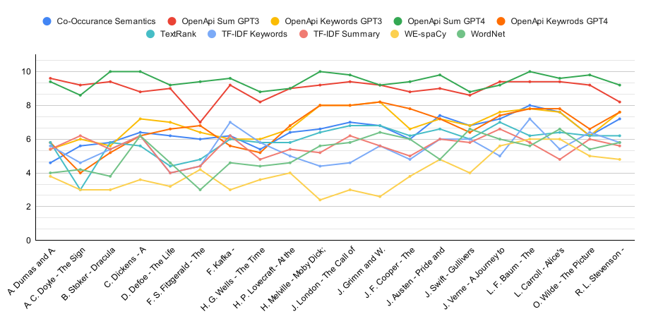
 
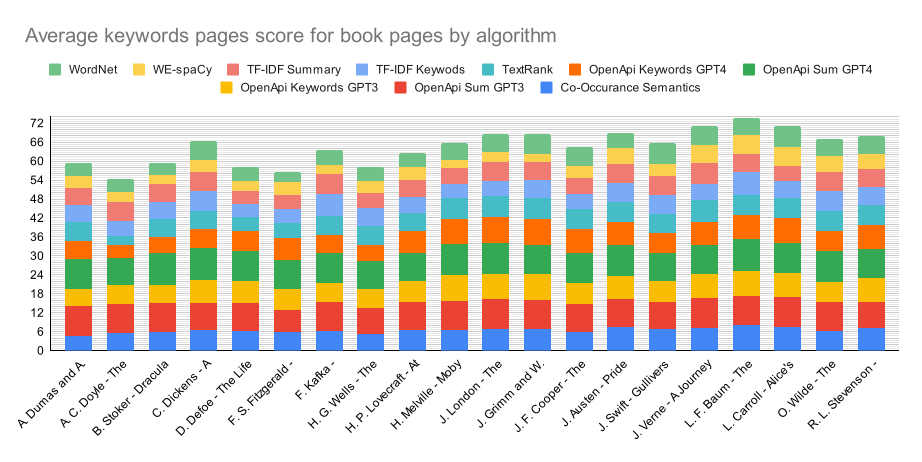
 
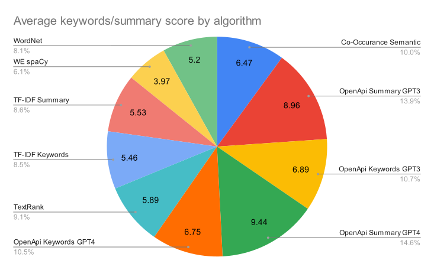

<h2>3. Середня оцінка для згенерованих Dall-e зображень для книги за алгоритмом та промптом</h2>

| Назва книги | Co-Occurance Semantic | OpenApi Summary GPT3 | OpenApi Keywords GPT3 | OpenApi Summary GPT4 | OpenApi Keywords GPT4 | TextRank | TF-IDF Keywords | TF-IDF Summary | WE spaCy | WordNet |
|------|-----------------------|----------------------|----------------------|----------------------|----------------------|----------|------------------|----------------|----------|---------|
| А.Дюма - Граф Монте-Крісто | 5.4 | 7.6 | 5 | 7.8 | 5.4 | 5.2 | 6.2 | 4.6 | 2.2 | 3.8 |
| А. Конан Дойл - Знак чотирьох | 5.2 | 6 | 6.2 | 4.8 | 3.6 | 3.4 | 3.8 | 5.4 | 1.8 | 2.8 |
| Б. Стокер - Дракула | 5.6 | 6.2 | 5 | 6.6 | 5 | 5.4 | 4.8 | 3.2 | 2.6 | 3.4 |
| Ч. Дікенс - Різдвяна пісня в прозі | 6.8 | 8 | 7.4 | 7 | 5.8 | 5.4 | 5.2 | 6 | 3 | 6 |
| Д. Дефо - Робінзон Крузо | 5.6 | 6.4 | 5.8 | 6.2 | 6 | 4.8 | 3.8 | 3.4 | 2.6 | 4 |
| Ф. Скотт Фіцжеральт - Великий Гетсбі | 5.6 | 5.6 | 6 | 5.2 | 6.6 | 4.4 | 4.6 | 2.2 | 2.6 | 1.6 |
| Ф. Кафка - Метаморфоза | 4.6 | 5.8 | 3.8 | 5.8 | 3.4 | 5.4 | 4 | 4 | 1.6 | 3.8 |
| Г. Уелсс - Машина часу | 5.2 | 6.2 | 5.2 | 5.8 | 4.4 | 4.6 | 4.8 | 3.2 | 3.2 | 3.6 |
| Г. Лавкрафт - В горах божевілля | 6 | 6.75 | 6.6 | 7 | 6.6 | 5.8 | 4.4 | 4.2 | 3.4 | 4 |
| Г. Мелвілль - Мобі Дік | 6.4 | 7.6 | 7.6 | 7.8 | 7.2 | 6.6 | 4.4 | 5.2 | 1.75 | 5 |
| Дж. Лондон - Поклик предків | 5 | 7.4 | 7.2 | 7.6 | 7.6 | 3.8 | 3 | 5.8 | 1.4 | 4.8 |
| Я. та В. Грімм - Казки братів Грімм | 6.6 | 6.6 | 7 | 6.2 | 7.6 | 6.6 | 4.6 | 4.6 | 1.2 | 5.6 |
| Дж. Ф. Купер - Останній з могікан | 4.8 | 7 | 6.2 | 7.4 | 7 | 5.2 | 4.4 | 5 | 2.6 | 4.2 |
| Дж. Остін - Гордість та упередження | 7.4 | 7.6 | 6 | 8.4 | 6 | 6.4 | 5.2 | 6.4 | 2.2 | 2.6 |
| Дж. Свіфт - Мандри Гулівера | 6.2 | 6.6 | 5.6 | 7.25 | 5.8 | 4.6 | 5.2 | 4.6 | 2.6 | 5 |
| Ж. Верн - Подорож до центру землі | 6.6 | 7 | 6.8 | 7 | 7.4 | 5.8 | 5.4 | 5.4 | 4.6 | 5.6 |
| Л. Ф. Баум - Чарівник країни Оз | 7.8 | 7.6 | 6.8 | 7.6 | 7 | 6.2 | 7.2 | 5.2 | 5.6 | 5.6 |
| Л. Керолл - Аліса у Дивокраї | 6.4 | 8.2 | 7.2 | 7.2 | 7.4 | 6.2 | 5.2 | 4.6 | 5.8 | 6.2 |
| О. Уайлд - Портрет Доріана Грея | 5 | 7.6 | 5.6 | 7.4 | 6.2 | 5.8 | 6.6 | 6 | 4.6 | 3.8 |
| Р. Л. Стівенсон - Острів скарбів | 6.8 | 7.6 | 7.2 | 7.2 | 7 | 6.2 | 5.6 | 5.4 | 4 | 5.2 |
|  | Co-Occurance Semantic | OpenApi Summary GPT3 | OpenApi Keywords GPT3 | OpenApi Summary GPT4 | OpenApi Keywords GPT4 | TextRank | TF-IDF Keywords | TF-IDF Summary | WE spaCy | WordNet |
| Середня оцінка | 5.95 | 6.97 | 6.21 | 6.86 | 6.15 | 5.39 | 4.92 | 4.72 | 2.97 | 4.33 |

 
 
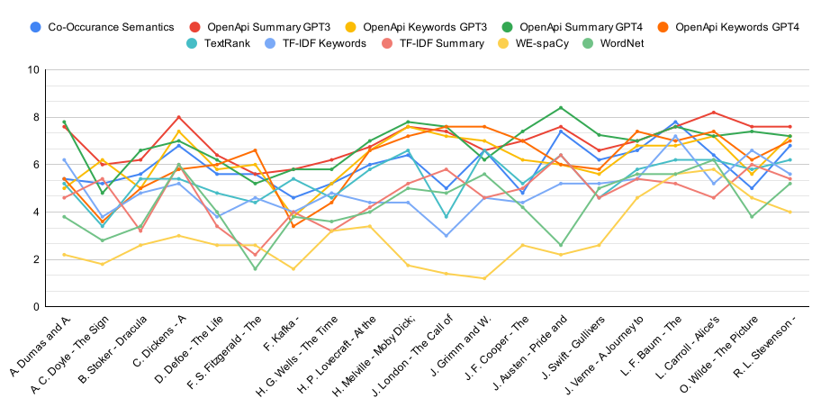
 
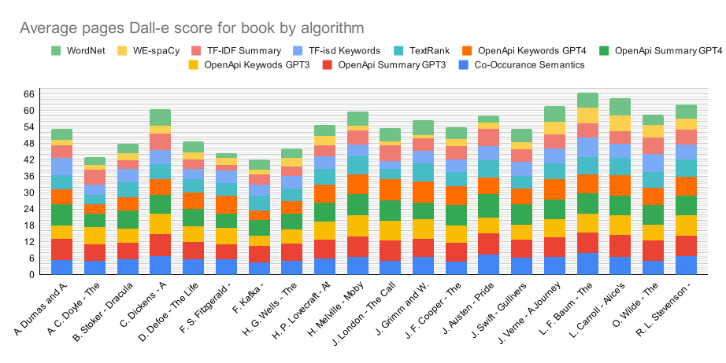
 
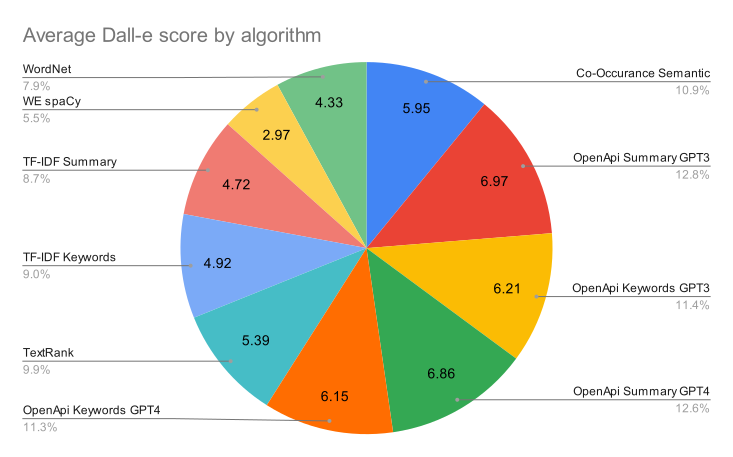

<h2>4. Середня оцінка для згенерованих Stable Diffusion зображень для книги за алгоритмом</h2>

| Назва книги | Co-Occurance Semantic | OpenApi Summary GPT3 | OpenApi Keywords GPT3 | OpenApi Summary GPT4 | OpenApi Keywords GPT4 | TextRank | TF-IDF Keywords | TF-IDF Summary | WE spaCy | WordNet |
|------|-----------------------|----------------------|----------------------|----------------------|----------------------|----------|------------------|----------------|----------|---------|
| А.Дюма - Граф Монте-Крісто | 3.8 | 7 | 4 | 7.2 | 4 | 3.6 | 4.75 | 3.8 | 2.6 | 2.75 |
| А. Конан Дойл - Знак чотирьох | 2.4 | 4.6 | 4.8 | 4.4 | 2.4 | 1.8 | 2.8 | 3 | 1.2 | 1.8 |
| Б. Стокер - Дракула | 4.6 | 4.6 | 4.4 | 6.6 | 4.6 | 4.8 | 4 | 2.6 | 2 | 2.4 |
| Ч. Дікенс - Різдвяна пісня в прозі | 4.4 | 5.8 | 5.4 | 6.4 | 5 | 4.4 | 4.6 | 4.6 | 2.2 | 5.4 |
| Д. Дефо - Робінзон Крузо | 4.75 | 5 | 4.2 | 5 | 5.4 | 3.4 | 3.8 | 2.4 | 1.6 | 4 |
| Ф. Скотт Фіцжеральт - Великий Гетсбі | 5 | 6.2 | 5.8 | 5.6 | 5.4 | 3.6 | 4.2 | 1.8 | 2 | 1.25 |
| Ф. Кафка - Метаморфоза | 2.8 | 4.25 | 3.2 | 4.6 | 2.8 | 4.6 | 3.8 | 3 | 1.8 | 3.2 |
| Г. Уелсс - Машина часу | 5 | 6.4 | 4.8 | 6.2 | 4.8 | 4.6 | 4.8 | 2.5 | 2.6 | 3.4 |
| Г. Лавкрафт - В горах божевілля | 4.2 | 6 | 5 | 5.4 | 5.4 | 4.2 | 2.75 | 2.4 | 2.8 | 3.6 |
| Г. Мелвілль - Мобі Дік | 4.8 | 6.4 | 6.2 | 6.8 | 5.6 | 6.333333333 | 2 | 4 | 1.2 | 5.25 |
| Дж. Лондон - Поклик предків | 6 | 7.6 | 7 | 7.8 | 6.6 | 4.4 | 3 | 3.6 | 1.25 | 4.2 |
| Я. та В. Грімм - Казки братів Грімм | 5.4 | 7.2 | 6.2 | 7 | 6 | 5.6 | 4.6 | 4.4 | 1.2 | 5.4 |
| Дж. Ф. Купер - Останній з могікан | 4.2 | 6.4 | 6.2 | 6 | 6.8 | 4.25 | 4 | 4.4 | 2.8 | 4.2 |
| Дж. Остін - Гордість та упередження | 6.2 | 6.8 | 6.4 | 7.4 | 6.8 | 6 | 5 | 5 | 2.8 | 4.8 |
| Дж. Свіфт - Мандри Гулівера | 5.2 | 5.4 | 6 | 5.8 | 5.2 | 4.8 | 5.4 | 4 | 2.4 | 4.8 |
| Ж. Верн - Подорож до центру землі | 5.6 | 5.8 | 5.8 | 6.8 | 5.8 | 5.8 | 4.8 | 5.4 | 3.4 | 5 |
| Л. Ф. Баум - Чарівник країни Оз | 5.8 | 6.2 | 6.2 | 6 | 6.4 | 5 | 5.6 | 4.4 | 4.6 | 4.8 |
| Л. Керолл - Аліса у Дивокраї | 5.6 | 7 | 5.5 | 6.8 | 5.8 | 5.6 | 4 | 4.6 | 4.4 | 5.2 |
| О. Уайлд - Портрет Доріана Грея | 5.4 | 6.8 | 5.4 | 6.2 | 5.8 | 5.2 | 5.6 | 5.6 | 3.6 | 4.8 |
| Р. Л. Стівенсон - Острів скарбів | 5.6 | 6.6 | 6.2 | 6.4 | 6 | 4.2 | 4.2 | 4.6 | 3.6 | 4 |
|  | Co-Occurance Semantic | OpenApi Summary GPT3 | OpenApi Keywords GPT3 | OpenApi Summary GPT4 | OpenApi Keywords GPT4 | TextRank | TF-IDF Keywords | TF-IDF Summary | WE spaCy | WordNet |
| Середня лцінка | 4.84 | 6.1 | 5.44 | 6.22 | 5.33 | 4.61 | 4.19 | 3.81 | 2.5 | 4.01 |

 
 
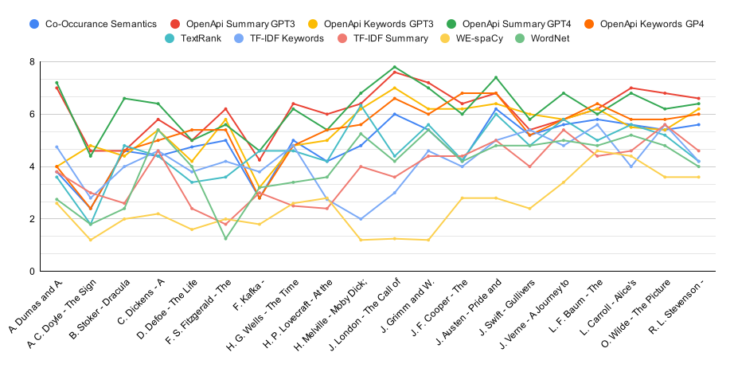
 
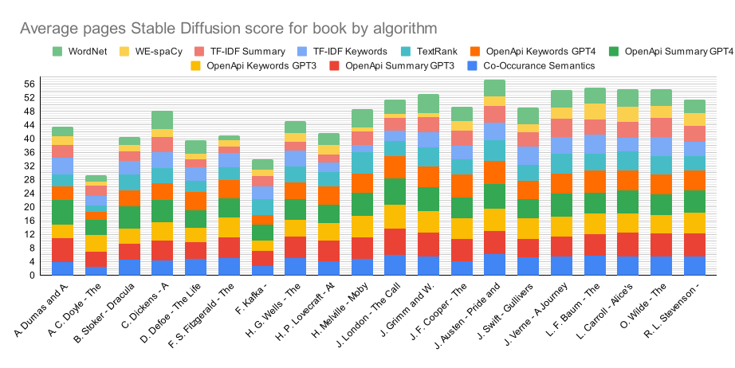
 
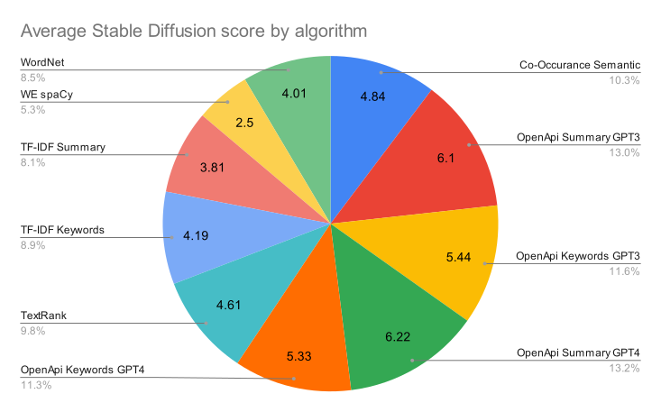

<h2>5. Середня оцінка для згенерованих MidJourney зображень для книги за алгоритмом</h2>

| Назва книги | Co-Occurance Semantic | OpenApi Summary GPT3 | OpenApi Keywords GPT3 | OpenApi Summary GPT4 | OpenApi Keywords GPT4 | TextRank | TF-IDF Keywords | TF-IDF Summary | WE spaCy | WordNet |
|------|-----------------------|----------------------|----------------------|----------------------|----------------------|----------|------------------|----------------|----------|---------|
| А.Дюма - Граф Монте-Крісто | 4 | 9 | 4 | 8.4 | 4.6 | 4.2 | 5 | 5 | 2.2 | 3.6 |
| А. Конан Дойл - Знак чотирьох | 4.2 | 6.6 | 5.6 | 5.6 | 3.6 | 2.4 | 3.2 | 5 | 2.2 | 3.2 |
| Б. Стокер - Дракула | 5.6 | 6 | 4.6 | 7.2 | 4.8 | 5.4 | 5 | 3.6 | 2.6 | 3.4 |
| Ч. Дікенс - Різдвяна пісня в прозі | 5.8 | 7.6 | 6.6 | 8.6 | 5.4 | 4.8 | 6.4 | 6 | 2.8 | 4.8 |
| Д. Дефо - Робінзон Крузо | 5.2 | 6.8 | 6.6 | 6.6 | 6.4 | 3.6 | 4.2 | 3.6 | 2.2 | 3.6 |
| Ф. Скотт Фіцжеральт - Великий Гетсбі | 5.6 | 6.8 | 6 | 6.6 | 7 | 4.2 | 4.8 | 2.2 | 2.4 | 1.4 |
| Ф. Кафка - Метаморфоза | 3.2 | 5.6 | 3.4 | 6.4 | 3.2 | 4.6 | 4.4 | 5 | 1.8 | 4.2 |
| Г. Уелсс - Машина часу | 5 | 6.4 | 5.4 | 5.8 | 4.4 | 5 | 4.6 | 3.2 | 3.2 | 3.6 |
| Г. Лавкрафт - В горах божевілля | 5.4 | 7.2 | 6.25 | 7.2 | 6.25 | 4.8 | 4 | 4.4 | 3.4 | 3.8 |
| Г. Мелвілль - Мобі Дік | 5.6 | 7.4 | 6.6 | 7 | 6.8 | 6.4 | 2.8 | 6 | 2 | 5 |
| Дж. Лондон - Поклик предків | 5 | 7.4 | 7.8 | 8.2 | 7.4 | 4.4 | 3.25 | 3.8 | 1.4 | 4.4 |
| Я. та В. Грімм - Казки братів Грімм | 5.8 | 7.6 | 6.8 | 7.4 | 7.6 | 6 | 5 | 4.6 | 1.2 | 5.6 |
| Дж. Ф. Купер - Останній з могікан | 4.6 | 7.4 | 6.6 | 7.6 | 7.2 | 4.6 | 4.8 | 5.4 | 3.25 | 5 |
| Дж. Остін - Гордість та упередження | 6.2 | 7.6 | 6.8 | 8 | 6.8 | 6.4 | 5.4 | 6.2 | 3.6 | 3.2 |
| Дж. Свіфт - Мандри Гулівера | 5.6 | 6 | 5.8 | 6.8 | 5.8 | 5.2 | 5.4 | 4.8 | 3 | 5.8 |
| Ж. Верн - Подорож до центру землі | 6.6 | 8 | 6.8 | 7.4 | 6.8 | 6 | 5.2 | 5.6 | 4 | 5.4 |
| Л. Ф. Баум - Чарівник країни Оз | 7 | 7 | 6.6 | 7.4 | 6.4 | 5 | 5.8 | 5.6 | 5.4 | 5.2 |
| Л. Керолл - Аліса у Дивокраї | 6.4 | 7.4 | 6.2 | 7.6 | 6.6 | 6 | 4.4 | 4.8 | 5.6 | 5.6 |
| О. Уайлд - Портрет Доріана Грея | 5.8 | 7.6 | 5.2 | 8.2 | 5.8 | 5 | 5.8 | 5.6 | 4.6 | 4.2 |
| Р. Л. Стівенсон - Острів скарбів | 6 | 7.2 | 7 | 8 | 6 | 5.6 | 5.4 | 4.4 | 4 | 5.8 |
|  | Co-Occurance Semantic | OpenApi Summary GPT3 | OpenApi Keywords GPT3 | OpenApi Summary GPT4 | OpenApi Keywords GPT4 | TextRank | TF-IDF Keywords | TF-IDF Summary | WE spaCy | WordNet |
| Середня оцінка | 5.43 | 7.13 | 6.03 | 7.3 | 5.94 | 4.98 | 4.74 | 4.74 | 3.04 | 4.34 |

 
 
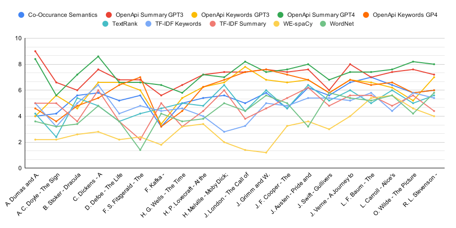
 
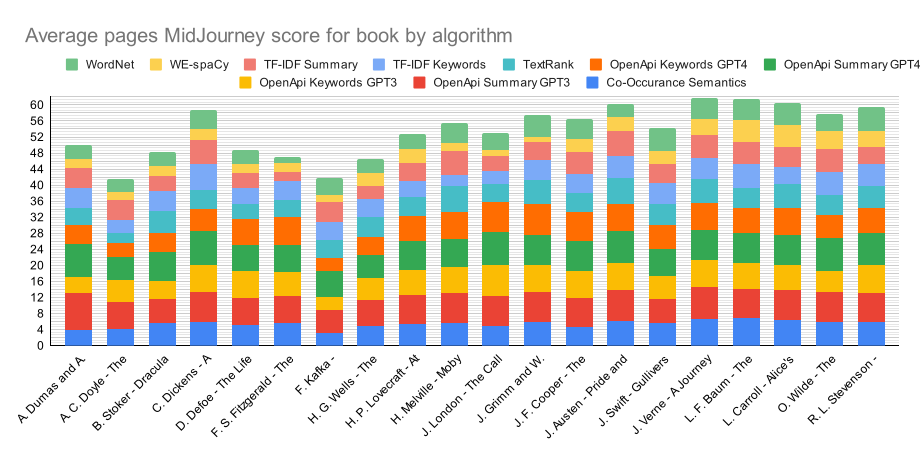
 
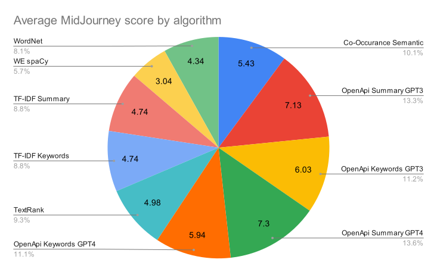

<h2>6. Середня оцінка для Dall-e, Stable Diffusion і MidJourney за книгу</h2>

| Book | Dall-e | StableDiffusion | MidJourney |
|------|--------|-----------------|------------|
| А.Дюма - Граф Монте-Крісто | 5.32 | 4.35 | 5 |
| А. Конан Дойл - Знак чотирьох | 4.3 | 2.92 | 4.16 |
| Б. Стокер - Дракула | 4.78 | 4.06 | 4.82 |
| Ч. Дікенс - Різдвяна пісня в прозі | 6.06 | 4.82 | 5.88 |
| Д. Дефо - Робінзон Крузо | 4.86 | 3.955 | 4.88 |
| Ф. Скотт Фіцжеральт - Великий Гетсбі | 4.44 | 4.085 | 4.7 |
| Ф. Кафка - Метаморфоза | 4.22 | 3.405 | 4.18 |
| Г. Уелсс - Машина часу | 4.62 | 4.51 | 4.66 |
| Г. Лавкрафт - В горах божевілля | 5.475 | 4.175 | 5.27 |
| Г. Мелвілль - Мобі Дік | 5.955 | 4.858333333 | 5.56 |
| Дж. Лондон - Поклик предків | 5.36 | 5.145 | 5.305 |
| Я. та В. Грімм - Казки братів Грімм | 5.66 | 5.3 | 5.76 |
| Дж. Ф. Купер - Останній з могікан | 5.38 | 4.925 | 5.645 |
| Дж. Остін - Гордість та упередження | 5.82 | 5.72 | 6.02 |
| Дж. Свіфт - Мандри Гулівера | 5.345 | 4.9 | 5.42 |
| Ж. Верн - Подорож до центру землі | 6.16 | 5.42 | 6.18 |
| Л. Ф. Баум - Чарівник країни Оз | 6.66 | 5.5 | 6.14 |
| Л. Керолл - Аліса у Дивокраї | 6.44 | 5.45 | 6.06 |
| О. Уайлд - Портрет Доріана Грея | 5.86 | 5.44 | 5.78 |
| Р. Л. Стівенсон - Острів скарбів | 6.22 | 5.14 | 5.94 |
|  | Dall-e | StableDiffusion | MidJourney |
| Середня оцінка | 5.45 | 4.7 | 5.37 |

 
 
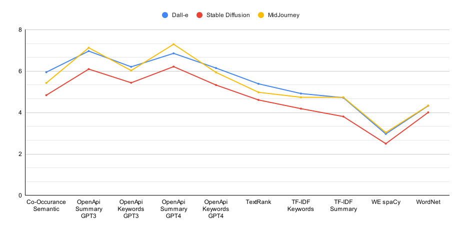
 

<h2>7. Кількість помилок за алгоритмом</h2>

| Алгоритм | TS | IS-D | IS-SD | IS-MJ |
|-----------|----|------|-------|-------|
| Co-Occurance Semantic | 0 | 0 | 2 | 0 |
| OpenApi Summary GPT3 | 0 | 1 | 1 | 0 |
| OpenApi Summary GPT4 | 0 | 2 | 0 | 0 |
| OpenApi Keywords GPT3 | 0 | 0 | 2 | 1 |
| OpenApi Keywords GPT4 | 0 | 1 | 0 | 1 |
| TextRank | 0 | 0 | 4 | 0 |
| TF-IDF Keywords | 0 | 0 | 1 | 2 |
| TF-IDF Summary | 0 | 1 | 2 | 0 |
| WE spaCy | 0 | 1 | 1 | 2 |
| WordNet | 0 | 0 | 2 | 0 |
| СУМА | 0 | 6 | 15 | 6 |

 
 
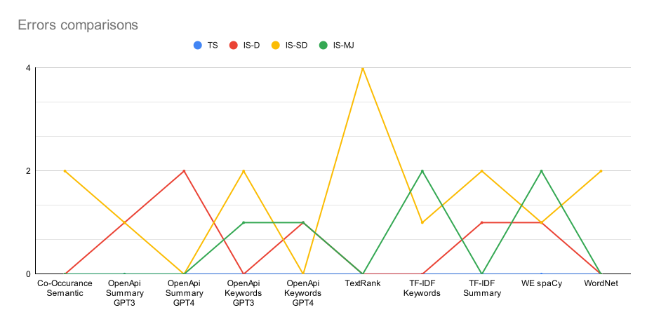
 
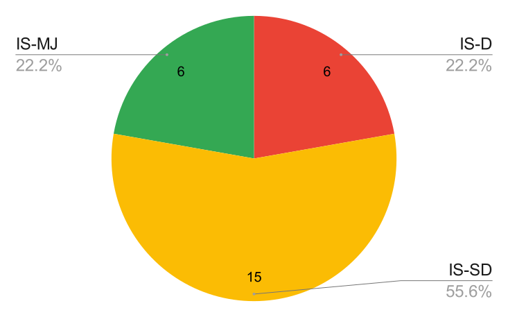