<h1>Результати другого етапу дослідження</h1>

[English](README.md)

<b>Скорочення:</b>
<ul>
    <li><b>TS</b> - Оцінка тексту</li>
    <li><b>IS-D</b> - Оцінка зображення - Dalle</li>
    <li><b>IS-SD</b> - Оцінка зображення - SD</li>
    <li><b>IS-MJ</b> - Оцінка зображення - MidJourney</li>
    <li><b>Ln</b> - Довжина рядка</li>
</ul>

<h2>1. Результати оцінювання всіх тестовий сторінок для всіх книг</h2>
<table>
  <tr>
    <th>Метод</th><th>TS</th><th>Ln</th><th>IS-D</th><th>IS-SD</th><th>IS-MJ</th><th>TS</th><th>Ln</th><th>IS-D</th><th>IS-SD</th><th>IS-MJ</th><th>TS</th><th>Ln</th><th>IS-D</th><th>IS-SD</th><th>IS-MJ</th><th>TS</th><th>Ln</th><th>IS-D</th><th>IS-SD</th><th>IS-MJ</th><th>TS</th><th>Ln</th><th>IS-D</th><th>IS-SD</th><th>IS-MJ</th>
  </tr>
  <tr>
    <td colspan="26">
      Олександр Дюма - Граф Монте Крісто
    </td>
  </tr>
    <tr>
        <td></td>
        <td colspan="5">Випадкова сторінка 1</td>
        <td colspan="5">Випадкова сторінка 2</td>
        <td colspan="5">Випадкова сторінка 3</td>
        <td colspan="5">Випадкова сторінка 4</td>
        <td colspan="5">Випадкова сторінка 5</td>
    </tr>
    <tr>
        <td>Claude3</td><td>9</td><td>53</td><td>7</td><td>7</td><td>6</td><td>10</td><td>43</td><td>9</td><td>8</td><td>8</td><td>9</td><td>57</td><td>6</td><td>8</td><td>7</td><td>9</td><td>66</td><td>8</td><td>7</td><td>8</td><td>9</td><td>43</td><td>7</td><td>8</td><td>7</td>
    </tr>
    <tr>
        <td>Copilot</td><td>8</td><td>66</td><td>6</td><td>7</td><td>7</td><td>10</td><td>73</td><td>7</td><td>6</td><td>7</td><td>9</td><td>51</td><td>6</td><td>8</td><td>7</td><td>8</td><td>52</td><td>7</td><td>7</td><td>7</td><td>8</td><td>47</td><td>7</td><td>8</td><td>8</td>
    </tr>
    <tr>
        <td>Gemini</td><td>7</td><td>25</td><td>6</td><td>8</td><td>7</td><td>9</td><td>32</td><td>8</td><td>8</td><td>8</td><td>7</td><td>11</td><td>8</td><td>7</td><td>error</td><td>9</td><td>46</td><td>6</td><td>7</td><td>4</td><td>7</td><td>21</td><td>2</td><td>8</td><td>8</td>
    </tr>
    <tr>
        <td>GPT-4</td><td>10</td><td>66</td><td>7</td><td>7</td><td>7</td><td>10</td><td>104</td><td>9</td><td>7</td><td>8</td><td>9</td><td>85</td><td>7</td><td>7</td><td>7</td><td>10</td><td>92</td><td>8</td><td>7</td><td>8</td><td>9</td><td>105</td><td>7</td><td>8</td><td>8</td>
    </tr>
    <tr>
        <td>Pi</td><td>10</td><td>52</td><td>8</td><td>7</td><td>9</td><td>9</td><td>46</td><td>7</td><td>7</td><td>7</td><td>9</td><td>49</td><td>7</td><td>8</td><td>7</td><td>7</td><td>46</td><td>7</td><td>5</td><td>5</td><td>8</td><td>51</td><td>5</td><td>6</td><td>8</td>
    </tr>
    <tr>
        <th>Метод</th><th>TS</th><th>Ln</th><th>IS-D</th><th>IS-SD</th><th>IS-MJ</th><th>TS</th><th>Ln</th><th>IS-D</th><th>IS-SD</th><th>IS-MJ</th><th>TS</th><th>Ln</th><th>IS-D</th><th>IS-SD</th><th>IS-MJ</th><th>TS</th><th>Ln</th><th>IS-D</th><th>IS-SD</th><th>IS-MJ</th><th>TS</th><th>Ln</th><th>IS-D</th><th>IS-SD</th><th>IS-MJ</th>
    </tr>
    <tr>
        <td colspan="26">Артур Конан Дойль - Знак чотирьох</td>
    </tr>
    <tr>
        <td>Claude3</td><td>9</td><td>54</td><td>8</td><td>8</td><td>9</td><td>8</td><td>58</td><td>5</td><td>5</td><td>5</td><td>10</td><td>58</td><td>9</td><td>6</td><td>9</td><td>8</td><td>50</td><td>7</td><td>7</td><td>7</td><td>7</td><td>60</td><td>6</td><td>6</td><td>6</td>
    </tr>
    <tr>
        <td>Copilot</td><td>8</td><td>54</td><td>8</td><td>8</td><td>8</td><td>8</td><td>62</td><td>7</td><td>7</td><td>7</td><td>8</td><td>51</td><td>9</td><td>6</td><td>9</td><td>8</td><td>58</td><td>8</td><td>8</td><td>8</td><td>8</td><td>52</td><td>7</td><td>6</td><td>7</td>
    </tr>
    <tr>
        <td>Gemini</td><td>8</td><td>32</td><td>7</td><td>7</td><td>6</td><td>9</td><td>37</td><td>8</td><td>8</td><td>8</td><td>8</td><td>53</td><td>7</td><td>7</td><td>7</td><td>8</td><td>34</td><td>8</td><td>7</td><td>8</td><td>8</td><td>62</td><td>9</td><td>6</td><td>8</td>
    </tr>
    <tr>
        <td>GPT-4</td><td>10</td><td>99</td><td>8</td><td>9</td><td>9</td><td>8</td><td>104</td><td>6</td><td>6</td><td>6</td><td>8</td><td>92</td><td>6</td><td>6</td><td>8</td><td>9</td><td>69</td><td>8</td><td>7</td><td>8</td><td>9</td><td>101</td><td>9</td><td>8</td><td>8</td>
    </tr>
    <tr>
        <td>Pi</td><td>9</td><td>57</td><td>7</td><td>7</td><td>7</td><td>8</td><td>82</td><td>7</td><td>6</td><td>7</td><td>9</td><td>67</td><td>9</td><td>7</td><td>8</td><td>9</td><td>63</td><td>7</td><td>8</td><td>8</td><td>9</td><td>92</td><td>9</td><td>7</td><td>8</td>
    </tr>
    <tr>
        <th>Метод</th><th>TS</th><th>Ln</th><th>IS-D</th><th>IS-SD</th><th>IS-MJ</th><th>TS</th><th>Ln</th><th>IS-D</th><th>IS-SD</th><th>IS-MJ</th><th>TS</th><th>Ln</th><th>IS-D</th><th>IS-SD</th><th>IS-MJ</th><th>TS</th><th>Ln</th><th>IS-D</th><th>IS-SD</th><th>IS-MJ</th><th>TS</th><th>Ln</th><th>IS-D</th><th>IS-SD</th><th>IS-MJ</th>
    </tr>
    <tr>
        <td colspan="26">Брем Стокер - Дракула</td>
    </tr>
    <tr>
        <td>Claude3</td><td>8</td><td>48</td><td>7</td><td>5</td><td>6</td><td>10</td><td>55</td><td>error</td><td>6</td><td>7</td><td>8</td><td>49</td><td>6</td><td>6</td><td>6</td><td>9</td><td>58</td><td>8</td><td>7</td><td>8</td><td>8</td><td>43</td><td>6</td><td>6</td><td>6</td>
    </tr>
    <tr>
        <td>Copilot</td><td>8</td><td>40</td><td>7</td><td>7</td><td>7</td><td>9</td><td>41</td><td>7</td><td>7</td><td>7</td><td>6</td><td>47</td><td>6</td><td>6</td><td>6</td><td>8</td><td>47</td><td>7</td><td>8</td><td>9</td><td>8</td><td>47</td><td>7</td><td>7</td><td>8</td>
    </tr>
    <tr>
        <td>Gemini</td><td>9</td><td>48</td><td>7</td><td>7</td><td>7</td><td>9</td><td>49</td><td>7</td><td>8</td><td>9</td><td>7</td><td>32</td><td>7</td><td>6</td><td>7</td><td>8</td><td>51</td><td>7</td><td>7</td><td>8</td><td>8</td><td>43</td><td>8</td><td>7</td><td>7</td>
    </tr>
    <tr>
        <td>GPT-4</td><td>10</td><td>83</td><td>8</td><td>7</td><td>7</td><td>10</td><td>89</td><td>7</td><td>7</td><td>7</td><td>10</td><td>106</td><td>6</td><td>6</td><td>6</td><td>9</td><td>81</td><td>7</td><td>7</td><td>9</td><td>10</td><td>85</td><td>8</td><td>6</td><td>8</td>
    </tr>
    <tr>
        <td>Pi</td><td>9</td><td>82</td><td>7</td><td>7</td><td>7</td><td>9</td><td>75</td><td>7</td><td>7</td><td>7</td><td>6</td><td>84</td><td>6</td><td>6</td><td>6</td><td>8</td><td>77</td><td>7</td><td>7</td><td>7</td><td>10</td><td>92</td><td>error</td><td>6</td><td>7</td>
    </tr>
    <tr>
        <th>Метод</th><th>TS</th><th>Ln</th><th>IS-D</th><th>IS-SD</th><th>IS-MJ</th><th>TS</th><th>Ln</th><th>IS-D</th><th>IS-SD</th><th>IS-MJ</th><th>TS</th><th>Ln</th><th>IS-D</th><th>IS-SD</th><th>IS-MJ</th><th>TS</th><th>Ln</th><th>IS-D</th><th>IS-SD</th><th>IS-MJ</th><th>TS</th><th>Ln</th><th>IS-D</th><th>IS-SD</th><th>IS-MJ</th>
    </tr>
    <tr>
        <td colspan="26">Чарльз Дікенз - Різдвя́на пі́сня в про́зі, або́ Різдвя́не оповіда́ння з при́видами</td>
    </tr>
    <tr>
        <td>Claude3</td><td>7</td><td>48</td><td>7</td><td>6</td><td>7</td><td>10</td><td>56</td><td>8</td><td>7</td><td>10</td><td>9</td><td>41</td><td>8</td><td>7</td><td>8</td><td>7</td><td>51</td><td>7</td><td>7</td><td>7</td><td>9</td><td>68</td><td>8</td><td>7</td><td>8</td>
    </tr>
    <tr>
        <td>Copilot</td><td>8</td><td>45</td><td>7</td><td>8</td><td>8</td><td>10</td><td>57</td><td>9</td><td>7</td><td>10</td><td>9</td><td>42</td><td>8</td><td>7</td><td>8</td><td>7</td><td>71</td><td>6</td><td>6</td><td>6</td><td>8</td><td>47</td><td>8</td><td>6</td><td>6</td>
    </tr>
    <tr>
        <td>Gemini</td><td>9</td><td>49</td><td>7</td><td>9</td><td>9</td><td>9</td><td>51</td><td>9</td><td>8</td><td>10</td><td>8</td><td>49</td><td>8</td><td>7</td><td>8</td><td>10</td><td>70</td><td>7</td><td>7</td><td>7</td><td>9</td><td>114</td><td>7</td><td>6</td><td>6</td>
    </tr>
    <tr>
        <td>GPT-4</td><td>10</td><td>82</td><td>7</td><td>8</td><td>9</td><td>10</td><td>77</td><td>9</td><td>7</td><td>10</td><td>9</td><td>86</td><td>8</td><td>7</td><td>8</td><td>10</td><td>92</td><td>7</td><td>6</td><td>7</td><td>10</td><td>89</td><td>8</td><td>7</td><td>7</td>
    </tr>
    <tr>
        <td>Pi</td><td>8</td><td>83</td><td>7</td><td>7</td><td>8</td><td>9</td><td>62</td><td>8</td><td>7</td><td>10</td><td>8</td><td>83</td><td>7</td><td>7</td><td>7</td><td>9</td><td>63</td><td>7</td><td>6</td><td>7</td><td>9</td><td>70</td><td>9</td><td>6</td><td>7</td>
    </tr>
    <tr>
        <th>Метод</th><th>TS</th><th>Ln</th><th>IS-D</th><th>IS-SD</th><th>IS-MJ</th><th>TS</th><th>Ln</th><th>IS-D</th><th>IS-SD</th><th>IS-MJ</th><th>TS</th><th>Ln</th><th>IS-D</th><th>IS-SD</th><th>IS-MJ</th><th>TS</th><th>Ln</th><th>IS-D</th><th>IS-SD</th><th>IS-MJ</th><th>TS</th><th>Ln</th><th>IS-D</th><th>IS-SD</th><th>IS-MJ</th>
    </tr>
    <tr>
        <td colspan="26">Даніель Дефо - Пригоди Робінзона Крузо</td>
    </tr>
    <tr>
        <td>Claude3</td><td>8</td><td>65</td><td>7</td><td>7</td><td>9</td><td>10</td><td>48</td><td>5</td><td>4</td><td>7</td><td>9</td><td>55</td><td>9</td><td>9</td><td>9</td><td>9</td><td>64</td><td>7</td><td>6</td><td>8</td><td>9</td><td>54</td><td>8</td><td>6</td><td>8</td>
    </tr>
    <tr>
        <td>Copilot</td><td>7</td><td>43</td><td>7</td><td>7</td><td>8</td><td>9</td><td>54</td><td>6</td><td>5</td><td>7</td><td>10</td><td>66</td><td>8</td><td>10</td><td>9</td><td>10</td><td>52</td><td>4</td><td>4</td><td>error</td><td>8</td><td>46</td><td>6</td><td>6</td><td>8</td>
    </tr>
    <tr>
        <td>Gemini</td><td>7</td><td>43</td><td>6</td><td>7</td><td>8</td><td>10</td><td>77</td><td>8</td><td>9</td><td>10</td><td>10</td><td>70</td><td>7</td><td>9</td><td>9</td><td>10</td><td>53</td><td>8</td><td>7</td><td>7</td><td>10</td><td>87</td><td>8</td><td>8</td><td>8</td>
    </tr>
    <tr>
        <td>GPT-4</td><td>9</td><td>82</td><td>7</td><td>7</td><td>7</td><td>10</td><td>97</td><td>5</td><td>5</td><td>8</td><td>9</td><td>79</td><td>7</td><td>9</td><td>9</td><td>10</td><td>83</td><td>8</td><td>6</td><td>7</td><td>9</td><td>76</td><td>7</td><td>7</td><td>8</td>
    </tr>
    <tr>
        <td>Pi</td><td>8</td><td>53</td><td>8</td><td>8</td><td>8</td><td>10</td><td>63</td><td>10</td><td>9</td><td>10</td><td>9</td><td>63</td><td>7</td><td>10</td><td>9</td><td>9</td><td>61</td><td>7</td><td>7</td><td>8</td><td>9</td><td>65</td><td>7</td><td>7</td><td>7</td>
    </tr>
    <tr>
        <th>Метод</th><th>TS</th><th>Ln</th><th>IS-D</th><th>IS-SD</th><th>IS-MJ</th><th>TS</th><th>Ln</th><th>IS-D</th><th>IS-SD</th><th>IS-MJ</th><th>TS</th><th>Ln</th><th>IS-D</th><th>IS-SD</th><th>IS-MJ</th><th>TS</th><th>Ln</th><th>IS-D</th><th>IS-SD</th><th>IS-MJ</th><th>TS</th><th>Ln</th><th>IS-D</th><th>IS-SD</th><th>IS-MJ</th>
    </tr>
    <tr>
        <td colspan="26">Ф. Скотт Фітцжеральт - Великий Гетсбі</td>
    </tr>
    <tr>
        <td>Claude3</td><td>9</td><td>49</td><td>6</td><td>2</td><td>8</td><td>9</td><td>49</td><td>7</td><td>2</td><td>7</td><td>8</td><td>91</td><td>7</td><td>7</td><td>7</td><td>9</td><td>45</td><td>7</td><td>7</td><td>7</td><td>9</td><td>65</td><td>8</td><td>2</td><td>8</td>
    </tr>
    <tr>
        <td>Copilot</td><td>9</td><td>41</td><td>8</td><td>7</td><td>8</td><td>7</td><td>50</td><td>8</td><td>6</td><td>8</td><td>7</td><td>47</td><td>8</td><td>8</td><td>7</td><td>8</td><td>41</td><td>7</td><td>7</td><td>7</td><td>8</td><td>43</td><td>6</td><td>6</td><td>6</td>
    </tr>
    <tr>
        <td>Gemini</td><td>9</td><td>68</td><td>8</td><td>7</td><td>7</td><td>9</td><td>44</td><td>7</td><td>7</td><td>8</td><td>8</td><td>48</td><td>6</td><td>6</td><td>7</td><td>10</td><td>49</td><td>8</td><td>7</td><td>8</td><td>10</td><td>57</td><td>7</td><td>7</td><td>8</td>
    </tr>
    <tr>
        <td>GPT-4</td><td>10</td><td>78</td><td>8</td><td>7</td><td>7</td><td>10</td><td>88</td><td>5</td><td>6</td><td>7</td><td>9</td><td>70</td><td>6</td><td>7</td><td>7</td><td>10</td><td>82</td><td>7</td><td>7</td><td>8</td><td>10</td><td>66</td><td>7</td><td>7</td><td>7</td>
    </tr>
    <tr>
        <td>Pi</td><td>9</td><td>68</td><td>7</td><td>7</td><td>7</td><td>7</td><td>71</td><td>6</td><td>6</td><td>7</td><td>9</td><td>77</td><td>6</td><td>6</td><td>6</td><td>8</td><td>74</td><td>7</td><td>7</td><td>7</td><td>9</td><td>86</td><td>7</td><td>7</td><td>7</td>
    </tr>
    <tr>
        <th>Метод</th><th>TS</th><th>Ln</th><th>IS-D</th><th>IS-SD</th><th>IS-MJ</th><th>TS</th><th>Ln</th><th>IS-D</th><th>IS-SD</th><th>IS-MJ</th><th>TS</th><th>Ln</th><th>IS-D</th><th>IS-SD</th><th>IS-MJ</th><th>TS</th><th>Ln</th><th>IS-D</th><th>IS-SD</th><th>IS-MJ</th><th>TS</th><th>Ln</th><th>IS-D</th><th>IS-SD</th><th>IS-MJ</th>
    </tr>
    <tr>
        <td colspan="26">Франц Кафка - Метаморфоза</td>
    </tr>
    <tr>
        <td>Claude3</td><td>8</td><td>55</td><td>8</td><td>7</td><td>8</td><td>8</td><td>55</td><td>8</td><td>7</td><td>8</td><td>8</td><td>55</td><td>8</td><td>7</td><td>8</td><td>8</td><td>55</td><td>8</td><td>7</td><td>8</td><td>8</td><td>55</td><td>8</td><td>7</td><td>8</td>
    </tr>
    <tr>
        <td>Copilot</td><td>8</td><td>55</td><td>8</td><td>7</td><td>8</td><td>8</td><td>55</td><td>8</td><td>7</td><td>8</td><td>8</td><td>55</td><td>8</td><td>7</td><td>8</td><td>8</td><td>55</td><td>8</td><td>7</td><td>8</td><td>8</td><td>55</td><td>8</td><td>7</td><td>8</td>
    </tr>
    <tr>
        <td>Gemini</td><td>8</td><td>55</td><td>8</td><td>7</td><td>8</td><td>8</td><td>55</td><td>8</td><td>7</td><td>8</td><td>8</td><td>55</td><td>8</td><td>7</td><td>8</td><td>8</td><td>55</td><td>8</td><td>7</td><td>8</td><td>8</td><td>55</td><td>8</td><td>7</td><td>8</td>
    </tr>
    <tr>
        <td>GPT-4</td><td>8</td><td>55</td><td>8</td><td>7</td><td>8</td><td>8</td><td>55</td><td>8</td><td>7</td><td>8</td><td>8</td><td>55</td><td>8</td><td>7</td><td>8</td><td>8</td><td>55</td><td>8</td><td>7</td><td>8</td><td>8</td><td>55</td><td>8</td><td>7</td><td>8</td>
    </tr>
    <tr>
        <td>Pi</td><td>8</td><td>55</td><td>8</td><td>7</td><td>8</td><td>8</td><td>55</td><td>8</td><td>7</td><td>8</td><td>8</td><td>55</td><td>8</td><td>7</td><td>8</td><td>8</td><td>55</td><td>8</td><td>7</td><td>8</td><td>8</td><td>55</td><td>8</td><td>7</td><td>8</td>
    </tr>
    <tr>
        <th>Метод</th><th>TS</th><th>Ln</th><th>IS-D</th><th>IS-SD</th><th>IS-MJ</th><th>TS</th><th>Ln</th><th>IS-D</th><th>IS-SD</th><th>IS-MJ</th><th>TS</th><th>Ln</th><th>IS-D</th><th>IS-SD</th><th>IS-MJ</th><th>TS</th><th>Ln</th><th>IS-D</th><th>IS-SD</th><th>IS-MJ</th><th>TS</th><th>Ln</th><th>IS-D</th><th>IS-SD</th><th>IS-MJ</th>
    </tr>
    <tr>
        <td colspan="26">Г. Уельс - Машина часу</td>
    </tr>
    <tr>
        <td>Claude3</td><td>8</td><td>57</td><td>6</td><td>7</td><td>6</td><td>9</td><td>46</td><td>8</td><td>7</td><td>9</td><td>9</td><td>64</td><td>8</td><td>7</td><td>9</td><td>9</td><td>47</td><td>7</td><td>9</td><td>9</td><td>9</td><td>73</td><td>7</td><td>7</td><td>8</td>
    </tr>
    <tr>
        <td>Copilot</td><td>8</td><td>45</td><td>6</td><td>7</td><td>6</td><td>8</td><td>37</td><td>9</td><td>8</td><td>9</td><td>8</td><td>37</td><td>7</td><td>7</td><td>8</td><td>8</td><td>34</td><td>7</td><td>8</td><td>8</td><td>8</td><td>32</td><td>7</td><td>6</td><td>7</td>
    </tr>
    <tr>
        <td>Gemini</td><td>9</td><td>75</td><td>6</td><td>7</td><td>6</td><td>9</td><td>55</td><td>8</td><td>8</td><td>9</td><td>8</td><td>51</td><td>9</td><td>7</td><td>7</td><td>9</td><td>59</td><td>7</td><td>9</td><td>9</td><td>8</td><td>70</td><td>7</td><td>6</td><td>7</td>
    </tr>
    <tr>
        <td>GPT-4</td><td>9</td><td>115</td><td>6</td><td>6</td><td>6</td><td>10</td><td>91</td><td>9</td><td>8</td><td>10</td><td>8</td><td>83</td><td>7</td><td>7</td><td>7</td><td>10</td><td>93</td><td>8</td><td>8</td><td>9</td><td>9</td><td>68</td><td>7</td><td>6</td><td>7</td>
    </tr>
    <tr>
        <td>Pi</td><td>8</td><td>78</td><td>6</td><td>6</td><td>6</td><td>8</td><td>81</td><td>9</td><td>8</td><td>9</td><td>8</td><td>85</td><td>7</td><td>7</td><td>7</td><td>10</td><td>98</td><td>8</td><td>7</td><td>7</td><td>8</td><td>91</td><td>7</td><td>7</td><td>7</td>
    </tr>
    <tr>
        <th>Метод</th><th>TS</th><th>Ln</th><th>IS-D</th><th>IS-SD</th><th>IS-MJ</th><th>TS</th><th>Ln</th><th>IS-D</th><th>IS-SD</th><th>IS-MJ</th><th>TS</th><th>Ln</th><th>IS-D</th><th>IS-SD</th><th>IS-MJ</th><th>TS</th><th>Ln</th><th>IS-D</th><th>IS-SD</th><th>IS-MJ</th><th>TS</th><th>Ln</th><th>IS-D</th><th>IS-SD</th><th>IS-MJ</th>
    </tr>
    <tr>
        <td colspan="26">Г. Лавкрафт - У горах божевілля</td>
    </tr>
    <tr>
        <td>Claude3</td><td>9</td><td>54</td><td>error</td><td>6</td><td>7</td><td>9</td><td>60</td><td>6</td><td>6</td><td>7</td><td>8</td><td>55</td><td>6</td><td>6</td><td>7</td><td>9</td><td>83</td><td>7</td><td>6</td><td>7</td><td>9</td><td>66</td><td>6</td><td>6</td><td>6</td>
    </tr>
    <tr>
        <td>Copilot</td><td>8</td><td>33</td><td>error</td><td>6</td><td>6</td><td>8</td><td>58</td><td>6</td><td>6</td><td>6</td><td>8</td><td>36</td><td>7</td><td>6</td><td>7</td><td>8</td><td>31</td><td>6</td><td>6</td><td>6</td><td>8</td><td>49</td><td>6</td><td>6</td><td>7</td>
    </tr>
    <tr>
        <td>Gemini</td><td>9</td><td>39</td><td>error</td><td>6</td><td>6</td><td>8</td><td>48</td><td>6</td><td>6</td><td>7</td><td>8</td><td>53</td><td>8</td><td>7</td><td>7</td><td>8</td><td>36</td><td>6</td><td>6</td><td>7</td><td>8</td><td>51</td><td>6</td><td>6</td><td>6</td>
    </tr>
    <tr>
        <td>GPT-4</td><td>10</td><td>82</td><td>error</td><td>6</td><td>6</td><td>9</td><td>91</td><td>7</td><td>6</td><td>7</td><td>10</td><td>91</td><td>8</td><td>8</td><td>8</td><td>9</td><td>81</td><td>6</td><td>6</td><td>6</td><td>10</td><td>100</td><td>6</td><td>5</td><td>5</td>
    </tr>
    <tr>
        <td>Pi</td><td>9</td><td>71</td><td>6</td><td>6</td><td>6</td><td>9</td><td>81</td><td>7</td><td>6</td><td>6</td><td>9</td><td>58</td><td>6</td><td>7</td><td>8</td><td>9</td><td>76</td><td>6</td><td>6</td><td>6</td><td>9</td><td>90</td><td>5</td><td>4</td><td>7</td>
    </tr>
    <tr>
        <th>Метод</th><th>TS</th><th>Ln</th><th>IS-D</th><th>IS-SD</th><th>IS-MJ</th><th>TS</th><th>Ln</th><th>IS-D</th><th>IS-SD</th><th>IS-MJ</th><th>TS</th><th>Ln</th><th>IS-D</th><th>IS-SD</th><th>IS-MJ</th><th>TS</th><th>Ln</th><th>IS-D</th><th>IS-SD</th><th>IS-MJ</th><th>TS</th><th>Ln</th><th>IS-D</th><th>IS-SD</th><th>IS-MJ</th>
    </tr>
    <tr>
        <td colspan="26">Герман Мельвіль - Мобі Дік</td>
    </tr>
    <tr>
        <td>Claude3</td><td>9</td><td>51</td><td>7</td><td>3</td><td>7</td><td>9</td><td>54</td><td>7</td><td>6</td><td>6</td><td>10</td><td>66</td><td>8</td><td>6</td><td>6</td><td>9</td><td>68</td><td>8</td><td>6</td><td>8</td><td>9</td><td>46</td><td>6</td><td>6</td><td>6</td>
    </tr>
    <tr>
        <td>Copilot</td><td>8</td><td>41</td><td>7</td><td>6</td><td>7</td><td>8</td><td>32</td><td>7</td><td>6</td><td>6</td><td>7</td><td>45</td><td>8</td><td>7</td><td>7</td><td>8</td><td>46</td><td>7</td><td>7</td><td>7</td><td>10</td><td>79</td><td>7</td><td>6</td><td>6</td>
    </tr>
    <tr>
        <td>Gemini</td><td>9</td><td>42</td><td>6</td><td>5</td><td>7</td><td>8</td><td>43</td><td>6</td><td>5</td><td>6</td><td>8</td><td>60</td><td>7</td><td>6</td><td>6</td><td>10</td><td>68</td><td>7</td><td>7</td><td>7</td><td>10</td><td>46</td><td>8</td><td>6</td><td>6</td>
    </tr>
    <tr>
        <td>GPT-4</td><td>10</td><td>65</td><td>8</td><td>7</td><td>7</td><td>9</td><td>100</td><td>8</td><td>6</td><td>7</td><td>9</td><td>83</td><td>7</td><td>6</td><td>7</td><td>10</td><td>94</td><td>7</td><td>7</td><td>7</td><td>10</td><td>85</td><td>8</td><td>6</td><td>5</td>
    </tr>
    <tr>
        <td>Pi</td><td>9</td><td>89</td><td>7</td><td>6</td><td>7</td><td>9</td><td>78</td><td>8</td><td>5</td><td>5</td><td>8</td><td>72</td><td>7</td><td>5</td><td>7</td><td>9</td><td>62</td><td>7</td><td>5</td><td>7</td><td>9</td><td>92</td><td>7</td><td>6</td><td>6</td>
    </tr>
    <tr>
        <th>Метод</th><th>TS</th><th>Ln</th><th>IS-D</th><th>IS-SD</th><th>IS-MJ</th><th>TS</th><th>Ln</th><th>IS-D</th><th>IS-SD</th><th>IS-MJ</th><th>TS</th><th>Ln</th><th>IS-D</th><th>IS-SD</th><th>IS-MJ</th><th>TS</th><th>Ln</th><th>IS-D</th><th>IS-SD</th><th>IS-MJ</th><th>TS</th><th>Ln</th><th>IS-D</th><th>IS-SD</th><th>IS-MJ</th>
    </tr>
    <tr>
        <td colspan="26">Джек Лондон - Поклик предків</td>
    </tr>
    <tr>
        <td>Claude3</td><td>10</td><td>61</td><td>7</td><td>6</td><td>7</td><td>9</td><td>76</td><td>7</td><td>6</td><td>7</td><td>8</td><td>52</td><td>8</td><td>3</td><td>8</td><td>9</td><td>59</td><td>9</td><td>8</td><td>8</td><td>8</td><td>58</td><td>6</td><td>6</td><td>8</td>
    </tr>
    <tr>
        <td>Copilot</td><td>8</td><td>51</td><td>7</td><td>7</td><td>7</td><td>9</td><td>72</td><td>7</td><td>7</td><td>8</td><td>8</td><td>55</td><td>5</td><td>6</td><td>8</td><td>9</td><td>74</td><td>9</td><td>8</td><td>9</td><td>8</td><td>43</td><td>7</td><td>7</td><td>7</td>
    </tr>
    <tr>
        <td>Gemini</td><td>8</td><td>53</td><td>7</td><td>7</td><td>7</td><td>9</td><td>59</td><td>8</td><td>7</td><td>7</td><td>8</td><td>52</td><td>7</td><td>6</td><td>6</td><td>7</td><td>38</td><td>7</td><td>6</td><td>7</td><td>10</td><td>55</td><td>7</td><td>6</td><td>7</td>
    </tr>
    <tr>
        <td>GPT-4</td><td>10</td><td>61</td><td>6</td><td>5</td><td>7</td><td>10</td><td>96</td><td>7</td><td>7</td><td>6</td><td>8</td><td>86</td><td>6</td><td>6</td><td>6</td><td>9</td><td>99</td><td>8</td><td>8</td><td>8</td><td>9</td><td>84</td><td>7</td><td>7</td><td>9</td>
    </tr>
    <tr>
        <td>Pi</td><td>10</td><td>73</td><td>8</td><td>5</td><td>6</td><td>9</td><td>76</td><td>6</td><td>6</td><td>7</td><td>8</td><td>80</td><td>error</td><td>4</td><td>6</td><td>9</td><td>85</td><td>8</td><td>7</td><td>8</td><td>9</td><td>94</td><td>7</td><td>5</td><td>7</td>
    </tr>
    <tr>
        <th>Метод</th><th>TS</th><th>Ln</th><th>IS-D</th><th>IS-SD</th><th>IS-MJ</th><th>TS</th><th>Ln</th><th>IS-D</th><th>IS-SD</th><th>IS-MJ</th><th>TS</th><th>Ln</th><th>IS-D</th><th>IS-SD</th><th>IS-MJ</th><th>TS</th><th>Ln</th><th>IS-D</th><th>IS-SD</th><th>IS-MJ</th><th>TS</th><th>Ln</th><th>IS-D</th><th>IS-SD</th><th>IS-MJ</th>
    </tr>
    <tr>
        <td colspan="26">Я. та В. Грімма - Казки братів Грімм</td>
    </tr>
    <tr>
        <td>Claude3</td><td>10</td><td>85</td><td>9</td><td>6</td><td>6</td><td>8</td><td>66</td><td>7</td><td>6</td><td>7</td><td>9</td><td>66</td><td>7</td><td>7</td><td>7</td><td>8</td><td>64</td><td>7</td><td>6</td><td>8</td><td>9</td><td>61</td><td>7</td><td>7</td><td>8</td>
    </tr>
    <tr>
        <td>Copilot</td><td>10</td><td>86</td><td>error</td><td>5</td><td>7</td><td>8</td><td>72</td><td>8</td><td>6</td><td>8</td><td>9</td><td>65</td><td>7</td><td>6</td><td>7</td><td>9</td><td>60</td><td>8</td><td>6</td><td>8</td><td>7</td><td>54</td><td>6</td><td>7</td><td>8</td>
    </tr>
    <tr>
        <td>Gemini</td><td>5</td><td>63</td><td>7</td><td>7</td><td>7</td><td>10</td><td>99</td><td>8</td><td>6</td><td>8</td><td>10</td><td>89</td><td>7</td><td>7</td><td>7</td><td>10</td><td>60</td><td>7</td><td>6</td><td>7</td><td>9</td><td>50</td><td>9</td><td>7</td><td>8</td>
    </tr>
    <tr>
        <td>GPT-4</td><td>9</td><td>60</td><td>error</td><td>6</td><td>6</td><td>8</td><td>80</td><td>7</td><td>6</td><td>7</td><td>10</td><td>99</td><td>7</td><td>7</td><td>7</td><td>10</td><td>76</td><td>5</td><td>6</td><td>7</td><td>10</td><td>98</td><td>7</td><td>7</td><td>7</td>
    </tr>
    <tr>
        <td>Pi</td><td>5</td><td>71</td><td>5</td><td>6</td><td>7</td><td>9</td><td>73</td><td>6</td><td>6</td><td>6</td><td>8</td><td>81</td><td>6</td><td>7</td><td>7</td><td>9</td><td>84</td><td>7</td><td>6</td><td>7</td><td>8</td><td>92</td><td>7</td><td>5</td><td>8</td>
    </tr>
    <tr>
        <th>Метод</th><th>TS</th><th>Ln</th><th>IS-D</th><th>IS-SD</th><th>IS-MJ</th><th>TS</th><th>Ln</th><th>IS-D</th><th>IS-SD</th><th>IS-MJ</th><th>TS</th><th>Ln</th><th>IS-D</th><th>IS-SD</th><th>IS-MJ</th><th>TS</th><th>Ln</th><th>IS-D</th><th>IS-SD</th><th>IS-MJ</th><th>TS</th><th>Ln</th><th>IS-D</th><th>IS-SD</th><th>IS-MJ</th>
    </tr>
    <tr>
        <td colspan="26">Дж. Ф. Купера - Останній з могікан</td>
    </tr>
    <tr>
        <td>Claude3</td><td>9</td><td>82</td><td>8</td><td>8</td><td>10</td><td>8</td><td>50</td><td>6</td><td>7</td><td>7</td><td>8</td><td>58</td><td>7</td><td>7</td><td>8</td><td>9</td><td>53</td><td>6</td><td>6</td><td>10</td><td>10</td><td>63</td><td>7</td><td>8</td><td>7</td>
    </tr>
    <tr>
        <td>Copilot</td><td>9</td><td>48</td><td>6</td><td>7</td><td>9</td><td>9</td><td>52</td><td>7</td><td>6</td><td>7</td><td>8</td><td>54</td><td>6</td><td>6</td><td>7</td><td>8</td><td>41</td><td>6</td><td>6</td><td>8</td><td>6</td><td>54</td><td>5</td><td>5</td><td>6</td>
    </tr>
    <tr>
        <td>Gemini</td><td>10</td><td>73</td><td>9</td><td>8</td><td>10</td><td>9</td><td>70</td><td>7</td><td>7</td><td>9</td><td>10</td><td>68</td><td>6</td><td>6</td><td>7</td><td>9</td><td>63</td><td>8</td><td>7</td><td>9</td><td>9</td><td>55</td><td>7</td><td>7</td><td>7</td>
    </tr>
    <tr>
        <td>GPT-4</td><td>10</td><td>58</td><td>9</td><td>8</td><td>8</td><td>9</td><td>87</td><td>6</td><td>6</td><td>6</td><td>9</td><td>98</td><td>4</td><td>6</td><td>7</td><td>9</td><td>73</td><td>6</td><td>6</td><td>6</td><td>9</td><td>90</td><td>7</td><td>6</td><td>8</td>
    </tr>
    <tr>
        <td>Pi</td><td>9</td><td>82</td><td>7</td><td>8</td><td>8</td><td>9</td><td>79</td><td>6</td><td>6</td><td>8</td><td>9</td><td>77</td><td>7</td><td>6</td><td>7</td><td>9</td><td>96</td><td>7</td><td>6</td><td>8</td><td>8</td><td>72</td><td>6</td><td>7</td><td>9</td>
    </tr>
    <tr>
        <th>Метод</th><th>TS</th><th>Ln</th><th>IS-D</th><th>IS-SD</th><th>IS-MJ</th><th>TS</th><th>Ln</th><th>IS-D</th><th>IS-SD</th><th>IS-MJ</th><th>TS</th><th>Ln</th><th>IS-D</th><th>IS-SD</th><th>IS-MJ</th><th>TS</th><th>Ln</th><th>IS-D</th><th>IS-SD</th><th>IS-MJ</th><th>TS</th><th>Ln</th><th>IS-D</th><th>IS-SD</th><th>IS-MJ</th>
    </tr>
    <tr>
        <td colspan="26">Дж. Остін - Гордість та упередження</td>
    </tr>
    <tr>
        <td>Claude3</td><td>10</td><td>65</td><td>9</td><td>9</td><td>9</td><td>9</td><td>65</td><td>9</td><td>4</td><td>8</td><td>9</td><td>61</td><td>8</td><td>4</td><td>9</td><td>10</td><td>44</td><td>7</td><td>7</td><td>9</td><td>10</td><td>49</td><td>7</td><td>1</td><td>9</td>
    </tr>
    <tr>
        <td>Copilot</td><td>8</td><td>38</td><td>7</td><td>8</td><td>9</td><td>10</td><td>57</td><td>10</td><td>8</td><td>9</td><td>9</td><td>49</td><td>8</td><td>8</td><td>8</td><td>9</td><td>41</td><td>9</td><td>9</td><td>9</td><td>9</td><td>34</td><td>8</td><td>10</td><td>10</td>
    </tr>
    <tr>
        <td>Gemini</td><td>9</td><td>72</td><td>10</td><td>8</td><td>8</td><td>9</td><td>62</td><td>8</td><td>8</td><td>10</td><td>8</td><td>31</td><td>7</td><td>7</td><td>8</td><td>9</td><td>50</td><td>7</td><td>8</td><td>9</td><td>9</td><td>33</td><td>7</td><td>9</td><td>10</td>
    </tr>
    <tr>
        <td>GPT-4</td><td>8</td><td>83</td><td>8</td><td>8</td><td>8</td><td>10</td><td>90</td><td>8</td><td>8</td><td>8</td><td>10</td><td>75</td><td>9</td><td>7</td><td>9</td><td>9</td><td>76</td><td>8</td><td>9</td><td>9</td><td>9</td><td>67</td><td>9</td><td>9</td><td>10</td>
    </tr>
    <tr>
        <td>Pi</td><td>10</td><td>89</td><td>8</td><td>8</td><td>8</td><td>9</td><td>96</td><td>8</td><td>10</td><td>10</td><td>10</td><td>88</td><td>8</td><td>7</td><td>7</td><td>10</td><td>101</td><td>7</td><td>9</td><td>9</td><td>10</td><td>81</td><td>9</td><td>10</td><td>10</td>
    </tr>
    <tr>
        <th>Метод</th><th>TS</th><th>Ln</th><th>IS-D</th><th>IS-SD</th><th>IS-MJ</th><th>TS</th><th>Ln</th><th>IS-D</th><th>IS-SD</th><th>IS-MJ</th><th>TS</th><th>Ln</th><th>IS-D</th><th>IS-SD</th><th>IS-MJ</th><th>TS</th><th>Ln</th><th>IS-D</th><th>IS-SD</th><th>IS-MJ</th><th>TS</th><th>Ln</th><th>IS-D</th><th>IS-SD</th><th>IS-MJ</th>
    </tr>
    <tr>
        <td colspan="26">Дж. Свіфт - Мандри Гулівера</td>
    </tr>
    <tr>
        <td>Claude3</td><td>9</td><td>62</td><td>8</td><td>6</td><td>6</td><td>8</td><td>48</td><td>5</td><td>5</td><td>5</td><td>9</td><td>52</td><td>4</td><td>5</td><td>5</td><td>10</td><td>56</td><td>4</td><td>4</td><td>4</td><td>7</td><td>54</td><td>5</td><td>4</td><td>5</td>
    </tr>
    <tr>
        <td>Copilot</td><td>8</td><td>42</td><td>9</td><td>4</td><td>6</td><td>6</td><td>44</td><td>5</td><td>5</td><td>5</td><td>7</td><td>42</td><td>4</td><td>5</td><td>7</td><td>8</td><td>35</td><td>5</td><td>6</td><td>5</td><td>6</td><td>33</td><td>5</td><td>5</td><td>5</td>
    </tr>
    <tr>
        <td>Gemini</td><td>8</td><td>36</td><td>6</td><td>7</td><td>6</td><td>7</td><td>60</td><td>4</td><td>5</td><td>5</td><td>9</td><td>42</td><td>7</td><td>3</td><td>7</td><td>8</td><td>41</td><td>6</td><td>6</td><td>8</td><td>8</td><td>45</td><td>5</td><td>5</td><td>5</td>
    </tr>
    <tr>
        <td>GPT-4</td><td>9</td><td>90</td><td>7</td><td>6</td><td>6</td><td>6</td><td>82</td><td>4</td><td>4</td><td>5</td><td>10</td><td>80</td><td>7</td><td>7</td><td>7</td><td>9</td><td>89</td><td>7</td><td>7</td><td>5</td><td>9</td><td>83</td><td>5</td><td>5</td><td>5</td>
    </tr>
    <tr>
        <td>Pi</td><td>9</td><td>83</td><td>8</td><td>6</td><td>6</td><td>6</td><td>91</td><td>5</td><td>5</td><td>5</td><td>6</td><td>104</td><td>4</td><td>2</td><td>6</td><td>6</td><td>76</td><td>5</td><td>4</td><td>5</td><td>6</td><td>87</td><td>5</td><td>5</td><td>7</td>
    </tr>
    <tr>
        <th>Метод</th><th>TS</th><th>Ln</th><th>IS-D</th><th>IS-SD</th><th>IS-MJ</th><th>TS</th><th>Ln</th><th>IS-D</th><th>IS-SD</th><th>IS-MJ</th><th>TS</th><th>Ln</th><th>IS-D</th><th>IS-SD</th><th>IS-MJ</th><th>TS</th><th>Ln</th><th>IS-D</th><th>IS-SD</th><th>IS-MJ</th><th>TS</th><th>Ln</th><th>IS-D</th><th>IS-SD</th><th>IS-MJ</th>
    </tr>
    <tr>
        <td colspan="26">Ж. Верн - Подорож до центру землі</td>
    </tr>
    <tr>
    <td><strong>Claude3</strong></td>
        <td>9</td><td>60</td><td>8</td><td>6</td><td>9</td><td>9</td><td>57</td><td>5</td><td>7</td><td>7</td>
        <td>8</td><td>52</td><td>7</td><td>4</td><td>7</td><td>9</td><td>54</td><td>7</td><td>6</td><td>8</td>
        <td>9</td><td>56</td><td>7</td><td>4</td><td>7</td>
    </tr>
    <tr>
        <td><strong>Copilot</strong></td>
        <td>9</td><td>46</td><td>4</td><td>7</td><td>9</td><td>7</td><td>50</td><td>7</td><td>4</td><td>5</td>
        <td>6</td><td>30</td><td>6</td><td>7</td><td>7</td><td>7</td><td>38</td><td>7</td><td>8</td><td>8</td>
        <td>9</td><td>77</td><td>6</td><td>6</td><td>6</td>
    </tr>
    <tr>
        <td><strong>Gemini</strong></td>
        <td>9</td><td>81</td><td>5</td><td>6</td><td>7</td><td>9</td><td>62</td><td>6</td><td>6</td><td>6</td>
        <td>7</td><td>54</td><td>6</td><td>6</td><td>6</td><td>9</td><td>68</td><td>7</td><td>7</td><td>7</td>
        <td>9</td><td>90</td><td>5</td><td>7</td><td>8</td>
    </tr>
    <tr>
        <td><strong>GPT-4</strong></td>
        <td>10</td><td>92</td><td>6</td><td>6</td><td>7</td><td>9</td><td>91</td><td>6</td><td>7</td><td>9</td>
        <td>9</td><td>64</td><td>7</td><td>7</td><td>7</td><td>9</td><td>79</td><td>7</td><td>7</td><td>8</td>
        <td>8</td><td>64</td><td>6</td><td>6</td><td>6</td>
    </tr>
    <tr>
        <td><strong>Pi</strong></td><td>5</td><td>101</td><td>7</td><td>6</td><td>9</td><td>7</td><td>104</td><td>5</td><td>6</td><td>7</td><td>7</td><td>96</td><td>8</td><td>6</td><td>7</td><td>6</td><td>67</td><td>6</td><td>6</td><td>7</td><td>7</td><td>105</td><td>6</td><td>6</td><td>8</td>
    </tr>
    <tr>
        <th>Метод</th><th>TS</th><th>Ln</th><th>IS-D</th><th>IS-SD</th><th>IS-MJ</th><th>TS</th><th>Ln</th><th>IS-D</th><th>IS-SD</th><th>IS-MJ</th><th>TS</th><th>Ln</th><th>IS-D</th><th>IS-SD</th><th>IS-MJ</th><th>TS</th><th>Ln</th><th>IS-D</th><th>IS-SD</th><th>IS-MJ</th><th>TS</th><th>Ln</th><th>IS-D</th><th>IS-SD</th><th>IS-MJ</th>
    </tr>
    <tr>
        <td colspan="26">Л. Ф. Баум - Чарівник країни Оз</td>
    </tr>
    <tr>
        <td>Claude3</td><td>9</td><td>3</td><td>3</td><td>7</td><td>6</td><td>9</td><td>9</td><td>5</td><td>8</td><td>7</td><td>7</td><td>9</td><td>9</td><td>5</td><td>3</td><td>6</td><td>6</td><td>6</td><td>10</td><td>5</td><td>5</td><td>6</td><td>6</td><td>9</td><td>9</td><td>6</td><td>4</td><td>6</td><td>6</td><td>9</td>
    </tr>
    <tr>
        <td>Copilot</td><td>9</td><td>3</td><td>2</td><td>7</td><td>7</td><td>9</td><td>8</td><td>4</td><td>6</td><td>7</td><td>7</td><td>7</td><td>9</td><td>4</td><td>4</td><td>6</td><td>6</td><td>7</td><td>10</td><td>3</td><td>9</td><td>7</td><td>7</td><td>8</td><td>9</td><td>4</td><td>7</td><td>9</td><td>6</td><td>9</td>
    </tr>
    <tr>
        <td>Gemini</td><td>9</td><td>4</td><td>8</td><td>6</td><td>7</td><td>9</td><td>9</td><td>5</td><td>8</td><td>7</td><td>6</td><td>8</td><td>7</td><td>5</td><td>0</td><td>7</td><td>7</td><td>8</td><td>10</td><td>7</td><td>9</td><td>5</td><td>6</td><td>6</td><td>10</td><td>6</td><td>6</td><td>6</td><td>6</td><td>8</td>
    </tr>
    <tr>
        <td>GPT-4</td><td>10</td><td>7</td><td>5</td><td>8</td><td>6</td><td>9</td><td>9</td><td>7</td><td>4</td><td>6</td><td>6</td><td>7</td><td>9</td><td>8</td><td>9</td><td>6</td><td>6</td><td>7</td><td>10</td><td>6</td><td>6</td><td>6</td><td>6</td><td>9</td><td>9</td><td>7</td><td>2</td><td>5</td><td>6</td><td>8</td>
    </tr>
    <tr>
        <td>Pi</td><td>9</td><td>7</td><td>0</td><td>8</td><td>6</td><td>9</td><td>9</td><td>6</td><td>7</td><td>7</td><td>7</td><td>7</td><td>8</td><td>7</td><td>9</td><td>6</td><td>6</td><td>6</td><td>9</td><td>9</td><td>5</td><td>6</td><td>6</td><td>7</td><td>9</td><td>7</td><td>5</td><td>4</td><td>6</td><td>6</td>
        </tr>
    <tr>
        <th>Метод</th><th>TS</th><th>Ln</th><th>IS-D</th><th>IS-SD</th><th>IS-MJ</th><th>TS</th><th>Ln</th><th>IS-D</th><th>IS-SD</th><th>IS-MJ</th><th>TS</th><th>Ln</th><th>IS-D</th><th>IS-SD</th><th>IS-MJ</th><th>TS</th><th>Ln</th><th>IS-D</th><th>IS-SD</th><th>IS-MJ</th><th>TS</th><th>Ln</th><th>IS-D</th><th>IS-SD</th><th>IS-MJ</th>
    </tr>
    <tr>
        <td colspan="26">Л. Керолл - Аліса у Дивокраї</td>
    </tr>
    <tr>
        <td>Claude3</td><td>9</td><td>4</td><td>7</td><td>8</td><td>8</td><td>9</td><td>9</td><td>4</td><td>3</td><td>8</td><td>7</td><td>8</td><td>8</td><td>6</td><td>9</td><td>7</td><td>7</td><td>7</td><td>8</td><td>60</td><td>10</td><td>7</td><td>8</td><td>10</td><td>64</td><td>7</td><td>6</td><td>7</td>
    </tr>
    <tr>
        <td>Copilot</td><td>9</td><td>4</td><td>4</td><td>8</td><td>7</td><td>9</td><td>8</td><td>1</td><td>9</td><td>6</td><td>7</td><td>7</td><td>9</td><td>3</td><td>1</td><td>8</td><td>7</td><td>8</td><td>7</td><td>38</td><td>7</td><td>7</td><td>9</td><td>8</td><td>35</td><td>7</td><td>7</td><td>8</td>
    </tr>
    <tr>
        <td>Gemini</td><td>9</td><td>5</td><td>3</td><td>7</td><td>7</td><td>9</td><td>10</td><td>4</td><td>8</td><td>7</td><td>7</td><td>7</td><td>10</td><td>8</td><td>1</td><td>10</td><td>7</td><td>8</td><td>10</td><td>55</td><td>8</td><td>7</td><td>7</td><td>8</td><td>51</td><td>7</td><td>7</td><td>7</td>
    </tr>
    <tr>
        <td>GPT-4</td><td>9</td><td>8</td><td>5</td><td>7</td><td>7</td><td>9</td><td>9</td><td>7</td><td>1</td><td>6</td><td>7</td><td>7</td><td>10</td><td>8</td><td>3</td><td>7</td><td>8</td><td>7</td><td>10</td><td>81</td><td>7</td><td>7</td><td>8</td><td>9</td><td>64</td><td>error</td><td>7</td><td>7</td>
    </tr>
    <tr>
        <td>Pi</td><td>9</td><td>7</td><td>9</td><td>6</td><td>6</td><td>9</td><td>8</td><td>7</td><td>7</td><td>6</td><td>5</td><td>5</td><td>8</td><td>6</td><td>5</td><td>10</td><td>7</td><td>7</td><td>10</td><td>90</td><td>7</td><td>6</td><td>8</td><td>10</td><td>95</td><td>7</td><td>7</td><td>7</td>
    </tr>
    <tr>
        <th>Метод</th><th>TS</th><th>Ln</th><th>IS-D</th><th>IS-SD</th><th>IS-MJ</th><th>TS</th><th>Ln</th><th>IS-D</th><th>IS-SD</th><th>IS-MJ</th><th>TS</th><th>Ln</th><th>IS-D</th><th>IS-SD</th><th>IS-MJ</th><th>TS</th><th>Ln</th><th>IS-D</th><th>IS-SD</th><th>IS-MJ</th><th>TS</th><th>Ln</th><th>IS-D</th><th>IS-SD</th><th>IS-MJ</th>
    </tr>
    <tr>
        <td colspan="26">О. Уайлд - Портрет Доріана Грея</td>
    </tr>
    <tr>
        <td>Claude3</td><td>8</td><td>53</td><td>8</td><td>7</td><td>8</td><td>8</td><td>4</td><td>7</td><td>6</td><td>4</td><td>7</td><td>3</td><td>7</td><td>1</td><td>1</td><td>1</td><td>1</td><td>7</td><td>54</td><td>5</td><td>6</td><td>7</td><td>10</td><td>59</td><td>9</td><td>8</td><td>9</td>
    </tr>
    <tr>
        <td>Copilot</td><td>9</td><td>46</td><td>9</td><td>7</td><td>8</td><td>9</td><td>3</td><td>7</td><td>6</td><td>5</td><td>6</td><td>9</td><td>4</td><td>7</td><td>9</td><td>8</td><td>10</td><td>8</td><td>55</td><td>5</td><td>6</td><td>6</td><td>10</td><td>54</td><td>9</td><td>8</td><td>9</td>
    </tr>
    <tr>
        <td>Gemini</td><td>8</td><td>80</td><td>9</td><td>7</td><td>8</td><td>10</td><td>9</td><td>6</td><td>8</td><td>8</td><td>10</td><td>3</td><td>6</td><td>1</td><td>1</td><td>1</td><td>1</td><td>6</td><td>32</td><td>4</td><td>4</td><td>4</td><td>10</td><td>88</td><td>9</td><td>8</td><td>10</td>
    </tr>
    <tr>
        <td>GPT-4</td><td>8</td><td>84</td><td>7</td><td>7</td><td>9</td><td>9</td><td>7</td><td>7</td><td>5</td><td>9</td><td>10</td><td>8</td><td>7</td><td>2</td><td>7</td><td>9</td><td>9</td><td>9</td><td>86</td><td>6</td><td>7</td><td>7</td><td>10</td><td>86</td><td>10</td><td>7</td><td>9</td>
    </tr>
    <tr>
        <td>Pi</td><td>8</td><td>62</td><td>9</td><td>7</td><td>9</td><td>10</td><td>9</td><td>3</td><td>6</td><td>7</td><td>8</td><td>8</td><td>10</td><td>3</td><td>6</td><td>9</td><td>10</td><td>7</td><td>80</td><td>8</td><td>6</td><td>9</td><td>10</td><td>78</td><td>8</td><td>7</td><td>7</td>
    </tr>
    <tr>
        <th>Метод</th><th>TS</th><th>Ln</th><th>IS-D</th><th>IS-SD</th><th>IS-MJ</th><th>TS</th><th>Ln</th><th>IS-D</th><th>IS-SD</th><th>IS-MJ</th><th>TS</th><th>Ln</th><th>IS-D</th><th>IS-SD</th><th>IS-MJ</th><th>TS</th><th>Ln</th><th>IS-D</th><th>IS-SD</th><th>IS-MJ</th><th>TS</th><th>Ln</th><th>IS-D</th><th>IS-SD</th><th>IS-MJ</th>
    </tr>
    <tr>
        <td colspan="26">Р. Л. Стівенсон - Острів скарбів</td>
    </tr>
    <tr>
        <td>Claude3</td><td>9</td><td>50</td><td>8</td><td>7</td><td>9</td><td>8</td><td>7</td><td>2</td><td>6</td><td>5</td><td>9</td><td>9</td><td>5</td><td>1</td><td>7</td><td>2</td><td>9</td><td>6</td><td>57</td><td>6</td><td>6</td><td>6</td><td>8</td><td>6</td><td>17</td><td>5</td><td>6</td>
    </tr>
    <tr>
        <td>Copilot</td><td>9</td><td>53</td><td>8</td><td>8</td><td>9</td><td>6</td><td>4</td><td>3</td><td>6</td><td>5</td><td>7</td><td>10</td><td>4</td><td>5</td><td>7</td><td>8</td><td>10</td><td>8</td><td>54</td><td>1</td><td>8</td><td>9</td><td>6</td><td>4</td><td>54</td><td>7</td><td>5</td>
    </tr>
    <tr>
        <td>Gemini</td><td>10</td><td>64</td><td>6</td><td>8</td><td>10</td><td>8</td><td>4</td><td>1</td><td>7</td><td>6</td><td>8</td><td>8</td><td>5</td><td>2</td><td>6</td><td>4</td><td>10</td><td>8</td><td>38</td><td>8</td><td>6</td><td>9</td><td>6</td><td>4</td><td>57</td><td>5</td><td>8</td>
    </tr>
    <tr>
        <td>GPT-4</td><td>9</td><td>59</td><td>9</td><td>8</td><td>9</td><td>8</td><td>10</td><td>4</td><td>6</td><td>5</td><td>7</td><td>9</td><td>8</td><td>8</td><td>6</td><td>7</td><td>9</td><td>9</td><td>86</td><td>6</td><td>7</td><td>8</td><td>6</td><td>7</td><td>97</td><td>5</td><td>5</td>
    </tr>
    <tr>
        <td>Pi</td><td>8</td><td>89</td><td>9</td><td>9</td><td>10</td><td>8</td><td>8</td><td>2</td><td>7</td><td>6</td><td>8</td><td>8</td><td>10</td><td>1</td><td>7</td><td>4</td><td>4</td><td>8</td><td>80</td><td>6</td><td>7</td><td>8</td><td>8</td><td>8</td><td>77</td><td>5</td><td>6</td>
    </tr>
</table>
 

<h2>2. Середня оцінка за згенеровану абстракцію для книги</h2>

| Book | Claude3 | Copilot | Gemini | GPT-4 | Pi |
| ------ | ------ | ------ | ------ | ------ | ------ |
| А.Дюма - Граф Монте-Крісто | 9.2 | 8.6 | 7.8 | 9.6 | 8.6 |
| А. Конан Дойл - Знак чотирьох | 8.4 | 8.0 | 8.2 | 8.8 | 8.8 |
| Б. Стокер - Дракула | 8.6 | 7.8 | 8.2 | 9.8 | 8.4 |
| Ч. Дікенс - Різдвяна пісня в прозі | 8.4 | 8.4 | 9.0 | 9.8 | 8.6 |
| Д. Дефо - Робінзон Крузо | 9.0 | 8.8 | 9.4 | 9.4 | 9.0 |
| Ф. Скотт Фіцжеральт - Великий Гетсбі | 8.8 | 7.8 | 9.2 | 9.8 | 8.4 |
| Ф. Кафка - Метаморфоза | 8.2 | 8.0 | 8.4 | 8.4 | 8.8 |
| Г. Уелсс - Машина часу | 8.8 | 8.0 | 8.6 | 9.2 | 8.4 |
| Г. Лавкрафт - В горах божевілля | 8.8 | 8.0 | 8.0 | 9.6 | 9.0 |
| Г. Мелвілль - Мобі Дік | 9.2 | 8.2 | 9.0 | 9.6 | 8.8 |
| Дж. Лондон - Поклик предків | 8.8 | 8.4 | 8.4 | 9.2 | 9.0 |
| Я. та В. Грімм - Казки братів Грімм | 8.8 | 8.8 | 8.8 | 9.4 | 7.8 |
| Дж. Ф. Купер - Останній з могікан | 8.8 | 8.0 | 9.4 | 9.2 | 8.8 |
| Дж. Остін - Гордість та упередження | 9.6 | 9.0 | 8.8 | 9.2 | 9.8 |
| Дж. Свіфт - Мандри Гулівера | 8.6 | 7.0 | 8.0 | 8.6 | 6.6 |
| Ж. Верн - Подорож до центру землі | 8.8 | 7.6 | 8.6 | 9.0 | 6.4 |
| Л. Ф. Баум - Чарівник країни Оз | 9.2 | 9.0 | 9.0 | 9.4 | 8.8 |
| Л. Керолл - Аліса у Дивокраї | 8.8 | 8.2 | 9.4 | 9.4 | 9.0 |
| О. Уайлд - Портрет Доріана Грея | 7.2 | 9.0 | 7.4 | 8.8 | 8.6 |
| Р. Л. Стівенсон - Острів скарбів | 8.0 | 7.8 | 8.0 | 8.2 | 8.0 |
| **Середня оцінка** | **8.70** | **8.22** | **8.58** | **9.22** | **8.48** |

 
 
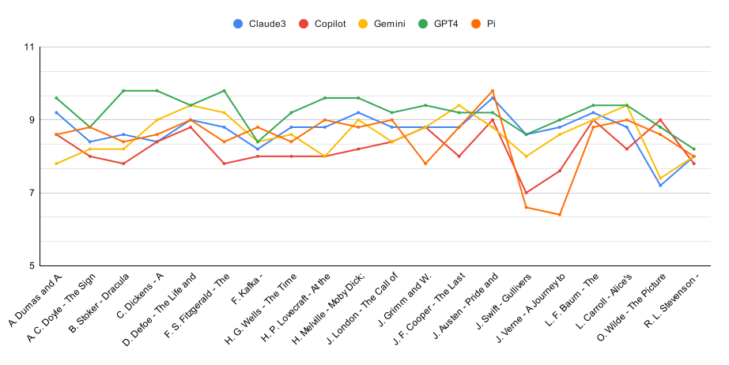
 
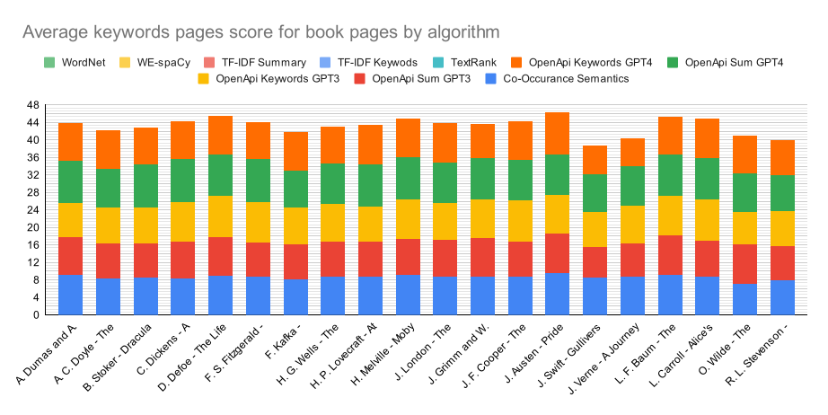
 
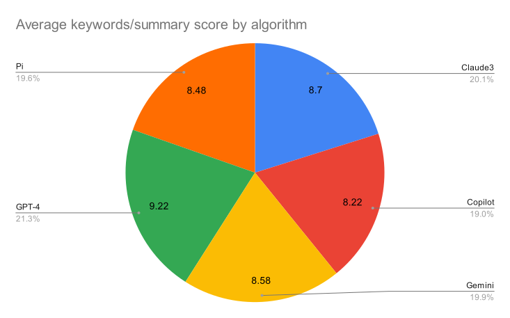

<h2>3. Середня оцінка для згенерованих Dall-e зображень для книги за алгоритмом та промптом</h2>

| Book | Claude3 | Copilot | Gemini | GPT-4 | Pi |
|---|---:|---:|---:|---:|---:|
| А.Дюма - Граф Монте-Крісто | 7.4 | 6.6 | 6.0 | 7.6 | 6.8 |
| А. Конан Дойл - Знак чотирьох | 7.0 | 7.8 | 7.8 | 7.4 | 7.8 |
| Б. Стокер - Дракула | 6.75 | 6.8 | 7.2 | 7.2 | 6.75 |
| Ч. Дікенс - Різдвяна пісня в прозі | 7.6 | 7.6 | 7.6 | 7.8 | 7.6 |
| Д. Дефо - Робінзон Крузо | 7.2 | 6.2 | 7.4 | 6.8 | 7.8 |
| Ф. Скотт Фіцжеральт - Великий Гетсбі | 7.0 | 7.4 | 7.2 | 6.6 | 6.6 |
| Ф. Кафка - Метаморфоза | 6.4 | 6.6 | 6.0 | 6.4 | 6.6 |
| Г. Уелсс - Машина часу | 7.2 | 7.2 | 7.4 | 7.4 | 7.4 |
| Г. Лавкрафт - В горах божевілля | 6.25 | 6.25 | 6.5 | 6.75 | 6.0 |
| Г. Мелвілль - Мобі Дік | 7.2 | 7.2 | 6.8 | 7.6 | 7.2 |
| Дж. Лондон - Поклик предків | 7.4 | 7.0 | 7.2 | 6.8 | 7.25 |
| Я. та В. Грімм - Казки братів Грімм | 7.4 | 7.25 | 7.6 | 6.5 | 6.2 |
| Дж. Ф. Купер - Останній з могікан | 6.8 | 6.0 | 7.4 | 6.4 | 6.6 |
| Дж. Остін - Гордість та упередження | 8.0 | 8.4 | 7.8 | 8.4 | 8.0 |
| Дж. Свіфт - Мандри Гулівера | 5.2 | 5.6 | 5.6 | 6.0 | 5.4 |
| Ж. Верн - Подорож до центру землі | 6.8 | 6.0 | 5.8 | 6.4 | 6.4 |
| Л. Ф. Баум - Чарівник країни Оз | 6.4 | 7.2 | 6.2 | 6.2 | 6.2 |
| Л. Керолл - Аліса у Дивокраї | 8.0 | 7.2 | 7.8 | 6.75 | 7.2 |
| О. Уайлд - Портрет Доріана Грея | 5.8 | 7.6 | 6.2 | 7.0 | 7.4 |
| Р. Л. Стівенсон - Острів скарбів | 6.8 | 5.2 | 6.8 | 6.8 | 7.2 |
| **Середня оцінка** | **6.93** | **6.86** | **6.92** | **6.94** | **6.92** |

 
 
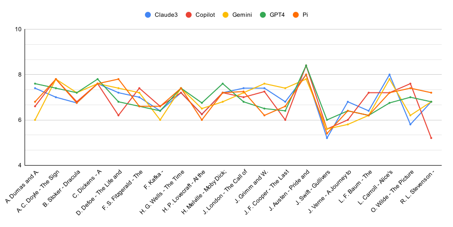
 
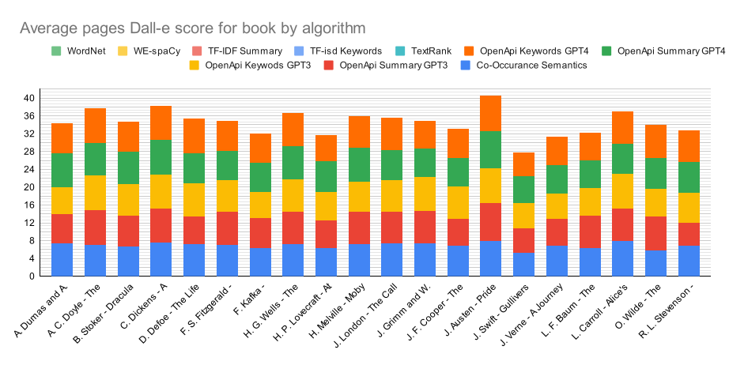
 
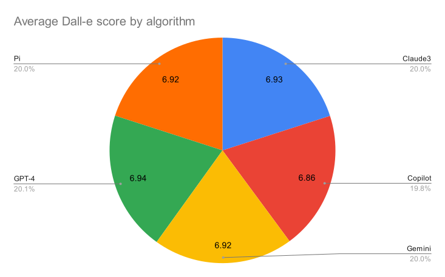

<h2>4. Середня оцінка для згенерованих Stable Diffusion зображень для книги за алгоритмом</h2>

| Booko | Claude3 | Copilot | Gemini | GPT-4 | Pi |
|---|---:|---:|---:|---:|---:|
| А.Дюма - Граф Монте-Крісто | 7.6 | 7.2 | 7.6 | 7.2 | 6.6 |
| А. Конан Дойл - Знак чотирьох | 6.4 | 7.0 | 7.0 | 7.2 | 7.0 |
| Б. Стокер - Дракула | 6.0 | 7.0 | 7.0 | 6.6 | 6.6 |
| Ч. Дікенс - Різдвяна пісня в прозі | 6.8 | 6.8 | 7.4 | 7.0 | 6.6 |
| Д. Дефо - Робінзон Крузо | 6.4 | 6.4 | 8.0 | 6.8 | 8.2 |
| Ф. Скотт Фіцжеральт - Великий Гетсбі | 4.0 | 6.8 | 6.8 | 6.8 | 6.6 |
| Ф. Кафка - Метаморфоза | 5.2 | 6.4 | 6.2 | 6.4 | 6.2 |
| Г. Уелсс - Машина часу | 7.4 | 7.2 | 7.4 | 7.0 | 7.0 |
| Г. Лавкрафт - В горах божевілля | 6.2 | 6.0 | 6.2 | 6.2 | 5.8 |
| Г. Мелвілль - Мобі Дік | 5.4 | 6.4 | 5.8 | 6.4 | 5.4 |
| Дж. Лондон - Поклик предків | 5.8 | 7.0 | 6.4 | 6.6 | 5.4 |
| Я. та В. Грімм - Казки братів Грімм | 6.4 | 6.0 | 6.0 | 6.4 | 6.0 |
| Дж. Ф. Купер - Останній з могікан | 7.2 | 6.0 | 7.0 | 6.4 | 6.6 |
| Дж. Остін - Гордість та упередження | 5.0 | 8.6 | 8.0 | 8.2 | 8.8 |
| Дж. Свіфт - Мандри Гулівера | 4.8 | 5.0 | 5.2 | 5.8 | 4.4 |
| Ж. Верн - Подорож до центру землі | 5.4 | 6.4 | 6.4 | 6.6 | 6.2 |
| Л. Ф. Баум - Чарівник країни Оз | 6.2 | 6.6 | 6.4 | 6.0 | 6.2 |
| Л. Керолл - Аліса у Дивокраї | 7.0 | 7.0 | 7.0 | 7.2 | 6.2 |
| О. Уайлд - Портрет Доріана Грея | 5.2 | 6.8 | 5.6 | 7.8 | 7.2 |
| Р. Л. Стівенсон - Острів скарбів | 5.0 | 7.2 | 5.8 | 6.4 | 6.2 |
| **Середня оцінка** | **5.97** | **6.69** | **6.66** | **6.75** | **6.46** |

 
 
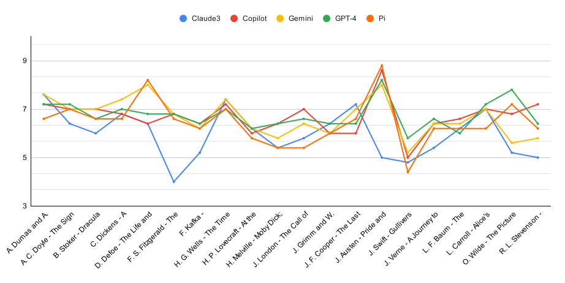
 
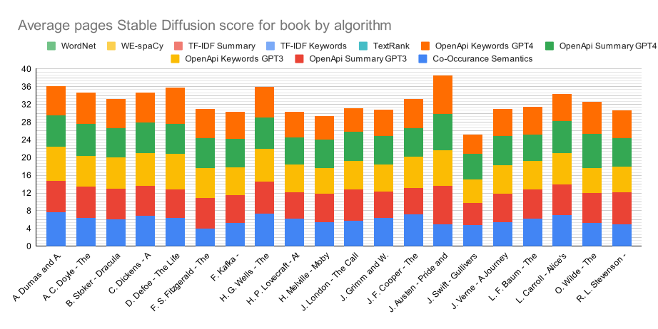
 
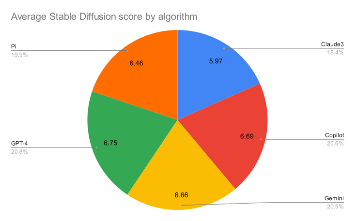

<h2>5. Середня оцінка для згенерованих MidJourney зображень для книги за алгоритмом</h2>

| Book | Claude3 | Copilot | Gemini | GPT-4 | Pi |
|---|---:|---:|---:|---:|---:|
| А.Дюма - Граф Монте-Крісто | 7.2 | 7.2 | 6.75 | 7.6 | 7.2 |
| А. Конан Дойл - Знак чотирьох | 7.2 | 7.8 | 7.4 | 7.8 | 7.6 |
| Б. Стокер - Дракула | 6.6 | 7.4 | 7.6 | 7.4 | 6.8 |
| Ч. Дікенс - Різдвяна пісня в прозі | 8.0 | 7.6 | 8.0 | 8.2 | 7.8 |
| Д. Дефо - Робінзон Крузо | 8.2 | 8.0 | 8.4 | 7.8 | 8.4 |
| Ф. Скотт Фіцжеральт - Великий Гетсбі | 7.4 | 7.2 | 7.6 | 7.2 | 6.8 |
| Ф. Кафка - Метаморфоза | 7.0 | 6.8 | 6.4 | 6.6 | 6.6 |
| Г. Уелсс - Машина часу | 8.2 | 7.6 | 7.6 | 7.8 | 7.2 |
| Г. Лавкрафт - В горах божевілля | 6.8 | 6.4 | 6.6 | 6.4 | 6.6 |
| Г. Мелвілль - Мобі Дік | 6.6 | 6.6 | 6.4 | 6.6 | 6.4 |
| Дж. Лондон - Поклик предків | 7.6 | 7.8 | 6.8 | 7.2 | 6.8 |
| Я. та В. Грімм - Казки братів Грімм | 7.2 | 7.6 | 7.4 | 6.8 | 7.0 |
| Дж. Ф. Купер - Останній з могікан | 8.4 | 7.4 | 8.4 | 7.0 | 8.0 |
| Дж. Остін - Гордість та упередження | 8.8 | 9.0 | 9.0 | 8.8 | 8.8 |
| Дж. Свіфт - Мандри Гулівера | 5.0 | 5.6 | 6.2 | 5.6 | 5.8 |
| Ж. Верн - Подорож до центру землі | 7.6 | 7.0 | 6.8 | 7.4 | 7.6 |
| Л. Ф. Баум - Чарівник країни Оз | 8.4 | 8.0 | 7.8 | 8.0 | 7.0 |
| Л. Керолл - Аліса у Дивокраї | 7.8 | 8.2 | 7.6 | 7.6 | 7.2 |
| О. Уайлд - Портрет Доріана Грея | 6.4 | 7.8 | 6.6 | 8.8 | 8.6 |
| Р. Л. Стівенсон - Острів скарбів | 7.8 | 8.0 | 9.0 | 7.6 | 7.2 |
| **Середня оцінка** | **7.41** | **7.45** | **7.42** | **7.41** | **7.27** |

 
 
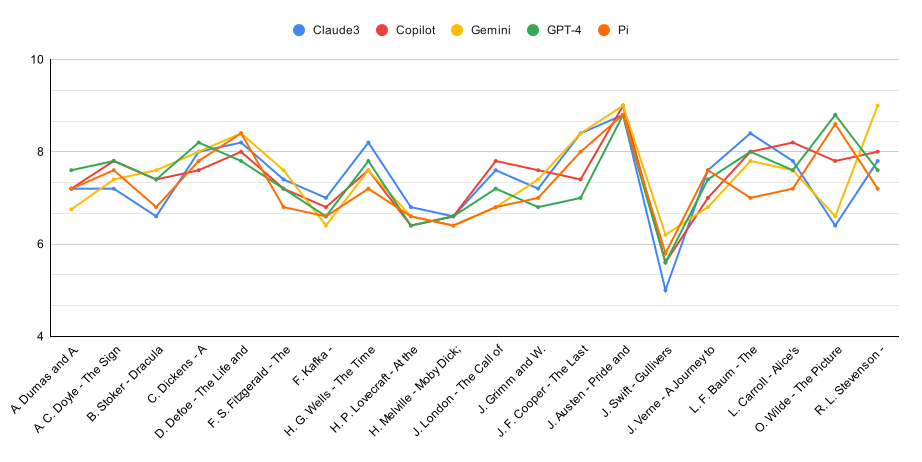
 
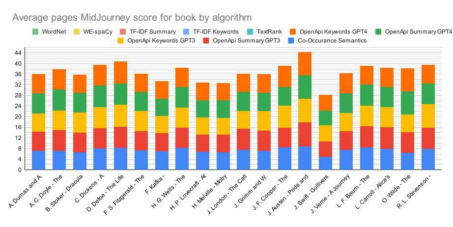
 
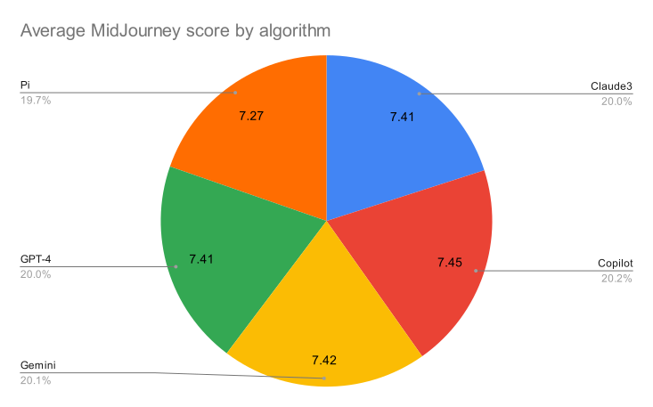

<h2>6. Середня оцінка для Dall-e, Stable Diffusion і MidJourney за книгу</h2>

| Book | Dall-e | StableDiffusion | MidJourney |
|---|---:|---:|---:|
| А.Дюма - Граф Монте-Крісто | 6.88 | 7.24 | 7.19 |
| А. Конан Дойл - Знак чотирьох | 7.56 | 6.92 | 7.56 |
| Б. Стокер - Дракула | 6.94 | 6.64 | 7.16 |
| Ч. Дікенс - Різдвяна пісня в прозі | 7.64 | 6.92 | 7.92 |
| Д. Дефо - Робінзон Крузо | 7.08 | 7.16 | 8.16 |
| Ф. Скотт Фіцжеральт - Великий Гетсбі | 6.96 | 6.20 | 7.24 |
| Ф. Кафка - Метаморфоза | 6.40 | 6.08 | 6.68 |
| Г. Уелсс - Машина часу | 7.32 | 7.20 | 7.68 |
| Г. Лавкрафт - В горах божевілля | 6.35 | 6.08 | 6.56 |
| Г. Мелвілль - Мобі Дік | 7.20 | 5.88 | 6.52 |
| Дж. Лондон - Поклик предків | 7.13 | 6.24 | 7.24 |
| Я. та В. Грімм - Казки братів Грімм | 6.99 | 6.16 | 7.20 |
| Дж. Ф. Купер - Останній з могікан | 6.64 | 6.64 | 7.84 |
| Дж. Остін - Гордість та упередження | 8.12 | 7.72 | 8.88 |
| Дж. Свіфт - Мандри Гулівера | 5.56 | 5.04 | 5.64 |
| Ж. Верн - Подорож до центру землі | 6.28 | 6.20 | 7.28 |
| Л. Ф. Баум - Чарівник країни Оз | 6.44 | 6.28 | 7.84 |
| Л. Керолл - Аліса у Дивокраї | 7.39 | 6.88 | 7.68 |
| О. Уайлд - Портрет Доріана Грея | 6.80 | 6.52 | 7.64 |
| Р. Л. Стівенсон - Острів скарбів | 6.56 | 6.12 | 7.92 |
| **Середня оцінка** | **6.91** | **6.51** | **7.39** |

 
 
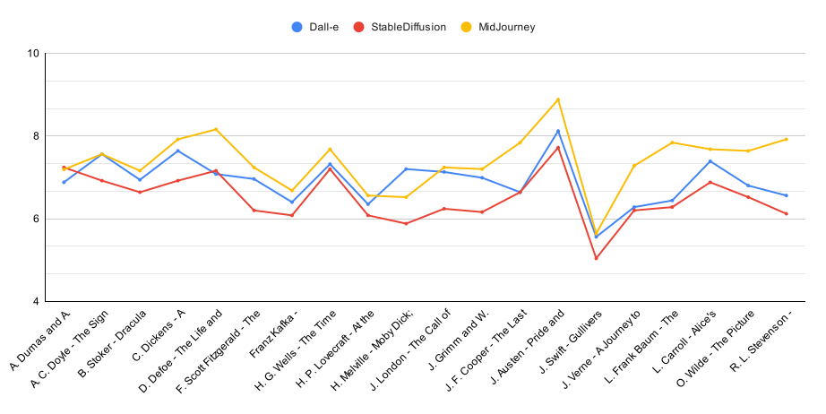
 
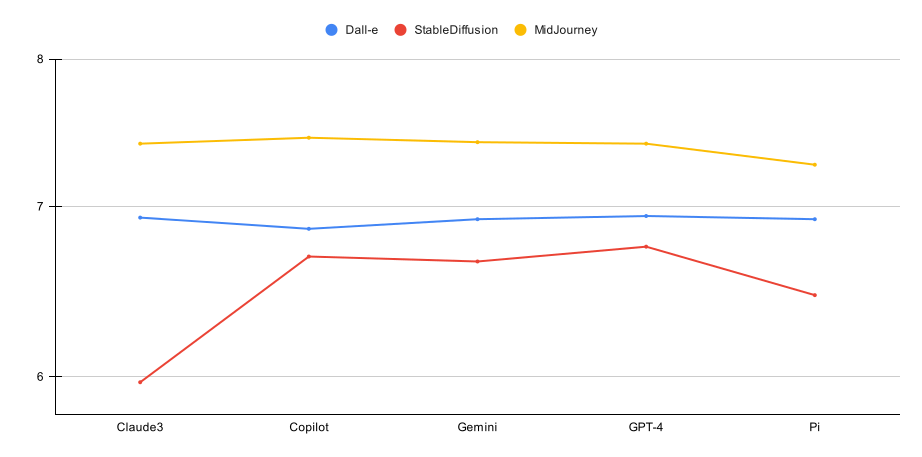

<h2>7. Кількість помилок за алгоритмом</h2>

| Algorithm | Dall-e | StableDiffusion | MidJourney |
|---|---:|---:|---:|
| Claude3 | 2 | 0 | 0 |
| Copilot | 2 | 0 | 1 |
| Gemini | 1 | 0 | 1 |
| GPT-4 | 3 | 0 | 0 |
| Pi | 2 | 0 | 0 |
| **SUM** | **10** | **0** | **2** |

 
 
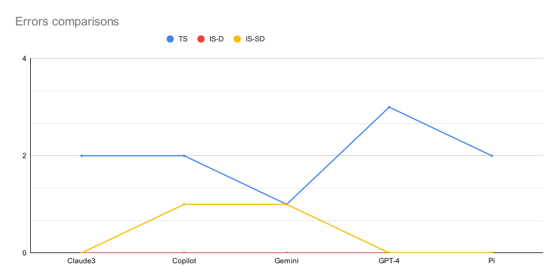
 
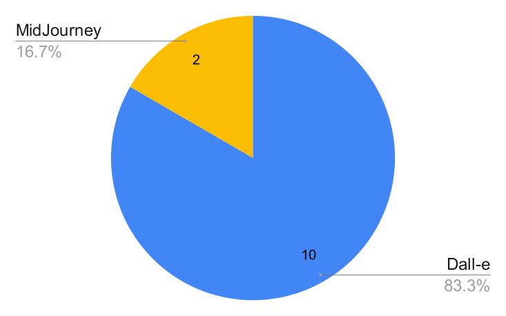

<h2>8. Кількість розпізнань назви/автора книги</h2>

| Book | Claude3 | Copilot | Gemini | GPT-4 | Pi |
|---|---:|---:|---:|---:|---:|
| А.Дюма - Граф Монте-Крісто | 0 | 3 | 0 | 0 | 0 |
| А. Конан Дойл - Знак чотирьох | 2 | 4 | 0 | 0 | 0 |
| Б. Стокер - Дракула | 1 | 2 | 1 | 2 | 0 |
| Ч. Дікенс - Різдвяна пісня в прозі | 1 | 3 | 0 | 1 | 0 |
| Д. Дефо - Робінзон Крузо | 0 | 0 | 3 | 0 | 4 |
| Ф. Скотт Фіцжеральт - Великий Гетсбі | 1 | 0 | 0 | 1 | 0 |
| Ф. Кафка - Метаморфоза | 3 | 1 | 0 | 0 | 0 |
| Г. Уелсс - Машина часу | 1 | 0 | 0 | 0 | 0 |
| Г. Лавкрафт - В горах божевілля | 0 | 0 | 0 | 0 | 0 |
| Г. Мелвілль - Мобі Дік | 0 | 0 | 0 | 1 | 0 |
| Дж. Лондон - Поклик предків | 0 | 0 | 0 | 0 | 0 |
| Я. та В. Грімм - Казки братів Грімм | 0 | 0 | 0 | 0 | 0 |
| Дж. Ф. Купер - Останній з могікан | 0 | 0 | 0 | 0 | 0 |
| Дж. Остін - Гордість та упередження | 0 | 1 | 1 | 0 | 0 |
| Дж. Свіфт - Мандри Гулівера | 1 | 0 | 0 | 0 | 0 |
| Ж. Верн - Подорож до центру землі | 0 | 0 | 0 | 0 | 0 |
| Л. Ф. Баум - Чарівник країни Оз | 1 | 0 | 0 | 0 | 0 |
| Л. Керолл - Аліса у Дивокраї | 2 | 0 | 0 | 0 | 1 |
| О. Уайлд - Портрет Доріана Грея | 2 | 0 | 0 | 1 | 0 |
| Р. Л. Стівенсон - Острів скарбів | 0 | 0 | 0 | 0 | 0 |
| **Sum** | **15** | **14** | **5** | **6** | **5** |

 
 
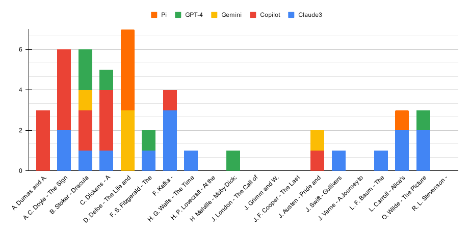
 
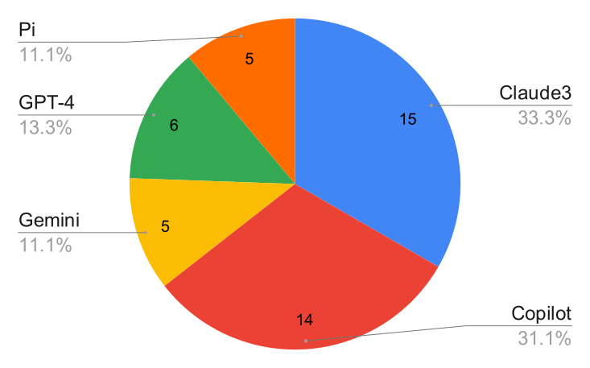

<h2>9. Відношення довжини абстракції до оцінки</h2>

| Book | Model | L | IS-D | Num | IS-SD | Num | IS-MJ | Num |
|---|---|---:|---:|---:|---:|---:|---:|---:|
| А.Дюма - Граф Монте-Крісто | GPT-3 | 29 | 9 | 2 | 7 | 2 | 9 | 1 |
|  | GPT-3 | 37 | 8 | 1 | 6 | 1 | 8 | 1 |
|  | GPT-3 | 28 | 6 | 1 | 8 | 1 | 0 | 0 |
|  | GPT-3 | 35 | 8 | 1 | 6 | 3 | 10 | 1 |
|  | GPT-3 | 37 | 7 | 3 | 8 | 1 | 9 | 2 |
|  | GPT-4 | 31 | 9 | 1 | 7 | 1 | 8 | 2 |
|  | GPT-4 | 41 | 9 | 3 | 7 | 2 | 8 | 2 |
|  | GPT-4 | 36 | 9 | 1 | 8 | 2 | 8 | 1 |
|  | GPT-4 | 41 | 9 | 3 | 7 | 2 | 9 | 1 |
|  | GPT-4 | 35 | 3 | 1 | 7 | 4 | 9 | 2 |
| А. Конан Дойл - Знак чотирьох | GPT-3 | 36 | 7 | 3 | 4 | 1 | 7 | 2 |
|  | GPT-3 | 37 | 1 | 1 | 1 | 1 | 4 | 1 |
|  | GPT-3 | 27 | 5 | 1 | 4 | 1 | 5 | 2 |
|  | GPT-3 | 31 | 7 | 1 | 8 | 3 | 9 | 2 |
|  | GPT-3 | 42 | 10 | 1 | 6 | 1 | 8 | 1 |
|  | GPT-4 | 26 | 3 | 1 | 7 | 1 | 6 | 1 |
|  | GPT-4 | 38 | 3 | 1 | 2 | 1 | 3 | 1 |
|  | GPT-4 | 32 | 3 | 1 | 3 | 1 | 6 | 1 |
|  | GPT-4 | 42 | 6 | 2 | 5 | 2 | 6 | 1 |
|  | GPT-4 | 29 | 9 | 1 | 5 | 1 | 7 | 2 |
| Б. Стокер - Дракула | GPT-3 | 29 | 9 | 2 | 7 | 2 | 8 | 1 |
|  | GPT-3 | 30 | 1 | 1 | 2 | 1 | 2 | 1 |
|  | GPT-3 | 29 | 7 | 1 | 5 | 2 | 6 | 3 |
|  | GPT-3 | 19 | 9 | 2 | 4 | 1 | 8 | 1 |
|  | GPT-3 | 22 | 5 | 1 | 5 | 1 | 6 | 1 |
|  | GPT-4 | 33 | 6 | 2 | 8 | 1 | 8 | 2 |
|  | GPT-4 | 33 | 7 | 3 | 7 | 4 | 7 | 3 |
|  | GPT-4 | 54 | 7 | 1 | 5 | 1 | 6 | 1 |
|  | GPT-4 | 43 | 6 | 2 | 7 | 1 | 8 | 1 |
|  | GPT-4 | 38 | 7 | 2 | 6 | 2 | 7 | 3 |
| Ч. Дікенс - Різдвяна пісня в прозі | GPT-3 | 27 | 9 | 1 | 6 | 4 | 8 | 1 |
|  | GPT-3 | 23 | 9 | 2 | 7 | 4 | 9 | 2 |
|  | GPT-3 | 21 | 8 | 2 | 6 | 1 | 7 | 3 |
|  | GPT-3 | 25 | 7 | 1 | 5 | 1 | 7 | 3 |
|  | GPT-3 | 21 | 7 | 1 | 5 | 1 | 7 | 3 |
|  | GPT-4 | 30 | 8 | 2 | 6 | 1 | 10 | 1 |
|  | GPT-4 | 40 | 9 | 2 | 7 | 1 | 9 | 2 |
|  | GPT-4 | 21 | 8 | 1 | 6 | 1 | 9 | 1 |
|  | GPT-4 | 50 | 5 | 1 | 7 | 1 | 8 | 1 |
|  | GPT-4 | 38 | 5 | 2 | 6 | 2 | 7 | 3 |
| Д. Дефо - Робінзон Крузо | GPT-3 | 39 | 6 | 1 | 5 | 1 | 6 | 1 |
|  | GPT-3 | 30 | 3 | 1 | 3 | 2 | 5 | 2 |
|  | GPT-3 | 38 | 8 | 2 | 8 | 1 | 8 | 1 |
|  | GPT-3 | 34 | 7 | 2 | 6 | 1 | 8 | 2 |
|  | GPT-3 | 42 | 8 | 1 | 3 | 1 | 7 | 1 |
|  | GPT-4 | 39 | 7 | 1 | 7 | 1 | 8 | 2 |
|  | GPT-4 | 51 | 3 | 1 | 3 | 1 | 6 | 1 |
|  | GPT-4 | 42 | 8 | 2 | 8 | 1 | 8 | 3 |
|  | GPT-4 | 39 | 5 | 1 | 3 | 1 | 4 | 1 |
|  | GPT-4 | 36 | 8 | 3 | 4 | 1 | 7 | 1 |
| Ф. Скотт Фіцжеральт - Великий Гетсбі | GPT-3 | 36 | 7 | 3 | 7 | 2 | 7 | 2 |
|  | GPT-3 | 37 | 3 | 1 | 3 | 1 | 3 | 1 |
|  | GPT-3 | 24 | 7 | 2 | 5 | 2 | 7 | 1 |
|  | GPT-3 | 31 | 4 | 1 | 8 | 3 | 8 | 2 |
|  | GPT-3 | 34 | 7 | 2 | 9 | 1 | 9 | 1 |
|  | GPT-4 | 52 | 4 | 1 | 7 | 1 | 6 | 3 |
|  | GPT-4 | 42 | 2 | 1 | 3 | 1 | 5 | 1 |
|  | GPT-4 | 52 | 6 | 2 | 6 | 1 | 6 | 3 |
|  | GPT-4 | 39 | 4 | 1 | 5 | 1 | 8 | 2 |
|  | GPT-4 | 37 | 7 | 1 | 7 | 3 | 8 | 3 |
| Ф. Кафка - Метаморфоза | GPT-3 | 33 | 6 | 1 | 2 | 1 | 5 | 1 |
|  | GPT-3 | 30 | 5 | 1 | 5 | 1 | 5 | 2 |
|  | GPT-3 | 26 | 7 | 3 | 4 | 1 | 4 | 1 |
|  | GPT-3 | 38 | 9 | 1 | 0 | 1 | 9 | 1 |
|  | GPT-3 | 26 | 7 | 3 | 5 | 1 | 5 | 1 |
|  | GPT-4 | 54 | 5 | 1 | 4 | 1 | 5 | 1 |
|  | GPT-4 | 31 | 2 | 1 | 3 | 1 | 3 | 1 |
|  | GPT-4 | 50 | 8 | 1 | 6 | 1 | 10 | 1 |
|  | GPT-4 | 45 | 7 | 2 | 4 | 1 | 5 | 1 |
|  | GPT-4 | 45 | 7 | 2 | 6 | 1 | 9 | 1 |
| Г. Уелсс - Машина часу | GPT-3 | 34 | 6 | 1 | 7 | 2 | 6 | 1 |
|  | GPT-3 | 28 | 7 | 1 | 7 | 2 | 7 | 3 |
|  | GPT-3 | 27 | 6 | 1 | 6 | 4 | 6 | 1 |
|  | GPT-3 | 18 | 7 | 1 | 7 | 1 | 7 | 1 |
|  | GPT-3 | 24 | 6 | 1 | 5 | 2 | 6 | 1 |
|  | GPT-4 | 47 | 2 | 1 | 7 | 1 | 3 | 1 |
|  | GPT-4 | 44 | 9 | 2 | 8 | 2 | 8 | 1 |
|  | GPT-4 | 27 | 6 | 2 | 6 | 2 | 7 | 2 |
|  | GPT-4 | 10 | 6 | 1 | 5 | 1 | 5 | 1 |
|  | GPT-4 | 52 | 6 | 2 | 5 | 1 | 6 | 3 |
| Г. Лавкрафт - В горах божевілля | GPT-3 | 32 | 0 | 0 | 6 | 2 | 8 | 1 |
|  | GPT-3 | 36 | 7 | 3 | 7 | 2 | 8 | 1 |
|  | GPT-3 | 35 | 7 | 3 | 7 | 2 | 7 | 2 |
|  | GPT-3 | 35 | 6 | 1 | 4 | 1 | 7 | 2 |
|  | GPT-3 | 35 | 7 | 3 | 6 | 3 | 6 | 1 |
|  | GPT-4 | 22 | 0 | 0 | 6 | 1 | 8 | 1 |
|  | GPT-4 | 37 | 8 | 3 | 7 | 3 | 8 | 3 |
|  | GPT-4 | 51 | 6 | 1 | 5 | 2 | 7 | 2 |
|  | GPT-4 | 43 | 6 | 2 | 4 | 1 | 7 | 1 |
|  | GPT-4 | 40 | 8 | 2 | 5 | 1 | 6 | 2 |
| Г. Мелвілль - Мобі Дік | GPT-3 | 26 | 7 | 3 | 7 | 1 | 7 | 1 |
|  | GPT-3 | 27 | 8 | 3 | 6 | 4 | 7 | 3 |
|  | GPT-3 | 49 | 7 | 1 | 7 | 1 | 8 | 1 |
|  | GPT-3 | 45 | 8 | 1 | 6 | 1 | 8 | 1 |
|  | GPT-3 | 31 | 8 | 2 | 6 | 1 | 7 | 1 |
|  | GPT-4 | 33 | 7 | 3 | 6 | 1 | 6 | 1 |
|  | GPT-4 | 46 | 7 | 1 | 6 | 1 | 7 | 1 |
|  | GPT-4 | 55 | 8 | 1 | 7 | 1 | 7 | 1 |
|  | GPT-4 | 34 | 8 | 1 | 7 | 2 | 8 | 1 |
|  | GPT-4 | 34 | 9 | 1 | 8 | 1 | 7 | 2 |
| Дж. Лондон - Поклик предків | GPT-3 | 23 | 8 | 1 | 7 | 4 | 7 | 4 |
|  | GPT-3 | 46 | 6 | 1 | 7 | 1 | 7 | 1 |
|  | GPT-3 | 23 | 7 | 5 | 8 | 2 | 7 | 4 |
|  | GPT-3 | 37 | 7 | 3 | 7 | 1 | 7 | 1 |
|  | GPT-3 | 48 | 10 | 1 | 8 | 1 | 9 | 1 |
|  | GPT-4 | 30 | 8 | 2 | 8 | 1 | 8 | 1 |
|  | GPT-4 | 58 | 8 | 1 | 8 | 1 | 7 | 1 |
|  | GPT-4 | 40 | 8 | 2 | 8 | 1 | 9 | 2 |
|  | GPT-4 | 35 | 8 | 2 | 7 | 4 | 8 | 1 |
|  | GPT-4 | 37 | 6 | 2 | 8 | 1 | 9 | 1 |
| Я. та В. Грімм - Казки братів Грімм | GPT-3 | 35 | 9 | 1 | 7 | 2 | 8 | 2 |
|  | GPT-3 | 23 | 7 | 5 | 7 | 4 | 6 | 1 |
|  | GPT-3 | 58 | 7 | 1 | 7 | 1 | 8 | 1 |
|  | GPT-3 | 23 | 7 | 5 | 7 | 4 | 7 | 4 |
|  | GPT-3 | 31 | 3 | 1 | 8 | 3 | 9 | 2 |
|  | GPT-4 | 64 | 8 | 1 | 7 | 1 | 8 | 1 |
|  | GPT-4 | 35 | 6 | 2 | 6 | 2 | 6 | 1 |
|  | GPT-4 | 33 | 6 | 2 | 7 | 4 | 7 | 3 |
|  | GPT-4 | 34 | 7 | 1 | 7 | 2 | 7 | 2 |
|  | GPT-4 | 32 | 4 | 1 | 8 | 1 | 9 | 1 |
| Дж. Ф. Купер - Останній з могікан | GPT-3 | 18 | 9 | 1 | 9 | 1 | 9 | 1 |
|  | GPT-3 | 30 | 6 | 2 | 6 | 1 | 6 | 1 |
|  | GPT-3 | 36 | 8 | 1 | 9 | 1 | 9 | 1 |
|  | GPT-3 | 29 | 6 | 1 | 5 | 2 | 6 | 3 |
|  | GPT-3 | 30 | 6 | 2 | 3 | 2 | 7 | 1 |
|  | GPT-4 | 44 | 9 | 2 | 8 | 2 | 9 | 1 |
|  | GPT-4 | 49 | 6 | 1 | 5 | 1 | 6 | 1 |
|  | GPT-4 | 36 | 8 | 3 | 6 | 1 | 9 | 2 |
|  | GPT-4 | 32 | 7 | 1 | 6 | 1 | 7 | 1 |
|  | GPT-4 | 38 | 7 | 2 | 5 | 2 | 7 | 3 |
| Дж. Остін - Гордість та упередження | GPT-3 | 21 | 6 | 1 | 7 | 1 | 7 | 3 |
|  | GPT-3 | 27 | 8 | 3 | 7 | 2 | 7 | 3 |
|  | GPT-3 | 23 | 7 | 5 | 5 | 1 | 7 | 4 |
|  | GPT-3 | 21 | 8 | 2 | 8 | 1 | 8 | 1 |
|  | GPT-3 | 19 | 9 | 2 | 7 | 1 | 9 | 1 |
|  | GPT-4 | 63 | 10 | 1 | 7 | 1 | 8 | 1 |
|  | GPT-4 | 36 | 8 | 3 | 8 | 2 | 9 | 2 |
|  | GPT-4 | 35 | 6 | 2 | 7 | 4 | 7 | 2 |
|  | GPT-4 | 35 | 8 | 2 | 6 | 2 | 7 | 2 |
|  | GPT-4 | 29 | 10 | 1 | 9 | 1 | 9 | 1 |
| Дж. Свіфт - Мандри Гулівера | GPT-3 | 32 | 7 | 1 | 6 | 2 | 7 | 1 |
|  | GPT-3 | 23 | 4 | 1 | 4 | 1 | 4 | 1 |
|  | GPT-3 | 29 | 8 | 1 | 6 | 1 | 6 | 3 |
|  | GPT-3 | 24 | 9 | 1 | 6 | 1 | 8 | 2 |
|  | GPT-3 | 55 | 5 | 1 | 5 | 1 | 5 | 1 |
|  | GPT-4 | 41 | 7 | 2 | 6 | 1 | 6 | 1 |
|  | GPT-4 | 33 | 0 | 0 | 7 | 4 | 8 | 2 |
|  | GPT-4 | 37 | 6 | 2 | 6 | 2 | 6 | 2 |
|  | GPT-4 | 33 | 9 | 1 | 5 | 1 | 7 | 3 |
|  | GPT-4 | 51 | 7 | 1 | 5 | 2 | 7 | 2 |
| Ж. Верн - Подорож до центру землі | GPT-3 | 56 | 8 | 1 | 6 | 1 | 8 | 1 |
|  | GPT-3 | 28 | 5 | 1 | 5 | 2 | 7 | 3 |
|  | GPT-3 | 31 | 8 | 2 | 7 | 1 | 8 | 2 |
|  | GPT-3 | 24 | 7 | 2 | 7 | 1 | 8 | 2 |
|  | GPT-3 | 37 | 7 | 3 | 4 | 1 | 9 | 2 |
|  | GPT-4 | 41 | 7 | 2 | 8 | 2 | 8 | 2 |
|  | GPT-4 | 28 | 6 | 1 | 6 | 1 | 8 | 2 |
|  | GPT-4 | 28 | 7 | 1 | 4 | 1 | 5 | 1 |
|  | GPT-4 | 31 | 8 | 1 | 8 | 1 | 8 | 2 |
|  | GPT-4 | 19 | 7 | 1 | 8 | 1 | 8 | 1 |
| Л. Ф. Баум - Чарівник країни Оз | GPT-3 | 20 | 8 | 1 | 9 | 1 | 9 | 1 |
|  | GPT-3 | 27 | 8 | 3 | 6 | 4 | 5 | 2 |
|  | GPT-3 | 41 | 7 | 1 | 5 | 1 | 6 | 1 |
|  | GPT-3 | 28 | 8 | 1 | 5 | 2 | 7 | 3 |
|  | GPT-3 | 35 | 7 | 3 | 6 | 3 | 8 | 2 |
|  | GPT-4 | 23 | 9 | 1 | 7 | 1 | 9 | 1 |
|  | GPT-4 | 42 | 7 | 2 | 6 | 2 | 8 | 3 |
|  | GPT-4 | 37 | 8 | 3 | 6 | 2 | 6 | 2 |
|  | GPT-4 | 38 | 5 | 2 | 5 | 2 | 6 | 1 |
|  | GPT-4 | 40 | 9 | 2 | 6 | 2 | 8 | 1 |
| Л. Керолл - Аліса у Дивокраї | GPT-3 | 23 | 9 | 2 | 9 | 1 | 8 | 1 |
|  | GPT-3 | 17 | 7 | 1 | 5 | 1 | 7 | 1 |
|  | GPT-3 | 25 | 9 | 2 | 9 | 1 | 7 | 3 |
|  | GPT-3 | 41 | 9 | 1 | 6 | 1 | 8 | 1 |
|  | GPT-3 | 47 | 7 | 1 | 6 | 1 | 7 | 1 |
|  | GPT-4 | 37 | 8 | 3 | 7 | 3 | 8 | 3 |
|  | GPT-4 | 40 | 6 | 1 | 6 | 2 | 6 | 2 |
|  | GPT-4 | 35 | 7 | 1 | 7 | 4 | 9 | 2 |
|  | GPT-4 | 42 | 7 | 2 | 7 | 1 | 8 | 3 |
|  | GPT-4 | 29 | 8 | 1 | 7 | 1 | 7 | 2 |
| О. Уайлд - Портрет Доріана Грея | GPT-3 | 25 | 9 | 2 | 7 | 1 | 7 | 3 |
|  | GPT-3 | 32 | 5 | 1 | 5 | 1 | 6 | 1 |
|  | GPT-3 | 34 | 8 | 1 | 7 | 2 | 8 | 2 |
|  | GPT-3 | 23 | 7 | 5 | 8 | 2 | 9 | 2 |
|  | GPT-3 | 28 | 9 | 1 | 7 | 2 | 8 | 1 |
|  | GPT-4 | 28 | 8 | 1 | 7 | 1 | 8 | 2 |
|  | GPT-4 | 42 | 8 | 2 | 6 | 2 | 7 | 2 |
|  | GPT-4 | 47 | 3 | 1 | 4 | 1 | 8 | 1 |
|  | GPT-4 | 51 | 9 | 1 | 6 | 1 | 8 | 1 |
|  | GPT-4 | 41 | 9 | 3 | 8 | 2 | 10 | 1 |
| Р. Л. Стівенсон - Острів скарбів | GPT-3 | 20 | 9 | 1 | 7 | 1 | 8 | 1 |
|  | GPT-3 | 16 | 8 | 1 | 7 | 1 | 7 | 1 |
|  | GPT-3 | 19 | 6 | 1 | 6 | 1 | 7 | 1 |
|  | GPT-3 | 38 | 8 | 2 | 6 | 1 | 7 | 1 |
|  | GPT-3 | 27 | 7 | 1 | 7 | 2 | 7 | 3 |
|  | GPT-4 | 30 | 9 | 1 | 7 | 1 | 9 | 1 |
|  | GPT-4 | 27 | 6 | 2 | 6 | 2 | 7 | 2 |
|  | GPT-4 | 33 | 7 | 3 | 7 | 4 | 9 | 1 |
|  | GPT-4 | 42 | 6 | 2 | 5 | 2 | 7 | 2 |
|  | GPT-4 | 24 | 8 | 1 | 7 | 1 | 8 | 1 |

 

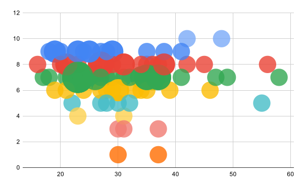
 
GPT3 Dall-e comparison

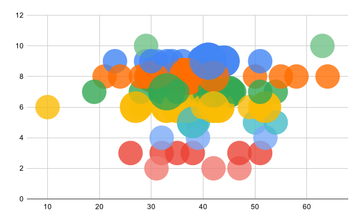
 
GPT4 Dall-e comparison

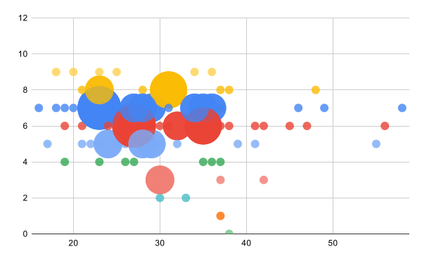
 
GPT3 Stable Diffusion comparison

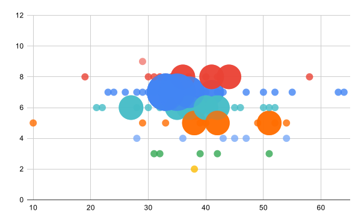
 
GPT4 Stable Diffusion comparison

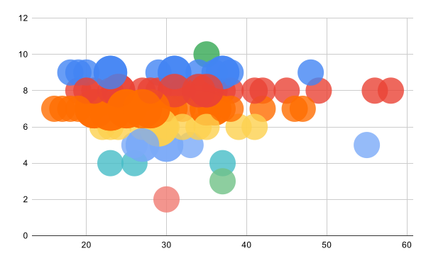
 
GPT3 MidJourney comparison

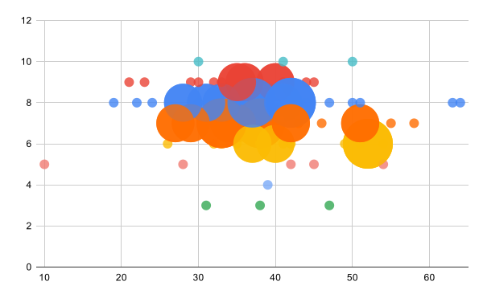
 
GPT4 MidJourney comparison

