<h1>Результати першого етапу дослідження</h1>

[Українською](README_ukr.md)

<b>Скорочення:</b>
<ul>
    <li><b>TS</b> - Оцінка тексту</li>
    <li><b>IS-D</b> - Оцінка зображення - Dalle</li>
    <li><b>IS-SD</b> - Оцінка зображення - SD</li>
    <li><b>IS-MJ</b> - Оцінка зображення - MidJourney</li>
    <li><b>Ln</b> - Довжина рядка</li>
</ul>

<h2>1. Результати оцінювання всіх тестовий сторінок для всіх книг</h2>

<table>
<tbody>
    <tr >
        <td></td><td>TS</td><td>IS-D</td><td>
IS-MJ
</td><td>
IS-SD
</td><td>TS</td><td>IS-D</td><td>
IS-MJ
</td><td>
IS-SD
</td><td>TS</td><td>IS-D</td><td>IS-MJ</td><td>IS-SD</td><td>TS</td><td>IS-D</td><td>IS-MJ</td><td>IS-SD</td><td>TS</td><td>IS-D</td><td>IS-MJ</td><td>IS-SD</td><td>IS-D</td><td>IS-MJ</td><td>IS-SD</td><td>TS</td><td>IS-D</td><td>
IS-MJ
</td><td>IS-SD</td><td>TS</td><td>
IS-D
</td><td>
IS-MJ
</td><td>
IS-SD
</td><td>TS</td><td>IS-D</td><td>
IS-MJ
</td><td>
IS-SD
</td><td>TS</td><td>IS-D</td><td>
IS-MJ
</td><td>
IS-SD
</td><td>TS</td><td>IS-D</td><td>IS-MJ</td><td>IS-SD</td><td>
IS-D
</td><td>
IS-MJ
</td><td>
IS-SD
</td><td>TS</td><td>IS-D</td><td>IS-MJ</td><td>IS-SD</td><td>TS</td><td>IS-D</td><td>IS-MJ</td><td>IS-SD</td><td>TS</td><td>IS-D</td><td>IS-MJ</td><td>IS-SD</td><td>TS</td><td>IS-D</td><td>IS-MJ</td><td>IS-SD</td><td>TS</td><td>IS-D</td><td>IS-MJ</td><td>IS-SD</td><td>IS-D</td><td>IS-MJ</td><td>IS-SD</td><td>TS</td><td>IS-D</td><td>IS-MJ</td><td>IS-SD</td><td>TS</td><td>IS-D</td><td>IS-MJ</td><td>IS-SD</td><td>TS</td><td>IS-D</td><td>IS-MJ</td><td>IS-SD</td><td>TS</td><td>IS-D</td><td>IS-MJ</td><td>IS-SD</td><td>TS</td><td>IS-D</td><td>IS-MJ</td><td>IS-SD</td><td>IS-D</td><td>IS-MJ</td><td>IS-SD</td><td>TS</td><td>IS-D</td><td>IS-MJ</td><td>IS-SD</td><td>TS</td><td>IS-D</td><td>IS-MJ</td><td>IS-SD</td><td>TS</td><td>IS-D</td><td>IS-MJ</td><td>IS-SD</td><td>TS</td><td>IS-D</td><td>IS-MJ</td><td>IS-SD</td><td>TS</td><td>IS-D</td><td>IS-MJ</td><td>IS-SD</td><td>IS-D</td><td>IS-MJ</td><td>IS-SD</td>
    </tr>
    <tr >
        <td colspan="116">А.Дюма - Граф Монте-Крісто</td>
    </tr>
    <tr >
        <td rowspan="1"></td><td colspan="23">Random 1</td><td colspan="23">Random 2</td><td colspan="23">Random 3</td><td colspan="23">Random 4</td><td colspan="23">Random 5</td>
    </tr>
    <tr >
        <td></td><td colspan="4">P1</td><td colspan="4">P2</td><td colspan="4">P3</td><td colspan="4">P4</td><td colspan="4">P5</td><td colspan="3">All Text</td><td colspan="4">P1</td><td colspan="4">P2</td><td colspan="4">P3</td><td colspan="4">P4</td><td colspan="4">P5</td><td colspan="3">All Text</td><td colspan="4">P1</td><td colspan="4">P2</td><td colspan="4">P3</td><td colspan="4">P4</td><td colspan="4">P5</td><td colspan="3">All Text</td><td colspan="4">P1</td><td colspan="4">P2</td><td colspan="4">P3</td><td colspan="4">P4</td><td colspan="4">P5</td><td colspan="3">All Text</td><td colspan="4">P1</td><td colspan="4">P2</td><td colspan="4">P3</td><td colspan="4">P4</td><td colspan="4">P5</td><td colspan="3">All Text</td>
    </tr>
    <tr >
        <td>Claude3</td><td>10</td><td>8</td><td>6</td><td>6</td><td>7</td><td>6</td><td>8</td><td>5</td><td>8</td><td>8</td><td>5</td><td>6</td><td>10</td><td>9</td><td>7</td><td>6</td><td>8</td><td>9</td><td>9</td><td>8</td><td rowspan="3">8</td><td rowspan="3">7</td><td rowspan="3">3</td><td>9</td><td>8</td><td>7</td><td>6</td><td>8</td><td>7</td><td>7</td><td>7</td><td>8</td><td>7</td><td>8</td><td>7</td><td>8</td><td>6</td><td>6</td><td>6</td><td>8</td><td>7</td><td>7</td><td>6</td><td rowspan="3">7</td><td rowspan="3">3</td><td rowspan="3">4</td><td>8</td><td>7</td><td>7</td><td>7</td><td>7</td><td>7</td><td>7</td><td>5</td><td>8</td><td>8</td><td>7</td><td>5</td><td>9</td><td>7</td><td>8</td><td>8</td><td>10</td><td>8</td><td>8</td><td>7</td><td rowspan="3">9</td><td rowspan="3">1</td><td rowspan="3">5</td><td>9</td><td>7</td><td>10</td><td>9</td><td>8</td><td>7</td><td>6</td><td>6</td><td>9</td><td>7</td><td>7</td><td>6</td><td>8</td><td>6</td><td>6</td><td>6</td><td>8</td><td>8</td><td>7</td><td>7</td><td rowspan="3">6</td><td rowspan="3">2</td><td rowspan="3">3</td><td>9</td><td>6</td><td>6</td><td>6</td><td>8</td><td>6</td><td>6</td><td>5</td><td>8</td><td>6</td><td>6</td><td>7</td><td>9</td><td>6</td><td>7</td><td>7</td><td>8</td><td>6</td><td>6</td><td>6</td><td rowspan="3">7</td><td rowspan="3">6</td><td rowspan="3">5</td>
    </tr>
    <tr >
        <td>Gemini</td><td>7</td><td>6</td><td>8</td><td>6</td><td>7</td><td>7</td><td>5</td><td>5</td><td>8</td><td>6</td><td>5</td><td>5</td><td>8</td><td>7</td><td>7</td><td>5</td><td>7</td><td>7</td><td>6</td><td>5</td><td>9</td><td>7</td><td>5</td><td>7</td><td>8</td><td>8</td><td>5</td><td>5</td><td>9</td><td>8</td><td>7</td><td>7</td><td>8</td><td>7</td><td>7</td><td>7</td><td>5</td><td>7</td><td>6</td><td>5</td><td>8</td><td>7</td><td>6</td><td>6</td><td>7</td><td>7</td><td>6</td><td>6</td><td>9</td><td>7</td><td>7</td><td>7</td><td>9</td><td>8</td><td>7</td><td>8</td><td>8</td><td>7</td><td>7</td><td>6</td><td>9</td><td>7</td><td>7</td><td>3</td><td>8</td><td>6</td><td>7</td><td>6</td><td>9</td><td>6</td><td>7</td><td>3</td><td>8</td><td>7</td><td>6</td><td>6</td><td>8</td><td>8</td><td>7</td><td>5</td><td>9</td><td>6</td><td>6</td><td>6</td><td>9</td><td>6</td><td>7</td><td>7</td><td>9</td><td>error</td><td>7</td><td>5</td><td>10</td><td>7</td><td>7</td><td>6</td><td>9</td><td>5</td><td>6</td><td>7</td>
    </tr>
    <tr >
        <td>GPT-4</td><td>10</td><td>7</td><td>7</td><td>8</td><td>8</td><td>8</td><td>6</td><td>5</td><td>10</td><td>6</td><td>7</td><td>5</td><td>9</td><td>7</td><td>7</td><td>6</td><td>10</td><td>9</td><td>9</td><td>8</td><td>9</td><td>3</td><td>6</td><td>7</td><td>8</td><td>8</td><td>7</td><td>8</td><td>9</td><td>10</td><td>7</td><td>6</td><td>6</td><td>3</td><td>5</td><td>5</td><td>10</td><td>9</td><td>9</td><td>5</td><td>9</td><td>8</td><td>8</td><td>8</td><td>8</td><td>7</td><td>9</td><td>8</td><td>8</td><td>7</td><td>8</td><td>8</td><td>9</td><td>8</td><td>7</td><td>7</td><td>10</td><td>8</td><td>9</td><td>8</td><td>9</td><td>8</td><td>7</td><td>7</td><td>9</td><td>8</td><td>7</td><td>7</td><td>9</td><td>8</td><td>6</td><td>6</td><td>8</td><td>7</td><td>7</td><td>6</td><td>8</td><td>6</td><td>7</td><td>7</td><td>9</td><td>6</td><td>6</td><td>6</td><td>8</td><td>5</td><td>5</td><td>5</td><td>9</td><td>error</td><td>7</td><td>7</td><td>10</td><td>6</td><td>7</td><td>7</td><td>10</td><td>10</td><td>7</td><td>7</td>
    </tr>
    <tr >
        <td colspan="116">А. Конан Дойл - Знак чотирьох</td>
    </tr>
    <tr >
        <td>Claude3</td><td>9</td><td>6</td><td>7</td><td>7</td><td>9</td><td>8</td><td>8</td><td>7</td><td>9</td><td>7</td><td>9</td><td>9</td><td>8</td><td>error</td><td>5</td><td>7</td><td>8</td><td>6</td><td>6</td><td>6</td><td rowspan="3">6</td><td rowspan="3">5</td><td rowspan="3">5</td><td>9</td><td>6</td><td>8</td><td>6</td><td>8</td><td>6</td><td>8</td><td>5</td><td>8</td><td>7</td><td>8</td><td>6</td><td>9</td><td>8</td><td>6</td><td>6</td><td>8</td><td>7</td><td>8</td><td>8</td><td rowspan="3">8</td><td rowspan="3">5</td><td rowspan="3">5</td><td>6</td><td>4</td><td>7</td><td>5</td><td>9</td><td>9</td><td>10</td><td>8</td><td>9</td><td>8</td><td>10</td><td>6</td><td>7</td><td>8</td><td>7</td><td>6</td><td>8</td><td>9</td><td>10</td><td>8</td><td rowspan="3">9</td><td rowspan="3">6</td><td rowspan="3">5</td><td>8</td><td>7</td><td>7</td><td>7</td><td>9</td><td>error</td><td>7</td><td>7</td><td>8</td><td>7</td><td>8</td><td>8</td><td>9</td><td>7</td><td>8</td><td>6</td><td>8</td><td>7</td><td>7</td><td>7</td><td rowspan="3">7</td><td rowspan="3">8</td><td rowspan="3">5</td><td>6</td><td>6</td><td>5</td><td>5</td><td>9</td><td>7</td><td>6</td><td>6</td><td>8</td><td>9</td><td>7</td><td>5</td><td>9</td><td>7</td><td>7</td><td>7</td><td>9</td><td>9</td><td>9</td><td>9</td><td rowspan="3">8</td><td rowspan="3">6</td><td rowspan="3">4</td>
    </tr>
    <tr >
        <td>Gemini</td><td>9</td><td>7</td><td>7</td><td>7</td><td>9</td><td>8</td><td>6</td><td>7</td><td>9</td><td>7</td><td>6</td><td>6</td><td>9</td><td>7</td><td>6</td><td>6</td><td>8</td><td>7</td><td>7</td><td>6</td><td>7</td><td>5</td><td>5</td><td>5</td><td>9</td><td>8</td><td>5</td><td>4</td><td>8</td><td>4</td><td>3</td><td>3</td><td>7</td><td>6</td><td>6</td><td>5</td><td>9</td><td>7</td><td>9</td><td>7</td><td>6</td><td>6</td><td>7</td><td>6</td><td>8</td><td>8</td><td>10</td><td>9</td><td>6</td><td>6</td><td>5</td><td>5</td><td>6</td><td>6</td><td>6</td><td>3</td><td>7</td><td>7</td><td>10</td><td>9</td><td>8</td><td>7</td><td>8</td><td>7</td><td>8</td><td>error</td><td>8</td><td>5</td><td>9</td><td>7</td><td>8</td><td>7</td><td>10</td><td>7</td><td>7</td><td>6</td><td>7</td><td>7</td><td>7</td><td>7</td><td>8</td><td>8</td><td>7</td><td>6</td><td>9</td><td>8</td><td>7</td><td>6</td><td>9</td><td>8</td><td>8</td><td>5</td><td>9</td><td>7</td><td>7</td><td>6</td><td>8</td><td>9</td><td>8</td><td>9</td>
    </tr>
    <tr >
        <td>GPT-4</td><td>8</td><td>6</td><td>7</td><td>6</td><td>8</td><td>7</td><td>6</td><td>6</td><td>9</td><td>error</td><td>7</td><td>6</td><td>8</td><td>6</td><td>7</td><td>7</td><td>9</td><td>7</td><td>6</td><td>6</td><td>9</td><td>6</td><td>5</td><td>5</td><td>8</td><td>7</td><td>9</td><td>6</td><td>8</td><td>8</td><td>7</td><td>6</td><td>7</td><td>5</td><td>6</td><td>6</td><td>9</td><td>8</td><td>8</td><td>7</td><td>9</td><td>6</td><td>10</td><td>7</td><td>9</td><td>8</td><td>10</td><td>9</td><td>9</td><td>9</td><td>9</td><td>8</td><td>9</td><td>9</td><td>9</td><td>5</td><td>7</td><td>6</td><td>7</td><td>7</td><td>8</td><td>7</td><td>8</td><td>6</td><td>9</td><td>7</td><td>7</td><td>6</td><td>9</td><td>7</td><td>7</td><td>7</td><td>10</td><td>7</td><td>6</td><td>7</td><td>8</td><td>7</td><td>8</td><td>7</td><td>8</td><td>7</td><td>7</td><td>5</td><td>8</td><td>8</td><td>7</td><td>6</td><td>9</td><td>8</td><td>7</td><td>7</td><td>9</td><td>8</td><td>6</td><td>6</td><td>9</td><td>9</td><td>9</td><td>9</td>
    </tr>
    <tr >
        <td colspan="116">Б. Стокер - Дракула</td>
    </tr>
    <tr >
        <td>Claude3</td><td>8</td><td>8</td><td>7</td><td>3</td><td>8</td><td>7</td><td>7</td><td>7</td><td>8</td><td>7</td><td>8</td><td>3</td><td>9</td><td>7</td><td>9</td><td>6</td><td>8</td><td>8</td><td>8</td><td>7</td><td rowspan="3">7</td><td rowspan="3">9</td><td rowspan="3">5</td><td>9</td><td>7</td><td>8</td><td>7</td><td>8</td><td>
error
</td><td>6</td><td>6</td><td>8</td><td>7</td><td>8</td><td>3</td><td>9</td><td>8</td><td>6</td><td>6</td><td>10</td><td>10</td><td>10</td><td>9</td><td rowspan="3">error</td><td rowspan="3">7</td><td rowspan="3">5</td><td>9</td><td>6</td><td>6</td><td>6</td><td>9</td><td>7</td><td>6</td><td>6</td><td>8</td><td>5</td><td>6</td><td>4</td><td>9</td><td>6</td><td>6</td><td>5</td><td>9</td><td>8</td><td>8</td><td>7</td><td rowspan="3">9</td><td rowspan="3">6</td><td rowspan="3">1</td><td>9</td><td>7</td><td>9</td><td>7</td><td>9</td><td>8</td><td>8</td><td>7</td><td>9</td><td>7</td><td>8</td><td>6</td><td>9</td><td>7</td><td>8</td><td>6</td><td>8</td><td>7</td><td>8</td><td>7</td><td rowspan="3">7</td><td rowspan="3">7</td><td rowspan="3">6</td><td>9</td><td>7</td><td>7</td><td>6</td><td>8</td><td>error</td><td>7</td><td>5</td><td>9</td><td>7</td><td>7</td><td>6</td><td>10</td><td>7</td><td>7</td><td>7</td><td>9</td><td>7</td><td>9</td><td>5</td><td rowspan="3">8</td><td rowspan="3">7</td><td rowspan="3">4</td>
    </tr>
    <tr >
        <td>Gemini</td><td>9</td><td>5</td><td>7</td><td>7</td><td>8</td><td>7</td><td>8</td><td>5</td><td>8</td><td>7</td><td>7</td><td>6</td><td>9</td><td>7</td><td>8</td><td>7</td><td>8</td><td>6</td><td>7</td><td>7</td><td>9</td><td>7</td><td>6</td><td>6</td><td>8</td><td>7</td><td>6</td><td>5</td><td>9</td><td>error</td><td>8</td><td>6</td><td>9</td><td>7</td><td>8</td><td>6</td><td>10</td><td>9</td><td>10</td><td>7</td><td>9</td><td>6</td><td>5</td><td>6</td><td>8</td><td>6</td><td>5</td><td>5</td><td>8</td><td>6</td><td>7</td><td>6</td><td>8</td><td>5</td><td>6</td><td>5</td><td>10</td><td>8</td><td>error</td><td>5</td><td>9</td><td>7</td><td>7</td><td>6</td><td>8</td><td>7</td><td>8</td><td>6</td><td>9</td><td>6</td><td>9</td><td>5</td><td>8</td><td>7</td><td>7</td><td>7</td><td>8</td><td>7</td><td>6</td><td>5</td><td>9</td><td>6</td><td>7</td><td>6</td><td>8</td><td>error</td><td>8</td><td>5</td><td>9</td><td>7</td><td>7</td><td>7</td><td>10</td><td>6</td><td>6</td><td>6</td><td>8</td><td>8</td><td>10</td><td>5</td>
    </tr>
    <tr >
        <td>GPT-4</td><td>8</td><td>6</td><td>8</td><td>7</td><td>8</td><td>7</td><td>7</td><td>8</td><td>8</td><td>6</td><td>8</td><td>8</td><td>9</td><td>6</td><td>8</td><td>6</td><td>8</td><td>7</td><td>7</td><td>6</td><td>9</td><td>7</td><td>6</td><td>6</td><td>8</td><td>
error
</td><td>9</td><td>6</td><td>9</td><td>8</td><td>6</td><td>6</td><td>9</td><td>8</td><td>6</td><td>6</td><td>9</td><td>8</td><td>8</td><td>6</td><td>9</td><td>6</td><td>7</td><td>6</td><td>9</td><td>7</td><td>6</td><td>6</td><td>8</td><td>4</td><td>7</td><td>6</td><td>9</td><td>6</td><td>6</td><td>5</td><td>8</td><td>8</td><td>7</td><td>6</td><td>9</td><td>6</td><td>7</td><td>5</td><td>8</td><td>7</td><td>7</td><td>6</td><td>9</td><td>6</td><td>9</td><td>7</td><td>8</td><td>5</td><td>6</td><td>5</td><td>8</td><td>7</td><td>7</td><td>7</td><td>9</td><td>6</td><td>5</td><td>5</td><td>9</td><td>error</td><td>8</td><td>7</td><td>9</td><td>7</td><td>8</td><td>7</td><td>10</td><td>5</td><td>8</td><td>6</td><td>9</td><td>7</td><td>7</td><td>5</td>
    </tr>
    <tr >
        <td colspan="116">Ч. Дікенс - Різдвяна пісня в прозі</td>
    </tr>
    <tr >
        <td>Claude3</td><td>10</td><td>7</td><td>7</td><td>7</td><td>9</td><td>7</td><td>7</td><td>7</td><td>9</td><td>7</td><td>7</td><td>5</td><td>10</td><td>8</td><td>7</td><td>6</td><td>10</td><td>9</td><td>9</td><td>9</td><td rowspan="3">8</td><td rowspan="3">9</td><td rowspan="3">8</td><td>9</td><td>9</td><td>10</td><td>8</td><td>9</td><td>8</td><td>8</td><td>8</td><td>9</td><td>9</td><td>8</td><td>7</td><td>10</td><td>8</td><td>9</td><td>8</td><td>9</td><td>9</td><td>10</td><td>9</td><td rowspan="3">8</td><td rowspan="3">6</td><td rowspan="3">5</td><td>9</td><td>7</td><td>7</td><td>7</td><td>9</td><td>8</td><td>8</td><td>6</td><td>10</td><td>6</td><td>6</td><td>6</td><td>9</td><td>8</td><td>6</td><td>6</td><td>10</td><td>7</td><td>9</td><td>5</td><td rowspan="3">6</td><td rowspan="3">5</td><td rowspan="3">6</td><td>9</td><td>5</td><td>8</td><td>7</td><td>9</td><td>6</td><td>8</td><td>7</td><td>8</td><td>6</td><td>8</td><td>6</td><td>8</td><td>6</td><td>8</td><td>8</td><td>10</td><td>5</td><td>7</td><td>6</td><td rowspan="3">7</td><td rowspan="3">4</td><td rowspan="3">4</td><td>9</td><td>8</td><td>6</td><td>6</td><td>9</td><td>8</td><td>8</td><td>7</td><td>9</td><td>8</td><td>7</td><td>7</td><td>10</td><td>8</td><td>8</td><td>8</td><td>10</td><td>9</td><td>8</td><td>8</td><td rowspan="3">5</td><td rowspan="3">7</td><td rowspan="3">6</td>
    </tr>
    <tr >
        <td>Gemini</td><td>9</td><td>6</td><td>7</td><td>7</td><td>9</td><td>9</td><td>8</td><td>6</td><td>10</td><td>7</td><td>6</td><td>7</td><td>10</td><td>6</td><td>7</td><td>7</td><td>9</td><td>10</td><td>8</td><td>8</td><td>10</td><td>9</td><td>9</td><td>8</td><td>9</td><td>8</td><td>8</td><td>7</td><td>10</td><td>8</td><td>7</td><td>7</td><td>9</td><td>9</td><td>8</td><td>7</td><td>9</td><td>8</td><td>8</td><td>8</td><td>9</td><td>8</td><td>7</td><td>7</td><td>9</td><td>9</td><td>9</td><td>7</td><td>9</td><td>9</td><td>7</td><td>7</td><td>9</td><td>7</td><td>10</td><td>7</td><td>10</td><td>7</td><td>9</td><td>6</td><td>9</td><td>6</td><td>8</td><td>7</td><td>9</td><td>6</td><td>8</td><td>7</td><td>9</td><td>5</td><td>6</td><td>6</td><td>8</td><td>7</td><td>7</td><td>7</td><td>7</td><td>6</td><td>6</td><td>6</td><td>9</td><td>6</td><td>6</td><td>6</td><td>9</td><td>8</td><td>8</td><td>7</td><td>10</td><td>8</td><td>7</td><td>7</td><td>9</td><td>8</td><td>6</td><td>6</td><td>9</td><td>8</td><td>9</td><td>8</td>
    </tr>
    <tr >
        <td>GPT-4</td><td>10</td><td>8</td><td>7</td><td>7</td><td>8</td><td>8</td><td>7</td><td>6</td><td>9</td><td>7</td><td>9</td><td>7</td><td>10</td><td>7</td><td>6</td><td>7</td><td>10</td><td>8</td><td>10</td><td>9</td><td>9</td><td>9</td><td>8</td><td>7</td><td>9</td><td>9</td><td>8</td><td>8</td><td>9</td><td>9</td><td>8</td><td>6</td><td>10</td><td>9</td><td>9</td><td>8</td><td>9</td><td>8</td><td>8</td><td>8</td><td>9</td><td>6</td><td>8</td><td>7</td><td>9</td><td>9</td><td>8</td><td>7</td><td>9</td><td>7</td><td>6</td><td>6</td><td>9</td><td>8</td><td>5</td><td>5</td><td>10</td><td>8</td><td>9</td><td>6</td><td>8</td><td>6</td><td>7</td><td>7</td><td>9</td><td>7</td><td>7</td><td>7</td><td>9</td><td>5</td><td>7</td><td>7</td><td>9</td><td>6</td><td>7</td><td>7</td><td>7</td><td>6</td><td>6</td><td>6</td><td>9</td><td>7</td><td>7</td><td>7</td><td>9</td><td>7</td><td>6</td><td>7</td><td>9</td><td>7</td><td>7</td><td>6</td><td>8</td><td>7</td><td>7</td><td>6</td><td>9</td><td>7</td><td>7</td><td>6</td>
    </tr>
    <tr >
        <td colspan="116">Д. Дефо - Робінзон Крузо</td>
    </tr>
    <tr >
        <td>Claude3</td><td>10</td><td>7</td><td>8</td><td>7</td><td>9</td><td>7</td><td>7</td><td>7</td><td>10</td><td>7</td><td>8</td><td>7</td><td>8</td><td>7</td><td>7</td><td>7</td><td>9</td><td>8</td><td>8</td><td>8</td><td rowspan="3">8</td><td rowspan="3">5</td><td rowspan="3">5</td><td>5</td><td>4</td><td>4</td><td>4</td><td>8</td><td>7</td><td>10</td><td>7</td><td>9</td><td>9</td><td>9</td><td>9</td><td>5</td><td>4</td><td>9</td><td>7</td><td>9</td><td>7</td><td>10</td><td>7</td><td rowspan="3">3</td><td rowspan="3">5</td><td rowspan="3">4</td><td>8</td><td>7</td><td>9</td><td>9</td><td>9</td><td>7</td><td>8</td><td>7</td><td>9</td><td>7</td><td>9</td><td>9</td><td>9</td><td>7</td><td>9</td><td>9</td><td>10</td><td>7</td><td>10</td><td>7</td><td rowspan="3">7</td><td rowspan="3">9</td><td rowspan="3">6</td><td>8</td><td>7</td><td>7</td><td>6</td><td>9</td><td>7</td><td>8</td><td>7</td><td>8</td><td>7</td><td>7</td><td>6</td><td>8</td><td>6</td><td>6</td><td>6</td><td>8</td><td>7</td><td>7</td><td>7</td><td rowspan="3">error</td><td rowspan="3">5</td><td rowspan="3">5</td><td>8</td><td>7</td><td>8</td><td>6</td><td>8</td><td>7</td><td>8</td><td>7</td><td>8</td><td>7</td><td>9</td><td>5</td><td>8</td><td>7</td><td>9</td><td>6</td><td>8</td><td>7</td><td>9</td><td>6</td><td rowspan="3">6</td><td rowspan="3">7</td><td rowspan="3">6</td>
    </tr>
    <tr >
        <td>Gemini</td><td>9</td><td>6</td><td>9</td><td>8</td><td>9</td><td>7</td><td>9</td><td>7</td><td>9</td><td>6</td><td>8</td><td>7</td><td>8</td><td>6</td><td>7</td><td>6</td><td>8</td><td>7</td><td>9</td><td>7</td><td>5</td><td>4</td><td>4</td><td>4</td><td>9</td><td>9</td><td>10</td><td>9</td><td>5</td><td>9</td><td>9</td><td>9</td><td>5</td><td>8</td><td>7</td><td>7</td><td>6</td><td>7</td><td>10</td><td>9</td><td>8</td><td>7</td><td>9</td><td>9</td><td>9</td><td>7</td><td>7</td><td>6</td><td>9</td><td>7</td><td>7</td><td>6</td><td>9</td><td>7</td><td>9</td><td>8</td><td>8</td><td>7</td><td>9</td><td>8</td><td>8</td><td>error</td><td>6</td><td>6</td><td>10</td><td>7</td><td>7</td><td>6</td><td>8</td><td>6</td><td>6</td><td>6</td><td>7</td><td>error</td><td>5</td><td>5</td><td>10</td><td>7</td><td>9</td><td>6</td><td>8</td><td>5</td><td>8</td><td>5</td><td>8</td><td>7</td><td>8</td><td>5</td><td>8</td><td>8</td><td>6</td><td>5</td><td>8</td><td>7</td><td>9</td><td>5</td><td>8</td><td>6</td><td>9</td><td>6</td>
    </tr>
    <tr >
        <td>GPT-4</td><td>10</td><td>7</td><td>7</td><td>7</td><td>8</td><td>7</td><td>8</td><td>7</td><td>9</td><td>7</td><td>7</td><td>7</td><td>8</td><td>7</td><td>8</td><td>7</td><td>8</td><td>7</td><td>9</td><td>7</td><td>5</td><td>4</td><td>4</td><td>4</td><td>9</td><td>9</td><td>10</td><td>7</td><td>5</td><td>8</td><td>9</td><td>9</td><td>5</td><td>7</td><td>7</td><td>7</td><td>6</td><td>6</td><td>10</td><td>8</td><td>8</td><td>8</td><td>9</td><td>9</td><td>10</td><td>7</td><td>9</td><td>9</td><td>9</td><td>7</td><td>7</td><td>9</td><td>9</td><td>7</td><td>10</td><td>10</td><td>10</td><td>7</td><td>7</td><td>9</td><td>9</td><td>7</td><td>8</td><td>7</td><td>9</td><td>7</td><td>7</td><td>7</td><td>8</td><td>5</td><td>6</td><td>6</td><td>8</td><td>error</td><td>7</td><td>6</td><td>9</td><td>7</td><td>7</td><td>6</td><td>8</td><td>5</td><td>6</td><td>5</td><td>9</td><td>8</td><td>7</td><td>5</td><td>8</td><td>7</td><td>8</td><td>6</td><td>8</td><td>6</td><td>8</td><td>5</td><td>9</td><td>5</td><td>9</td><td>6</td>
    </tr>
    <tr >
        <td colspan="116">Ф. Скотт Фіцжеральт - Великий Гетсбі</td>
    </tr>
    <tr >
        <td>Claude3</td><td>8</td><td>7</td><td>6</td><td>6</td><td>9</td><td>8</td><td>7</td><td>7</td><td>9</td><td>9</td><td>6</td><td>6</td><td>10</td><td>9</td><td>6</td><td>6</td><td>9</td><td>7</td><td>7</td><td>6</td><td rowspan="3">6</td><td rowspan="3">6</td><td rowspan="3">6</td><td>9</td><td>8</td><td>9</td><td>8</td><td>10</td><td>7</td><td>7</td><td>7</td><td>9</td><td>7</td><td>7</td><td>6</td><td>8</td><td>7</td><td>7</td><td>6</td><td>10</td><td>8</td><td>7</td><td>8</td><td rowspan="3">8</td><td rowspan="3">7</td><td rowspan="3">3</td><td>9</td><td>8</td><td>9</td><td>9</td><td>9</td><td>7</td><td>8</td><td>7</td><td>9</td><td>8</td><td>8</td><td>7</td><td>9</td><td>8</td><td>8</td><td>7</td><td>10</td><td>9</td><td>9</td><td>6</td><td rowspan="3">9</td><td rowspan="3">8</td><td rowspan="3">7</td><td>8</td><td>7</td><td>8</td><td>8</td><td>9</td><td>7</td><td>9</td><td>9</td><td>9</td><td>7</td><td>5</td><td>5</td><td>9</td><td>7</td><td>7</td><td>6</td><td>9</td><td>7</td><td>7</td><td>7</td><td rowspan="3">6</td><td rowspan="3">7</td><td rowspan="3">6</td><td>8</td><td>7</td><td>7</td><td>7</td><td>9</td><td>6</td><td>7</td><td>7</td><td>8</td><td>7</td><td>7</td><td>6</td><td>9</td><td>7</td><td>7</td><td>7</td><td>9</td><td>6</td><td>7</td><td>7</td><td rowspan="3">6</td><td rowspan="3">7</td><td rowspan="3">6</td>
    </tr>
    <tr >
        <td>Gemini</td><td>8</td><td>4</td><td>2</td><td>3</td><td>9</td><td>7</td><td>6</td><td>2</td><td>9</td><td>6</td><td>6</td><td>6</td><td>9</td><td>6</td><td>6</td><td>6</td><td>10</td><td>9</td><td>8</td><td>7</td><td>9</td><td>6</td><td>7</td><td>6</td><td>10</td><td>7</td><td>8</td><td>7</td><td>9</td><td>5</td><td>6</td><td>6</td><td>8</td><td>5</td><td>6</td><td>5</td><td>8</td><td>8</td><td>9</td><td>6</td><td>9</td><td>6</td><td>7</td><td>7</td><td>9</td><td>9</td><td>8</td><td>8</td><td>9</td><td>7</td><td>7</td><td>7</td><td>9</td><td>6</td><td>7</td><td>7</td><td>9</td><td>8</td><td>7</td><td>6</td><td>9</td><td>7</td><td>7</td><td>7</td><td>9</td><td>7</td><td>7</td><td>7</td><td>9</td><td>8</td><td>8</td><td>7</td><td>9</td><td>8</td><td>8</td><td>9</td><td>9</td><td>7</td><td>5</td><td>5</td><td>9</td><td>7</td><td>7</td><td>7</td><td>10</td><td>10</td><td>8</td><td>7</td><td>8</td><td>6</td><td>8</td><td>8</td><td>7</td><td>7</td><td>7</td><td>8</td><td>8</td><td>6</td><td>6</td><td>6</td>
    </tr>
    <tr >
        <td>GPT-4</td><td>9</td><td>7</td><td>5</td><td>6</td><td>10</td><td>6</td><td>6</td><td>6</td><td>10</td><td>9</td><td>6</td><td>6</td><td>9</td><td>5</td><td>6</td><td>6</td><td>9</td><td>9</td><td>9</td><td>7</td><td>8</td><td>7</td><td>6</td><td>6</td><td>10</td><td>8</td><td>6</td><td>6</td><td>8</td><td>5</td><td>6</td><td>6</td><td>8</td><td>5</td><td>5</td><td>5</td><td>10</td><td>9</td><td>9</td><td>9</td><td>10</td><td>7</td><td>8</td><td>7</td><td>9</td><td>8</td><td>7</td><td>7</td><td>9</td><td>6</td><td>7</td><td>7</td><td>10</td><td>9</td><td>8</td><td>7</td><td>10</td><td>8</td><td>7</td><td>7</td><td>8</td><td>6</td><td>7</td><td>6</td><td>9</td><td>7</td><td>6</td><td>6</td><td>9</td><td>6</td><td>7</td><td>6</td><td>8</td><td>7</td><td>8</td><td>8</td><td>10</td><td>6</td><td>8</td><td>6</td><td>9</td><td>7</td><td>7</td><td>6</td><td>9</td><td>7</td><td>7</td><td>7</td><td>10</td><td>6</td><td>8</td><td>7</td><td>9</td><td>6</td><td>7</td><td>6</td><td>9</td><td>7</td><td>8</td><td>7</td>
    </tr>
    <tr >
        <td colspan="116">Ф. Кафка - Метаморфоза</td>
    </tr>
    <tr >
        <td>Claude3</td><td>9</td><td>8</td><td>9</td><td>7</td><td>9</td><td>7</td><td>10</td><td>7</td><td>9</td><td>7</td><td>9</td><td>6</td><td>8</td><td>6</td><td>6</td><td>6</td><td>10</td><td>10</td><td>10</td><td>9</td><td rowspan="3">10</td><td rowspan="3">7</td><td rowspan="3">6</td><td>8</td><td>6</td><td>7</td><td>7</td><td>9</td><td>7</td><td>7</td><td>6</td><td>8</td><td>8</td><td>8</td><td>6</td><td>8</td><td>7</td><td>9</td><td>7</td><td>10</td><td>9</td><td>10</td><td>9</td><td rowspan="3">7</td><td rowspan="3">7</td><td rowspan="3">6</td><td>8</td><td>6</td><td>6</td><td>6</td><td>9</td><td>8</td><td>8</td><td>8</td><td>8</td><td>7</td><td>7</td><td>4</td><td>10</td><td>7</td><td>6</td><td>6</td><td>10</td><td>8</td><td>9</td><td>6</td><td rowspan="3">8</td><td rowspan="3">6</td><td rowspan="3">5</td><td>9</td><td>7</td><td>8</td><td>6</td><td>9</td><td>8</td><td>8</td><td>7</td><td>8</td><td>6</td><td>6</td><td>6</td><td>8</td><td>7</td><td>7</td><td>6</td><td>10</td><td>9</td><td>9</td><td>8</td><td rowspan="3">6</td><td rowspan="3">5</td><td rowspan="3">5</td><td>9</td><td>8</td><td>8</td><td>5</td><td>9</td><td>7</td><td>9</td><td>7</td><td>8</td><td>6</td><td>5</td><td>1</td><td>9</td><td>7</td><td>9</td><td>7</td><td>10</td><td>9</td><td>10</td><td>6</td><td rowspan="3">9</td><td rowspan="3">6</td><td rowspan="3">3</td>
    </tr>
    <tr >
        <td>Gemini</td><td>7</td><td>7</td><td>6</td><td>7</td><td>9</td><td>8</td><td>9</td><td>7</td><td>8</td><td>7</td><td>7</td><td>7</td><td>8</td><td>6</td><td>7</td><td>6</td><td>9</td><td>10</td><td>8</td><td>9</td><td>8</td><td>7</td><td>6</td><td>6</td><td>8</td><td>7</td><td>7</td><td>5</td><td>8</td><td>7</td><td>7</td><td>7</td><td>9</td><td>7</td><td>7</td><td>6</td><td>8</td><td>7</td><td>8</td><td>8</td><td>8</td><td>6</td><td>6</td><td>6</td><td>9</td><td>8</td><td>7</td><td>6</td><td>8</td><td>7</td><td>7</td><td>5</td><td>10</td><td>8</td><td>8</td><td>6</td><td>9</td><td>7</td><td>8</td><td>6</td><td>8</td><td>6</td><td>6</td><td>6</td><td>9</td><td>7</td><td>8</td><td>6</td><td>8</td><td>7</td><td>5</td><td>6</td><td>8</td><td>6</td><td>6</td><td>5</td><td>9</td><td>8</td><td>7</td><td>6</td><td>8</td><td>7</td><td>6</td><td>6</td><td>9</td><td>7</td><td>7</td><td>6</td><td>8</td><td>6</td><td>6</td><td>5</td><td>8</td><td>6</td><td>6</td><td>5</td><td>8</td><td>8</td><td>8</td><td>5</td>
    </tr>
    <tr >
        <td>GPT-4</td><td>7</td><td>6</td><td>6</td><td>6</td><td>10</td><td>8</td><td>6</td><td>6</td><td>9</td><td>7</td><td>9</td><td>6</td><td>9</td><td>6</td><td>6</td><td>6</td><td>10</td><td>10</td><td>9</td><td>8</td><td>8</td><td>5</td><td>5</td><td>6</td><td>9</td><td>7</td><td>7</td><td>7</td><td>8</td><td>7</td><td>6</td><td>5</td><td>9</td><td>7</td><td>7</td><td>7</td><td>10</td><td>8</td><td>8</td><td>7</td><td>8</td><td>6</td><td>5</td><td>6</td><td>9</td><td>7</td><td>7</td><td>6</td><td>8</td><td>7</td><td>4</td><td>5</td><td>10</td><td>7</td><td>7</td><td>6</td><td>10</td><td>7</td><td>7</td><td>6</td><td>8</td><td>7</td><td>7</td><td>6</td><td>9</td><td>7</td><td>6</td><td>6</td><td>8</td><td>7</td><td>6</td><td>6</td><td>8</td><td>6</td><td>5</td><td>5</td><td>10</td><td>9</td><td>8</td><td>6</td><td>9</td><td>8</td><td>7</td><td>6</td><td>9</td><td>7</td><td>8</td><td>7</td><td>8</td><td>7</td><td>6</td><td>6</td><td>8</td><td>6</td><td>6</td><td>6</td><td>10</td><td>6</td><td>8</td><td>7</td>
    </tr>
    <tr >
        <td colspan="116">Г. Уелсс - Машина часу</td>
    </tr>
    <tr >
        <td>Claude3</td><td>7</td><td>6</td><td>5</td><td>6</td><td>9</td><td>7</td><td>6</td><td>6</td><td>7</td><td>5</td><td>6</td><td>7</td><td>8</td><td>6</td><td>7</td><td>7</td><td>9</td><td>7</td><td>7</td><td>7</td><td rowspan="3">7</td><td rowspan="3">5</td><td rowspan="3">4</td><td>8</td><td>7</td><td>8</td><td>7</td><td>9</td><td>7</td><td>9</td><td>6</td><td>10</td><td>8</td><td>8</td><td>7</td><td>8</td><td>7</td><td>7</td><td>7</td><td>9</td><td>9</td><td>10</td><td>6</td><td rowspan="3">8</td><td rowspan="3">6</td><td rowspan="3">6</td><td>8</td><td>7</td><td>6</td><td>6</td><td>9</td><td>7</td><td>7</td><td>5</td><td>8</td><td>7</td><td>7</td><td>6</td><td>8</td><td>7</td><td>6</td><td>6</td><td>10</td><td>7</td><td>10</td><td>6</td><td rowspan="3">9</td><td rowspan="3">5</td><td rowspan="3">3</td><td>7</td><td>7</td><td>7</td><td>7</td><td>9</td><td>9</td><td>9</td><td>6</td><td>9</td><td>8</td><td>8</td><td>7</td><td>9</td><td>6</td><td>6</td><td>8</td><td>9</td><td>7</td><td>6</td><td>5</td><td rowspan="3">6</td><td rowspan="3">7</td><td rowspan="3">5</td><td>7</td><td>6</td><td>6</td><td>6</td><td>9</td><td>6</td><td>8</td><td>7</td><td>8</td><td>8</td><td>8</td><td>7</td><td>8</td><td>6</td><td>6</td><td>6</td><td>10</td><td>7</td><td>8</td><td>7</td><td rowspan="3">7</td><td rowspan="3">5</td><td rowspan="3">5</td>
    </tr>
    <tr >
        <td>Gemini</td><td>7</td><td>6</td><td>6</td><td>6</td><td>9</td><td>6</td><td>6</td><td>5</td><td>9</td><td>6</td><td>7</td><td>7</td><td>9</td><td>6</td><td>5</td><td>5</td><td>7</td><td>6</td><td>7</td><td>5</td><td>7</td><td>7</td><td>7</td><td>7</td><td>10</td><td>7</td><td>8</td><td>7</td><td>9</td><td>7</td><td>6</td><td>6</td><td>9</td><td>7</td><td>7</td><td>7</td><td>10</td><td>8</td><td>8</td><td>7</td><td>8</td><td>7</td><td>5</td><td>4</td><td>8</td><td>6</td><td>7</td><td>7</td><td>9</td><td>8</td><td>7</td><td>7</td><td>8</td><td>7</td><td>7</td><td>6</td><td>9</td><td>7</td><td>8</td><td>6</td><td>7</td><td>9</td><td>8</td><td>7</td><td>9</td><td>9</td><td>6</td><td>5</td><td>10</td><td>9</td><td>8</td><td>6</td><td>8</td><td>6</td><td>6</td><td>6</td><td>9</td><td>8</td><td>10</td><td>6</td><td>8</td><td>6</td><td>8</td><td>8</td><td>10</td><td>7</td><td>8</td><td>5</td><td>9</td><td>7</td><td>7</td><td>6</td><td>8</td><td>7</td><td>7</td><td>6</td><td>8</td><td>7</td><td>8</td><td>7</td>
    </tr>
    <tr >
        <td>GPT-4</td><td>7</td><td>7</td><td>6</td><td>5</td><td>9</td><td>8</td><td>5</td><td>6</td><td>7</td><td>6</td><td>6</td><td>7</td><td>9</td><td>6</td><td>7</td><td>7</td><td>7</td><td>6</td><td>7</td><td>6</td><td>8</td><td>7</td><td>7</td><td>7</td><td>10</td><td>7</td><td>8</td><td>6</td><td>9</td><td>7</td><td>7</td><td>6</td><td>9</td><td>7</td><td>8</td><td>7</td><td>10</td><td>8</td><td>8</td><td>6</td><td>8</td><td>7</td><td>6</td><td>6</td><td>10</td><td>8</td><td>6</td><td>4</td><td>9</td><td>6</td><td>6</td><td>5</td><td>8</td><td>6</td><td>6</td><td>6</td><td>10</td><td>8</td><td>8</td><td>6</td><td>8</td><td>7</td><td>7</td><td>7</td><td>9</td><td>8</td><td>9</td><td>8</td><td>10</td><td>9</td><td>9</td><td>9</td><td>8</td><td>8</td><td>7</td><td>8</td><td>9</td><td>8</td><td>10</td><td>6</td><td>8</td><td>6</td><td>8</td><td>7</td><td>10</td><td>8</td><td>7</td><td>6</td><td>9</td><td>8</td><td>8</td><td>9</td><td>9</td><td>7</td><td>8</td><td>7</td><td>10</td><td>6</td><td>7</td><td>6</td>
    </tr>
    <tr >
        <td colspan="116">Г. Лавкрафт - В горах божевілля</td>
    </tr>
    <tr >
        <td>Claude3</td><td>8</td><td>error</td><td>5</td><td>5</td><td>10</td><td>error</td><td>6</td><td>5</td><td>8</td><td>error</td><td>7</td><td>5</td><td>7</td><td>error</td><td>6</td><td>6</td><td>9</td><td>error</td><td>7</td><td>6</td><td rowspan="3">error</td><td rowspan="3">6</td><td rowspan="3">5</td><td>7</td><td>6</td><td>7</td><td>7</td><td>10</td><td>7</td><td>9</td><td>7</td><td>7</td><td>6</td><td>7</td><td>6</td><td>7</td><td>6</td><td>6</td><td>6</td><td>8</td><td>7</td><td>7</td><td>7</td><td rowspan="3">7</td><td rowspan="3">6</td><td rowspan="3">7</td><td>9</td><td>8</td><td>7</td><td>7</td><td>8</td><td>7</td><td>8</td><td>7</td><td>10</td><td>7</td><td>7</td><td>7</td><td>9</td><td>7</td><td>7</td><td>7</td><td>10</td><td>7</td><td>7</td><td>7</td><td rowspan="3">7</td><td rowspan="3">7</td><td rowspan="3">7</td><td>8</td><td>7</td><td>7</td><td>5</td><td>10</td><td>8</td><td>7</td><td>7</td><td>7</td><td>6</td><td>2</td><td>3</td><td>7</td><td>6</td><td>5</td><td>4</td><td>8</td><td>7</td><td>7</td><td>7</td><td rowspan="3">6</td><td rowspan="3">3</td><td rowspan="3">1</td><td>8</td><td>6</td><td>6</td><td>6</td><td>9</td><td>7</td><td>8</td><td>7</td><td>8</td><td>6</td><td>5</td><td>5</td><td>8</td><td>7</td><td>6</td><td>2</td><td>10</td><td>7</td><td>7</td><td>7</td><td rowspan="3">6</td><td rowspan="3">8</td><td rowspan="3">2</td>
    </tr>
    <tr >
        <td>Gemini</td><td>8</td><td>error</td><td>5</td><td>5</td><td>10</td><td>error</td><td>5</td><td>4</td><td>8</td><td>error</td><td>6</td><td>5</td><td>8</td><td>error</td><td>6</td><td>6</td><td>8</td><td>error</td><td>7</td><td>6</td><td>7</td><td>5</td><td>6</td><td>5</td><td>10</td><td>8</td><td>10</td><td>8</td><td>8</td><td>6</td><td>8</td><td>7</td><td>6</td><td>6</td><td>6</td><td>6</td><td>6</td><td>7</td><td>7</td><td>6</td><td>9</td><td>8</td><td>7</td><td>7</td><td>8</td><td>6</td><td>7</td><td>7</td><td>10</td><td>7</td><td>7</td><td>7</td><td>9</td><td>7</td><td>7</td><td>7</td><td>10</td><td>8</td><td>8</td><td>7</td><td>7</td><td>6</td><td>4</td><td>4</td><td>8</td><td>7</td><td>7</td><td>5</td><td>8</td><td>6</td><td>3</td><td>4</td><td>7</td><td>5</td><td>5</td><td>4</td><td>8</td><td>7</td><td>7</td><td>5</td><td>7</td><td>6</td><td>2</td><td>2</td><td>10</td><td>7</td><td>8</td><td>7</td><td>7</td><td>6</td><td>5</td><td>5</td><td>9</td><td>8</td><td>3</td><td>2</td><td>8</td><td>5</td><td>6</td><td>5</td>
    </tr>
    <tr >
        <th   >
45
</th><td>GPT-4</td><td>8</td><td>error</td><td>5</td><td>5</td><td>10</td><td>error</td><td>7</td><td>6</td><td>8</td><td>error</td><td>7</td><td>5</td><td>8</td><td>error</td><td>6</td><td>5</td><td>9</td><td>error</td><td>7</td><td>5</td><td>7</td><td>7</td><td>8</td><td>7</td><td>10</td><td>8</td><td>9</td><td>8</td><td>10</td><td>7</td><td>8</td><td>6</td><td>8</td><td>7</td><td>9</td><td>7</td><td>8</td><td>7</td><td>7</td><td>7</td><td>9</td><td>7</td><td>8</td><td>7</td><td>10</td><td>8</td><td>9</td><td>7</td><td>10</td><td>7</td><td>7</td><td>7</td><td>9</td><td>8</td><td>8</td><td>7</td><td>10</td><td>7</td><td>7</td><td>7</td><td>8</td><td>6</td><td>4</td><td>4</td><td>8</td><td>6</td><td>6</td><td>6</td><td>8</td><td>6</td><td>3</td><td>4</td><td>7</td><td>6</td><td>4</td><td>3</td><td>8</td><td>7</td><td>7</td><td>7</td><td>7</td><td>5</td><td>6</td><td>5</td><td>10</td><td>7</td><td>7</td><td>7</td><td>7</td><td>6</td><td>7</td><td>6</td><td>9</td><td>6</td><td>6</td><td>5</td><td>10</td><td>7</td><td>9</td><td>7</td>
    </tr>
    <tr >
        <td colspan="116">Г. Мелвілль - Мобі Дік</td>
    </tr>
    <tr >
        <td>Claude3</td><td>7</td><td>6</td><td>6</td><td>5</td><td>9</td><td>8</td><td>8</td><td>7</td><td>9</td><td>8</td><td>9</td><td>7</td><td>7</td><td>7</td><td>8</td><td>7</td><td>10</td><td>8</td><td>8</td><td>7</td><td rowspan="3">7</td><td rowspan="3">7</td><td rowspan="3">6</td><td>6</td><td>5</td><td>5</td><td>5</td><td>9</td><td>6</td><td>6</td><td>6</td><td>8</td><td>7</td><td>8</td><td>7</td><td>8</td><td>5</td><td>6</td><td>6</td><td>9</td><td>8</td><td>9</td><td>7</td><td rowspan="3">6</td><td rowspan="3">5</td><td rowspan="3">6</td><td>9</td><td>7</td><td>7</td><td>7</td><td>9</td><td>7</td><td>7</td><td>8</td><td>9</td><td>8</td><td>9</td><td>7</td><td>9</td><td>9</td><td>9</td><td>8</td><td>10</td><td>7</td><td>7</td><td>8</td><td rowspan="3">6</td><td rowspan="3">9</td><td rowspan="3">9</td><td>8</td><td>7</td><td>7</td><td>6</td><td>10</td><td>7</td><td>8</td><td>6</td><td>9</td><td>7</td><td>7</td><td>7</td><td>8</td><td>7</td><td>7</td><td>6</td><td>10</td><td>8</td><td>7</td><td>7</td><td rowspan="3">8</td><td rowspan="3">7</td><td rowspan="3">7</td><td>8</td><td>8</td><td>6</td><td>7</td><td>9</td><td>3</td><td>6</td><td>7</td><td>8</td><td>7</td><td>7</td><td>7</td><td>8</td><td>7</td><td>7</td><td>7</td><td>10</td><td>9</td><td>10</td><td>10</td><td rowspan="3">6</td><td rowspan="3">6</td><td rowspan="3">4</td>
    </tr>
    <tr >
        <td>Gemini</td><td>7</td><td>error</td><td>6</td><td>5</td><td>9</td><td>7</td><td>8</td><td>6</td><td>7</td><td>1</td><td>9</td><td>7</td><td>7</td><td>9</td><td>8</td><td>7</td><td>9</td><td>7</td><td>7</td><td>7</td><td>8</td><td>7</td><td>8</td><td>6</td><td>9</td><td>8</td><td>8</td><td>6</td><td>9</td><td>8</td><td>8</td><td>7</td><td>9</td><td>8</td><td>7</td><td>7</td><td>10</td><td>8</td><td>8</td><td>7</td><td>9</td><td>9</td><td>9</td><td>6</td><td>9</td><td>7</td><td>8</td><td>7</td><td>9</td><td>7</td><td>9</td><td>9</td><td>9</td><td>7</td><td>9</td><td>7</td><td>7</td><td>7</td><td>8</td><td>8</td><td>8</td><td>7</td><td>6</td><td>7</td><td>10</td><td>7</td><td>7</td><td>7</td><td>9</td><td>7</td><td>7</td><td>7</td><td>8</td><td>7</td><td>7</td><td>7</td><td>8</td><td>7</td><td>8</td><td>7</td><td>8</td><td>7</td><td>7</td><td>7</td><td>8</td><td>9</td><td>7</td><td>6</td><td>8</td><td>8</td><td>7</td><td>7</td><td>8</td><td>6</td><td>7</td><td>6</td><td>8</td><td>7</td><td>8</td><td>4</td>
    </tr>
    <tr >
        <td>GPT-4</td><td>8</td><td>6</td><td>7</td><td>6</td><td>9</td><td>7</td><td>8</td><td>7</td><td>8</td><td>7</td><td>8</td><td>7</td><td>8</td><td>7</td><td>7</td><td>7</td><td>10</td><td>9</td><td>9</td><td>8</td><td>6</td><td>6</td><td>6</td><td>6</td><td>8</td><td>7</td><td>8</td><td>7</td><td>8</td><td>7</td><td>9</td><td>7</td><td>8</td><td>7</td><td>7</td><td>7</td><td>10</td><td>7</td><td>8</td><td>7</td><td>9</td><td>8</td><td>9</td><td>7</td><td>10</td><td>7</td><td>9</td><td>7</td><td>9</td><td>7</td><td>9</td><td>8</td><td>9</td><td>7</td><td>error</td><td>7</td><td>10</td><td>8</td><td>9</td><td>9</td><td>8</td><td>7</td><td>7</td><td>6</td><td>10</td><td>error</td><td>7</td><td>8</td><td>9</td><td>7</td><td>7</td><td>5</td><td>8</td><td>7</td><td>7</td><td>6</td><td>10</td><td>error</td><td>7</td><td>7</td><td>8</td><td>7</td><td>7</td><td>7</td><td>9</td><td>6</td><td>7</td><td>7</td><td>8</td><td>7</td><td>6</td><td>7</td><td>8</td><td>7</td><td>6</td><td>7</td><td>10</td><td>9</td><td>10</td><td>9</td>
    </tr>
    <tr >
        <td colspan="116">Дж. Лондон - Поклик предків</td>
    </tr>
    <tr >
        <td>Claude3</td><td>8</td><td>7</td><td>6</td><td>7</td><td>10</td><td>8</td><td>6</td><td>7</td><td>8</td><td>7</td><td>7</td><td>6</td><td>8</td><td>7</td><td>7</td><td>7</td><td>10</td><td>10</td><td>10</td><td>7</td><td rowspan="3">8</td><td rowspan="3">7</td><td rowspan="3">6</td><td>8</td><td>7</td><td>7</td><td>6</td><td>9</td><td>
error
</td><td>6</td><td>6</td><td>9</td><td>7</td><td>7</td><td>6</td><td>8</td><td>7</td><td>6</td><td>6</td><td>10</td><td>error</td><td>9</td><td>6</td><td rowspan="3">error</td><td rowspan="3">7</td><td rowspan="3">6</td><td>8</td><td>7</td><td>6</td><td>6</td><td>10</td><td>7</td><td>8</td><td>6</td><td>8</td><td>7</td><td>9</td><td>7</td><td>8</td><td>6</td><td>6</td><td>6</td><td>10</td><td>9</td><td>9</td><td>8</td><td rowspan="3">7</td><td rowspan="3">4</td><td rowspan="3">4</td><td>8</td><td>8</td><td>7</td><td>7</td><td>10</td><td>9</td><td>8</td><td>7</td><td>9</td><td>8</td><td>7</td><td>7</td><td>8</td><td>7</td><td>7</td><td>7</td><td>10</td><td>7</td><td>8</td><td>8</td><td rowspan="3">7</td><td rowspan="3">7</td><td rowspan="3">7</td><td>7</td><td>7</td><td>8</td><td>7</td><td>10</td><td>7</td><td>7</td><td>7</td><td>9</td><td>6</td><td>7</td><td>7</td><td>8</td><td>5</td><td>6</td><td>6</td><td>10</td><td>7</td><td>8</td><td>7</td><td rowspan="3">7</td><td rowspan="3">7</td><td rowspan="3">4</td>
    </tr>
    <tr >
        <td>Gemini</td><td>7</td><td>7</td><td>4</td><td>5</td><td>10</td><td>9</td><td>6</td><td>6</td><td>8</td><td>6</td><td>4</td><td>4</td><td>8</td><td>6</td><td>2</td><td>2</td><td>8</td><td>8</td><td>9</td><td>7</td><td>8</td><td>6</td><td>6</td><td>6</td><td>10</td><td>
error
</td><td>6</td><td>6</td><td>8</td><td>6</td><td>6</td><td>6</td><td>8</td><td>6</td><td>6</td><td>6</td><td>10</td><td>error</td><td>8</td><td>6</td><td>7</td><td>6</td><td>3</td><td>3</td><td>9</td><td>7</td><td>9</td><td>7</td><td>8</td><td>8</td><td>4</td><td>3</td><td>8</td><td>5</td><td>5</td><td>4</td><td>9</td><td>error</td><td>7</td><td>6</td><td>7</td><td>7</td><td>6</td><td>6</td><td>9</td><td>7</td><td>7</td><td>6</td><td>8</td><td>7</td><td>6</td><td>4</td><td>7</td><td>7</td><td>8</td><td>7</td><td>9</td><td>7</td><td>8</td><td>7</td><td>8</td><td>7</td><td>7</td><td>7</td><td>10</td><td>6</td><td>7</td><td>7</td><td>8</td><td>6</td><td>7</td><td>7</td><td>7</td><td>6</td><td>error</td><td>6</td><td>8</td><td>6</td><td>6</td><td>6</td>
    </tr>
    <tr >
        <td>GPT-4</td><td>8</td><td>7</td><td>7</td><td>7</td><td>9</td><td>9</td><td>8</td><td>7</td><td>8</td><td>6</td><td>6</td><td>7</td><td>8</td><td>9</td><td>6</td><td>6</td><td>10</td><td>9</td><td>9</td><td>6</td><td>8</td><td>6</td><td>6</td><td>6</td><td>9</td><td>7</td><td>7</td><td>6</td><td>8</td><td>error</td><td>6</td><td>6</td><td>8</td><td>6</td><td>6</td><td>6</td><td>10</td><td>error</td><td>8</td><td>6</td><td>8</td><td>5</td><td>5</td><td>5</td><td>9</td><td>8</td><td>7</td><td>6</td><td>8</td><td>7</td><td>4</td><td>5</td><td>7</td><td>6</td><td>4</td><td>3</td><td>10</td><td>error</td><td>9</td><td>7</td><td>7</td><td>6</td><td>6</td><td>6</td><td>9</td><td>6</td><td>7</td><td>8</td><td>8</td><td>9</td><td>8</td><td>7</td><td>7</td><td>7</td><td>8</td><td>7</td><td>10</td><td>8</td><td>9</td><td>8</td><td>7</td><td>8</td><td>7</td><td>7</td><td>10</td><td>6</td><td>6</td><td>7</td><td>8</td><td>8</td><td>7</td><td>7</td><td>8</td><td>8</td><td>7</td><td>7</td><td>8</td><td>6</td><td>7</td><td>7</td>
    </tr>
    <tr >
        <td colspan="116">Я. та В. Грімм - Казки братів Грімм</td>
    </tr>
    <tr >
        <td>Claude3</td><td>7</td><td>7</td><td>7</td><td>7</td><td>10</td><td>error</td><td>8</td><td>6</td><td>9</td><td>8</td><td>6</td><td>6</td><td>9</td><td>7</td><td>7</td><td>6</td><td>9</td><td>9</td><td>8</td><td>6</td><td rowspan="3">8</td><td rowspan="3">6</td><td rowspan="3">6</td><td>7</td><td>7</td><td>8</td><td>8</td><td>10</td><td>7</td><td>9</td><td>6</td><td>10</td><td>7</td><td>8</td><td>8</td><td>8</td><td>8</td><td>8</td><td>7</td><td>10</td><td>7</td><td>9</td><td>5</td><td rowspan="3">9</td><td rowspan="3">6</td><td rowspan="3">5</td><td>9</td><td>6</td><td>6</td><td>6</td><td>10</td><td>7</td><td>7</td><td>6</td><td>9</td><td>error</td><td>7</td><td>7</td><td>8</td><td>error</td><td>6</td><td>6</td><td>10</td><td>9</td><td>10</td><td>6</td><td rowspan="3">8</td><td rowspan="3">10</td><td rowspan="3">5</td><td>7</td><td>6</td><td>6</td><td>6</td><td>9</td><td>6</td><td>6</td><td>7</td><td>9</td><td>7</td><td>8</td><td>7</td><td>9</td><td>7</td><td>6</td><td>7</td><td>8</td><td>8</td><td>10</td><td>8</td><td rowspan="3">6</td><td rowspan="3">10</td><td rowspan="3">6</td><td>8</td><td>7</td><td>7</td><td>7</td><td>10</td><td>7</td><td>7</td><td>6</td><td>9</td><td>6</td><td>6</td><td>6</td><td>8</td><td>6</td><td>7</td><td>7</td><td>10</td><td>9</td><td>10</td><td>6</td><td rowspan="3">6</td><td rowspan="3">9</td><td rowspan="3">6</td>
    </tr>
    <tr >
        <td>Gemini</td><td>7</td><td>7</td><td>8</td><td>7</td><td>10</td><td>error</td><td>8</td><td>7</td><td>8</td><td>7</td><td>6</td><td>6</td><td>7</td><td>6</td><td>6</td><td>5</td><td>9</td><td>error</td><td>6</td><td>5</td><td>8</td><td>6</td><td>7</td><td>7</td><td>9</td><td>6</td><td>9</td><td>8</td><td>9</td><td>1</td><td>6</td><td>8</td><td>9</td><td>6</td><td>7</td><td>4</td><td>8</td><td>7</td><td>7</td><td>7</td><td>9</td><td>7</td><td>7</td><td>6</td><td>10</td><td>6</td><td>6</td><td>6</td><td>9</td><td>6</td><td>6</td><td>6</td><td>8</td><td>6</td><td>6</td><td>6</td><td>8</td><td>5</td><td>6</td><td>6</td><td>8</td><td>7</td><td>6</td><td>6</td><td>10</td><td>6</td><td>10</td><td>6</td><td>9</td><td>7</td><td>9</td><td>7</td><td>8</td><td>7</td><td>8</td><td>7</td><td>9</td><td>7</td><td>8</td><td>7</td><td>8</td><td>6</td><td>7</td><td>7</td><td>9</td><td>7</td><td>8</td><td>6</td><td>9</td><td>3</td><td>6</td><td>5</td><td>8</td><td>7</td><td>6</td><td>6</td><td>9</td><td>8</td><td>9</td><td>6</td>
    </tr>
    <tr >
        <td>GPT-4</td><td>7</td><td>7</td><td>8</td><td>7</td><td>10</td><td>error</td><td>6</td><td>7</td><td>8</td><td>error</td><td>6</td><td>6</td><td>7</td><td>error</td><td>7</td><td>6</td><td>9</td><td>7</td><td>7</td><td>6</td><td>7</td><td>7</td><td>7</td><td>8</td><td>10</td><td>7</td><td>9</td><td>5</td><td>10</td><td>9</td><td>9</td><td>8</td><td>8</td><td>7</td><td>7</td><td>7</td><td>9</td><td>9</td><td>8</td><td>7</td><td>9</td><td>6</td><td>6</td><td>6</td><td>10</td><td>6</td><td>6</td><td>5</td><td>9</td><td>6</td><td>7</td><td>7</td><td>9</td><td>6</td><td>6</td><td>6</td><td>10</td><td>8</td><td>7</td><td>7</td><td>8</td><td>6</td><td>10</td><td>6</td><td>9</td><td>6</td><td>9</td><td>6</td><td>9</td><td>9</td><td>10</td><td>7</td><td>9</td><td>6</td><td>10</td><td>6</td><td>10</td><td>1</td><td>6</td><td>6</td><td>8</td><td>6</td><td>8</td><td>7</td><td>10</td><td>8</td><td>8</td><td>6</td><td>10</td><td>7</td><td>7</td><td>7</td><td>9</td><td>6</td><td>9</td><td>7</td><td>10</td><td>8</td><td>10</td><td>6</td>
    </tr>
    <tr >
        <td colspan="116">Дж. Ф. Купер - Останній з могікан</td>
    </tr>
    <tr >
        <td>Claude3</td><td>8</td><td>8</td><td>7</td><td>7</td><td>8</td><td>7</td><td>9</td><td>8</td><td>9</td><td>9</td><td>9</td><td>7</td><td>8</td><td>6</td><td>7</td><td>6</td><td>10</td><td>7</td><td>9</td><td>7</td><td rowspan="3">6</td><td rowspan="3">error</td><td rowspan="3">2</td><td>7</td><td>7</td><td>6</td><td>6</td><td>10</td><td>8</td><td>8</td><td>7</td><td>8</td><td>8</td><td>9</td><td>7</td><td>8</td><td>7</td><td>8</td><td>8</td><td>9</td><td>6</td><td>8</td><td>7</td><td rowspan="3">8</td><td rowspan="3">error</td><td rowspan="3">6</td><td>8</td><td>9</td><td>8</td><td>8</td><td>10</td><td>8</td><td>8</td><td>8</td><td>10</td><td>7</td><td>8</td><td>7</td><td>7</td><td>7</td><td>8</td><td>7</td><td>10</td><td>8</td><td>9</td><td>8</td><td rowspan="3">7</td><td rowspan="3">8</td><td rowspan="3">6</td><td>8</td><td>7</td><td>8</td><td>7</td><td>10</td><td>error</td><td>10</td><td>7</td><td>10</td><td>7</td><td>10</td><td>7</td><td>7</td><td>6</td><td>7</td><td>6</td><td>10</td><td>9</td><td>10</td><td>7</td><td rowspan="3">7</td><td rowspan="3">6</td><td rowspan="3">6</td><td>8</td><td>7</td><td>7</td><td>7</td><td>9</td><td>7</td><td>7</td><td>7</td><td>9</td><td>8</td><td>8</td><td>7</td><td>8</td><td>8</td><td>7</td><td>7</td><td>9</td><td>7</td><td>7</td><td>7</td><td rowspan="3">8</td><td rowspan="3">error</td><td rowspan="3">6</td>
    </tr>
    <tr >
        <td>Gemini</td><td>8</td><td>8</td><td>10</td><td>9</td><td>9</td><td>7</td><td>8</td><td>6</td><td>8</td><td>6</td><td>7</td><td>7</td><td>7</td><td>7</td><td>7</td><td>7</td><td>9</td><td>8</td><td>8</td><td>6</td><td>8</td><td>7</td><td>7</td><td>7</td><td>9</td><td>7</td><td>7</td><td>7</td><td>8</td><td>7</td><td>7</td><td>7</td><td>8</td><td>7</td><td>7</td><td>7</td><td>9</td><td>8</td><td>9</td><td>7</td><td>9</td><td>7</td><td>9</td><td>9</td><td>10</td><td>8</td><td>8</td><td>8</td><td>9</td><td>6</td><td>7</td><td>6</td><td>7</td><td>7</td><td>7</td><td>7</td><td>10</td><td>7</td><td>7</td><td>7</td><td>9</td><td>7</td><td>7</td><td>7</td><td>10</td><td>8</td><td>8</td><td>7</td><td>9</td><td>6</td><td>9</td><td>7</td><td>7</td><td>6</td><td>7</td><td>6</td><td>10</td><td>8</td><td>8</td><td>7</td><td>8</td><td>7</td><td>7</td><td>7</td><td>9</td><td>6</td><td>7</td><td>6</td><td>8</td><td>6</td><td>7</td><td>7</td><td>7</td><td>8</td><td>7</td><td>7</td><td>9</td><td>7</td><td>9</td><td>7</td>
    </tr>
    <tr >
        <td>GPT-4</td><td>8</td><td>3</td><td>8</td><td>7</td><td>9</td><td>8</td><td>8</td><td>6</td><td>8</td><td>8</td><td>8</td><td>7</td><td>8</td><td>7</td><td>9</td><td>7</td><td>10</td><td>8</td><td>7</td><td>7</td><td>8</td><td>7</td><td>7</td><td>7</td><td>10</td><td>7</td><td>10</td><td>9</td><td>8</td><td>7</td><td>9</td><td>7</td><td>8</td><td>4</td><td>6</td><td>7</td><td>10</td><td>8</td><td>9</td><td>7</td><td>8</td><td>7</td><td>8</td><td>8</td><td>10</td><td>8</td><td>9</td><td>8</td><td>9</td><td>7</td><td>7</td><td>6</td><td>7</td><td>7</td><td>8</td><td>7</td><td>10</td><td>9</td><td>9</td><td>8</td><td>9</td><td>7</td><td>8</td><td>7</td><td>10</td><td>error</td><td>9</td><td>7</td><td>10</td><td>error</td><td>8</td><td>7</td><td>9</td><td>6</td><td>8</td><td>7</td><td>10</td><td>8</td><td>8</td><td>6</td><td>8</td><td>7</td><td>7</td><td>7</td><td>10</td><td>8</td><td>8</td><td>7</td><td>10</td><td>7</td><td>8</td><td>7</td><td>7</td><td>9</td><td>7</td><td>7</td><td>10</td><td>6</td><td>7</td><td>7</td>
    </tr>
    <tr >
        <td colspan="116">Дж. Остін - Гордість та упередження</td>
    </tr>
    <tr >
        <td>Claude3</td><td>8</td><td>7</td><td>7</td><td>8</td><td>10</td><td>9</td><td>8</td><td>8</td><td>9</td><td>10</td><td>8</td><td>8</td><td>7</td><td>7</td><td>8</td><td>7</td><td>10</td><td>9</td><td>10</td><td>7</td><td rowspan="3">9</td><td rowspan="3">9</td><td rowspan="3">7</td><td>7</td><td>9</td><td>8</td><td>7</td><td>10</td><td>8</td><td>7</td><td>7</td><td>8</td><td>8</td><td>7</td><td>7</td><td>7</td><td>7</td><td>7</td><td>7</td><td>10</td><td>9</td><td>10</td><td>7</td><td rowspan="3">8</td><td rowspan="3">7</td><td rowspan="3">7</td><td>8</td><td>7</td><td>7</td><td>7</td><td>9</td><td>9</td><td>9</td><td>8</td><td>8</td><td>7</td><td>8</td><td>3</td><td>8</td><td>8</td><td>9</td><td>8</td><td>10</td><td>9</td><td>10</td><td>10</td><td rowspan="3">9</td><td rowspan="3">9</td><td rowspan="3">6</td><td>8</td><td>6</td><td>7</td><td>7</td><td>10</td><td>8</td><td>8</td><td>9</td><td>9</td><td>8</td><td>8</td><td>1</td><td>7</td><td>8</td><td>7</td><td>7</td><td>9</td><td>10</td><td>10</td><td>7</td><td rowspan="3">7</td><td rowspan="3">5</td><td rowspan="3">7</td><td>8</td><td>8</td><td>9</td><td>7</td><td>9</td><td>8</td><td>7</td><td>7</td><td>9</td><td>8</td><td>8</td><td>1</td><td>8</td><td>7</td><td>8</td><td>8</td><td>10</td><td>8</td><td>10</td><td>9</td><td rowspan="3">8</td><td rowspan="3">error</td><td rowspan="3">6</td>
    </tr>
    <tr >
        <td>Gemini</td><td>8</td><td>7</td><td>7</td><td>7</td><td>10</td><td>8</td><td>9</td><td>7</td><td>8</td><td>7</td><td>7</td><td>7</td><td>7</td><td>7</td><td>7</td><td>7</td><td>9</td><td>7</td><td>8</td><td>7</td><td>8</td><td>9</td><td>8</td><td>8</td><td>10</td><td>8</td><td>8</td><td>7</td><td>7</td><td>7</td><td>7</td><td>7</td><td>7</td><td>7</td><td>7</td><td>7</td><td>10</td><td>7</td><td>8</td><td>5</td><td>8</td><td>7</td><td>9</td><td>6</td><td>9</td><td>8</td><td>9</td><td>9</td><td>8</td><td>8</td><td>8</td><td>8</td><td>8</td><td>6</td><td>9</td><td>8</td><td>8</td><td>9</td><td>8</td><td>8</td><td>8</td><td>8</td><td>7</td><td>7</td><td>10</td><td>7</td><td>8</td><td>8</td><td>8</td><td>9</td><td>9</td><td>7</td><td>7</td><td>7</td><td>7</td><td>7</td><td>9</td><td>7</td><td>8</td><td>8</td><td>8</td><td>7</td><td>9</td><td>6</td><td>9</td><td>8</td><td>8</td><td>7</td><td>7</td><td>6</td><td>7</td><td>7</td><td>7</td><td>7</td><td>6</td><td>6</td><td>9</td><td>8</td><td>8</td><td>8</td>
    </tr>
    <tr >
        <td>GPT-4</td><td>8</td><td>7</td><td>7</td><td>7</td><td>10</td><td>8</td><td>9</td><td>7</td><td>8</td><td>9</td><td>7</td><td>7</td><td>7</td><td>9</td><td>8</td><td>7</td><td>10</td><td>9</td><td>8</td><td>7</td><td>7</td><td>7</td><td>7</td><td>7</td><td>9</td><td>9</td><td>8</td><td>8</td><td>8</td><td>8</td><td>7</td><td>7</td><td>7</td><td>7</td><td>7</td><td>6</td><td>10</td><td>9</td><td>10</td><td>8</td><td>8</td><td>8</td><td>9</td><td>8</td><td>10</td><td>9</td><td>9</td><td>9</td><td>8</td><td>8</td><td>8</td><td>8</td><td>8</td><td>8</td><td>8</td><td>9</td><td>9</td><td>7</td><td>8</td><td>8</td><td>8</td><td>7</td><td>7</td><td>8</td><td>10</td><td>9</td><td>9</td><td>7</td><td>8</td><td>8</td><td>7</td><td>7</td><td>7</td><td>7</td><td>7</td><td>7</td><td>10</td><td>8</td><td>9</td><td>7</td><td>8</td><td>7</td><td>10</td><td>8</td><td>9</td><td>9</td><td>8</td><td>8</td><td>8</td><td>9</td><td>6</td><td>6</td><td>7</td><td>6</td><td>6</td><td>6</td><td>8</td><td>10</td><td>8</td><td>8</td>
    </tr>
    <tr >
        <td colspan="116">Дж. Свіфт - Мандри Гулівера</td>
    </tr>
    <tr >
        <td>Claude3</td><td>8</td><td>9</td><td>7</td><td>6</td><td>10</td><td>8</td><td>7</td><td>6</td><td>8</td><td>9</td><td>8</td><td>6</td><td>7</td><td>8</td><td>6</td><td>6</td><td>9</td><td>9</td><td>9</td><td>6</td><td rowspan="3">9</td><td rowspan="3">7</td><td rowspan="3">4</td><td>7</td><td>6</td><td>5</td><td>5</td><td>10</td><td>8</td><td>7</td><td>7</td><td>7</td><td>error</td><td>5</td><td>5</td><td>7</td><td>6</td><td>5</td><td>5</td><td>10</td><td>8</td><td>8</td><td>9</td><td rowspan="3">error</td><td rowspan="3">6</td><td rowspan="3">5</td><td>6</td><td>1</td><td>5</td><td>5</td><td>10</td><td>8</td><td>5</td><td>error</td><td>6</td><td>5</td><td>4</td><td>5</td><td>6</td><td>5</td><td>5</td><td>5</td><td>6</td><td>5</td><td>5</td><td>5</td><td rowspan="3">5</td><td rowspan="3">5</td><td rowspan="3">5</td><td>6</td><td>6</td><td>5</td><td>4</td><td>9</td><td>5</td><td>6</td><td>6</td><td>9</td><td>8</td><td>6</td><td>5</td><td>6</td><td>6</td><td>6</td><td>5</td><td>10</td><td>10</td><td>10</td><td>7</td><td rowspan="3">6</td><td rowspan="3">5</td><td rowspan="3">4</td><td>7</td><td>3</td><td>4</td><td>4</td><td>10</td><td>8</td><td>7</td><td>7</td><td>7</td><td>3</td><td>3</td><td>3</td><td>7</td><td>8</td><td>3</td><td>3</td><td>9</td><td>8</td><td>7</td><td>7</td><td rowspan="3">6</td><td rowspan="3">3</td><td rowspan="3">3</td>
    </tr>
    <tr >
        <td>Gemini</td><td>7</td><td>7</td><td>7</td><td>6</td><td>10</td><td>8</td><td>7</td><td>5</td><td>8</td><td>9</td><td>7</td><td>5</td><td>8</td><td>8</td><td>6</td><td>6</td><td>9</td><td>9</td><td>7</td><td>7</td><td>7</td><td>6</td><td>6</td><td>5</td><td>8</td><td>5</td><td>5</td><td>5</td><td>7</td><td>5</td><td>5</td><td>5</td><td>6</td><td>6</td><td>5</td><td>5</td><td>10</td><td>error</td><td>8</td><td>8</td><td>6</td><td>4</td><td>5</td><td>3</td><td>9</td><td>5</td><td>5</td><td>5</td><td>6</td><td>6</td><td>5</td><td>5</td><td>6</td><td>5</td><td>5</td><td>5</td><td>6</td><td>5</td><td>5</td><td>5</td><td>7</td><td>6</td><td>5</td><td>5</td><td>9</td><td>7</td><td>4</td><td>5</td><td>6</td><td>7</td><td>4</td><td>5</td><td>6</td><td>5</td><td>5</td><td>5</td><td>10</td><td>9</td><td>8</td><td>7</td><td>7</td><td>4</td><td>2</td><td>3</td><td>10</td><td>7</td><td>3</td><td>3</td><td>6</td><td>3</td><td>3</td><td>3</td><td>7</td><td>6</td><td>3</td><td>3</td><td>7</td><td>8</td><td>8</td><td>6</td>
    </tr>
    <tr >
        <td>GPT-4</td><td>7</td><td>8</td><td>6</td><td>6</td><td>10</td><td>8</td><td>7</td><td>5</td><td>8</td><td>7</td><td>7</td><td>7</td><td>8</td><td>7</td><td>4</td><td>5</td><td>9</td><td>9</td><td>8</td><td>5</td><td>6</td><td>5</td><td>5</td><td>5</td><td>8</td><td>8</td><td>6</td><td>6</td><td>7</td><td>6</td><td>5</td><td>5</td><td>7</td><td>6</td><td>6</td><td>6</td><td>8</td><td>6</td><td>6</td><td>6</td><td>6</td><td>5</td><td>5</td><td>5</td><td>9</td><td>5</td><td>5</td><td>5</td><td>6</td><td>5</td><td>4</td><td>5</td><td>6</td><td>4</td><td>4</td><td>5</td><td>6</td><td>5</td><td>6</td><td>5</td><td>6</td><td>5</td><td>5</td><td>5</td><td>9</td><td>6</td><td>7</td><td>8</td><td>5</td><td>4</td><td>4</td><td>4</td><td>5</td><td>5</td><td>4</td><td>5</td><td>9</td><td>9</td><td>6</td><td>5</td><td>7</td><td>6</td><td>4</td><td>3</td><td>10</td><td>8</td><td>7</td><td>7</td><td>7</td><td>3</td><td>3</td><td>3</td><td>7</td><td>7</td><td>3</td><td>3</td><td>8</td><td>8</td><td>8</td><td>7</td>
    </tr>
    <tr >
        <td colspan="116">Ж. Верн - Подорож до центру землі</td>
    </tr>
    <tr >
        <td>Claude3</td><td>7</td><td>7</td><td>9</td><td>6</td><td>10</td><td>9</td><td>9</td><td>8</td><td>8</td><td>error</td><td>9</td><td>7</td><td>7</td><td>7</td><td>8</td><td>8</td><td>9</td><td>8</td><td>8</td><td>8</td><td rowspan="3">6</td><td rowspan="3">7</td><td rowspan="3">5</td><td>7</td><td>6</td><td>6</td><td>7</td><td>10</td><td>7</td><td>7</td><td>8</td><td>8</td><td>6</td><td>7</td><td>4</td><td>6</td><td>6</td><td>7</td><td>6</td><td>10</td><td>7</td><td>8</td><td>7</td><td rowspan="3">6</td><td rowspan="3">5</td><td rowspan="3">7</td><td>6</td><td>6</td><td>6</td><td>6</td><td>8</td><td>7</td><td>9</td><td>8</td><td>7</td><td>6</td><td>6</td><td>6</td><td>8</td><td>6</td><td>6</td><td>6</td><td>7</td><td>7</td><td>7</td><td>7</td><td rowspan="3">7</td><td rowspan="3">6</td><td rowspan="3">3</td><td>6</td><td>6</td><td>7</td><td>7</td><td>8</td><td>6</td><td>7</td><td>7</td><td>7</td><td>7</td><td>7</td><td>7</td><td>6</td><td>6</td><td>7</td><td>7</td><td>10</td><td>9</td><td>10</td><td>9</td><td rowspan="3">8</td><td rowspan="3">8</td><td rowspan="3">8</td><td>6</td><td>6</td><td>6</td><td>6</td><td>9</td><td>8</td><td>8</td><td>7</td><td>7</td><td>7</td><td>7</td><td>7</td><td>6</td><td>6</td><td>6</td><td>7</td><td>10</td><td>8</td><td>8</td><td>7</td><td rowspan="3">7</td><td rowspan="3">6</td><td rowspan="3">6</td>
    </tr>
    <tr >
        <td>Gemini</td><td>8</td><td>5</td><td>6</td><td>6</td><td>10</td><td>9</td><td>9</td><td>8</td><td>8</td><td>7</td><td>8</td><td>8</td><td>8</td><td>7</td><td>8</td><td>7</td><td>9</td><td>7</td><td>8</td><td>8</td><td>8</td><td>6</td><td>8</td><td>8</td><td>9</td><td>7</td><td>7</td><td>6</td><td>8</td><td>7</td><td>7</td><td>7</td><td>9</td><td>7</td><td>8</td><td>6</td><td>8</td><td>7</td><td>7</td><td>6</td><td>7</td><td>7</td><td>6</td><td>5</td><td>9</td><td>8</td><td>7</td><td>7</td><td>6</td><td>8</td><td>8</td><td>6</td><td>8</td><td>8</td><td>8</td><td>7</td><td>7</td><td>6</td><td>6</td><td>6</td><td>6</td><td>7</td><td>7</td><td>7</td><td>9</td><td>7</td><td>8</td><td>7</td><td>7</td><td>7</td><td>6</td><td>6</td><td>7</td><td>7</td><td>8</td><td>7</td><td>8</td><td>8</td><td>8</td><td>6</td><td>6</td><td>6</td><td>6</td><td>6</td><td>9</td><td>8</td><td>7</td><td>5</td><td>7</td><td>6</td><td>6</td><td>7</td><td>7</td><td>6</td><td>6</td><td>7</td><td>7</td><td>8</td><td>6</td><td>7</td>
    </tr>
    <tr >
        <td>GPT-4</td><td>8</td><td>7</td><td>8</td><td>7</td><td>9</td><td>7</td><td>8</td><td>7</td><td>8</td><td>7</td><td>9</td><td>7</td><td>8</td><td>6</td><td>7</td><td>7</td><td>10</td><td>7</td><td>9</td><td>8</td><td>7</td><td>6</td><td>7</td><td>5</td><td>9</td><td>8</td><td>9</td><td>8</td><td>8</td><td>6</td><td>7</td><td>6</td><td>8</td><td>7</td><td>7</td><td>8</td><td>10</td><td>9</td><td>9</td><td>7</td><td>6</td><td>6</td><td>6</td><td>6</td><td>7</td><td>7</td><td>5</td><td>5</td><td>7</td><td>6</td><td>6</td><td>6</td><td>8</td><td>8</td><td>8</td><td>7</td><td>8</td><td>7</td><td>7</td><td>6</td><td>6</td><td>7</td><td>7</td><td>7</td><td>9</td><td>9</td><td>8</td><td>8</td><td>7</td><td>9</td><td>9</td><td>8</td><td>8</td><td>8</td><td>9</td><td>8</td><td>10</td><td>8</td><td>9</td><td>9</td><td>6</td><td>6</td><td>6</td><td>6</td><td>9</td><td>7</td><td>6</td><td>6</td><td>7</td><td>6</td><td>7</td><td>7</td><td>8</td><td>6</td><td>7</td><td>7</td><td>10</td><td>8</td><td>7</td><td>7</td>
    </tr>
    <tr >
        <td colspan="116">Л. Ф. Баум - Чарівник країни Оз</td>
    </tr>
    <tr >
        <td>Claude3</td><td>9</td><td>8</td><td>8</td><td>8</td><td>10</td><td>9</td><td>9</td><td>8</td><td>10</td><td>8</td><td>7</td><td>7</td><td>8</td><td>8</td><td>8</td><td>7</td><td>10</td><td>9</td><td>8</td><td>7</td><td rowspan="3">error</td><td rowspan="3">8</td><td rowspan="3">7</td><td>7</td><td>7</td><td>5</td><td>5</td><td>10</td><td>9</td><td>7</td><td>7</td><td>9</td><td>7</td><td>7</td><td>7</td><td>8</td><td>7</td><td>5</td><td>4</td><td>9</td><td>8</td><td>8</td><td>8</td><td rowspan="3">8</td><td rowspan="3">6</td><td rowspan="3">4</td><td>7</td><td>7</td><td>7</td><td>7</td><td>9</td><td>7</td><td>7</td><td>7</td><td>8</td><td>7</td><td>7</td><td>7</td><td>8</td><td>7</td><td>7</td><td>7</td><td>9</td><td>8</td><td>8</td><td>7</td><td rowspan="3">7</td><td rowspan="3">7</td><td rowspan="3">7</td><td>9</td><td>9</td><td>8</td><td>7</td><td>10</td><td>7</td><td>7</td><td>6</td><td>10</td><td>8</td><td>7</td><td>7</td><td>9</td><td>7</td><td>7</td><td>6</td><td>10</td><td>9</td><td>9</td><td>7</td><td rowspan="3">7</td><td rowspan="3">6</td><td rowspan="3">6</td><td>8</td><td>7</td><td>8</td><td>6</td><td>9</td><td>6</td><td>7</td><td>6</td><td>8</td><td>9</td><td>7</td><td>6</td><td>8</td><td>8</td><td>6</td><td>6</td><td>10</td><td>8</td><td>9</td><td>5</td><td rowspan="3">7</td><td rowspan="3">6</td><td rowspan="3">5</td>
    </tr>
    <tr >
        <td>Gemini</td><td>8</td><td>7</td><td>8</td><td>7</td><td>10</td><td>10</td><td>9</td><td>8</td><td>9</td><td>7</td><td>8</td><td>7</td><td>8</td><td>7</td><td>7</td><td>7</td><td>9</td><td>8</td><td>8</td><td>7</td><td>8</td><td>7</td><td>6</td><td>4</td><td>10</td><td>
error
</td><td>8</td><td>6</td><td>10</td><td>7</td><td>6</td><td>6</td><td>9</td><td>7</td><td>6</td><td>4</td><td>8</td><td>8</td><td>6</td><td>5</td><td>8</td><td>7</td><td>7</td><td>7</td><td>10</td><td>8</td><td>7</td><td>6</td><td>8</td><td>7</td><td>7</td><td>7</td><td>8</td><td>7</td><td>7</td><td>7</td><td>9</td><td>8</td><td>7</td><td>5</td><td>9</td><td>7</td><td>7</td><td>7</td><td>10</td><td>8</td><td>8</td><td>7</td><td>10</td><td>8</td><td>7</td><td>6</td><td>9</td><td>8</td><td>6</td><td>6</td><td>9</td><td>7</td><td>7</td><td>5</td><td>7</td><td>7</td><td>8</td><td>7</td><td>10</td><td>9</td><td>8</td><td>7</td><td>9</td><td>9</td><td>7</td><td>6</td><td>8</td><td>7</td><td>7</td><td>6</td><td>9</td><td>8</td><td>7</td><td>6</td>
    </tr>
    <tr >
        <td>GPT-4</td><td>8</td><td>8</td><td>8</td><td>7</td><td>10</td><td>10</td><td>9</td><td>7</td><td>9</td><td>8</td><td>7</td><td>7</td><td>9</td><td>8</td><td>7</td><td>7</td><td>9</td><td>8</td><td>10</td><td>7</td><td>7</td><td>7</td><td>5</td><td>5</td><td>10</td><td>
error
</td><td>7</td><td>6</td><td>8</td><td>7</td><td>7</td><td>6</td><td>9</td><td>7</td><td>7</td><td>6</td><td>10</td><td>9</td><td>7</td><td>7</td><td>8</td><td>8</td><td>7</td><td>7</td><td>9</td><td>7</td><td>7</td><td>7</td><td>8</td><td>7</td><td>7</td><td>7</td><td>8</td><td>7</td><td>6</td><td>7</td><td>9</td><td>error</td><td>7</td><td>7</td><td>9</td><td>7</td><td>7</td><td>7</td><td>10</td><td>9</td><td>7</td><td>7</td><td>10</td><td>8</td><td>7</td><td>6</td><td>9</td><td>8</td><td>7</td><td>7</td><td>10</td><td>7</td><td>8</td><td>6</td><td>8</td><td>8</td><td>7</td><td>6</td><td>10</td><td>8</td><td>7</td><td>6</td><td>9</td><td>8</td><td>6</td><td>6</td><td>9</td><td>7</td><td>6</td><td>6</td><td>9</td><td>7</td><td>8</td><td>6</td>
    </tr>
    <tr >
        <td colspan="116">Л. Керолл - Аліса у Дивокраї</td>
    </tr>
    <tr >
        <td>Claude3</td><td>9</td><td>9</td><td>7</td><td>7</td><td>10</td><td>9</td><td>7</td><td>6</td><td>9</td><td>6</td><td>6</td><td>5</td><td>8</td><td>7</td><td>6</td><td>5</td><td>10</td><td>9</td><td>9</td><td>6</td><td rowspan="3">8</td><td rowspan="3">6</td><td rowspan="3">5</td><td>8</td><td>7</td><td>6</td><td>6</td><td>9</td><td>7</td><td>5</td><td>6</td><td>8</td><td>8</td><td>5</td><td>6</td><td>8</td><td>8</td><td>6</td><td>6</td><td>10</td><td>9</td><td>6</td><td>6</td><td rowspan="3">9</td><td rowspan="3">6</td><td rowspan="3">6</td><td>10</td><td>9</td><td>8</td><td>7</td><td>10</td><td>9</td><td>10</td><td>7</td><td>9</td><td>6</td><td>6</td><td>6</td><td>9</td><td>8</td><td>7</td><td>6</td><td>10</td><td>8</td><td>8</td><td>6</td><td rowspan="3">8</td><td rowspan="3">5</td><td rowspan="3">5</td><td>10</td><td>7</td><td>8</td><td>6</td><td>10</td><td>8</td><td>6</td><td>5</td><td>10</td><td>9</td><td>7</td><td>5</td><td>10</td><td>7</td><td>7</td><td>5</td><td>10</td><td>9</td><td>8</td><td>6</td><td rowspan="3">8</td><td rowspan="3">7</td><td rowspan="3">5</td><td>9</td><td>8</td><td>7</td><td>7</td><td>10</td><td>8</td><td>6</td><td>6</td><td>9</td><td>7</td><td>6</td><td>6</td><td>10</td><td>8</td><td>6</td><td>6</td><td>10</td><td>8</td><td>8</td><td>6</td><td rowspan="3">8</td><td rowspan="3">6</td><td rowspan="3">2</td>
    </tr>
    <tr >
        <td>Gemini</td><td>9</td><td>8</td><td>9</td><td>6</td><td>10</td><td>7</td><td>7</td><td>6</td><td>10</td><td>6</td><td>7</td><td>6</td><td>8</td><td>5</td><td>6</td><td>5</td><td>9</td><td>7</td><td>6</td><td>5</td><td>8</td><td>7</td><td>6</td><td>6</td><td>10</td><td>8</td><td>6</td><td>6</td><td>9</td><td>7</td><td>6</td><td>7</td><td>8</td><td>3</td><td>5</td><td>5</td><td>10</td><td>7</td><td>7</td><td>6</td><td>9</td><td>9</td><td>7</td><td>6</td><td>10</td><td>9</td><td>8</td><td>6</td><td>10</td><td>9</td><td>6</td><td>5</td><td>9</td><td>8</td><td>6</td><td>6</td><td>9</td><td>10</td><td>6</td><td>5</td><td>10</td><td>7</td><td>7</td><td>6</td><td>10</td><td>9</td><td>9</td><td>6</td><td>10</td><td>6</td><td>7</td><td>5</td><td>10</td><td>7</td><td>6</td><td>5</td><td>9</td><td>7</td><td>7</td><td>5</td><td>9</td><td>8</td><td>7</td><td>6</td><td>10</td><td>8</td><td>7</td><td>5</td><td>10</td><td>7</td><td>6</td><td>6</td><td>9</td><td>8</td><td>7</td><td>6</td><td>9</td><td>8</td><td>7</td><td>6</td>
    </tr>
    <tr >
        <td>GPT-4</td><td>9</td><td>8</td><td>7</td><td>6</td><td>10</td><td>7</td><td>7</td><td>6</td><td>9</td><td>7</td><td>8</td><td>6</td><td>8</td><td>6</td><td>7</td><td>6</td><td>9</td><td>7</td><td>6</td><td>5</td><td>8</td><td>8</td><td>6</td><td>6</td><td>9</td><td>7</td><td>6</td><td>6</td><td>8</td><td>7</td><td>7</td><td>6</td><td>8</td><td>7</td><td>5</td><td>5</td><td>10</td><td>9</td><td>7</td><td>6</td><td>9</td><td>7</td><td>9</td><td>6</td><td>10</td><td>error</td><td>8</td><td>5</td><td>9</td><td>9</td><td>6</td><td>5</td><td>9</td><td>8</td><td>6</td><td>6</td><td>10</td><td>9</td><td>9</td><td>6</td><td>10</td><td>7</td><td>7</td><td>6</td><td>10</td><td>8</td><td>7</td><td>5</td><td>10</td><td>7</td><td>6</td><td>5</td><td>10</td><td>7</td><td>7</td><td>5</td><td>10</td><td>8</td><td>8</td><td>5</td><td>9</td><td>8</td><td>8</td><td>7</td><td>10</td><td>8</td><td>7</td><td>5</td><td>10</td><td>8</td><td>6</td><td>6</td><td>10</td><td>7</td><td>8</td><td>6</td><td>10</td><td>8</td><td>8</td><td>6</td>
    </tr>
    <tr >
        <td colspan="116">О. Уайлд - Портрет Доріана Грея</td>
    </tr>
    <tr >
        <td>Claude3</td><td>9</td><td>8</td><td>8</td><td>7</td><td>10</td><td>6</td><td>8</td><td>8</td><td>9</td><td>8</td><td>8</td><td>8</td><td>9</td><td>8</td><td>9</td><td>8</td><td>10</td><td>9</td><td>10</td><td>8</td><td rowspan="3">9</td><td rowspan="3">7</td><td rowspan="3">6</td><td>9</td><td>10</td><td>8</td><td>5</td><td>10</td><td>10</td><td>8</td><td>7</td><td>9</td><td>9</td><td>9</td><td>5</td><td>8</td><td>8</td><td>9</td><td>5</td><td>10</td><td>10</td><td>10</td><td>9</td><td rowspan="3">9</td><td rowspan="3">4</td><td rowspan="3">3</td><td>4</td><td>3</td><td>2</td><td>1</td><td>8</td><td>6</td><td>9</td><td>7</td><td>8</td><td>2</td><td>8</td><td>7</td><td>9</td><td>3</td><td>8</td><td>8</td><td>4</td><td>4</td><td>4</td><td>4</td><td rowspan="3">2</td><td rowspan="3">7</td><td rowspan="3">7</td><td>8</td><td>7</td><td>9</td><td>8</td><td>9</td><td>6</td><td>7</td><td>6</td><td>10</td><td>error</td><td>9</td><td>6</td><td>9</td><td>5</td><td>9</td><td>6</td><td>10</td><td>8</td><td>8</td><td>7</td><td rowspan="3">8</td><td rowspan="3">7</td><td rowspan="3">6</td><td>9</td><td>9</td><td>9</td><td>9</td><td>9</td><td>9</td><td>7</td><td>9</td><td>9</td><td>9</td><td>9</td><td>9</td><td>9</td><td>8</td><td>8</td><td>8</td><td>10</td><td>10</td><td>10</td><td>9</td><td rowspan="3">9</td><td rowspan="3">6</td><td rowspan="3">7</td>
    </tr>
    <tr >
        <td>Gemini</td><td>9</td><td>8</td><td>8</td><td>7</td><td>10</td><td>8</td><td>8</td><td>8</td><td>9</td><td>7</td><td>8</td><td>7</td><td>9</td><td>9</td><td>8</td><td>8</td><td>10</td><td>9</td><td>9</td><td>8</td><td>9</td><td>10</td><td>10</td><td>9</td><td>10</td><td>9</td><td>9</td><td>7</td><td>9</td><td>8</td><td>7</td><td>6</td><td>8</td><td>9</td><td>9</td><td>7</td><td>10</td><td>9</td><td>9</td><td>7</td><td>4</td><td>3</td><td>1</td><td>1</td><td>8</td><td>2</td><td>6</td><td>7</td><td>9</td><td>5</td><td>6</td><td>7</td><td>8</td><td>3</td><td>7</td><td>7</td><td>4</td><td>4</td><td>4</td><td>4</td><td>8</td><td>7</td><td>7</td><td>7</td><td>10</td><td>8</td><td>8</td><td>6</td><td>10</td><td>5</td><td>6</td><td>5</td><td>9</td><td>6</td><td>7</td><td>6</td><td>7</td><td>8</td><td>9</td><td>7</td><td>9</td><td>8</td><td>9</td><td>9</td><td>9</td><td>9</td><td>9</td><td>7</td><td>9</td><td>9</td><td>9</td><td>7</td><td>9</td><td>9</td><td>9</td><td>8</td><td>10</td><td>9</td><td>9</td><td>7</td>
    </tr>
    <tr >
        <td>GPT-4</td><td>8</td><td>5</td><td>7</td><td>6</td><td>9</td><td>9</td><td>9</td><td>6</td><td>9</td><td>8</td><td>9</td><td>8</td><td>8</td><td>6</td><td>7</td><td>7</td><td>10</td><td>9</td><td>10</td><td>8</td><td>9</td><td>9</td><td>9</td><td>8</td><td>9</td><td>9</td><td>7</td><td>5</td><td>9</td><td>9</td><td>7</td><td>5</td><td>9</td><td>9</td><td>8</td><td>8</td><td>10</td><td>9</td><td>9</td><td>8</td><td>8</td><td>7</td><td>9</td><td>7</td><td>1</td><td>7</td><td>8</td><td>7</td><td>9</td><td>6</td><td>7</td><td>7</td><td>8</td><td>7</td><td>7</td><td>7</td><td>10</td><td>10</td><td>10</td><td>9</td><td>7</td><td>8</td><td>7</td><td>6</td><td>10</td><td>8</td><td>8</td><td>7</td><td>10</td><td>6</td><td>6</td><td>5</td><td>9</td><td>6</td><td>5</td><td>6</td><td>9</td><td>error</td><td>7</td><td>6</td><td>9</td><td>8</td><td>9</td><td>8</td><td>9</td><td>9</td><td>9</td><td>7</td><td>9</td><td>8</td><td>9</td><td>8</td><td>9</td><td>8</td><td>9</td><td>9</td><td>10</td><td>9</td><td>10</td><td>7</td>
    </tr>
    <tr >
        <td colspan="116">Р. Л. Стівенсон - Острів скарбів</td>
    </tr>
    <tr >
        <td>Claude3</td><td>8</td><td>8</td><td>9</td><td>7</td><td>10</td><td>9</td><td>9</td><td>8</td><td>9</td><td>9</td><td>8</td><td>8</td><td>9</td><td>9</td><td>9</td><td>7</td><td>9</td><td>8</td><td>8</td><td>8</td><td rowspan="3">8</td><td rowspan="3">7</td><td rowspan="3">6</td><td>7</td><td>6</td><td>8</td><td>6</td><td>10</td><td>7</td><td>9</td><td>5</td><td>7</td><td>7</td><td>8</td><td>6</td><td>8</td><td>6</td><td>9</td><td>5</td><td>10</td><td>9</td><td>9</td><td>5</td><td rowspan="3">9</td><td rowspan="3">6</td><td rowspan="3">1</td><td>8</td><td>7</td><td>8</td><td>7</td><td>10</td><td>9</td><td>8</td><td>8</td><td>8</td><td>7</td><td>8</td><td>5</td><td>7</td><td>5</td><td>7</td><td>6</td><td>10</td><td>8</td><td>10</td><td>8</td><td rowspan="3">6</td><td rowspan="3">8</td><td rowspan="3">5</td><td>7</td><td>9</td><td>10</td><td>8</td><td>10</td><td>8</td><td>9</td><td>6</td><td>9</td><td>8</td><td>10</td><td>6</td><td>9</td><td>9</td><td>9</td><td>6</td><td>10</td><td>8</td><td>9</td><td>7</td><td rowspan="3">8</td><td rowspan="3">8</td><td rowspan="3">7</td><td>8</td><td>7</td><td>6</td><td>6</td><td>10</td><td>8</td><td>8</td><td>6</td><td>8</td><td>7</td><td>7</td><td>6</td><td>8</td><td>8</td><td>8</td><td>6</td><td>9</td><td>8</td><td>8</td><td>6</td><td rowspan="3">7</td><td rowspan="3">6</td><td rowspan="3">6</td>
    </tr>
    <tr >
        <td>Gemini</td><td>9</td><td>8</td><td>8</td><td>8</td><td>10</td><td>9</td><td>9</td><td>8</td><td>9</td><td>8</td><td>9</td><td>7</td><td>9</td><td>9</td><td>9</td><td>7</td><td>9</td><td>9</td><td>10</td><td>8</td><td>7</td><td>6</td><td>7</td><td>5</td><td>10</td><td>9</td><td>7</td><td>5</td><td>9</td><td>8</td><td>8</td><td>6</td><td>9</td><td>7</td><td>8</td><td>6</td><td>9</td><td>8</td><td>8</td><td>6</td><td>8</td><td>7</td><td>7</td><td>7</td><td>9</td><td>8</td><td>6</td><td>3</td><td>9</td><td>7</td><td>6</td><td>6</td><td>9</td><td>8</td><td>7</td><td>6</td><td>9</td><td>8</td><td>8</td><td>5</td><td>8</td><td>5</td><td>10</td><td>4</td><td>10</td><td>8</td><td>8</td><td>5</td><td>9</td><td>8</td><td>7</td><td>5</td><td>10</td><td>8</td><td>9</td><td>6</td><td>9</td><td>9</td><td>10</td><td>8</td><td>8</td><td>7</td><td>6</td><td>6</td><td>10</td><td>8</td><td>9</td><td>6</td><td>8</td><td>8</td><td>8</td><td>6</td><td>8</td><td>8</td><td>6</td><td>7</td><td>9</td><td>8</td><td>8</td><td>7</td>
    </tr>
    <tr >
        <td>GPT-4</td><td>9</td><td>5</td><td>9</td><td>8</td><td>10</td><td>9</td><td>9</td><td>9</td><td>9</td><td>9</td><td>9</td><td>7</td><td>10</td><td>8</td><td>7</td><td>7</td><td>10</td><td>10</td><td>10</td><td>8</td><td>9</td><td>8</td><td>8</td><td>7</td><td>9</td><td>8</td><td>9</td><td>5</td><td>8</td><td>6</td><td>6</td><td>5</td><td>7</td><td>7</td><td>6</td><td>6</td><td>10</td><td>9</td><td>9</td><td>8</td><td>8</td><td>7</td><td>8</td><td>7</td><td>9</td><td>9</td><td>8</td><td>6</td><td>9</td><td>8</td><td>6</td><td>5</td><td>9</td><td>7</td><td>8</td><td>6</td><td>10</td><td>8</td><td>10</td><td>5</td><td>9</td><td>8</td><td>10</td><td>8</td><td>10</td><td>9</td><td>9</td><td>9</td><td>9</td><td>8</td><td>9</td><td>6</td><td>9</td><td>7</td><td>8</td><td>6</td><td>10</td><td>9</td><td>9</td><td>6</td><td>7</td><td>6</td><td>6</td><td>6</td><td>10</td><td>8</td><td>8</td><td>7</td><td>8</td><td>7</td><td>6</td><td>6</td><td>8</td><td>6</td><td>7</td><td>6</td><td>10</td><td>error</td><td>8</td><td>6</td>
    </tr>
</tbody>
</table>

 

<h2>2. Середня оцінка за згенеровану абстракцію за промптом для книги</h2>

<table>
  <thead>
    <tr>
      <th rowspan="2">Книга</th><th colspan="5">Claude3</th><th colspan="5">Gemini</th><th colspan="5">GPT-4</th>
    </tr>
    <tr>
      <th>P1</th><th>P2</th><th>P3</th><th>P4</th><th>P5</th>
      <th>P1</th><th>P2</th><th>P3</th><th>P4</th><th>P5</th>
      <th>P1</th><th>P2</th><th>P3</th><th>P4</th><th>P5</th>
    </tr>
  </thead>
  <tbody>
    <tr>
      <td>А.Дюма - Граф Монте-Крісто</td><td>9</td><td>7.6</td><td>8.2</td><td>8.8</td><td>8.4</td><td>8.4</td><td>7.8</td><td>8.8</td><td>8.6</td><td>7.4</td><td>9.2</td><td>8.2</td><td>9</td><td>8.4</td><td>9.6</td>
    </tr>
    <tr>
      <td>А. Конан Дойл - Знак чотирьох</td><td>7.6</td><td>8.8</td><td>8.4</td><td>8.4</td><td>8.2</td><td>7.6</td><td>8.6</td><td>8.2</td><td>8.2</td><td>7.8</td><td>8.4</td><td>8.4</td><td>8.8</td><td>8.6</td><td>8.4</td>
    </tr>
    <tr>
      <td>Б. Стокер - Дракула</td><td>8.8</td><td>8.4</td><td>8.4</td><td>9.2</td><td>8.8</td><td>9</td><td>8</td><td>8.6</td><td>8.8</td><td>8.8</td><td>8.8</td><td>8.4</td><td>8.6</td><td>9</td><td>8.4</td>
    </tr>
    <tr>
      <td>Ч. Дікенс - Різдвяна пісня в прозі</td><td>9.2</td><td>9</td><td>9</td><td>9.4</td><td>9.8</td><td>9.2</td><td>9</td><td>9.6</td><td>9</td><td>8.8</td><td>9</td><td>8.8</td><td>9</td><td>9.2</td><td>9</td>
    </tr>
    <tr>
      <td>Д. Дефо - Робінзон Крузо</td><td>7.8</td><td>8.6</td><td>8.8</td><td>7.6</td><td>8.8</td><td>7.6</td><td>9</td><td>7.8</td><td>7.4</td><td>8</td><td>8</td><td>9</td><td>7.8</td><td>7.6</td><td>8.4</td>
    </tr>
    <tr>
      <td>Ф. Скотт Фіцжеральт - Великий Гетсбі</td><td>8.4</td><td>9.2</td><td>8.8</td><td>9</td><td>9.4</td><td>8.8</td><td>9.4</td><td>8.8</td><td>8.4</td><td>8.8</td><td>8.8</td><td>9.4</td><td>9.2</td><td>8.8</td><td>9.6</td>
    </tr>
    <tr>
      <td>Ф. Кафка - Метаморфоза</td><td>8.6</td><td>9</td><td>8.2</td><td>8.6</td><td>10</td><td>7.8</td><td>8.8</td><td>8</td><td>8.6</td><td>8.6</td><td>8</td><td>9.2</td><td>8.2</td><td>8.8</td><td>10</td>
    </tr>
    <tr>
      <td>Г. Уелсс - Машина часу</td><td>7.4</td><td>9</td><td>8.4</td><td>8.2</td><td>9.4</td><td>7.4</td><td>9.2</td><td>9.2</td><td>8.4</td><td>8.6</td><td>7.8</td><td>9.6</td><td>8.8</td><td>8.6</td><td>9.2</td>
    </tr>
    <tr>
      <td>Г. Лавкрафт - В горах божевілля</td><td>8</td><td>9.4</td><td>8</td><td>7.6</td><td>9</td><td>7.6</td><td>9.2</td><td>8.2</td><td>7.8</td><td>8</td><td>7.8</td><td>9.6</td><td>8.6</td><td>8.2</td><td>9</td>
    </tr>
    <tr>
      <td>Г. Мелвілль - Мобі Дік</td><td>7.6</td><td>9.2</td><td>8.6</td><td>8</td><td>9.8</td><td>8</td><td>9</td><td>8.4</td><td>8.2</td><td>8.4</td><td>7.8</td><td>9.2</td><td>8.4</td><td>8.2</td><td>10</td>
    </tr>
    <tr>
      <td>Дж. Лондон - Поклик предків</td><td>7.8</td><td>9.8</td><td>8.6</td><td>8</td><td>10</td><td>7.4</td><td>9.6</td><td>8</td><td>7.6</td><td>8.8</td><td>7.6</td><td>9.2</td><td>8</td><td>7.6</td><td>9.6</td>
    </tr>
    <tr>
      <td>Я. та В. Грімм - Казки братів Грімм</td><td>7.6</td><td>9.8</td><td>9.2</td><td>8.4</td><td>9.4</td><td>8</td><td>9.6</td><td>8.8</td><td>8</td><td>8.6</td><td>7.8</td><td>9.8</td><td>9.2</td><td>8.4</td><td>9.6</td>
    </tr>
    <tr>
      <td>Дж. Ф. Купер - Останній з могікан</td><td>7.8</td><td>9.4</td><td>9.2</td><td>7.6</td><td>9.6</td><td>8.4</td><td>9.4</td><td>8.4</td><td>7.2</td><td>9.4</td><td>8.2</td><td>9.8</td><td>9</td><td>7.8</td><td>10</td>
    </tr>
    <tr>
      <td>Дж. Остін - Гордість та упередження</td><td>7.8</td><td>9.6</td><td>8.6</td><td>7.4</td><td>9.8</td><td>8</td><td>9.6</td><td>7.6</td><td>7.2</td><td>9</td><td>7.8</td><td>9.6</td><td>8</td><td>7.2</td><td>9.4</td>
    </tr>
    <tr>
      <td>Дж. Свіфт - Мандри Гулівера</td><td>6.8</td><td>9.8</td><td>7.4</td><td>6.6</td><td>8.8</td><td>6.8</td><td>9.2</td><td>6.6</td><td>6.6</td><td>8.4</td><td>6.4</td><td>9.2</td><td>6.6</td><td>6.6</td><td>8</td>
    </tr>
    <tr>
      <td>Ж. Верн - Подорож до центру землі</td><td>6.4</td><td>9</td><td>7.4</td><td>6.6</td><td>9.2</td><td>7</td><td>9.2</td><td>7.2</td><td>7.8</td><td>7.8</td><td>6.6</td><td>8.6</td><td>7.4</td><td>8</td><td>9.6</td>
    </tr>
    <tr>
      <td>Л. Ф. Баум - Чарівник країни Оз</td><td>8</td><td>9.6</td><td>9</td><td>8.2</td><td>9.6</td><td>8</td><td>10</td><td>9.2</td><td>8.4</td><td>8.8</td><td>8</td><td>9.8</td><td>8.8</td><td>8.8</td><td>9.4</td>
    </tr>
    <tr>
      <td>Л. Керолл - Аліса у Дивокраї</td><td>9.2</td><td>9.8</td><td>9</td><td>9</td><td>10</td><td>9</td><td>10</td><td>9.8</td><td>8.8</td><td>9.2</td><td>9</td><td>9.8</td><td>9.2</td><td>9</td><td>9.8</td>
    </tr>
    <tr>
      <td>О. Уайлд - Портрет Доріана Грея</td><td>7.8</td><td>9.2</td><td>9</td><td>8.8</td><td>8.8</td><td>7.8</td><td>9.4</td><td>9.2</td><td>8.6</td><td>8.2</td><td>8.2</td><td>7.6</td><td>9.2</td><td>8.6</td><td>9.8</td>
    </tr>
    <tr>
      <td>Р. Л. Стівенсон - Острів скарбів</td><td>7.6</td><td>10</td><td>8.2</td><td>8.2</td><td>9.6</td><td>8</td><td>9.8</td><td>8.8</td><td>9</td><td>9</td><td>8.4</td><td>9.6</td><td>8.6</td><td>8.6</td><td>10</td>
    </tr>
    <tr>
      <td><strong>Середня Оцінка</strong></td><td colspan="5"><strong>8.64</strong></td><td colspan="5"><strong>8.46</strong></td><td colspan="5"><strong>8.68</strong></td>
    </tr>
  </tbody>
</table>

 
 

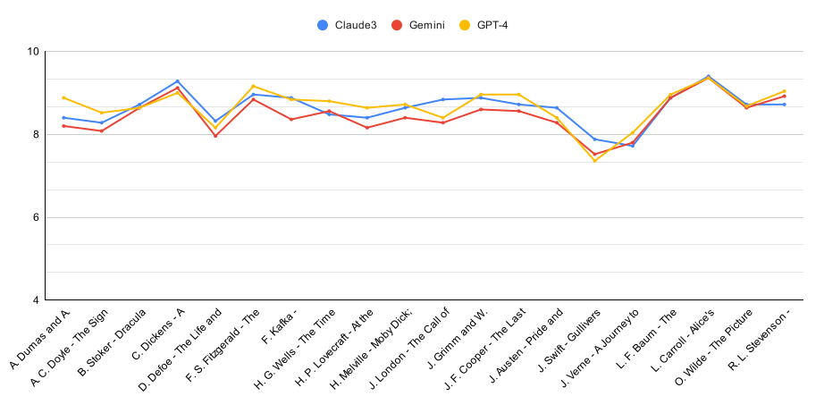
 
Середня оцінка для абстракції за алгоритмом для книги

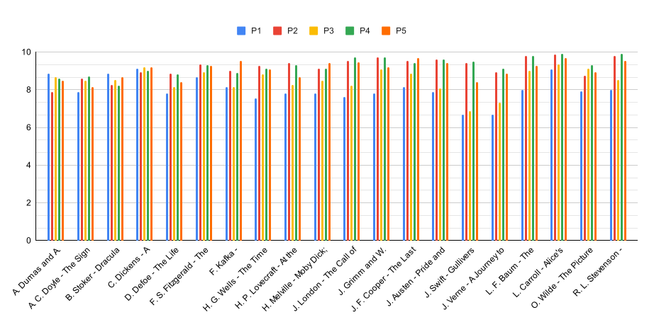
 
Середня оцінка для абстракції за промптом для книги

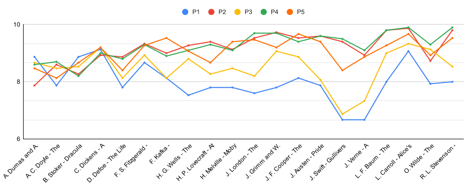
 
Загальна оцінка для абстракції за пропмтом для книги

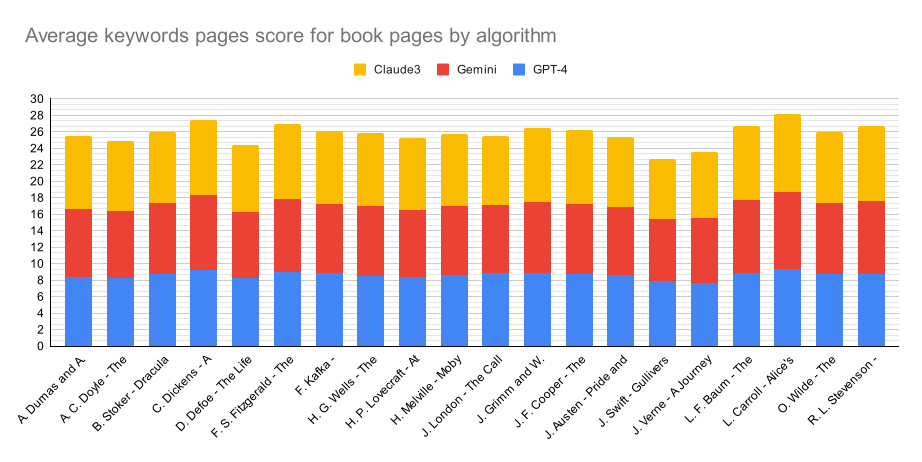
 
Середня оцінка для абстракції за алгоритмом для книги

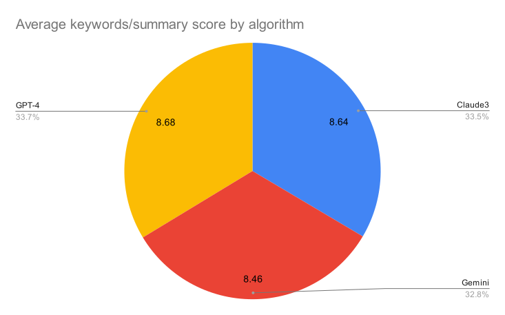
 
Середня оцінка для абстракції за алгоритмом для книги

 

<h2>3. Середня оцінка для згенерованих Dall-e зображень для книги за алгоритмом та промптом</h2>

<table>
  <thead>
    <tr>
      <th rowspan="2">Назва книги</th><th colspan="5">Claude3</th><th colspan="5">Gemini</th><th colspan="5">GPT-4</th><th rowspan="2">No alg</th>
    </tr>
    <tr>
      <th>P1</th><th>P2</th><th>P3</th><th>P4</th><th>P5</th>
      <th>P1</th><th>P2</th><th>P3</th><th>P4</th><th>P5</th>
      <th>P1</th><th>P2</th><th>P3</th><th>P4</th><th>P5</th>
    </tr>
  </thead>
  <tbody>
    <tr>
      <td>А.Дюма - Граф Монте-Крісто</td><td>7.2</td><td>6.6</td><td>7.2</td><td>6.8</td><td>7.6</td><td>6.6</td><td>6.8</td><td>6.75</td><td>7.2</td><td>6.8</td><td>6.4</td><td>7.2</td><td>7.75</td><td>6.2</td><td>8.4</td><td>7.4</td>
    </tr>
    <tr>
      <td>А. Конан Дойл - Знак чотирьох</td><td>5.8</td><td>7.5</td><td>7.6</td><td>7.5</td><td>7.6</td><td>6.6</td><td>8</td><td>6.4</td><td>6.6</td><td>7.4</td><td>6.4</td><td>7.4</td><td>8</td><td>7</td><td>7.4</td><td>7.6</td>
    </tr>
    <tr>
      <td>Б. Стокер - Дракула</td><td>7</td><td>7.33</td><td>6.6</td><td>7</td><td>8</td><td>6.2</td><td>6.75</td><td>6.5</td><td>6.4</td><td>7.6</td><td>6.2</td><td>7</td><td>6.2</td><td>6</td><td>7.4</td><td>7.75</td>
    </tr>
    <tr>
      <td>Ч. Дікенс - Різдвяна пісня в прозі</td><td>7.2</td><td>7.4</td><td>7.2</td><td>7.6</td><td>7.8</td><td>7</td><td>8</td><td>7.4</td><td>7.4</td><td>7.8</td><td>7.2</td><td>8</td><td>7</td><td>7.4</td><td>7.4</td><td>6.8</td>
    </tr>
    <tr>
      <td>Д. Дефо - Робінзон Крузо</td><td>6.4</td><td>7</td><td>7.4</td><td>6.2</td><td>7.2</td><td>5.5</td><td>7.4</td><td>7.2</td><td>7</td><td>6.8</td><td>6.2</td><td>7.6</td><td>6.8</td><td>6.75</td><td>6.4</td><td>6</td>
    </tr>
    <tr>
      <td>Ф. Скотт Фіцжеральт - Великий Гетсбі</td><td>7.4</td><td>7</td><td>7.6</td><td>7.6</td><td>7.4</td><td>6</td><td>8</td><td>6.4</td><td>6.4</td><td>7.6</td><td>6.8</td><td>7.2</td><td>6.4</td><td>6.4</td><td>7.8</td><td>7</td>
    </tr>
    <tr>
      <td>Ф. Кафка - Метаморфоза</td><td>7</td><td>7.4</td><td>6.8</td><td>6.8</td><td>9</td><td>6.6</td><td>7.4</td><td>6.8</td><td>6.6</td><td>8</td><td>6.4</td><td>7.2</td><td>7</td><td>6.4</td><td>8</td><td>8</td>
    </tr>
    <tr>
      <td>Г. Уелсс - Машина часу</td><td>6.6</td><td>7.2</td><td>7.2</td><td>6.4</td><td>7.4</td><td>7</td><td>7</td><td>7.4</td><td>6.6</td><td>7.2</td><td>6.8</td><td>7.8</td><td>7.2</td><td>6.8</td><td>7.2</td><td>7.4</td>
    </tr>
    <tr>
      <td>Г. Лавкрафт - В горах божевілля</td><td>6.75</td><td>7.25</td><td>6.25</td><td>6.5</td><td>7</td><td>6.25</td><td>7</td><td>6.25</td><td>6.5</td><td>6.75</td><td>6.25</td><td>7.25</td><td>6.5</td><td>6.75</td><td>7</td><td>6.5</td>
    </tr>
    <tr>
      <td>Г. Мелвілль - Мобі Дік</td><td>6.6</td><td>6.2</td><td>7.4</td><td>7</td><td>8</td><td>7.5</td><td>7.6</td><td>6.2</td><td>7.4</td><td>7.2</td><td>6.8</td><td>6.75</td><td>7</td><td>7</td><td>8.25</td><td>6.6</td>
    </tr>
    <tr>
      <td>Дж. Лондон - Поклик предків</td><td>7.2</td><td>7.75</td><td>7</td><td>6.4</td><td>8.25</td><td>6.6</td><td>7.25</td><td>6.6</td><td>6</td><td>7</td><td>6.4</td><td>7.2</td><td>7.5</td><td>7.2</td><td>7.66</td><td>7.25</td>
    </tr>
    <tr>
      <td>Я. та В. Грімм - Казки братів Грімм</td><td>6.6</td><td>6.75</td><td>7</td><td>7</td><td>8.4</td><td>6.6</td><td>6.25</td><td>4.8</td><td>6.4</td><td>6.75</td><td>6.4</td><td>6.75</td><td>7.75</td><td>6.25</td><td>6.6</td><td>7.4</td>
    </tr>
    <tr>
      <td>Дж. Ф. Купер - Останній з могікан</td><td>7.6</td><td>7.5</td><td>7.8</td><td>6.8</td><td>7.4</td><td>7.2</td><td>7.2</td><td>6.2</td><td>7</td><td>7.6</td><td>6.2</td><td>7.75</td><td>7.25</td><td>6.6</td><td>7.8</td><td>7.2</td>
    </tr>
    <tr>
      <td>Дж. Остін - Гордість та упередження</td><td>7.4</td><td>8.4</td><td>8.2</td><td>7.4</td><td>9</td><td>7.6</td><td>7.8</td><td>7.4</td><td>6.8</td><td>7.6</td><td>7.2</td><td>8.8</td><td>8.4</td><td>7.4</td><td>8.6</td><td>8.2</td>
    </tr>
    <tr>
      <td>Дж. Свіфт - Мандри Гулівера</td><td>5</td><td>7.4</td><td>6.25</td><td>6.6</td><td>8</td><td>5.4</td><td>6.4</td><td>6</td><td>6</td><td>7.75</td><td>5.8</td><td>7</td><td>5</td><td>5.8</td><td>7.4</td><td>6.5</td>
    </tr>
    <tr>
      <td>Ж. Верн - Подорож до центру землі</td><td>6.2</td><td>7.4</td><td>6.5</td><td>6.2</td><td>7.8</td><td>6.2</td><td>7.8</td><td>7</td><td>7</td><td>7.2</td><td>6.4</td><td>7.6</td><td>6.8</td><td>7</td><td>7.8</td><td>6.8</td>
    </tr>
    <tr>
      <td>Л. Ф. Баум - Чарівник країни Оз</td><td>7.6</td><td>7.6</td><td>7.8</td><td>7.4</td><td>8.4</td><td>7</td><td>8.75</td><td>7.6</td><td>7.2</td><td>7.8</td><td>7.6</td><td>8.5</td><td>7.6</td><td>7.4</td><td>7.75</td><td>7.25</td>
    </tr>
    <tr>
      <td>Л. Керолл - Аліса у Дивокраї</td><td>8</td><td>8.2</td><td>7.2</td><td>7.6</td><td>8.6</td><td>7.8</td><td>8.2</td><td>7</td><td>6.2</td><td>7.8</td><td>7.6</td><td>7.5</td><td>7.6</td><td>7</td><td>8.2</td><td>8.2</td>
    </tr>
    <tr>
      <td>О. Уайлд - Портрет Доріана Грея</td><td>7.4</td><td>7.4</td><td>7</td><td>6.4</td><td>8.2</td><td>7.2</td><td>7.2</td><td>6.8</td><td>7.2</td><td>7.8</td><td>7.4</td><td>8.4</td><td>7.4</td><td>7.2</td><td>9.25</td><td>7.4</td>
    </tr>
    <tr>
      <td>Р. Л. Стівенсон - Острів скарбів</td><td>7.4</td><td>8.2</td><td>7.6</td><td>7.4</td><td>8.2</td><td>6.6</td><td>8.4</td><td>7.8</td><td>8</td><td>8.4</td><td>6.8</td><td>8.6</td><td>7.6</td><td>7</td><td>9</td><td>7.6</td>
    </tr>
    <tr>
      <td><strong>Середня Оцінка</strong></td><td colspan="5"><strong>7.27</strong></td><td colspan="5"><strong>7.02</strong></td><td colspan="5"><strong>7.18</strong></td><td><strong>7.24</strong></td>
    </tr>
  </tbody>
</table>

 
 

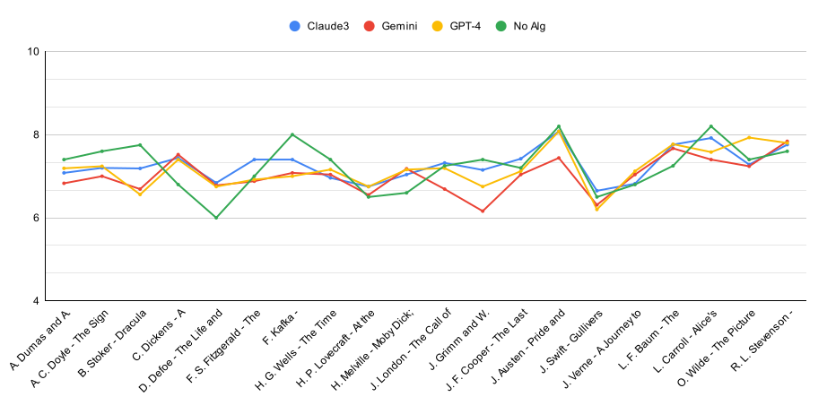
 
Середня оцінка для згенерованих Dall-e зображень за алгоритмом для книги

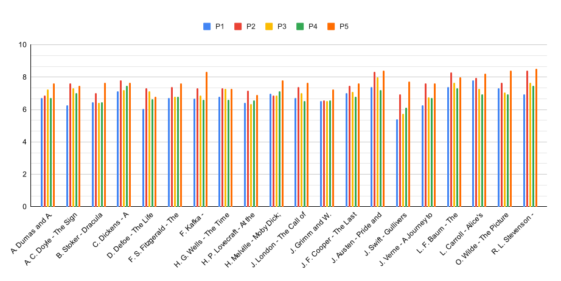
 
Середня оцінка для згенерованих Dall-e зображень за промптом для книги

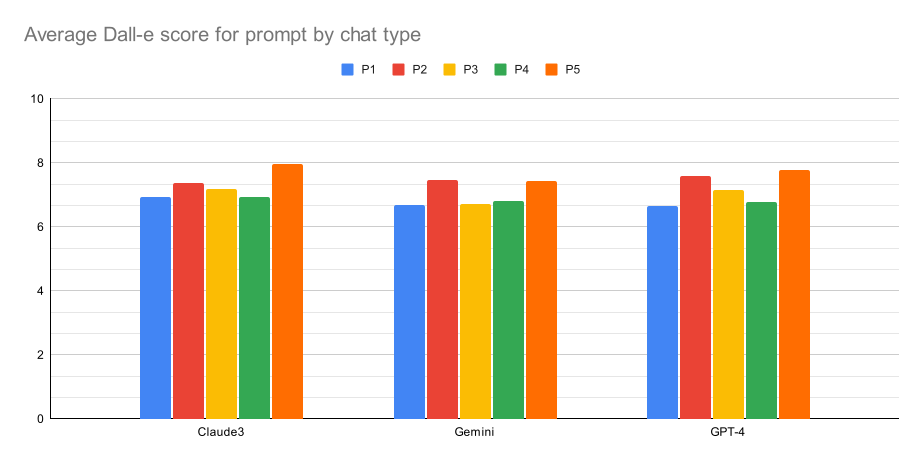
 
Зведена залежність для згенерованих Dall-e зображень за промптом від алгоритму

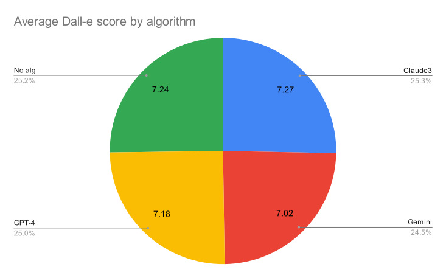
 
Співвідношення застосованого алгоритму за оцінками зображень згенерованих для Dall-e зображень

<h2>4. Середня оцінка для згенерованих Stable Diffusion зображень для книги за алгоритмом та промптом</h2>

<table>
  <thead>
    <tr>
      <th rowspan="2">Назва книги</th><th colspan="5">Claude3</th><th colspan="5">Gemini</th><th colspan="5">GPT-4</th><th rowspan="2">No alg</th>
    </tr>
    <tr>
      <th>P1</th><th>P2</th><th>P3</th><th>P4</th><th>P5</th>
      <th>P1</th><th>P2</th><th>P3</th><th>P4</th><th>P5</th>
      <th>P1</th><th>P2</th><th>P3</th><th>P4</th><th>P5</th>
    </tr>
  </thead>
  <tbody>
    <tr>
      <td>А.Дюма - Граф Монте-Крісто</td><td>6.8</td><td>5.6</td><td>6.2</td><td>6.6</td><td>6.8</td><td>5.6</td><td>5.8</td><td>5.4</td><td>6.4</td><td>5.6</td><td>7.2</td><td>6.6</td><td>6.4</td><td>6.2</td><td>7</td><td>4</td>
    </tr>
    <tr>
      <td>А. Конан Дойл - Знак чотирьох</td><td>6</td><td>6.6</td><td>6.8</td><td>6.4</td><td>7.6</td><td>6.2</td><td>6.2</td><td>5.2</td><td>5.2</td><td>7.6</td><td>5.8</td><td>6.6</td><td>6.8</td><td>6.2</td><td>7.2</td><td>4.8</td>
    </tr>
    <tr>
      <td>Б. Стокер - Дракула</td><td>5.8</td><td>6.2</td><td>4.4</td><td>6</td><td>7</td><td>6.2</td><td>5.2</td><td>6</td><td>6.2</td><td>5.8</td><td>5.8</td><td>6.6</td><td>6.8</td><td>5.6</td><td>6</td><td>4.2</td>
    </tr>
    <tr>
      <td>Ч. Дікенс - Різдвяна пісня в прозі</td><td>7</td><td>7</td><td>6.2</td><td>7.2</td><td>7.4</td><td>7</td><td>6.8</td><td>6.8</td><td>6.8</td><td>7.2</td><td>7</td><td>7</td><td>6.4</td><td>6.6</td><td>7</td><td>5.8</td>
    </tr>
    <tr>
      <td>Д. Дефо - Робінзон Крузо</td><td>6.4</td><td>7</td><td>7.2</td><td>7</td><td>7</td><td>6.4</td><td>6.6</td><td>6.6</td><td>6.2</td><td>7.2</td><td>6.4</td><td>7</td><td>7.4</td><td>7</td><td>7.2</td><td>5.2</td>
    </tr>
    <tr>
      <td>Ф. Скотт Фіцжеральт - Великий Гетсбі</td><td>7.6</td><td>7.4</td><td>6</td><td>6.4</td><td>6.8</td><td>6</td><td>6.2</td><td>6.8</td><td>7</td><td>6</td><td>6.2</td><td>6.4</td><td>6.4</td><td>6.4</td><td>7.2</td><td>5.6</td>
    </tr>
    <tr>
      <td>Ф. Кафка - Метаморфоза</td><td>6.2</td><td>7</td><td>4.6</td><td>6.4</td><td>7.6</td><td>6.2</td><td>6</td><td>6</td><td>5.6</td><td>6.8</td><td>6</td><td>6.4</td><td>5.6</td><td>6</td><td>6.8</td><td>5</td>
    </tr>
    <tr>
      <td>Г. Уелсс - Машина часу</td><td>6.4</td><td>6</td><td>6.8</td><td>6.8</td><td>6.2</td><td>6.4</td><td>5.8</td><td>6.4</td><td>6</td><td>6.2</td><td>6.4</td><td>6</td><td>7.2</td><td>7</td><td>6</td><td>4.6</td>
    </tr>
    <tr>
      <td>Г. Лавкрафт - В горах божевілля</td><td>6</td><td>6.6</td><td>5.2</td><td>5</td><td>6.8</td><td>4.6</td><td>6.2</td><td>5.6</td><td>5</td><td>5.8</td><td>5.6</td><td>6.8</td><td>5.6</td><td>5.4</td><td>6.6</td><td>4.4</td>
    </tr>
    <tr>
      <td>Г. Мелвілль - Мобі Дік</td><td>6</td><td>6.8</td><td>7</td><td>6.8</td><td>7.8</td><td>6.2</td><td>6.4</td><td>7.4</td><td>6.8</td><td>6.6</td><td>6.4</td><td>7.2</td><td>6.8</td><td>6.8</td><td>8</td><td>6.4</td>
    </tr>
    <tr>
      <td>Дж. Лондон - Поклик предків</td><td>6.6</td><td>6.6</td><td>6.6</td><td>6.4</td><td>7.2</td><td>5.4</td><td>6.4</td><td>4.8</td><td>5</td><td>6.4</td><td>6.2</td><td>6.8</td><td>6.4</td><td>5.8</td><td>6.8</td><td>5.4</td>
    </tr>
    <tr>
      <td>Я. та В. Грімм - Казки братів Грімм</td><td>6.8</td><td>6.25</td><td>6.8</td><td>6.6</td><td>6.2</td><td>6.6</td><td>6.6</td><td>6.4</td><td>5.6</td><td>6.2</td><td>6.8</td><td>5.8</td><td>7</td><td>6.4</td><td>6.4</td><td>5.6</td>
    </tr>
    <tr>
      <td>Дж. Ф. Купер - Останній з могікан</td><td>7</td><td>7.4</td><td>7</td><td>6.8</td><td>7.2</td><td>7.8</td><td>6.8</td><td>6.8</td><td>6.8</td><td>6.8</td><td>7.2</td><td>7.4</td><td>6.8</td><td>7</td><td>7</td><td>5.2</td>
    </tr>
    <tr>
      <td>Дж. Остін - Гордість та упередження</td><td>7.2</td><td>7.8</td><td>4</td><td>7.4</td><td>8</td><td>6.8</td><td>7.6</td><td>7.2</td><td>7</td><td>7.2</td><td>7.6</td><td>7.8</td><td>7</td><td>7</td><td>7.6</td><td>6.6</td>
    </tr>
    <tr>
      <td>Дж. Свіфт - Мандри Гулівера</td><td>4.8</td><td>6.5</td><td>4.8</td><td>4.8</td><td>6.8</td><td>4.4</td><td>4.6</td><td>4.6</td><td>4.8</td><td>6.6</td><td>4.8</td><td>6.2</td><td>4.8</td><td>4.8</td><td>5.6</td><td>4.25</td>
    </tr>
    <tr>
      <td>Ж. Верн - Подорож до центру землі</td><td>6.4</td><td>7.6</td><td>6.2</td><td>6.8</td><td>7.6</td><td>6.4</td><td>6.6</td><td>6.8</td><td>6.8</td><td>6.6</td><td>6.2</td><td>6.8</td><td>6.8</td><td>7.4</td><td>7.4</td><td>5.8</td>
    </tr>
    <tr>
      <td>Л. Ф. Баум - Чарівник країни Оз</td><td>6.6</td><td>6.8</td><td>6.8</td><td>6</td><td>6.8</td><td>6.4</td><td>6.8</td><td>6.4</td><td>6</td><td>5.6</td><td>6.4</td><td>6.6</td><td>6.4</td><td>6.6</td><td>6.6</td><td>5.8</td>
    </tr>
    <tr>
      <td>Л. Керолл - Аліса у Дивокраї</td><td>6.6</td><td>6</td><td>5.6</td><td>5.6</td><td>6</td><td>6</td><td>5.8</td><td>5.8</td><td>5.4</td><td>5.4</td><td>6.2</td><td>5.4</td><td>5.6</td><td>5.6</td><td>5.6</td><td>4.6</td>
    </tr>
    <tr>
      <td>О. Уайлд - Портрет Доріана Грея</td><td>6</td><td>7.4</td><td>7</td><td>7</td><td>7.4</td><td>6.6</td><td>7</td><td>6.4</td><td>7.2</td><td>6.6</td><td>7</td><td>6.4</td><td>6.6</td><td>7.4</td><td>7.6</td><td>5.8</td>
    </tr>
    <tr>
      <td>Р. Л. Стівенсон - Острів скарбів</td><td>6.8</td><td>6.6</td><td>6.2</td><td>6</td><td>6.8</td><td>6</td><td>5.4</td><td>6</td><td>6.4</td><td>6.8</td><td>7.2</td><td>7.2</td><td>5.8</td><td>6.2</td><td>6.6</td><td>5</td>
    </tr>
    <tr>
      <td><strong>Середня Оцінка</strong></td><td colspan="5"><strong>6.55</strong></td><td colspan="5"><strong>6.23</strong></td><td colspan="5"><strong>6.54</strong></td><td><strong>5.2</strong></td>
    </tr>
  </tbody>
</table>

 
 

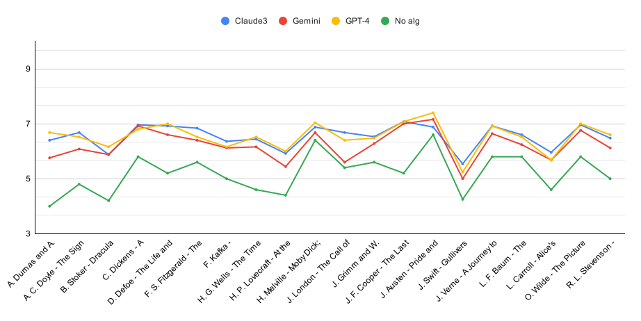
 
Середня оцінка для згенерованих Stable Diffusion зображень за алгоритмом для книги

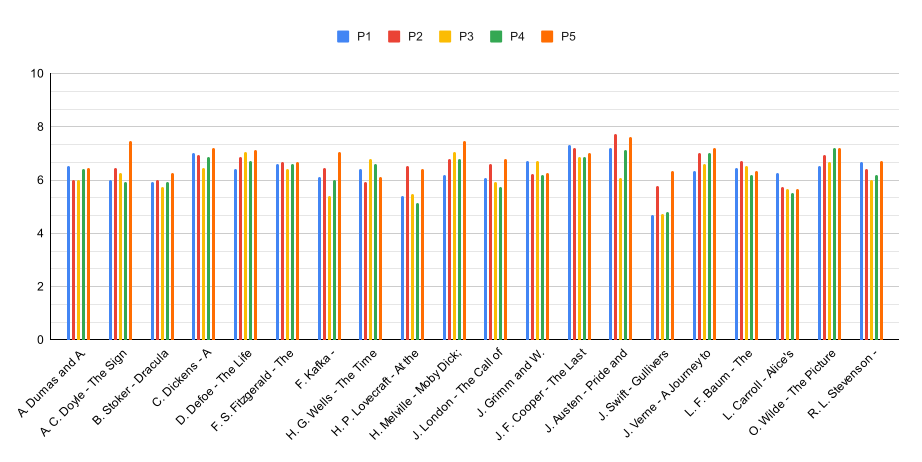
 
Середня оцінка для згенерованих Stable Diffusion зображень за промптом для книги

 
Зведена залежність для згенерованих Stable Diffusion зображень за промптом від алгоритму

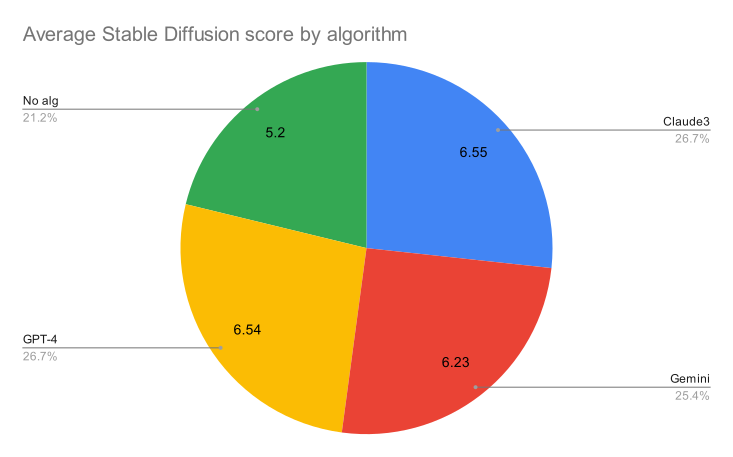
 
Співвідношення застосованого алгоритму за оцінками зображень згенерованих для Stable Diffusion зображень

<h2>5. Середня оцінка для згенерованих MidJourney зображень для книги за алгоритмом та промптом</h2>

<table>
  <thead>
    <tr>
      <th rowspan="2">Назва книги</th><th colspan="5">Claude3</th><th colspan="5">Gemini</th><th colspan="5">GPT-4</th><th rowspan="2">Whole Page</th>
    </tr>
    <tr>
      <th>P1</th><th>P2</th><th>P3</th><th>P4</th><th>P5</th><th>P1</th><th>P2</th><th>P3</th><th>P4</th><th>P5</th><th>P1</th><th>P2</th><th>P3</th><th>P4</th><th>P5</th>
    </tr>
  </thead>
  <tbody>
    <tr>
      <td>А.Дюма - Граф Монте-Крісто</td><td>7.2</td><td>6.8</td><td>6.6</td><td>6.8</td><td>7.4</td><td>6.4</td><td>6</td><td>6.6</td><td>6.8</td><td>6.4</td><td>6.8</td><td>6.8</td><td>7</td><td>6.6</td><td>8.2</td><td>3.8</td>
    </tr>
    <tr>
      <td>А. Конан Дойл - Знак чотирьох</td><td>6.8</td><td>7.8</td><td>8.4</td><td>6.6</td><td>8</td><td>6.8</td><td>7.2</td><td>6</td><td>6.4</td><td>8.2</td><td>7.4</td><td>7.8</td><td>7.4</td><td>6.8</td><td>7.6</td><td>6</td>
    </tr>
    <tr>
      <td>Б. Стокер - Дракула</td><td>7.4</td><td>6.8</td><td>7.4</td><td>7.2</td><td>8.6</td><td>6.4</td><td>7</td><td>7.6</td><td>7</td><td>8.25</td><td>6.6</td><td>7.4</td><td>7.6</td><td>6.8</td><td>7.2</td><td>7.2</td>
    </tr>
    <tr>
      <td>Ч. Дікенс - Різдвяна пісня в прозі</td><td>7.6</td><td>7.8</td><td>7.2</td><td>7.6</td><td>8.6</td><td>7.4</td><td>8.2</td><td>6.6</td><td>7.6</td><td>8</td><td>7.4</td><td>7.2</td><td>7.4</td><td>6.8</td><td>8</td><td>6.2</td>
    </tr>
    <tr>
      <td>Д. Дефо - Робінзон Крузо</td><td>7.2</td><td>8.2</td><td>8.4</td><td>8</td><td>8.8</td><td>7.2</td><td>8.2</td><td>7.2</td><td>7.4</td><td>9.2</td><td>6.8</td><td>8.2</td><td>7.4</td><td>8</td><td>8.4</td><td>6.2</td>
    </tr>
    <tr>
      <td>Ф. Скотт Фіцжеральт - Великий Гетсбі</td><td>7.8</td><td>7.6</td><td>6.6</td><td>7</td><td>7.4</td><td>6</td><td>7.4</td><td>7</td><td>6.8</td><td>7</td><td>6.6</td><td>6.4</td><td>6.8</td><td>6.8</td><td>8.2</td><td>7</td>
    </tr>
    <tr>
      <td>Ф. Кафка - Метаморфоза</td><td>7.6</td><td>8.4</td><td>7</td><td>7.4</td><td>9.6</td><td>6</td><td>7.6</td><td>6.4</td><td>6.8</td><td>7.8</td><td>6</td><td>6.8</td><td>6.2</td><td>6.2</td><td>8</td><td>6.2</td>
    </tr>
    <tr>
      <td>Г. Уелсс - Машина часу</td><td>6.4</td><td>7.8</td><td>7.4</td><td>6.4</td><td>8.2</td><td>6.8</td><td>7</td><td>7</td><td>6.4</td><td>8.2</td><td>6.8</td><td>7</td><td>7.2</td><td>7.2</td><td>8</td><td>5.6</td>
    </tr>
    <tr>
      <td>Г. Лавкрафт - В горах божевілля</td><td>6.4</td><td>7.6</td><td>5.6</td><td>6</td><td>7</td><td>4.8</td><td>7.4</td><td>5.8</td><td>5.4</td><td>7</td><td>6.2</td><td>7.6</td><td>6.4</td><td>6.6</td><td>7.4</td><td>6</td>
    </tr>
    <tr>
      <td>Г. Мелвілль - Мобі Дік</td><td>6.2</td><td>7</td><td>8</td><td>7.4</td><td>8.2</td><td>7.2</td><td>7.6</td><td>8</td><td>7.6</td><td>7.8</td><td>7.2</td><td>7.8</td><td>7.8</td><td>6.75</td><td>8.6</td><td>6.8</td>
    </tr>
    <tr>
      <td>Дж. Лондон - Поклик предків</td><td>6.8</td><td>7</td><td>7.4</td><td>6.4</td><td>8.8</td><td>5.2</td><td>7</td><td>5.4</td><td>5.25</td><td>7.6</td><td>6.2</td><td>7</td><td>6.2</td><td>6.2</td><td>8.4</td><td>6.4</td>
    </tr>
    <tr>
      <td>Я. та В. Грімм - Казки братів Грімм</td><td>6.8</td><td>7.4</td><td>7</td><td>6.8</td><td>9.4</td><td>7</td><td>8.2</td><td>6.6</td><td>6.6</td><td>7.2</td><td>7.8</td><td>7.6</td><td>7.8</td><td>7.8</td><td>7.6</td><td>8.2</td>
    </tr>
    <tr>
      <td>Дж. Ф. Купер - Останній з могікан</td><td>7.2</td><td>8.4</td><td>8.8</td><td>7.4</td><td>8.6</td><td>8</td><td>7.6</td><td>7.4</td><td>7</td><td>8.2</td><td>7.6</td><td>8.8</td><td>8</td><td>7.6</td><td>8</td><td>7</td>
    </tr>
    <tr>
      <td>Дж. Остін - Гордість та упередження</td><td>7.6</td><td>7.8</td><td>7.8</td><td>7.8</td><td>10</td><td>8</td><td>8.4</td><td>7.6</td><td>7.2</td><td>8</td><td>8</td><td>8.6</td><td>7</td><td>7.2</td><td>8.6</td><td>7.5</td>
    </tr>
    <tr>
      <td>Дж. Свіфт - Мандри Гулівера</td><td>5.2</td><td>6.4</td><td>5.2</td><td>5</td><td>7.8</td><td>5</td><td>4.8</td><td>4.8</td><td>4.8</td><td>7.2</td><td>5</td><td>6.4</td><td>4.6</td><td>4.2</td><td>6.8</td><td>5.2</td>
    </tr>
    <tr>
      <td>Ж. Верн - Подорож до центру землі</td><td>6.8</td><td>8</td><td>7.2</td><td>6.8</td><td>8.2</td><td>6.6</td><td>7.6</td><td>7</td><td>7.6</td><td>7</td><td>6.8</td><td>7.2</td><td>7.6</td><td>7.6</td><td>8.2</td><td>6.4</td>
    </tr>
    <tr>
      <td>Л. Ф. Баум - Чарівник країни Оз</td><td>7.2</td><td>7.4</td><td>7</td><td>6.6</td><td>8.4</td><td>7.2</td><td>8</td><td>7</td><td>6.6</td><td>7</td><td>6.8</td><td>7.4</td><td>6.8</td><td>6.6</td><td>8</td><td>6.6</td>
    </tr>
    <tr>
      <td>Л. Керолл - Аліса у Дивокраї</td><td>7.2</td><td>6.8</td><td>6</td><td>6.4</td><td>7.8</td><td>7.2</td><td>7.4</td><td>6.4</td><td>6</td><td>6.6</td><td>7.4</td><td>7</td><td>6.6</td><td>6.6</td><td>7.6</td><td>6</td>
    </tr>
    <tr>
      <td>О. Уайлд - Портрет Доріана Грея</td><td>7.2</td><td>7.8</td><td>8.6</td><td>8.6</td><td>8.4</td><td>7</td><td>8</td><td>7.2</td><td>8</td><td>8</td><td>8.2</td><td>8.2</td><td>7.6</td><td>7.2</td><td>9.2</td><td>6.2</td>
    </tr>
    <tr>
      <td>Р. Л. Стівенсон - Острів скарбів</td><td>8.2</td><td>8.6</td><td>8.2</td><td>8.4</td><td>8.8</td><td>7.6</td><td>7.8</td><td>7.6</td><td>7.8</td><td>8.8</td><td>8.2</td><td>8.6</td><td>7.2</td><td>7.2</td><td>9.2</td><td>7</td>
    </tr>
    <tr>
      <td><strong>Середня Оцінка</strong></td><td colspan="5"><strong>7.47</strong></td><td colspan="5"><strong>7.06</strong></td><td colspan="5"><strong>7.28</strong></td><td><strong>6.38</strong></td>
    </tr>
  </tbody>
</table>

 
 

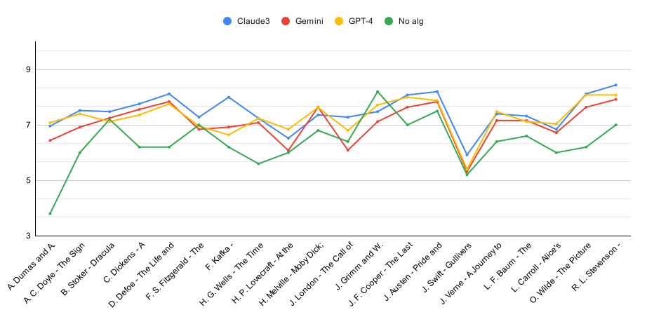
 
Середня оцінка для згенерованих MidJourney зображень за алгоритмом для книги

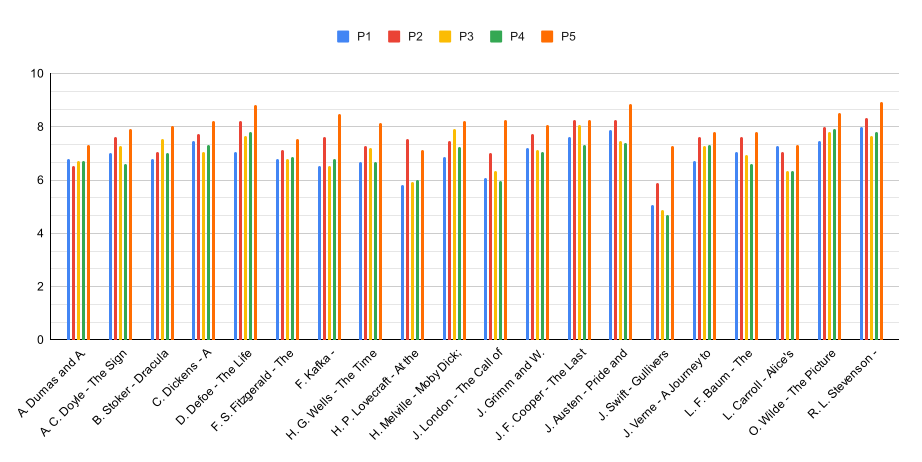
 
Середня оцінка для згенерованих MidJourney зображень за промптом для книги

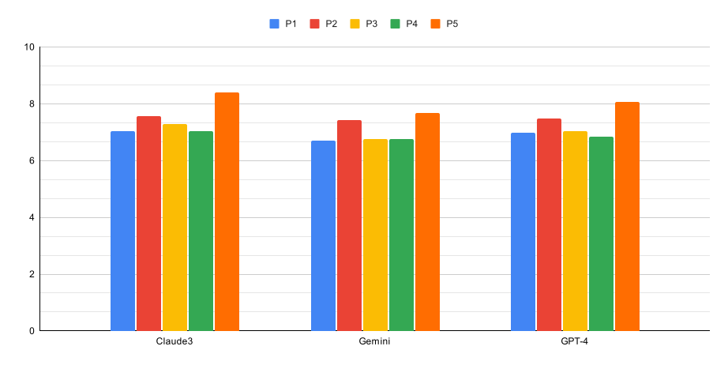
 
Зведена залежність для згенерованих MidJourney зображень за промптом від алгоритму

 
Співвідношення застосованого алгоритму за оцінками зображень згенерованих для MidJourney зображень

<h2>6. Середня оцінка для згенерованих зображень моделями by Dall-e, Stable Diffusion та MidJourney за книгою</h2>

| Назва книги | DALL-E | StableDiffusion | MidJourney |
|---|---:|---:|---:|
| А.Дюма - Граф Монте-Крісто | 7.06 | 6.14 | 6.64 |
| А. Конан Дойл - Знак чотирьох | 7.18 | 6.33 | 7.20 |
| Б. Стокер - Дракула | 6.87 | 5.86 | 7.28 |
| Ч. Дікенс - Різдвяна пісня в прозі | 7.41 | 6.83 | 7.48 |
| Д. Дефо - Робінзон Крузо | 6.74 | 6.74 | 7.80 |
| Ф. Скотт Фіцжеральт - Великий Гетсбі | 7.06 | 6.53 | 7.03 |
| Ф. Кафка - Метаморфоза | 7.21 | 6.14 | 7.13 |
| Г. Уелсс - Машина часу | 7.08 | 6.26 | 7.09 |
| Г. Лавкрафт - В горах божевілля | 6.67 | 5.70 | 6.45 |
| Г. Мелвілль - Мобі Дік | 7.09 | 6.84 | 7.50 |
| Дж. Лондон - Поклик предків | 7.08 | 6.18 | 6.70 |
| Я. та В. Грімм - Казки братів Грімм | 6.73 | 6.38 | 7.49 |
| Дж. Ф. Купер - Останній з могікан | 7.19 | 6.94 | 7.85 |
| Дж. Остін - Гордість та упередження | 7.89 | 7.11 | 7.94 |
| Дж. Свіфт - Мандри Гулівера | 6.39 | 5.20 | 5.53 |
| Ж. Верн - Подорож до центру землі | 6.98 | 6.76 | 7.29 |
| Л. Ф. Баум - Чарівник країни Оз | 7.70 | 6.41 | 7.16 |
| Л. Керолл - Аліса у Дивокраї | 7.67 | 5.70 | 6.81 |
| О. Уайлд - Портрет Доріана Грея | 7.48 | 6.84 | 7.84 |
| Р. Л. Стівенсон - Острів скарбів | 7.79 | 6.31 | 8.08 |
| **Середня Оцінка** | **7.16** | **6.36** | **7.21** |

 
 

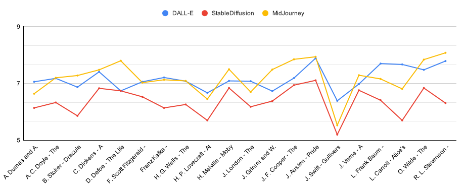
 
Середеня оцінка для зображень згенерованих Dall-e, Stable Diffusion та MidJourney за книгою

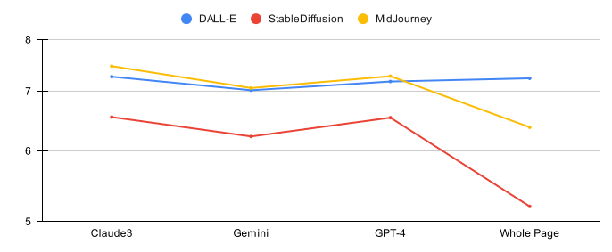
 
Середеня оцінка для зображень згенерованих Dall-e, Stable Diffusion та MidJourney за книгою

<h2>7. Середня оцінка для згенерованих зображень за промптом для книги</h2>

| Book | P1 | P2 | P3 | P4 | P5 |
|---|---:|---:|---:|---:|---:|
| А.Дюма - Граф Монте-Крісто | 6.69 | 6.47 | 6.65 | 6.62 | 7.13 |
| А. Конан Дойл - Знак чотирьох | 6.42 | 7.23 | 6.96 | 6.52 | 7.62 |
| Б. Стокер - Дракула | 6.40 | 6.70 | 6.56 | 6.47 | 7.32 |
| Ч. Дікенс - Різдвяна пісня в прозі | 7.20 | 7.49 | 6.91 | 7.22 | 7.69 |
| Д. Дефо - Робінзон Крузо | 6.50 | 7.47 | 7.29 | 7.06 | 7.58 |
| Ф. Скотт Фіцжеральт - Великий Гетсбі | 6.71 | 7.07 | 6.67 | 6.76 | 7.27 |
| Ф. Кафка - Метаморфоза | 6.44 | 7.13 | 6.27 | 6.47 | 7.96 |
| Г. Уелсс - Машина часу | 6.62 | 6.84 | 7.09 | 6.62 | 7.18 |
| Г. Лавкрафт - В горах божевілля | 5.87 | 7.08 | 5.91 | 5.90 | 6.82 |
| Г. Мелвілль - Мобі Дік | 6.68 | 7.04 | 7.29 | 7.06 | 7.83 |
| Дж. Лондон - Поклик предків | 6.29 | 7.00 | 6.43 | 6.07 | 7.57 |
| Я. та В. Грімм - Казки братів Грімм | 6.82 | 6.84 | 6.79 | 6.61 | 7.20 |
| Дж. Ф. Купер - Останній з могікан | 7.31 | 7.65 | 7.34 | 7.00 | 7.62 |
| Дж. Остін - Гордість та упередження | 7.49 | 8.11 | 7.18 | 7.24 | 8.29 |
| Дж. Свіфт - Мандри Гулівера | 5.05 | 6.19 | 5.12 | 5.20 | 7.11 |
| Ж. Верн - Подорож до центру землі | 6.44 | 7.40 | 6.88 | 7.02 | 7.53 |
| Л. Ф. Баум - Чарівник країни Оз | 6.98 | 7.54 | 7.04 | 6.71 | 7.37 |
| Л. Керолл - Аліса у Дивокраї | 7.11 | 6.92 | 6.42 | 6.26 | 7.07 |
| О. Уайлд - Портрет Доріана Грея | 7.11 | 7.53 | 7.18 | 7.35 | 8.05 |
| Р. Л. Стівенсон - Острів скарбів | 7.20 | 7.71 | 7.11 | 7.16 | 8.06 |
| **Середня Оцінка** | **6.67** | **7.17** | **6.75** | **6.67** | **7.51** |

 
 

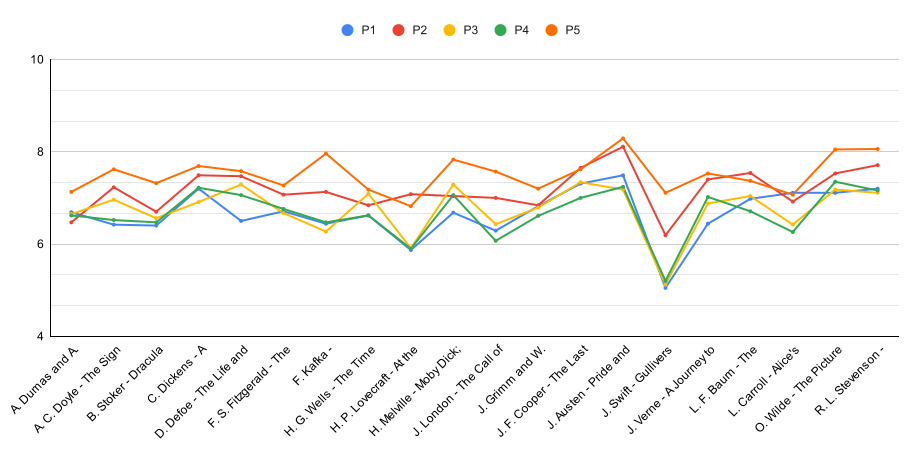
 
Середня оцінка для згенерованих зображень за промптом для книги

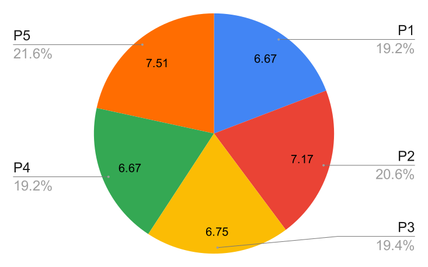
 
Середня оцінка для згенерованих зображень за промптом для книги

<h2>8. Середня оцінка для зображень згенерованих абстракцією мовної моделі чи повної сторінки для книги</h2>

| Назва книги | Claude3 | Gemini | GPT-4 | Whole Page |
|---|---:|---:|---:|---:|
| А.Дюма - Граф Монте-Крісто | 6.81 | 6.34 | 6.98 | 5.07 |
| А. Конан Дойл - Знак чотирьох | 7.13 | 6.67 | 7.05 | 6.13 |
| Б. Стокер - Дракула | 6.85 | 6.61 | 6.61 | 6.38 |
| Ч. Дікенс - Різдвяна пісня в прозі | 7.39 | 7.33 | 7.19 | 6.27 |
| Д. Дефо - Робінзон Крузо | 7.29 | 7.07 | 7.17 | 5.80 |
| Ф. Скотт Фіцжеральт - Великий Гетсбі | 7.17 | 6.71 | 6.80 | 6.53 |
| Ф. Кафка - Метаморфоза | 7.25 | 6.71 | 6.60 | 6.40 |
| Г. Уелсс - Машина часу | 6.88 | 6.76 | 6.97 | 5.87 |
| Г. Лавкрафт - В горах божевілля | 6.40 | 6.02 | 6.53 | 5.63 |
| Г. Мелвілль - Мобі Дік | 7.09 | 7.17 | 7.28 | 6.60 |
| Дж. Лондон - Поклик предків | 7.09 | 6.13 | 6.80 | 6.35 |
| Я. та В. Грімм - Казки братів Грімм | 7.05 | 6.52 | 6.98 | 7.07 |
| Дж. Ф. Купер - Останній з могікан | 7.53 | 7.23 | 7.40 | 6.47 |
| Дж. Остін - Гордість та упередження | 7.72 | 7.48 | 7.79 | 7.43 |
| Дж. Свіфт - Мандри Гулівера | 6.04 | 5.54 | 5.61 | 5.32 |
| Ж. Верн - Подорож до центру землі | 7.05 | 6.95 | 7.17 | 6.33 |
| Л. Ф. Баум - Чарівник країни Оз | 7.23 | 7.02 | 7.14 | 6.55 |
| Л. Керолл - Аліса у Дивокраї | 6.91 | 6.60 | 6.77 | 6.27 |
| О. Уайлд - Портрет Доріана Грея | 7.45 | 7.21 | 7.67 | 6.47 |
| Р. Л. Стівенсон - Острів скарбів | 7.56 | 7.29 | 7.49 | 6.53 |
| **Середня Оцінка** | **7.09** | **6.77** | **7.00** | **6.27** |

 
 

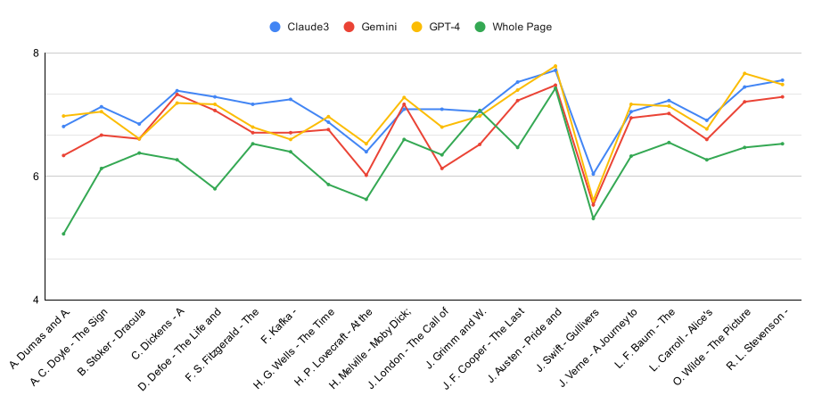
 
Середня оцінка для зображень згенерованих абстракцією мовної моделі чи повної сторінки для книги

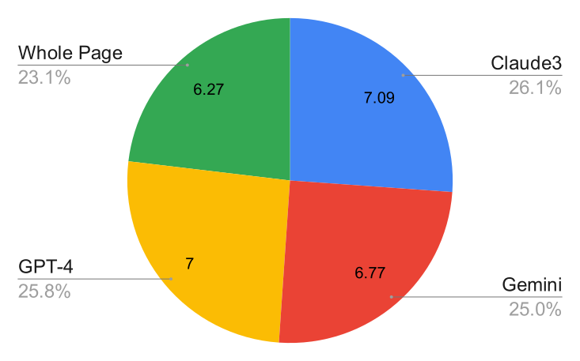
 
Середня оцінка для зображень згенерованих абстракцією мовної моделі чи повної сторінки для книги

<h2>9. Залежність помилок згенерованих абстракціями великих мовних моделей до дифузійної моделі</h2>

| Мовна модель/Дифузійна модель | DALL-E | StableDiffusion | MidJourney | SUM |
|---|---:|---:|---:|---:|
| Claude3 | 18 | 1 | 0 | 19 |
| Gemini | 20 | 0 | 1 | 21 |
| GPT-4 | 25 | 0 | 1 | 26 |
| No Alg | 6 | 0 | 4 | 10 |
| **Середня Оцінка** | **69** | **1** | **6** |  |

 
 

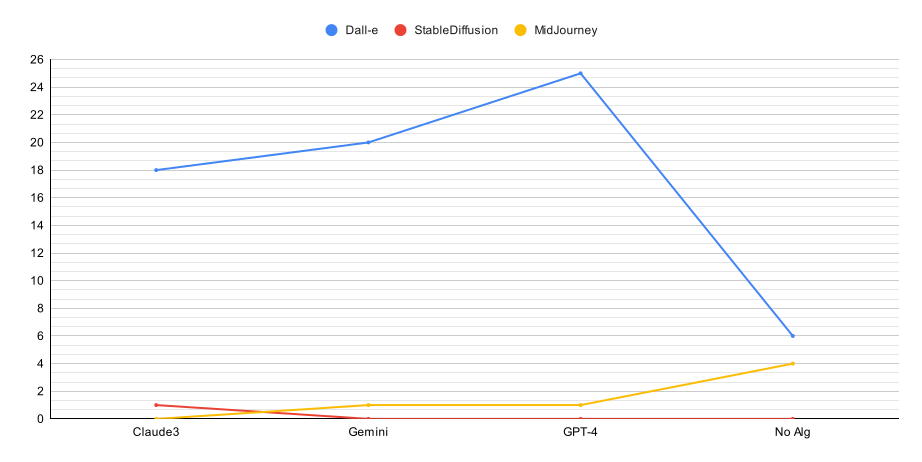
 
Залежність помилок згенерованих абстракціями великих мовних моделей до дифузійної моделі

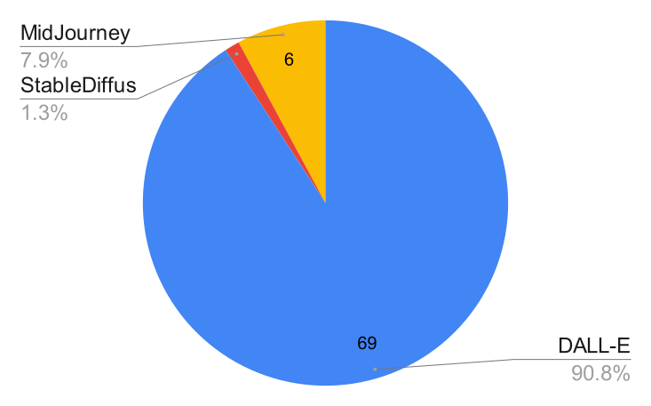
 
Співвідношення помилок до дифузійної моделі

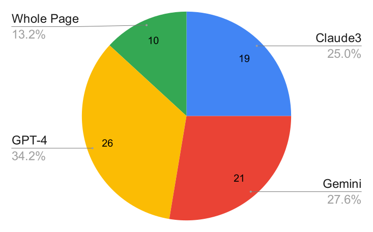
 
Співвідношення помилок до мовної моделі

